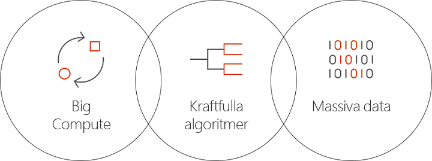

# Vad är Batch AI i Azure?
Batch AI är en hanterad tjänst som gör att dataanalytiker och AI-forskare kan träna AI och andra maskininlärningsmodeller på kluster med virtuella Azure-datorer, inklusive virtuella datorer med GPU-stöd. Du beskriver ditt jobbs krav, var indata finns att hitta och var utdata ska lagras, och så hanterar Batch AI resten.  
 
## Varför Batch AI? 
Att utveckla kraftfulla AI-algoritmer är en beräkningsintensiv och iterativ process. Dataanalytiker och AI-forskare arbetar med allt större datauppsättningar. De utvecklar modeller med flera lager, och att göra detta med flera experiment vad gäller nätverksdesign och finjustering av hyperparametrar. Den här processen kräver flera processorer och GPU:er per modell, att flera experiment körs parallellt och att det finns delad lagring för utbildningsdata, loggar och modellutdata.   
 

Dataanalytiker och AI forskare är experter i sina respektive fält, men att hantera infrastrukturen i stor skala kan vara en störande faktor. Att utveckla AI i stor skala kräver många infrastruktursuppgifter: etablera kluster av virtuella datorer, installera programvaran och behållare, ställa arbeten i kö, prioritera och schemalägga jobb, hantera fel, distribuera data, dela resultat, skala resurser för att hantera kostnader och integrera med verktyg och arbetsflöden. Batch AI hanterar dessa uppgifter. 
 
## Vad är Batch AI? 

Batch AI tillhandahåller resurshantering och schemaläggning av jobb specialiserade för AI-utbildning och testning. De viktigaste funktionerna är: 

* Att köra tidskrävande batchjobb, iterativa experiment och interaktiv utbildning 
* Skala kluster av virtuella datorer automatiskt eller manuellt med hjälp av GPU:er eller CPU:er 
* Konfigurera SSH-kommunikation mellan virtuella datorer och för fjärråtkomst 
* Stöd för ramverk för djupinlärning eller maskininlärning, med optimerad konfiguration för populära verktyg som [Microsoft Cognitive Toolkit](https://github.com/Microsoft/CNTK) (CNTK) [TensorFlow](https://www.tensorflow.org/) och [Chainer](https://chainer.org/) 
* Prioritetsbaserad jobbkö för att dela kluster och utnyttja fördelarna med virtuella datorer med låg prioritet och reserverade instanser  
* Flexibla lagringsalternativ, inklusive Azure Files och en hanterad NFS-server 
* Montera fjärrfilsresurser i den virtuella datorn och valfria behållare 
* Tillhandahålla jobbstatus och starta om i händelse av fel i virtuella datorer 
* Åtkomst till utdataloggar, stdout, stderr och modeller, inklusive direktuppspelning från Azure Storage 
* Azures [kommandoradsgränssnitt](/cli/azure) (CLI), SDK:er för [Python](https://github.com/Azure/azure-sdk-for-python), [C#](https://www.nuget.org/packages/Microsoft.Azure.Management.BatchAI/1.0.0-preview) och Java, övervakning i Azure Portal och integrering med Microsoft AI-verktyg 

Batch AI-SDK:n stöder skapande av skript eller program för att kunna hantera utbildningspipelines och integrera med verktyg. SDK:n innehåller för närvarande Python, C#, Java och REST API:er.  
 

Batch AI använder Azure Resource Manager för kontrollplansåtgärder (skapa, lista, hämta, ta bort). Azure Active Directory används för autentisering och rollbaserad åtkomstkontroll.  
 
## Hur man använder Batch AI 

Om du vill använda Batch AI måste du definiera och hantera *kluster* och *jobb*. 

 
**Kluster** beskriver dina beräkningskrav: 
* Den Azure-region där du vill köra 
* Storleken på familjen och den virtuella dator som ska användas – t.ex. en virtuell NC24-dator som innehåller 4 NVIDIA K80 GPU:er 
* Antalet virtuella datorer, eller det lägsta eller högsta antalet för autoskalning 
* VM-avbildningen – t.ex. Ubuntu 16.04 LTS eller [Microsoft Deep Learning Virtual Machine](https://azuremarketplace.microsoft.com/marketplace/apps/microsoft-ads.dsvm-deep-learning)
* Alla fjärrfilsresursvolymer som ska monteras – t.ex. från Azure Files eller en NFS-server som hanteras av Batch AI 
* Användarnamn och SSH-nyckel eller lösenord för att konfigurera på de virtuella datorerna för att aktivera interaktiv inloggning för felsökning  
 

**Jobb** beskriver: 
* Det kluster och den region som ska användas 
* Antalet virtuella datorer för jobbet 
* Inkommande och utgående kataloger som ska skickas till jobbet vid start. För detta används vanligtvis det delade filsystem som monterades under klusterkonfigurationen 
* En valfri behållare för att köra ditt program eller installationsskript 
* AI-ramverksspecifik konfiguration eller den kommandorad och parametrar som krävs för att starta jobbet 
 

Komma igång med Batch AI med [Azure CLI](/cli/azure) och konfigurationsfiler för kluster och jobb. Använd den här metoden om du snabbt vill kunna skapa klustret vid behov och kör jobb för att experimentera med nätverksdesign eller hyperparametrar.  
 

Batch AI gör det enklare att arbeta parallellt med flera GPU:er. När jobb behöver skala över flera GPU:er konfigurerar Batch AI säker nätverksanslutning mellan de virtuella datorerna. När InfiniBand används konfigurerar Batch AI drivrutiner och startar MPI mellan noderna i ett jobb.  

## Datahantering
Batch AI tillhandahåller flexibla alternativ för dina utbildningsskript, data och utdata:
  
* Använd **lokal disk** för tidiga undersökningar och mindre datauppsättningar. I det här scenariot kan du eventuellt vilja ansluta till den virtuella datorn via SSH för att redigera skript och läsa loggar. 

* Använd **Azure Files** för att dela utbildningsdata för flera jobb, och lagra utdataloggar och modeller på en enskild plats 

* Konfigurera en **NFS-server** för att stödja data i större skala och virtuella datorer för utbildning. Batch AI kan konfigureras som en NFS-server för ett särskilt klustertyp med diskar som säkerhetskopieras i Azure Storage. 
 
* Ett **parallellt filsystem** ger skalbarhet för data och parallell utbildning. Även om Batch AI inte hanterar parallella filsystem, så är exempeldistributionsmallar tillgängliga för Lustre, Gluster och BeeGFS.  

## Nästa steg

* Kom igång med ditt första Batch AI-utbildningsjobb med [Azure CLI](quickstart-cli.md) eller [Python](quickstart-python.md).
* Kolla in exemplen på [utbildningsrecept](https://github.com/Azure/BatchAI) för olika ramverk.

