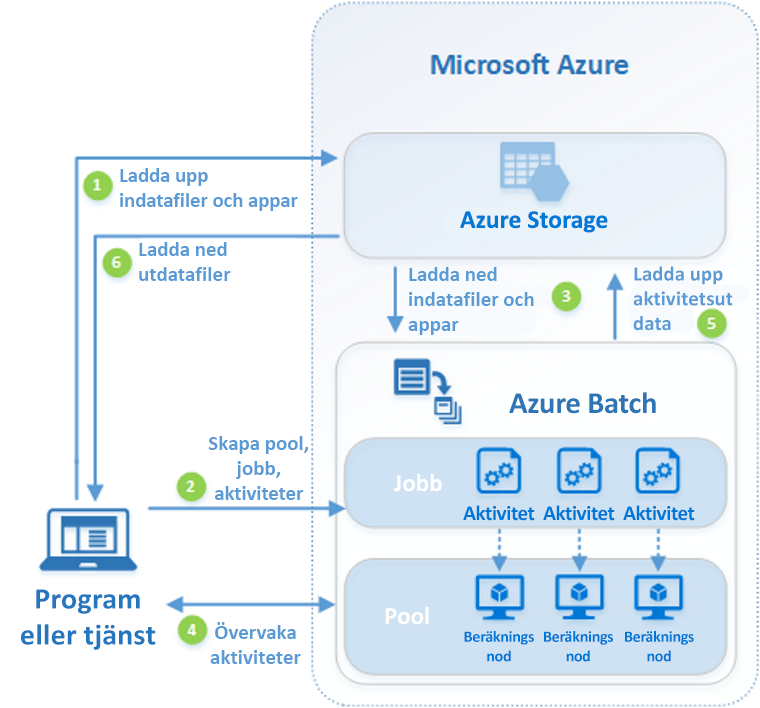

# Vad är Azure Batch?

Använd Azure Batch till att effektivt köra storskaliga parallella program och HPC-program (databehandling med höga prestanda) i Azure. Azure Batch skapar och hanterar en pool med beräkningsnoder (virtuella datorer), installerar de program som du vill köra och schemalägger jobb som ska köras på noderna. Det finns ingen kluster-eller jobb schema program vara att installera, hantera eller skala. I stället kan du använda [Batch-API: er och verktyg](batch-apis-tools.md), kommandoradsskript eller Azure-portalen för att konfigurera, hantera och övervaka dina jobb.

Utvecklare kan använda Batch som en plattformstjänst för att skapa SaaS-program eller klientprogram där storskalig körning krävs. Du kan till exempel skapa en tjänst med batch för att köra en Carlo risk simulering för ett finansiellt tjänste företag eller en tjänst för att bearbeta många avbildningar.

Det kostar inget extra att använda Batch. Du betalar bara för de underliggande resurserna som används, till exempel virtuella datorer, lagring och nätverk.

En jämförelse mellan batch och andra alternativ för HPC-lösningar i Azure finns i [HPC (data behandling med höga prestanda) i Azure](/azure/architecture/topics/high-performance-computing/).

## Köra parallella arbetsbelastningar

Batch fungerar bra med parallella arbetsbelastningar. Parallella arbets belastningar har program som kan köras separat, med varje instans som kompletterar en del av arbetet. När programmen körs kan de komma åt några vanliga data, men de kommunicerar inte med andra instanser av programmet. Parallella arbetsbelastningar kan därför köras i stor skala, vilket avgörs av hur stor del av beräkningsresurserna som är tillgängliga för att köra program samtidigt.

Några exempel på parallella arbetsbelastningar som du kan använda i Batch:

- Finansiell riskmodellering med Monte Carlo-simuleringar
- VFX och 3D-bildåtergivning
- Bildanalys och bearbetning
- Mediatranskodning
- Genetisk sekvensanalys
- Optisk teckenläsning (OCR)
- Datainhämtning, bearbetning och ETL-åtgärder
- Testkörning av programvara

Du kan också använda batch för att [köra nära kopplade arbets belastningar](batch-mpi.md), där de program du kör måste kommunicera med varandra, i stället för att köras oberoende av varandra. Nära kopplade program använder normalt Message Passing Interface (MPI) API. Du kan köra dina nära kopplade arbetsbelastningar med Batch med [Microsoft MPI](/message-passing-interface/microsoft-mpi) eller Intel MPI. Förbättra programmets prestanda med särskilda [HPC](../virtual-machines/sizes-hpc.md) och [GPU-optimerade](../virtual-machines/sizes-gpu.md) VM-storlekar.

Några exempel på nära kopplade arbetsbelastningar:

- Analys med finita elementmetoden
- Vätskedynamik
- AI-utbildning med flera noder

Många nära kopplade jobb kan köras parallellt med Batch. Till exempel kan du utföra flera simuleringar av en vätska som rinner genom ett rör med varierande rörbredd.

## Ytterligare funktioner för Batch

På högre nivå finns även belastningsspecifika funktioner för Azure Batch:

- Batch har stöd för storskaliga [återgivningsarbetsbelastningar](batch-rendering-service.md) med återgivningsverktyg inklusive Autodesk Maya, 3ds Max, Arnold och V-Ray. 
- R-användare kan installera [doAzureParallel R-paketet](https://github.com/Azure/doAzureParallel) för att enkelt skala ut körning av R-algoritmer till Batch-adresspooler.

Du kan också köra Batch-jobb som en del av ett större Azure-arbetsflöde för att omvandla data som hanteras av verktyg som [Azure Data Factory](../data-factory/transform-data-using-dotnet-custom-activity.md).

## Så här fungerar det

Ett vanligt scenario för Batch innebär att skala ut parallella arbeten, till exempel återgivningen av bilder för 3D-scener till en pool med beräkningsnoder. Den här poolen kan vara din "återge Server grupp" som tillhandahåller flera tusen, hundratals eller tusentals kärnor i ditt åter givnings jobb.

Följande diagram illustrerar stegen i ett vanligt Batch-arbetsflöde med ett klientprogram eller en värdbaserad tjänst som använder Batch för att köra en parallell arbetsbelastning.

|Steg  |Beskrivning  |
|---------|---------|
|1. Ladda upp **indatafilerna** och **programmen** för att bearbeta dessa filer till ditt Azure Storage-konto.     |Indatafilerna kan vara data som ditt program bearbetar, till exempel modellering av finansdata eller videofiler som ska kodas. Programfilerna kan innehålla skript eller program som bearbetar data, till exempel en mediatranscoder.|
|2. skapa en batch- **pool** med Compute-noder i batch-kontot, ett **jobb** för att köra arbets belastningen på poolen och **uppgifter** i jobbet.     | [Compute-noder](nodes-and-pools.md) är de virtuella datorer som kör dina [uppgifter](jobs-and-tasks.md). Ange egenskaper för din pool, till exempel antal och storlek på noderna, en Windows-eller Linux VM-avbildning och ett program att installera när noderna ansluter till poolen. Hantera kostnaden och storleken på poolen med hjälp av [virtuella datorer med låg prioritet](batch-low-pri-vms.md) eller genom att [automatiskt skala](batch-automatic-scaling.md) antalet noder när arbets belastningen ändras.   När du lägger till aktiviteter till ett jobb schemalägger Batch-tjänsten automatiskt aktiviteterna för körning på beräkningsnoderna i poolen. Varje aktivitet använder det program som du överförde för att bearbeta indatafilerna. |
|3. Ladda ned **indatafiler** och **program** till batch     |Innan varje aktivitet körs kan den Ladda ned de indata som ska bearbetas till den tilldelade noden. Om programmet inte redan är installerat på noderna i poolen kan det laddas ned här i stället. När hämtningen från Azure Storage är slutförd körs aktiviteten på den tilldelade noden.|
|4. övervaka **aktivitets körning**     |När aktiviteterna utförs ska du köra frågor mot Batch för att övervaka jobbets och aktiviteternas förlopp. Ditt klientprogram eller -tjänst kommunicerar med Batch-tjänsten över HTTPS. Eftersom du kan övervaka tusentals aktiviteter som körs på tusentals beräkningsnoder, se till att [effektivt fråga Batch-tjänsten](batch-efficient-list-queries.md).|
|5 **. Ladda upp Uppgiftsutdata**     |När aktiviteterna slutförs kan de ladda upp resultatdata till Azure Storage. Du kan också hämta filer direkt från filsystemet på en beräkningsnod.|
|6. Ladda ned **utdatafiler**     |När övervakningen upptäcker att aktiviteterna i jobbet har slutförts kan klientprogrammet eller tjänsten hämta utdata för vidare bearbetning.|

Tänk på att det arbets flöde som beskrivs ovan bara är ett sätt att använda batch och det finns många andra funktioner och alternativ. Du kan till exempel köra [flera aktiviteter parallellt](batch-parallel-node-tasks.md) på varje beräkningsnod. Du kan också använda [jobb förberedelse-och slut för ande uppgifter](batch-job-prep-release.md) för att förbereda noderna för dina jobb och sedan Rensa efteråt.

Se [batch-tjänstens arbets flöde och resurser](batch-service-workflow-features.md) för en översikt över funktioner som pooler, noder, jobb och aktiviteter. Se även de senaste [Batch-tjänstuppdateringarna](https://azure.microsoft.com/updates/?product=batch).

## Nästa steg

Kom igång med Azure Batch med någon av dessa snabbstarter:
- [Kör ditt första Batch-jobb med Azure CLI](quick-create-cli.md)
- [Kör ditt första Batch-jobb med Azure-portalen](quick-create-portal.md)
- [Kör ditt första Batch-jobb med hjälp av .NET API](quick-run-dotnet.md)
- [Kör ditt första Batch-jobb med hjälp av Python API](quick-run-python.md)
