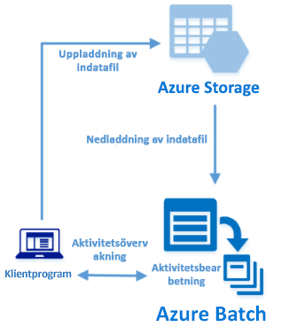

# <a name="quickstart-run-your-first-azure-batch-job-with-the-net-api"></a>Snabbstart: Kör ditt första Azure Batch-jobb med .NET-API

Kom igång med Azure Batch genom att köra ett jobb från ett C#-program som bygger på Azure Batch .NET API. Appen överför flera indatafiler till Azure-lagring och skapar sedan en pool med Batch-beräkningsnoder (virtuella datorer). Sedan skapar den ett exempeljobb som kör aktiviteter för att bearbeta varje indatafil på poolen med ett grundläggande kommando.

När du har slutfört den här snabbstarten kommer du att förstå huvudbegreppen för Batch-tjänsten och vara redo att testa Batch med mer realistiska arbetsbelastningar i större skala.



## <a name="prerequisites"></a>Krav

- Ett Azure-konto med en aktiv prenumeration. [Skapa ett konto kostnads fritt](https://azure.microsoft.com/free/?WT.mc_id=A261C142F).

- Ett Batch-konto och ett länkat Azure Storage-konto. Information om hur du skapar de här kontona finns Batch-snabbstarterna som du kommer åt via [Azure-portalen](quick-create-portal.md) eller [Azure CLI](quick-create-cli.md).

- [Visual Studio 2017 eller senare](https://www.visualstudio.com/vs), eller [.net Core 2,1](https://www.microsoft.com/net/download/dotnet-core/2.1) för Linux, MacOS eller Windows. 

## <a name="sign-in-to-azure"></a>Logga in på Azure

Logga in på Azure Portal på [https://portal.azure.com](https://portal.azure.com).

[!INCLUDE [batch-common-credentials](../../includes/batch-common-credentials.md)]

## <a name="download-the-sample"></a>Ladda ned exemplet

[Ladda ned eller klona exempelappen](https://github.com/Azure-Samples/batch-dotnet-quickstart) från GitHub. Om du vill klona lagringsplatsen för exempelappen med en Git-klient använder du följande kommando:

```
git clone https://github.com/Azure-Samples/batch-dotnet-quickstart.git
```

Gå till den katalog som innehåller filen med Visual Studio-lösningen `BatchDotNetQuickstart.sln`.

Öppna lösningsfilen i Visual Studio och uppdatera strängarna med autentiseringsuppgifterna i `Program.cs` med värdena för dina konton. Ett exempel:

```csharp
// Batch account credentials
private const string BatchAccountName = "mybatchaccount";
private const string BatchAccountKey  = "xxxxxxxxxxxxxxxxE+yXrRvJAqT9BlXwwo1CwF+SwAYOxxxxxxxxxxxxxxxx43pXi/gdiATkvbpLRl3x14pcEQ==";
private const string BatchAccountUrl  = "https://mybatchaccount.mybatchregion.batch.azure.com";

// Storage account credentials
private const string StorageAccountName = "mystorageaccount";
private const string StorageAccountKey  = "xxxxxxxxxxxxxxxxy4/xxxxxxxxxxxxxxxxfwpbIC5aAWA8wDu+AFXZB827Mt9lybZB1nUcQbQiUrkPtilK5BQ==";
```

[!INCLUDE [batch-credentials-include](../../includes/batch-credentials-include.md)]

## <a name="build-and-run-the-app"></a>Kompilera och köra appen

Om du vill se Batch-arbetsflödet i praktiken skapar och kör du programmet i Visual Studio eller på kommandoraden med kommandona `dotnet build` och `dotnet run`. När du har kört appen ska du granska koden för att lära dig hur varje del av appen fungerar. Till exempel i Visual Studio:

- Högerklicka på lösningen i Solution Explorer och klicka på Build- **lösning**. 

- Bekräfta återställningen av NuGet-paket om du uppmanas att göra det. Om du behöver ladda ned paket som saknas ska du se till att [NuGet Package Manager](https://docs.nuget.org/consume/installing-nuget) är installerat.

När du kör exempelappen ser utdata i konsolen ut ungefär så här. Under körningen uppstår det en paus vid `Monitoring all tasks for 'Completed' state, timeout in 00:30:00...` medan poolens beräkningsnoder startas. Aktiviteter köas för att köras när den första beräkningsnoden körs. Gå till batch-kontot i [Azure Portal](https://portal.azure.com) för att övervaka poolen, Compute-noderna, jobbet och uppgifterna.

```
Sample start: 11/16/2018 4:02:54 PM

Container [input] created.
Uploading file taskdata0.txt to container [input]...
Uploading file taskdata1.txt to container [input]...
Uploading file taskdata2.txt to container [input]...
Creating pool [DotNetQuickstartPool]...
Creating job [DotNetQuickstartJob]...
Adding 3 tasks to job [DotNetQuickstartJob]...
Monitoring all tasks for 'Completed' state, timeout in 00:30:00...
```

När aktiviteterna har slutförts kan du se utdata som liknar följande för varje aktivitet:

```
Printing task output.
Task: Task0
Node: tvm-2850684224_3-20171205t000401z
Standard out:
Batch processing began with mainframe computers and punch cards. Today it still plays a central role in business, engineering, science, and other pursuits that require running lots of automated tasks....
stderr:
...
```

Körningen tar normalt runt 5 minuter om du kör appen med standardkonfigurationen. Den ursprungliga poolinstallationen tar längst tid. För att köra jobbet igen ska du ta bort jobbet från den tidigare körningen men inte ta bort poolen. På en förkonfigurerad pool slutförs jobbet inom några sekunder.

## <a name="review-the-code"></a>Granska koden

.NET-appen i den här snabbstarten gör följande:

- Överför tre små textfiler till en blobcontainer i ditt Azure-lagringskonto. Dessa filer är indata som ska bearbetas av Batch.
- Skapar en pool med beräkningsnoder som kör Windows Server.
- Skapar ett jobb och tre aktiviteter som ska köras på noderna. Varje aktivitet bearbetar en av indatafilerna på en kommandorad för Windows. 
- Visar filer som returneras av aktiviteterna.

Se filen `Program.cs` och information i följande avsnitt.

### <a name="preliminaries"></a>Förberedelser

För att interagera med ett lagringskonto använder appen Azure Storage-klientbiblioteket för .NET. Den skapar en referens till kontot med [CloudStorageAccount](/dotnet/api/microsoft.azure.cosmos.table.cloudstorageaccount) och därifrån skapar den en [CloudBlobClient](/dotnet/api/microsoft.azure.storage.blob.cloudblobclient).

```csharp
CloudBlobClient blobClient = storageAccount.CreateCloudBlobClient();
```

Appen använder referensen `blobClient` för att skapa en container i lagringskontot och för att överföra filer till containern. De lagrade filerna har definierats som Batch [ResourceFile](/dotnet/api/microsoft.azure.batch.resourcefile)-objekt som Batch senare kan hämta till beräkningsnoder.

```csharp
List<string> inputFilePaths = new List<string>
{
    "taskdata0.txt",
    "taskdata1.txt",
    "taskdata2.txt"
};

List<ResourceFile> inputFiles = new List<ResourceFile>();

foreach (string filePath in inputFilePaths)
{
    inputFiles.Add(UploadFileToContainer(blobClient, inputContainerName, filePath));
}
```

Appen skapar ett [BatchClient](/dotnet/api/microsoft.azure.batch.batchclient)-objekt för att skapa och hantera pooler, jobb och uppgifter i Batch-tjänsten. Batch-klienten i exemplet använder autentisering med delad nyckel. (Batch har även stöd för Azure Active Directory-autentisering.)

```csharp
BatchSharedKeyCredentials cred = new BatchSharedKeyCredentials(BatchAccountUrl, BatchAccountName, BatchAccountKey);

using (BatchClient batchClient = BatchClient.Open(cred))
...
```

### <a name="create-a-pool-of-compute-nodes"></a>Skapa en pool med beräkningsnoder

För att skapa en Batch-pool app använder appen metoden [BatchClient.PoolOperations.CreatePool](/dotnet/api/microsoft.azure.batch.pooloperations.createpool) för att ange antalet noder, VM-storlek och en pool-konfiguration. Här anger ett [VirtualMachineConfiguration](/dotnet/api/microsoft.azure.batch.virtualmachineconfiguration)-objekt en [ImageReference](/dotnet/api/microsoft.azure.batch.imagereference) till en Windows Server-avbildning som publicerats på Azure Marketplace. Batch stöder ett brett utbud av Linux- och Windows Server-avbildningar på Azure Marketplace samt anpassade VM-avbildningar.

Antalet noder (`PoolNodeCount`) och VM-storlek (`PoolVMSize`) är definierade konstanter. Exemplet skapar som standard en pool med 2 noder i storleken *Standard_A1_v2*. Storleken som föreslås erbjuder en bra balans mellan prestanda och kostnad för det här snabba exemplet.

Metoden [Commit](/dotnet/api/microsoft.azure.batch.cloudpool.commit) skickar poolen till Batch-tjänsten.

```csharp

private static VirtualMachineConfiguration CreateVirtualMachineConfiguration(ImageReference imageReference)
{
    return new VirtualMachineConfiguration(
        imageReference: imageReference,
        nodeAgentSkuId: "batch.node.windows amd64");
}

private static ImageReference CreateImageReference()
{
    return new ImageReference(
        publisher: "MicrosoftWindowsServer",
        offer: "WindowsServer",
        sku: "2016-datacenter-smalldisk",
        version: "latest");
}

private static void CreateBatchPool(BatchClient batchClient, VirtualMachineConfiguration vmConfiguration)
{
    try
    {
        CloudPool pool = batchClient.PoolOperations.CreatePool(
            poolId: PoolId,
            targetDedicatedComputeNodes: PoolNodeCount,
            virtualMachineSize: PoolVMSize,
            virtualMachineConfiguration: vmConfiguration);

        pool.Commit();
    }
...

```

### <a name="create-a-batch-job"></a>Skapa ett Batch-jobb

Ett Batch-jobb är en logisk gruppering av en eller flera aktiviteter. Ett jobb omfattar inställningar som är gemensamma för aktiviteter, till exempel prioritet och vilken pool som aktiviteterna ska köras på. Appen använder metoden [BatchClient.JobOperations.CreateJob](/dotnet/api/microsoft.azure.batch.joboperations.createjob) för att skapa ett jobb på din pool.

Metoden [Commit](/dotnet/api/microsoft.azure.batch.cloudjob.commit) skickar jobbet till Batch-tjänsten. Från början har jobbet inga uppgifter.

```csharp
try
{
    CloudJob job = batchClient.JobOperations.CreateJob();
    job.Id = JobId;
    job.PoolInformation = new PoolInformation { PoolId = PoolId };

    job.Commit();
}
...
```

### <a name="create-tasks"></a>Skapa uppgifter

Appen skapar en lista över [CloudTask](/dotnet/api/microsoft.azure.batch.cloudtask)-objekt. Varje aktivitet bearbetar indata `ResourceFile`-objekt med egenskapen [CommandLine](/dotnet/api/microsoft.azure.batch.cloudtask.commandline). I det här exemplet kör kommandoraden Windows kommandot `type` för att visa filen. Detta kommando är ett enkelt exempel i demonstrationssyfte. När du använder Batch är det på kommandoraden som du anger din app eller ditt skript. Batch tillhandahåller ett antal sätt att distribuera appar och skript till beräkningsnoder.

Sedan lägger appen till aktiviteter i jobbet med metoden [AddTask](/dotnet/api/microsoft.azure.batch.joboperations.addtask) som köar dem för att köras på beräkningsnoder.

```csharp
for (int i = 0; i < inputFiles.Count; i++)
{
    string taskId = String.Format("Task{0}", i);
    string inputFilename = inputFiles[i].FilePath;
    string taskCommandLine = String.Format("cmd /c type {0}", inputFilename);

    CloudTask task = new CloudTask(taskId, taskCommandLine);
    task.ResourceFiles = new List<ResourceFile> { inputFiles[i] };
    tasks.Add(task);
}

batchClient.JobOperations.AddTask(JobId, tasks);
```

### <a name="view-task-output"></a>Visa aktivitetens utdata

Appen skapar ett [TaskStateMonitor](/dotnet/api/microsoft.azure.batch.taskstatemonitor) för att övervaka aktiviteter och kontrollera att de slutförs. Appen använder sedan egenskapen [CloudTask.ComputeNodeInformation](/dotnet/api/microsoft.azure.batch.cloudtask.computenodeinformation) för att visa den `stdout.txt`-fil som skapats av varje slutförd aktivitet. När aktiviteten körs skrivs utdata från aktivitetskommandot till `stdout.txt`:

```csharp
foreach (CloudTask task in completedtasks)
{
    string nodeId = String.Format(task.ComputeNodeInformation.ComputeNodeId);
    Console.WriteLine("Task: {0}", task.Id);
    Console.WriteLine("Node: {0}", nodeId);
    Console.WriteLine("Standard out:");
    Console.WriteLine(task.GetNodeFile(Constants.StandardOutFileName).ReadAsString());
}
```

## <a name="clean-up-resources"></a>Rensa resurser

Appen tar automatiskt bort den lagringscontainer den skapar och ger dig möjlighet att ta bort Batch-poolen och jobbet. Du debiteras för poolen medan noderna körs, även om inga jobb är schemalagda. Ta bort poolen när du inte längre behöver den. När du tar bort poolen raderas alla aktivitetsutdata på noderna.

När de inte längre behövs tar du bort resursgruppen, Batch-kontot och lagringskontot. Om du vill göra det i Azure-portalen väljer du resursgruppen för Batch-kontot och klickar på **Ta bort resursgrupp**.

## <a name="next-steps"></a>Nästa steg

I den här snabbstarten körde du en liten app som byggts med Batch .NET API för att skapa en Batch-pool och ett Batch-jobb. Jobbet körde exempelaktiviteter och hämtade utdata som skapats på noderna. Nu när du förstår nyckelbegreppen för Batch-tjänsten är du redo att testa Batch med mer realistiska arbetsbelastningar i större skala. Om du vill lära dig mer om Azure Batch och gå igenom parallell arbetsbelastning med ett verkligt program ska du fortsätta med självstudierna om Batch .NET.

> [!div class="nextstepaction"]
> [Bearbeta en parallell arbetsbelastning med .NET](tutorial-parallel-dotnet.md)
