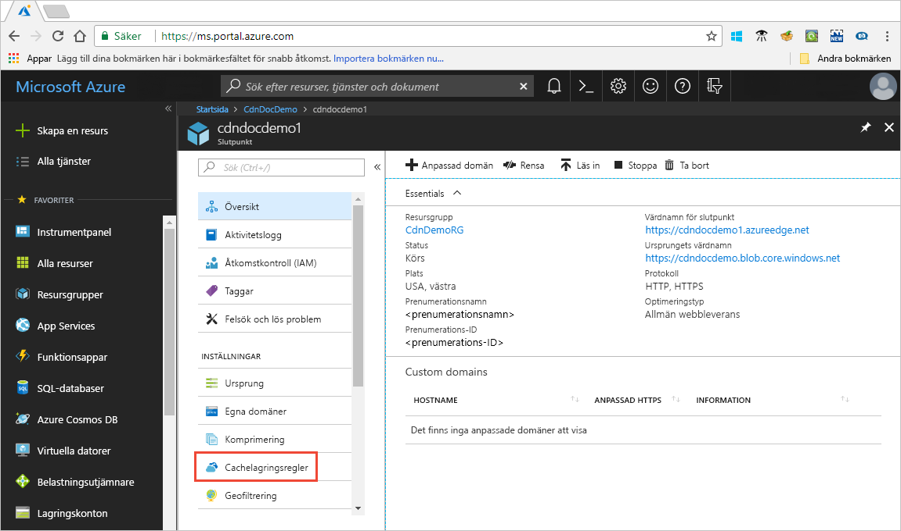

# Kontrollera funktionssättet för Azure CDN-cachelagring med cachelagringsregler

> [!NOTE] 
> Reglerna för cachelagring är bara tillgängliga för **Azure CDN Standard från Verizon** och **Azure CDN Standard från Akamai** -profiler. För **Azure CDN från Microsoft** -profiler måste du använda [standard regel motorn](cdn-standard-rules-engine-reference.md) för att **Azure CDN Premium från Verizon** -profiler, du måste använda [verktyget Verizon Premium regler](./cdn-verizon-premium-rules-engine.md) i **hanterings** portalen för liknande funktioner.
 
Azure Content Delivery Network (CDN) erbjuder två sätt att styra hur dina filer cachelagras: 

- Regler för cachelagring: den här artikeln beskriver hur du kan använda regler för cachelagring av innehålls leverans nätverk (CDN) för att ange eller ändra standardvärdet för förfallet cache i både globalt och med anpassade villkor, till exempel en URL-sökväg och fil namn Azure CDN har två typer av cachelagringsregler:

   - Globala cachelagringsregler: Du kan ange en regel för globala cachelagringsregler för varje slutpunkt i din profil, vilket påverkar alla förfrågningar till slutpunkten. Den globala cachelagringsregeln åsidosätter eventuella huvuden för HTTP-cachedirektiv, om angivna.

   - Anpassade cachelagringsregler: Du kan ange en eller flera anpassade cachelagringsregler för varje slutpunkt i din profil. Anpassade cachelagringsregler matchar specifika sökvägar och filnamnstillägg, bearbetas i ordning och åsidosätter den globala cacheregeln om sådan finns. 

- Cachelagring av frågesträngar: du kan ändra hur Azure CDN behandlar cachelagring för begär Anden med frågesträngar. Mer information finns i [kontroll Azure CDN caching-beteende med frågesträngar](cdn-query-string.md). Om filen inte kan cachelagras har inställningen för cachelagring av frågesträngar ingen påverkan, baserat på regler för cachelagring och CDN Standard beteenden.

Information om standard beteende för cachelagring och lagring av direktiv-rubriker finns i [så här fungerar cachelagring](cdn-how-caching-works.md). 

## Åtkomst till Azure CDN regler för cachelagring

1. Öppna Azure Portal, Välj en CDN-profil och välj en slut punkt.

2. I det vänstra fönstret under inställningar, väljer du **Cachelagringsregler**.

   

   Sidan **Cachelagringsregler** visas.

   

## Egenskaper för cachelagring
För globala och anpassade regler för cachelagring kan du ange följande **beteende inställningar för cachelagring** :

- **Kringgå cache**: cachelagra och ignorerar inte ursprung-tillhandahållna cache-direktiv-rubriker.

- **Åsidosätt**: Ignorera ursprung-angiven cache-varaktighet; Använd den angivna cachens varaktighet i stället. Detta kommer inte att åsidosätta Cache-Control: no-cache.

- **Ange om det saknas**: respektera ursprung-tillhandahållen cache-direktiv-rubriker, om de finns. Annars använder du angiven cache-varaktighet.

## Förfallo tid för cache
För globala och anpassade regler för cachelagring kan du ange förfallo tid för cache i dagar, timmar, minuter och sekunder:

- För att **åsidosätta** och **Ange om** inställningarna för **cachelagring** är giltiga är giltiga cache-längder mellan 0 och 366 dagar. För värdet 0 sekunder cachelagrar CDN innehållet, men måste verifiera om varje begäran med ursprungs servern.

- För inställningen **kringgå cacheminne** anges cachens varaktighet automatiskt till 0 sekunder och kan inte ändras.

## Matchnings villkor för anpassade caching-regler

Två matchnings villkor är tillgängliga för anpassade cache-regler:
 
- **Sökväg**: det här tillståndet matchar sökvägen till URL: en, exklusive domän namnet och stöder jokertecknet ( \* ). Till exempel _/myfile.html_, _/My/Folder/*_ och _/my/images/*. jpg_. Den maximala längden är 260 tecken.

- **Tillägg**: det här villkoret matchar fil namns tillägget för den begärda filen. Du kan ange en lista över kommaavgränsade fil namns tillägg som ska matchas. Till exempel _. jpg_, _. mp3_ eller _. png_. Det maximala antalet tillägg är 50 och det maximala antalet tecken per tillägg är 16. 

## Global och anpassad regel bearbetnings ordning
Globala och anpassade regler för cachelagring bearbetas i följande ordning:

- Globala regler för cachelagring prioriteras över standardvärdet för CDN-cachelagring (HTTP cache-direktivets huvud inställningar). 

- Regler för anpassad cachelagring åsidosätter globala regler för cachelagring, där de tillämpas. Anpassade regler för cachelagring bearbetas i ordning från uppifrån och ned. Det vill säga om en begäran matchar båda villkoren, åsidosätter reglerna längst ned i listan över regler överst i listan. Därför bör du placera mer detaljerade regler längre ned i listan.

**Exempel**:
- Global caching-regel: 
   - Beteende för cachelagring: **Åsidosätt**
   - Förfallo tid för cache: 1 dag

- Regel för anpassad cachelagring #1:
   - Matchnings villkor: **sökväg**
   - Matchnings värde: _/Home/*_
   - Beteende för cachelagring: **Åsidosätt**
   - Förfallo tid för cache: 2 dagar

- Regel för anpassad cachelagring #2:
   - Matchnings villkor: **tillägg**
   - Matchnings värde: _. html_
   - Beteende för cachelagring: **Ange om det saknas**
   - Förfallo tid för cache: 3 dagar

När de här reglerna anges är en begäran om _&lt; slut punkts namn &gt;_. azureedge.net/Home/index.html utlöser en anpassad regel för cachelagring #2, som är inställt på: **Ange om det saknas** och 3 dagar. Om *index.html* -filen har `Cache-Control` eller `Expires` http-huvuden, kommer de att bevaras. i annat fall cachelagras filen i tre dagar, om dessa huvuden inte har angetts.

> [!NOTE] 
> Filer som cachelagras före en regel ändring behåller sina inställningar för varaktighet för ursprungs cache. Om du vill återställa deras cache-varaktigheter måste du [Rensa filen](cdn-purge-endpoint.md). 
>
> Azure CDN konfigurations ändringar kan ta lite tid att sprida genom nätverket: 
> - För **Azure CDN Standard från Akamai**-profiler slutförs spridningen vanligtvis inom en minut. 
> - För **Azure CDN Standard från Verizon** -profiler, slutförs spridningen vanligt vis om 10 minuter.  
>

## Se även

- [Så fungerar cachelagring](cdn-how-caching-works.md)
- [Självstudie: Konfigurera Azures CDN-cachelagringsregler](cdn-caching-rules-tutorial.md)