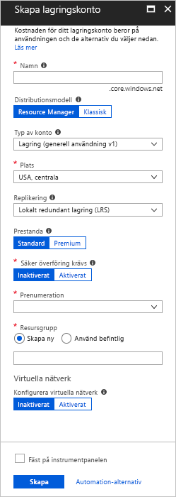
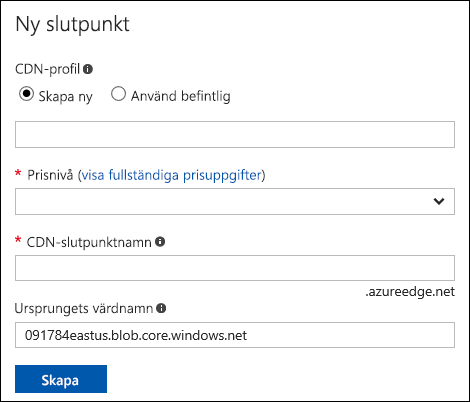

# Snabbstart: Integrera ett Azure Storage-konto med Azure CDN
I den här snabbstarten aktiverar du [Azure Content Delivery Network (CDN)](cdn-overview.md) för att cachelagra innehåll från Azure Storage. Azure CDN ger utvecklarna en global lösning när det gäller att leverera innehåll med hög bandbredd. Det kan cachelagra blobbar och statiskt innehåll för beräkningsinstanser på fysiska noder i USA, Europa, Asien, Australien och Sydamerika.

[!INCLUDE [quickstarts-free-trial-note](../../includes/quickstarts-free-trial-note.md)]

## Logga in på Azure-portalen
Logga in på [Azure Portal](https://portal.azure.com) med ditt Azure-konto.

## skapar ett lagringskonto
Använd följande procedur om du vill skapa ett nytt lagringskonto för en Azure-prenumeration. Ett lagringskonto ger åtkomst till Azure Storage-tjänster. Lagringskontot representerar namnrymdens högsta nivå för åtkomst till var och en av Azure Storages tjänstkomponenter: Azure Blob, Queue och Table Storage. Mer information finns i [Introduktion till Microsoft Azure Storage](../storage/common/storage-introduction.md).

Om du vill skapa ett lagringskonto måste du vara tjänstadministratör eller medadministratör för den associera prenumerationen.

Du kan använda flera metoder för att skapa ett lagringskonto, bl.a. Azure Portal och PowerShell. Den här snabbstarten visar hur du använder Azure Portal.   

**Skapa ett lagringskonto för en Azure-prenumeration**

1. Välj **Skapa en resurs** längst upp till vänster i Azure-portalen. 

    Fönstret **Ny** visas.

2. Välj **Lagring** och sedan **Koppla undernät – blob, fil, tabell, kö**.
    
    

    Fönstret **Skapa lagringskonto** visas.   

    

3. Ange ett underdomänsnamn i rutan **Namn**. Den här posten kan innehålla 3-24 gemena bokstäver och siffror.
   
    Det här värdet blir värdnamnet i den URI som används för att adressera prenumerationens blobb-, kö- eller tabellresurser. När du vill adressera en containerresurs i Blob Storage så använd en URI i följande format:
   
    http://*&lt;StorageAcountLabel&gt;*.blob.core.windows.net/*&lt;mycontainer&gt;*

    där *&lt;StorageAccountLabel&gt;* refererar till värdet i rutan **Namn**.
   
    > [!IMPORTANT]    
    > URL-etiketten bildar underdomänen i lagringskontots URI och måste vara unika bland alla värdbaserade tjänster i Azure.
   
    Det här värdet används också som namn på lagringskontot i portalen eller när du försöker få åtkomst till det här kontot i programmet.
    
4. När det gäller resten av inställningarna så använd de värden som anges i följande tabell:

    | Inställning  | Värde |
    | -------- | ----- |
    | **Distributionsmodell** | Använd standardvärdet. |
    | **Typ av konto** | Använd standardvärdet. |
    | **Plats**    | Välj **USA, centrala** i listrutan. |
    | **Replikering** | Använd standardvärdet. |
    | **Prestanda** | Använd standardvärdet. |
    | **Säker överföring krävs** | Använd standardvärdet. |
    | **Prenumeration** | Välj en Azure-prenumeration i listrutan. |
    | **Resursgrupp** | Välj **Skapa ny** och ange *my-resource-group-123* som namn på resursgruppen. Det här namnet måste vara globalt unikt. Om det redan används kan du ange ett annat namn eller välja **Använd befintligt** och välja **min-resurs-grupp-123** från den nedrullningsbara listan.  Mer information om resursgrupper finns i [Översikt över Azure Resource Manager](../azure-resource-manager/resource-group-overview.md#resource-groups).| 
    | **Konfigurera virtuella nätverk** | Använd standardvärdet. |  
    
5. Spara lagringskontot på instrumentpanelen när det har skapats genom att välja **Fäst på instrumentpanelen**.
    
6. Välj **Skapa**. Det kan ta flera minuter att skapa lagringskontot.

## Aktivera Azure CDN för lagringskontot

Du kan aktivera Azure CDN för ditt lagringskonto direkt från ditt lagringskonto. Om du vill ange avancerade konfigurationsinställningar för din CDN-slutpunkt, som [optimering av nedladdning av stora filer](cdn-optimization-overview.md#large-file-download), kan du istället använda [Azure CDN-tillägget](cdn-create-new-endpoint.md) till att skapa en CDN-profil och en slutpunkt.

1. Välj ett lagringskonto på instrumentpanelen och välj sedan **Azure CDN** i den vänstra rutan. Om knappen **Azure CDN** inte visas direkt kan du ta fram den genom att ange CDN i rutan **Sök** i det vänstra fönstret.
    
    Sidan **Azure CDN** visas.

    
    
2. Skapa en ny slutpunkt genom att ange den nödvändiga information som visas i följande tabell:

    | Inställning  | Värde |
    | -------- | ----- |
    | **CDN-profil** | Välj **Skapa ny** och ange *my-cdn-profile-123* som profilnamn. Namnet måste vara globalt unikt. Om det redan används kan du ange ett annat namn.  |
    | **prisnivå** | Välj **Standard Verizon** i listrutan. |
    | **CDN-slutpunktsnamn** | Ange *my-endpoint-123* som slutpunktens värdnamn. Namnet måste vara globalt unikt. Om det redan används kan du ange ett annat namn. Namnet används för att komma åt cachelagrade resurser på domänen _&lt;slutpunktens namn&gt;_.azureedge.net. En ny CDN-slutpunkt använder som standard lagringskontots värdnamn som ursprunglig server.|

3. Välj **Skapa**. När slutpunkten har skapats visas den i listan med slutpunkter.

    

## Aktivera ytterligare CDN-funktioner
Öppna CDN slutpunktens konfigurationssida genom att välja CDN-slutpunkten i listan på lagringskontots **Azure CDN**-sida. Från den här sidan kan du aktivera ytterligare CDN-funktioner, t.ex. [komprimering](cdn-improve-performance.md), [cachelagring av frågesträngar](cdn-query-string.md) och [geofiltrering](cdn-restrict-access-by-country.md). 
    

## Aktivera SAS
Om du vill ge begränsad åtkomst till privata lagringscontainrar kan du använda funktionen SAS (signatur för delad åtkomst) för Azure-lagringskontot. En SAS är en URI som ger begränsad åtkomst till dina Azure-lagringsresurser utan att du exponerar din kontonyckel. Mer information finns i [Använda Azure CDN med SAS](cdn-sas-storage-support.md).

## Åtkomst till CDN-innehåll
Använd CDN-URL som anges i portalen om du vill få åtkomst till cachelagrat innehåll på CDN. Adressen för en cachelagrad blobb har följande format:

http://<*EndpointName*\>.azureedge.net/<*myPublicContainer*\>/<*BlobName*\>

> [!NOTE]
> När du aktiverar Azure CDN-åtkomst till ett lagringskonto är alla offentligt tillgängliga objekt berättigade för CDN POP-cachelagring. Om du ändrar ett objekt som för tillfället är cachelagrat i CDN blir det nya innehållet inte tillgängligt via Azure CDN förrän Azure CDN uppdaterar sitt innehåll efter det att det cachelagrade innehållets Time to Live-period har löpt ut.

## Ta bort innehåll från Azure CDN
Om du inte längre vill cachelagra ett objekt i Azure CDN kan du vidta något av följande steg:

* Gör containern privat i stället för offentlig. Mer information finns i [Hantera anonym läsbehörighet till containrar och blobbar](../storage/blobs/storage-manage-access-to-resources.md).
* Inaktivera eller ta bort CDN-slutpunkten med hjälp av Azure Portal.
* Ändra din värdbaserade tjänst så att den inte längre svarar på förfrågningar för objektet.

Ett objekt som redan har cachelagrats i Azure CDN förblir cachelagrat tills objektets Time to Live-period har löpt ut eller tills slutpunkten har [rensats](cdn-purge-endpoint.md). När Time to Live-perioden har löpt ut avgör Azure CDN om CDN-slutpunkten fortfarande är giltigt och om objektet fortfarande är tillgängligt anonymt. Om så inte är fallet kommer objektet inte längre att cachelagras.

## Rensa resurser
I föregående steg skapade du en CDN-profil och en CDN-slutpunkt i en resursgrupp. Spara dessa resurser om du vill gå till [Nästa steg](#next-steps) och lära dig hur du lägger till en anpassad domän i din slutpunkt. Men om du inte tänker använda de här resurserna i framtiden kan du ta bort dem genom att ta bort resursgruppen (på så sätt undviker du ytterligare kostnader):

1. På den vänstra menyn i Azure Portal väljer du **Resursgrupper** och sedan **my-resource-group-123**.

2. På sidan **Resursgrupp** väljer du **Ta bort resursgrupp**, skriver *my-resource-group-123* i textrutan och väljer **Ta bort**.

    Den här åtgärden tar bort resursgruppen, profilen och slutpunkten som du skapade i den här snabbstarten.

3. Om du vill ta bort ditt lagringskonto markerar du det på instrumentpanelen och väljer sedan **Ta bort** på den översta menyn.

## Nästa steg
Mer information om hur du lägger till en anpassad domän och aktiverar HTTPS för din CDN-slutpunkt finns i följande självstudie:

> [!div class="nextstepaction"]
> [Självstudie: Använda lagringsblobar via en anpassad Azure CDN-domän och HTTPS](cdn-storage-custom-domain-https.md)

