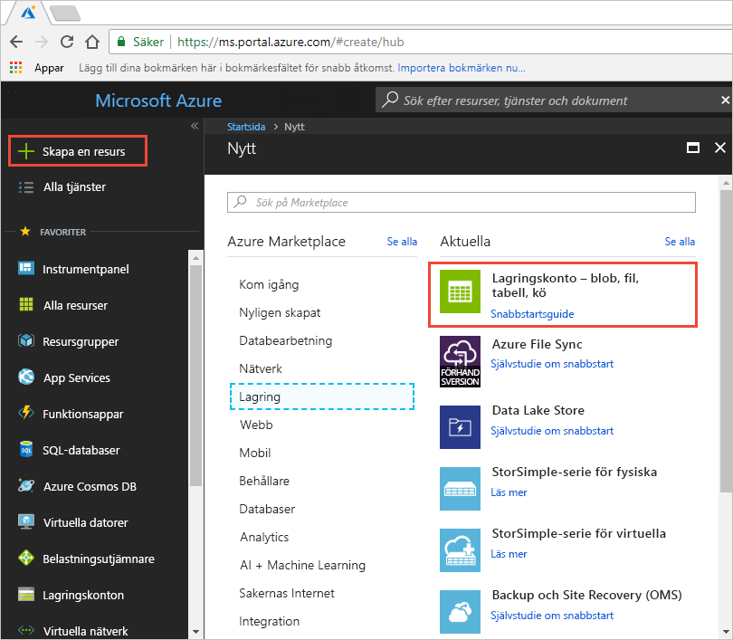
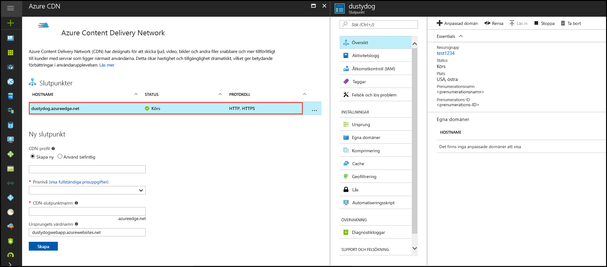
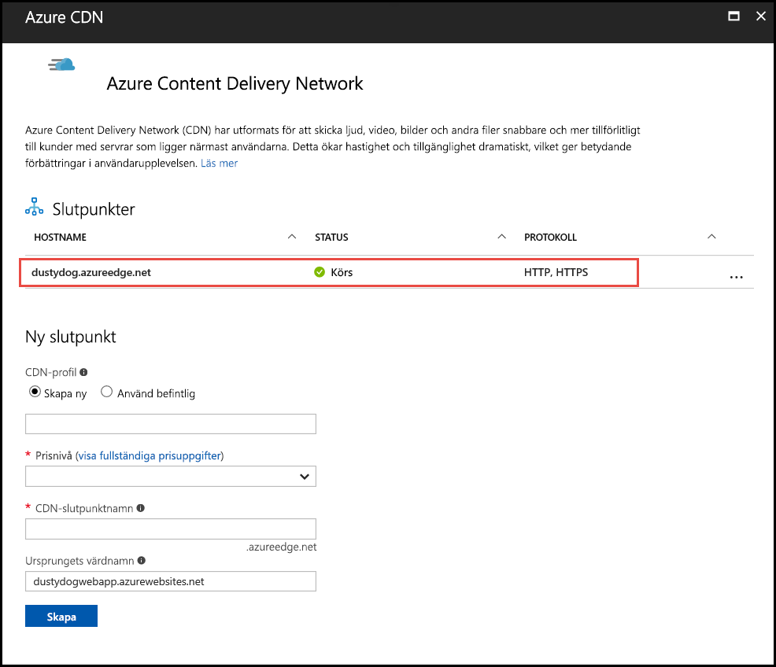

# Snabb start: integrera ett Azure Storage-konto med Azure CDN

I den här snabb starten aktiverar du [Azure Content Delivery Network (CDN)](cdn-overview.md) för att cachelagra innehåll från Azure Storage. Azure CDN ger utvecklarna en global lösning när det gäller att leverera innehåll med hög bandbredd. Det kan cachelagra blobbar och statiskt innehåll för beräkningsinstanser på fysiska noder i USA, Europa, Asien, Australien och Sydamerika.

## Förutsättningar

- Ett Azure-konto med en aktiv prenumeration. [Skapa ett konto kostnads fritt](https://azure.microsoft.com/free/?ref=microsoft.com&utm_source=microsoft.com&utm_medium=docs&utm_campaign=visualstudio).

## Logga in på Azure Portal

Logga in på [Azure-portalen](https://portal.azure.com) med ditt Azure-konto.

## skapar ett lagringskonto

Ett lagringskonto ger åtkomst till Azure Storage-tjänster. Lagringskontot representerar namnrymdens högsta nivå för åtkomst till var och en av Azure Storages tjänstkomponenter: Azure Blob, Queue och Table Storage. Mer information finns i [Introduktion till Microsoft Azure Storage](../storage/common/storage-introduction.md).

Om du vill skapa ett lagringskonto måste du vara tjänstadministratör eller medadministratör för den associera prenumerationen.

1. I Azure Portal väljer du **skapa en resurs** längst upp till vänster. Fönstret **Ny** visas.

1. Sök efter **lagrings konto** och välj **lagrings konto – BLOB, fil, tabell, kö** i list rutan. Välj sedan **skapa**:
    
    

1. I **fönstret Skapa lagrings konto** anger du följande information:

    | Inställning | Värde | 
    | --- | --- |
    | Projekt information > resurs grupp | Välj **Skapa nytt** och Använd namnet *CDNQuickstart-RG*. Du kan också använda en befintlig resurs grupp om du föredrar det. |
    | Instans information > lagrings konto namn | Ange ett namn för kontot 3-24 med bara gemena bokstäver och siffror. Namnet måste vara unikt i Azure och blir värd namnet i den URL som används för att adressera BLOB-, kö-eller tabell resurser för prenumerationen. Om du vill adressera en behållar resurs i Blob Storage använder du en URI i följande format: http://*&lt; storageaccountname &gt;*. blob.Core.Windows.net/*&lt; container-name &gt;*.
    | Instans information > plats | Välj en Azure-region nära dig i list rutan. |
    
    Lämna all annan information inställd på standardvärdena och välj sedan **Granska + skapa**.

1. Det kan ta flera minuter att slutföra skapandet av lagrings kontot. När du har skapat filen väljer du **gå till resurs** för att öppna lagrings kontots sida för nästa steg.

## Aktivera Azure CDN för lagringskontot

1. På sidan för ditt lagrings konto väljer du **BLOB service**  >  **Azure CDN** på den vänstra menyn. Sidan **Azure CDN** visas.

    
    
1. Ange följande information i avsnittet **ny slut punkt** :

    | Inställning  | Värde |
    | -------- | ----- |
    | **CDN-profil** | Välj **Skapa ny** och ange ditt profil namn, till exempel *CDN-Profile-123*. En profil är en samling slut punkter. |
    | **Prisnivå** | Välj ett av **standard** alternativen, till exempel **standard Microsoft**. |
    | **CDN-slutpunktsnamn** | Ange slut punktens värdnamn, till exempel *CDN-Endpoint-123*. Det här namnet måste vara globalt unikt i Azure eftersom det är för att komma åt dina cachelagrade resurser i URL _&lt; -slutpunkten-name &gt;_. azureedge.net. |
    | **Ursprungets värdnamn** | En ny CDN-slutpunkt använder som standard lagringskontots värdnamn som ursprunglig server. |

1. Välj **Skapa**. När slutpunkten har skapats visas den i listan med slutpunkter.

    

> [!TIP]
> Om du vill ange avancerade konfigurationsinställningar för din CDN-slutpunkt, som [optimering av nedladdning av stora filer](cdn-optimization-overview.md#large-file-download), kan du istället använda [Azure CDN-tillägget](cdn-create-new-endpoint.md) till att skapa en CDN-profil och en slutpunkt.

## Aktivera ytterligare CDN-funktioner

Öppna CDN slutpunktens konfigurationssida genom att välja CDN-slutpunkten i listan på lagringskontots **Azure CDN**-sida.

Från den här sidan kan du aktivera ytterligare CDN-funktioner, t.ex. [komprimering](cdn-improve-performance.md), [cachelagring av frågesträngar](cdn-query-string.md) och [geofiltrering](cdn-restrict-access-by-country.md). 
    
## Aktivera SAS

Om du vill ge begränsad åtkomst till privata lagrings behållare kan du använda funktionen signatur för delad åtkomst (SAS) i ditt Azure Storage-konto. En SAS är en URI som ger begränsad åtkomst till dina Azure-lagringsresurser utan att du exponerar din kontonyckel. Mer information finns i [Använda Azure CDN med SAS](cdn-sas-storage-support.md).

## Åtkomst till CDN-innehåll

Använd CDN-URL som anges i portalen om du vill få åtkomst till cachelagrat innehåll på CDN. Adressen för en cachelagrad blobb har följande format:

http://<*-slutpunkt-Name* \> . azureedge.net/<*myPublicContainer* \> /< *BlobName*\>

> [!NOTE]
> När du aktiverar Azure CDN-åtkomst till ett lagringskonto är alla offentligt tillgängliga objekt berättigade för CDN POP-cachelagring. Om du ändrar ett objekt som för tillfället är cachelagrat i CDN blir det nya innehållet inte tillgängligt via Azure CDN förrän Azure CDN uppdaterar sitt innehåll efter det att det cachelagrade innehållets Time to Live-period har löpt ut.

## Ta bort innehåll från Azure CDN

Om du inte längre vill cachelagra ett objekt i Azure CDN kan du vidta något av följande steg:

- Gör containern privat i stället för offentlig. Mer information finns i [Hantera anonym Läs behörighet till behållare och blobbar](../storage/blobs/anonymous-read-access-configure.md).
- Inaktivera eller ta bort CDN-slutpunkten med hjälp av Azure Portal.
- Ändra din värdbaserade tjänst så att den inte längre svarar på förfrågningar för objektet.

Ett objekt som redan har cachelagrats i Azure CDN förblir cachelagrat tills objektets Time to Live-period har löpt ut eller tills slutpunkten har [rensats](cdn-purge-endpoint.md). När Time to Live-perioden har löpt ut avgör Azure CDN om CDN-slutpunkten fortfarande är giltigt och om objektet fortfarande är tillgängligt anonymt. Om så inte är fallet kommer objektet inte längre att cachelagras.

## Rensa resurser

I föregående steg skapade du en CDN-profil och en CDN-slutpunkt i en resursgrupp. Spara dessa resurser om du vill gå till [Nästa steg](#next-steps) och lära dig hur du lägger till en anpassad domän i din slutpunkt. Men om du inte tänker använda de här resurserna i framtiden kan du ta bort dem genom att ta bort resursgruppen (på så sätt undviker du ytterligare kostnader):

1. I den vänstra menyn i Azure Portal väljer du **resurs grupper** och väljer sedan * CDNQuickstart-rg * *.

2. Välj **ta bort resurs grupp** på sidan **resurs grupp** , ange *CDNQuickstart-RG* i text rutan och välj sedan **ta bort**.

    Den här åtgärden tar bort resursgruppen, profilen och slutpunkten som du skapade i den här snabbstarten.

3. Om du vill ta bort ditt lagringskonto markerar du det på instrumentpanelen och väljer sedan **Ta bort** på den översta menyn.

## Nästa steg

> [!div class="nextstepaction"]
> [Skapa en Azure CDN-profil och en CDN-slutpunkt](cdn-create-new-endpoint.md)

> [!div class="nextstepaction"]
> [Självstudie: Använd CDN till Server statiskt innehåll från en webbapp](cdn-add-to-web-app.md)