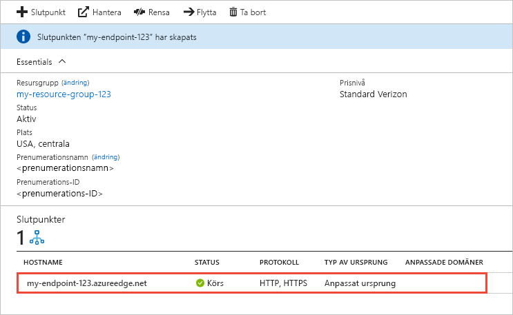

# Skapa en Azure CDN-slutpunkt
I den här artikeln beskrivs alla inställningar för att skapa en [Azure Content Delivery Network-slutpunkt (CDN)](cdn-overview.md) i en befintlig CDN-profil. När du har skapat en profil och en slut punkt kan du börja leverera innehåll till dina kunder. En snabb start för att skapa en profil och slut punkt finns i [snabb start: skapa en Azure CDN profil och slut punkt](cdn-create-new-endpoint.md).

## Förutsättningar
Innan du kan skapa en CDN-slutpunkt måste du ha skapat minst en CDN-profil, som kan innehålla en eller flera CDN-slutpunkter. Du kan organisera dina CDN-slutpunkter efter internetdomän, webbapp eller något annat kriterium genom att använda flera profiler. Eftersom CDN-prissättningen används på CDN-profilens nivå måste du skapa flera CDN-profiler om du vill använda en blandning av Azure CDN pris nivåer. Information om hur du skapar en CDN-profil finns i [skapa en ny CDN-profil](cdn-create-new-endpoint.md#create-a-new-cdn-profile).

## Logga in på Azure Portal
Logga in på [Azure Portal](https://portal.azure.com) med ditt Azure-konto.

## Skapa en ny CDN-slutpunkt

1. Gå till din CDN-profil på [Azure-portalen](https://portal.azure.com). Du kanske fäste den på instrumentpanelen i föregående steg. Om inte så kan du hitta den genom att välja **Alla tjänster** och sedan **CDN-profiler**. Välj den profil du vill lägga till på slutpunkten i fönstret **CDN-profiler**. 
   
    Fönstret för CDN-profilen visas.

2. Välj **slut punkt**.
   
    
   
    Sidan **Lägg till en slutpunkt** visas.
   
    

3. I **Namn** anger du ett unikt namn för den nya CDN-slutpunkten. Det här namnet används för att komma åt dina cachelagrade resurser på domänen _\<endpointname>_ . azureedge.net.

4. För **typ av ursprung** väljer du någon av följande ursprungs typer: 
   - **Lagring** för Azure Storage
   - **Moln tjänst** för Azure-Cloud Services
   - **Web App** för Azure Web Apps
   - **Anpassat ursprung** för alla andra offentligt tillgängliga ursprungs webb servrar (som finns i Azure eller på annan plats)

5. För **Ursprungligt värdnamn** väljer eller anger du din ursprungs Server domän. List rutan visar alla tillgängliga ursprungs servrar av den typ som du angav i steg 4. Om du valde **anpassat ursprung** som typ av ursprung anger du domänen för din anpassade ursprungs Server.
    
6. För **ursprungs Sök väg** anger du sökvägen till de resurser som du vill cachelagra. Lämna inställningen tom om du vill tillåta cachelagring av alla resurser i den domän du angav i steg 5.
    
7. I **Ursprungsvärdadress** anger du värdhuvudet som du vill att Azure CDN ska skicka med varje begäran, eller så lämnar du standardvärdet.
   
   > [!NOTE]
   > Vissa typer av ursprung, till exempel Azure Storage och Web Apps, kräver att värdhuvudet matchar ursprungets domän. Lämna standardvärdet såvida du inte har ett ursprung som kräver ett värdhuvud som skiljer sig från dess domän.
   > 
    
8. För **protokoll** och **ursprungs port** anger du de protokoll och portar som ska användas för att komma åt dina resurser på ursprungs servern. Du måste välja minst ett protokoll (HTTP eller HTTPS). Använd den CDN-tillhandahållna domänen ( _\<endpointname>_ . azureedge.net) för att komma åt https-innehåll. 
   
   > [!NOTE]
   > Värdet för **ursprungs porten** bestämmer bara porten som slut punkten använder för att hämta information från ursprungs servern. Själva slutpunkten är bara tillgänglig för slutklienter via HTTP- och HTTPS-standardportarna (80 och 443), oavsett värdet för **Ursprungsport**.  
   > 
   > Slutpunkter i **Azure CDN from Akamai**-profiler tillåter inte hela TCP-portintervallet för ursprungsportar. En lista över ursprungsportar som inte tillåts finns i [Azure CDN från Akamai-tillåtna ursprungsportar](/previous-versions/azure/mt757337(v=azure.100)).  
   > 
   > HTTPS-stöd för Azure CDN anpassade domäner stöds inte på **Azure CDN från Akamai** -produkter. Mer information finns i [Konfigurera HTTPS på en anpassad Azure CDN-domän](cdn-custom-ssl.md).
    
9. För **optimerad för** väljer du en optimerings typ som bäst matchar det scenario och den typ av innehåll som du vill att slut punkten ska leverera. Mer information finns i [optimera Azure CDN för typ av innehålls leverans](cdn-optimization-overview.md).

    Följande optimerings typs inställningar stöds, enligt profil typ:
    - **Azure CDN Standard från Microsoft** -profiler:
       - [**Allmän webb leverans**](cdn-optimization-overview.md#general-web-delivery)

    - **Azure CDN Standard från Verizon** och **Azure CDN Premium från Verizon** -profiler:
       - [**Allmän webb leverans**](cdn-optimization-overview.md#general-web-delivery)
       - [**Acceleration av dynamisk webbplats**](cdn-optimization-overview.md#dynamic-site-acceleration)

    - **Azure CDN Standard från Akamai** -profiler:
       - [**Allmän webb leverans**](cdn-optimization-overview.md#general-web-delivery)
       - [**Allmän medie direkt uppspelning**](cdn-optimization-overview.md#general-media-streaming)
       - [**Medie direkt uppspelning av video på begäran**](cdn-optimization-overview.md#video-on-demand-media-streaming)
       - [**Hämtning av stora filer**](cdn-optimization-overview.md#large-file-download)
       - [**Acceleration av dynamisk webbplats**](cdn-optimization-overview.md#dynamic-site-acceleration)

10. Välj **Lägg till** för att skapa den nya slutpunkten.
   
    När slutpunkten har skapats, visas den i en lista över slutpunkter för profilen.
    
    
    
    Slutpunkten kan inte användas direkt, eftersom det tar tid för registreringen att sprida sig: 
    - För **Azure CDN Standard från Microsoft**-profiler slutförs spridningen vanligtvis inom 10 minuter. 
    - För **Azure CDN Standard från Akamai**-profiler slutförs spridningen vanligtvis inom en minut. 
    - För **Azure CDN Standard från Verizon**- och **Azure CDN Premium från Verizon**-profiler slutförs spridningen vanligtvis inom 90 minuter. 
   
    Om du försöker använda CDN-domännamnet innan slut punkts konfigurationen har spridits till POP-servrarna (Point-of-Presence) kan du få en HTTP 404-svars status. Om det har varit flera timmar sedan du skapade slut punkten och du fortfarande får en 404-svars status, se [fel sökning Azure CDN slut punkter som returnerar en 404-status kod](cdn-troubleshoot-endpoint.md).

## Rensa resurser
Om du vill ta bort en slut punkt när den inte längre behövs markerar du den och väljer sedan **ta bort**. 

## Nästa steg
Om du vill veta mer om anpassade domäner fortsätter du till självstudien för att lägga till en anpassad domän i CDN-slutpunkten.

> [!div class="nextstepaction"]
> [Lägga till en anpassad domän](cdn-map-content-to-custom-domain.md)

