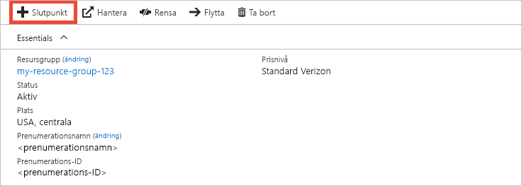
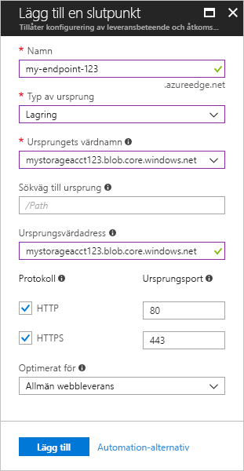

# Snabbstart: Skapa en Azure CDN-profil och slutpunkt
I den här snabbstarten aktiverar du Azure Content Delivery Network (CDN) genom att skapa en ny CDN-profil och CDN-slutpunkt. När du har skapat en profil och en slutpunkt kan du börja leverera innehåll till dina kunder.

[!INCLUDE [quickstarts-free-trial-note](../../includes/quickstarts-free-trial-note.md)]

## Nödvändiga komponenter
För den här snabbstarten måste du ha skapat ett lagringskonto med namnet *mystorageacct123*, som du använder för ursprungets värdnamn. Mer information finns i [Integrera ett Azure-lagringskonto med Azure CDN](cdn-create-a-storage-account-with-cdn.md).

## Logga in på Azure-portalen
Logga in på [Azure Portal](https://portal.azure.com) med ditt Azure-konto.

[!INCLUDE [cdn-create-profile](../../includes/cdn-create-profile.md)]

## Skapa en ny CDN-slutpunkt

När du har skapat en CDN-profil kan använda du den för att skapa en slutpunkt.

1. På instrumentpanelen i Azure Portal väljer du den CDN-profil som du skapade. Om du inte hittar den väljer du **Alla tjänster** och sedan **CDN-profiler**. På sidan **CDN-profiler** markerar du den profil som du vill använda. 
   
    CDN-profilsidan visas.

2. Välj **Slutpunkt**.
   
    
   
    Fönstret **Lägg till slutpunkt** visas.

3. Använd värdena som anges i följande tabell som slutpunktsinställningar:

    | Inställning | Värde |
    | ------- | ----- |
    | **Namn** | Ange *my-endpoint-123* som slutpunktens värdnamn. Namnet måste vara globalt unikt. Om det redan används kan du ange ett annat namn. Namnet används för att komma åt cachelagrade resurser på domänen _&lt;slutpunktens namn&gt;_.azureedge.net.|
    | **Typ av ursprung** | Välj **Lagring**. | 
    | **Ursprungets värdnamn** | Ange *mystorageacct123.blob.core.windows.net* som värdnamn. Namnet måste vara globalt unikt. Om det redan används kan du ange ett annat namn. |
    | **Sökväg till ursprung** | Lämna tomt. |
    | **Ursprungsvärdadress** | Använd det standardgenererade värdet. |  
    | **Protokoll** | Använd de valda standardalternativen för **HTTP** och **HTTPS**. |
    | **Ursprungsport** | Använd standardportvärdena. | 
    | **Optimerat för** | Använd standardvalet **Allmän webbleverans**. |

    

3. Välj **Lägg till** för att skapa den nya slutpunkten.
   
   När slutpunkten har skapats, visas den i en lista över slutpunkter för profilen.
    
   
    
   Slutpunkten kan inte användas direkt, eftersom det tar tid för registreringen att sprida sig: 
   - För **Azure CDN Standard från Microsoft**-profiler slutförs spridningen vanligtvis inom tio minuter. 
   - För **Azure CDN Standard från Akamai**-profiler slutförs spridningen vanligtvis inom en minut. 
   - För **Azure CDN Standard från Verizon**- och **Azure CDN Premium från Verizon**-profiler slutförs spridningen vanligtvis inom 90 minuter. 

## Rensa resurser
I föregående steg skapade du en CDN-profil och en CDN-slutpunkt i en resursgrupp. Spara dessa resurser om du vill gå till [Nästa steg](#next-steps) och lära dig hur du lägger till en anpassad domän i din slutpunkt. Men om du inte tänker använda de här resurserna i framtiden kan du ta bort dem genom att ta bort resursgruppen (på så sätt undviker du ytterligare kostnader):

1. På den vänstra menyn i Azure Portal väljer du **Resursgrupper** och sedan **my-resource-group-123**.

2. På sidan **Resursgrupp** väljer du **Ta bort resursgrupp**, skriver *my-resource-group-123* i textrutan och väljer **Ta bort**.

    Den här åtgärden tar bort resursgruppen, profilen och slutpunkten som du skapade i den här snabbstarten.

## Nästa steg
Mer information om hur du lägger till en anpassad domän i din CDN-slutpunkt finns i följande självstudiekurs:

> [!div class="nextstepaction"]
> [Självstudie: Självstudier: Lägga till en anpassad domän i Azure CDN-slutpunkten](cdn-map-content-to-custom-domain.md)

