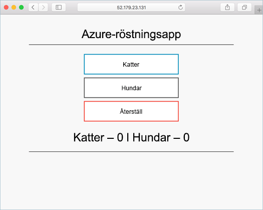

# <a name="deprecated-deploy-docker-ce-cluster"></a>(INAKTUELL) Distribuera Docker CE-kluster

[!INCLUDE [ACS deprecation](../../../includes/container-service-deprecation.md)]

I den här snabbstartsguiden ska vi distribuera ett Docker CE-kluster med hjälp av Azure CLI. Därefter distribuerar vi och kör ett flerbehållarprogram som består av en webbklientdel och en Redis-instans i klustret. När vi har gjort det kan programmet nås via Internet.

Docker CE på Azure Container Service är en förhandsversion och **bör inte användas för produktionsarbete**.

Om du inte har en Azure-prenumeration kan du skapa ett [kostnadsfritt konto](https://azure.microsoft.com/free/?WT.mc_id=A261C142F) innan du börjar.

Om du väljer att installera och använda CLI lokalt måste du köra Azure CLI version 2.0.4 eller senare. Kör `az --version` för att hitta versionen. Om du behöver installera eller uppgradera kan du läsa informationen i [Installera Azure CLI]( /cli/azure/install-azure-cli).

## <a name="create-a-resource-group"></a>Skapa en resursgrupp

Skapa en resursgrupp med kommandot [az group create](/cli/azure/group#az-group-create). En Azure-resursgrupp är en logisk grupp där Azure-resurser distribueras och hanteras.

I följande exempel skapas en resursgrupp med namnet *myResourceGroup* i den *westus2* plats.

```azurecli-interactive
az group create --name myResourceGroup --location westus2
```

Utdata:

```json
{
  "id": "/subscriptions/00000000-0000-0000-0000-000000000000/resourceGroups/myResourceGroup",
  "location": "westus2",
  "managedBy": null,
  "name": "myResourceGroup",
  "properties": {
    "provisioningState": "Succeeded"
  },
  "tags": null
}
```

## <a name="create-docker-swarm-cluster"></a>Skapa Docker Swarm-kluster

Skapa ett Docker CE-kluster i Azure Container Service med kommandot [az acs create](/cli/azure/acs#az-acs-create). Information om region availaiblity av Docker CE finns [ACS regioner för Docker CE](https://github.com/Azure/ACS/blob/master/announcements/2017-08-04_additional_regions.md)

I följande exempel skapas ett kluster med namnet *mySwarmCluster* med en Linux-huvudnod och tre Linux-agentnoder.

```azurecli-interactive
az acs create --name mySwarmCluster --orchestrator-type dockerce --resource-group myResourceGroup --generate-ssh-keys
```

I vissa fall, som vid en begränsad utvärderingsversion, har en Azure-prenumeration begränsad åtkomst till Azure-resurser. Om distributionen misslyckas på grund av begränsade tillgängliga kärnor minskar du antalet standardagenter genom att lägga till `--agent-count 1` till kommandot [az acs create](/cli/azure/acs#az-acs-create). 

Efter flera minuter slutförs kommandot och returnerar JSON-formaterad information om klustret.

## <a name="connect-to-the-cluster"></a>Anslut till klustret

I den här snabbstartsguide behöver du FQDN både för Docker Swarm-huvudnoden och Docker-agentpoolen. Kör följande kommando för att returnera både huvudnods- och agent-FQDN.


```bash
az acs list --resource-group myResourceGroup --query '[*].{Master:masterProfile.fqdn,Agent:agentPoolProfiles[0].fqdn}' -o table
```

Utdata:

```bash
Master                                                               Agent
-------------------------------------------------------------------  --------------------------------------------------------------------
myswarmcluster-myresourcegroup-d5b9d4mgmt.ukwest.cloudapp.azure.com  myswarmcluster-myresourcegroup-d5b9d4agent.ukwest.cloudapp.azure.com
```

Skapa en SSH-tunnel till Swarm-huvudnoden. Ersätt `MasterFQDN` med FQDN-adressen för Swarm-huvudnoden.

```bash
ssh -p 2200 -fNL localhost:2374:/var/run/docker.sock azureuser@MasterFQDN
```

Ange miljövariabeln `DOCKER_HOST`. På detta sätt kan du köra Docker-kommandon mot Docker Swarm utan att behöva ange värdnamnet.

```bash
export DOCKER_HOST=localhost:2374
```

Du är nu redo att köra Docker-tjänster på Docker Swarm.


## <a name="run-the-application"></a>Köra programmet

Skapa en fil med namnet `azure-vote.yaml` och kopiera följande innehåll till den.


```yaml
version: '3'
services:
  azure-vote-back:
    image: redis
    ports:
        - "6379:6379"

  azure-vote-front:
    image: microsoft/azure-vote-front:v1
    environment:
      REDIS: azure-vote-back
    ports:
        - "80:80"
```

Kör kommandot [docker stack deploy](https://docs.docker.com/engine/reference/commandline/stack_deploy/) för att skapa Azure Vote-tjänsten.

```bash
docker stack deploy azure-vote --compose-file azure-vote.yaml
```

Utdata:

```bash
Creating network azure-vote_default
Creating service azure-vote_azure-vote-back
Creating service azure-vote_azure-vote-front
```

Använd kommandot [docker stack ps](https://docs.docker.com/engine/reference/commandline/stack_ps/) för att returnera distributionsstatusen för programmet.

```bash
docker stack ps azure-vote
```

När `CURRENT STATE` för varje tjänst är `Running` är programmet redo.

```bash
ID                  NAME                            IMAGE                                 NODE                               DESIRED STATE       CURRENT STATE                ERROR               PORTS
tnklkv3ogu3i        azure-vote_azure-vote-front.1   microsoft/azure-vote-front:v1   swarmm-agentpool0-66066781000004   Running             Running 5 seconds ago                            
lg99i4hy68r9        azure-vote_azure-vote-back.1    redis:latest                          swarmm-agentpool0-66066781000002   Running             Running about a minute ago
```

## <a name="test-the-application"></a>Testa programmet

Gå till FQDN för Swarm-agentpoolen för att testa Azure Vote-programmet.



## <a name="delete-cluster"></a>Ta bort klustret
När klustret inte längre behövs du använda kommandot [az group delete](/cli/azure/group#az-group-delete) för att ta bort resursgruppen, containertjänsten och alla relaterade resurser.

```azurecli-interactive
az group delete --name myResourceGroup --yes --no-wait
```

## <a name="get-the-code"></a>Hämta koden

I den här snabbstartsguide används fördefinierade containeravbildningar för att skapa en Docker-tjänst. Tillhörande programkod, Dockerfile och Compose-fil finns på GitHub.

[https://github.com/Azure-Samples/azure-voting-app-redis](https://github.com/Azure-Samples/azure-voting-app-redis.git)

## <a name="next-steps"></a>Nästa steg

I den här snabbstartsguiden distribuerade du ett Docker Swarm-kluster och distribuerade sedan ett flerbehållarprogram till det.

Om du vill veta mer om integrering av Docker swarm med Azure DevOps kan du fortsätta att CI/CD med Docker Swarm och Azure DevOps.

> [!div class="nextstepaction"]
> [CI/CD med Docker Swarm och Azure DevOps](./container-service-docker-swarm-setup-ci-cd.md)
