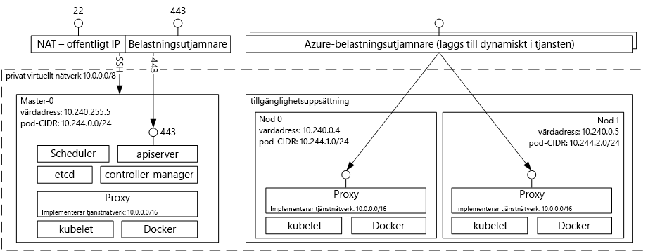

# (INAKTUELL) Introduktion till Azure Container Service för Kubernetes

> [!TIP]
> Den uppdaterade versionen av artikeln som använder Azure Kubernetes Service finns i [Översikt över Azure Kubernetes Service (AKS)](../../aks/intro-kubernetes.md).

[!INCLUDE [ACS deprecation](../../../includes/container-service-kubernetes-deprecation.md)]

Azure Container Service för Kubernetes gör det enkelt för dig att skapa, konfigurera och hantera av ett kluster på virtuella datorer som är förkonfigurerade för att köra program i behållare. På så sätt kan du använda dina befintliga kunskaper eller använda en stor och växande mängd communityexpertis för att distribuera och hantera containerbaserade program i Microsoft Azure.

Genom att använda Azure Container Service kan du dra nytta av Azures funktioner på företagsnivå samtidigt som programmen fortsätter att vara bärbara via Kubernetes och Docker-avbildningsformatet.

## Använda Azure Container Service för Kubernetes
Vårt mål med Azure Container Service är att tillhandahålla en behållarvärdmiljö genom att använda verktyg och teknik med öppen källkod som är populära bland kunderna idag. Därför tillgängliggör vi Kubernetes API-standardslutpunkter. Genom att använda dessa standardslutpunkter kan du använda all programvara som kan kommunicera till ett Kubernetes-kluster. Du kan till exempel välja [kubectl](https://kubernetes.io/docs/user-guide/kubectl-overview/), [helm](https://helm.sh/) eller [draft](https://github.com/Azure/draft).

## Skapa ett Kubernetes-kluster med Azure Container Service
Om du vill börja använda Azure Container Service distribuerar du ett Azure Container Service-kluster med [Azure CLI](container-service-kubernetes-walkthrough.md) eller via portalen (sök på Marketplace efter **Azure Container Service**). Om du är en avancerad användare som behöver mer kontroll över Azure Resource Manager-mallarna kan du öppna projektet [acs-engine](https://github.com/Azure/acs-engine) med öppen källkod för att bygga ett eget anpassat Kubernetes-kluster och distribuera det via `az` CLI.

### Använda Kubernetes
Kubernetes automatiserar distributionen, skalningen och hanteringen av program som använder containrar. Det har en omfattande uppsättning funktioner. Till exempel:
* Automatisk paketering
* Självåterställning
* Horisontell skalning
* Tjänstidentifiering och belastningsutjämning
* Automatiserade distributioner och återställningar
* Hemlighets- och konfigurationshantering
* Storage-dirigering
* Batch-körning

Arkitekturdiagram över Kubernetes som distribuerats via Azure Container Service:

## Videoklipp

Stöd för Kubernetes i Azure Container Service (Azure fredag, januari 2017):

> [!VIDEO https://channel9.msdn.com/Shows/Azure-Friday/Kubernetes-Support-in-Azure-Container-Services/player]
>
>

Verktyg för utveckling och distribution av program på Kubernetes (Azure OpenDev, juni 2017):

> [!VIDEO https://channel9.msdn.com/Events/AzureOpenDev/June2017/Tools-for-Developing-and-Deploying-Applications-on-Kubernetes/player]
>
>

## Nästa steg

Titta närmare på [Kubernetes-snabbstarten](container-service-kubernetes-walkthrough.md) för att börja utforska Azure Container Service idag.
