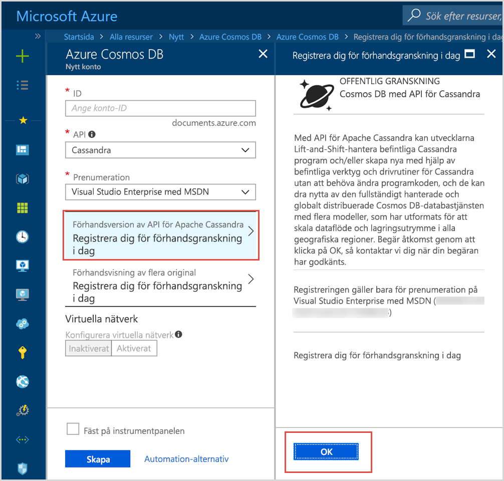

# Introduktion till Azure Cosmos DB: Apache Cassandra API

Azure Cosmos DB tillhandahåller Cassandra API:t (förhandsversion) för program som är skrivna för Apache Cassandra och som behöver premiumfunktioner som:

* [Skalbart lagringsutrymme och dataflöde](partition-data.md).
* [Nyckelfärdig global distribution](distribute-data-globally.md)
* Latensvärden på enstaka millisekunder vid 99:e percentilen.
* [Fem väldefinierade konsekvensnivåer](consistency-levels.md)
* [Automatisk indexering av data](http://www.vldb.org/pvldb/vol8/p1668-shukla.pdf) utan att du behöver hantera schema och index. 
* Garanterat hög tillgänglighet, allt backat av [branschledande serviceavtal](https://azure.microsoft.com/support/legal/sla/cosmos-db/)

## Vad är Azure Cosmos DB Apache Cassandra API?

Azure Cosmos DB kan användas som datalager för appar som skrivits för [Apache Cassandra](https://cassandra.apache.org/) genom att använda Apache Cassandra API:t. Det innebär att med hjälp av befintliga [Apache-licensierade drivrutiner som är kompatibla med CQLv4](https://cassandra.apache.org/doc/latest/getting_started/drivers.html?highlight=driver), kan ditt program som skrivits för Cassandra nu kommunicera med Azure Cosmos DB Cassandra API:t. I flera fall kan du växla från att använda Apache Cassandra till att använda Azure Cosmos DB:s Apache Cassandra API genom att bara ändra en anslutningssträng. Med den här funktionen kan du enkelt skapa och köra Cassandra API-databasprogram i Azure Cloud med Azure Cosmos DB:s globala distribution och dess [omfattande branschledande serviceavtal](https://azure.microsoft.com/support/legal/sla/cosmos-db), medan du fortsätter att använda bekanta kunskaper och verktyg för Cassandra API.

Cassandra API:t låter dig interagera med data som lagras i Azure Cosmos DB med hjälp av Cassandra Query Language-baserade verktyg (till exempel CQLSH) och de Cassandra-klientdrivrutiner som du redan är bekant med. Läs mer om det här i Microsoft Mechanics-videon med Principal Engineering Manager Kirill Gavrylyuk.

> [!VIDEO https://www.youtube.com/embed/1Sf4McGN1AQ]
>

## Vad är fördelen med att använda Apache Cassandra API:t för Azure Cosmos DB?

**Ingen driftshantering**: som en i sanning fullständigt hanterad tjänst, ser Azure Cosmos DB till att Cassandra API-administratörer inte behöver oroa sig för att hantera och övervaka en uppsjö med inställningar över OS-, JVM- och yaml-filer och deras samspel. Azure Cosmos DB erbjuder övervakning av dataflöde, svarstid, lagring och tillgänglighet och konfigurerbara aviseringar. 

**Prestandahantering**: Azure Cosmos DB tillhandahåller serviceavtalsbackade läs och skriv med låga svarstider för den 99:e percentilen. Användare behöver inte oroa sig över att ha en driftsöverkapacitet för att få serviceavtal med bra läs och skriv. Dessa inkluderar vanligtvis schemaläggningskomprimering, hantering av tombstones, inställningar för bloomfilter och replikeringsfördröjningar. Azure DB Cosmos tar bort oron med att hantera de här problemen så du kan fokusera på programleveranserna.

**Automatisk indexering**: Azure Cosmos DB indexerar automatiskt alla kolumner i tabellen i Cassandra API-databasen. Azure Cosmos DB kräver inte att du skapar sekundärindex för att snabba upp frågor. Den tillhandahåller en läs- och skrivupplevelse med låga svarstider samtidigt som den utför automatisk konsekvent indexering. 

**Möjlighet att använda befintlig kod och verktyg**: Azure Cosmos DB erbjuder kompatibilitet på trådprotokollsnivå med befintliga SDK:er och verktyg. Den här kompatibiliteten garanterar att du kan använda din befintliga kodbas med Cassandra API för Azure Cosmos DB med minimala ändringar.

**Dataflöde och lagringselasticitet**: Azure Cosmos-plattformen ger dig elasticitet med garanterat dataflöde över regioner via enkla portal-, PowerShell- eller CLI-åtgärder. Du kan elastiskt skala Azure Cosmos DB-tabeller med förutsägbar prestanda allteftersom programmet växer. Azure Cosmos DB stöder Cassandra API-tabeller som kan skalas till praktiskt taget obegränsade lagringsstorlekar. 

**Global distribution och tillgänglighet**: Azure Cosmos DB ger dig möjligheten att distribuera data över Azure-regioner så att användare kan njuta av låg svarstider med bibehållen tillgänglighet. Azure Cosmos DB ger dig 99,99 % tillgänglighet inom en region och 99,999 % lästillgänglighet över regionerna utan driftsöverkapacitet. Azure Cosmos DB finns tillgängligt i över 30 [Azure-regioner](https://azure.microsoft.com/regions/services/). Läs mer i [Distribuera data globalt](distribute-data-globally.md). 

**Val av konsekvensnivåer:** Azure Cosmos DB låter dig välja mellan fem väldefinierade konsekvensnivåer för bästa möjliga balans mellan konsekvens och prestanda. Dessa konsekvensnivåer är stark, begränsat föråldrad, session, konsekvent prefix och eventuell. Med de här detaljerade, väldefinierade konsekvensnivåerna kan utvecklare fatta välgrundade beslut om balans mellan konsekvens, tillgänglighet och svarstid. Läs mer om hur du [maximerar tillgänglighet och prestanda med hjälp av konsekvensnivåer](consistency-levels.md). 

**Enterprise-klass**: Azure Cosmos DB erbjuder [kompatibilitetscertifieringar](https://www.microsoft.com/trustcenter) så att användare kan använda plattformen på ett säkert sätt. Azure Cosmos DB erbjuder även kryptering i vila och i rörelse, IP-brandvägg och granskningsloggar för kontrollplansaktiviteter.  

## Registrera dig nu 

Om du redan har en Azure-prenumeration, kan du registrera dig för programmet Cassandra API (förhandsversion) i [Azure-portalen](https://aka.ms/cosmosdb-cassandra-signup).  Om Azure är nytt för dig, kan du registrera dig för en [kostnadsfri utvärderingsversion](https://azure.microsoft.com/free) där du får 12 månaders gratis åtkomst till Azure Cosmos DB. Slutför följande steg för att begära åtkomst till programmet Cassandra API (förhandsversion).

1. I [Azure-portalen](https://portal.azure.com), klickar du på **Skapa en resurs** > **Databaser** > **Azure Cosmos DB**. 

2. På sidan Nytt konto, väljer du **Cassandra** i API-rutan. 

3. I rutan **Prenumeration** väljer du den Azure-prenumeration som du vill använda för det här kontot.

4. Klicka på **Registrera dig för förhandsversionen idag**.

    

3. I rutan Registrera dig för förhandsversionen idag, klickar du på **OK**. 

    När du skickar in din begäran, ändras status till **Väntar på godkännande** i fönstret Nytt konto. 

När du skickat in din begäran, väntar du på ett e-postmeddelande att din begäran har godkänts. På grund av stora mängder begäranden, bör du få ett meddelande inom en vecka. Du behöver inte skapa ett supportärende för att slutföra begäran. Begäranden granskas i den ordning de tas emot. 

## Så här kommer du igång
När du har gått med i förhandsversionsprogrammet, kan du följa Cassandra API-snabbstarterna för att skapa en app med Cassandra API:t:

* [Snabbstart: skapa en Cassandra webbapp med Node.js och Azure Cosmos DB](create-cassandra-nodejs.md)
* [Snabbstart: skapa en Cassandra webbapp med Java och Azure Cosmos DB](create-cassandra-java.md)
* [Snabbstart: skapa en Cassandra webbapp med .NET och Azure Cosmos DB](create-cassandra-dotnet.md)
* [Snabbstart: skapa en Cassandra webbapp med Python och Azure Cosmos DB](create-cassandra-python.md)

## Nästa steg

Information om Azure Cosmos DB Cassandra API:t finns integrerad i den övergripande dokumentationen för Azure Cosmos DB, men här följer några tips för att komma igång:

* Följ [Snabbstarterna](create-cassandra-nodejs.md) för att skapa ett konto och en ny app med ett Git-exempel
* Följ [Självstudien](tutorial-develop-cassandra-java.md) för att skapa en ny app programmässigt.
* Följ [självstudien Importera Cassandra-data](cassandra-import-data.md) för att importera dina befintliga data till Azure Cosmos DB.
* Läs [Vanliga frågor](faq.md#cassandra).
