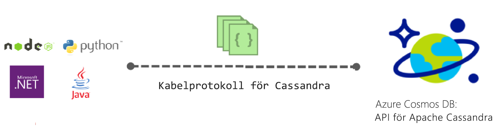

# Introduktion till Apache Cassandra API för Azure Cosmos DB

Azure Cosmos-DB innehåller Cassandra API (förhandsversion) för program som är skrivna för Apache Cassandra som behöver premium-funktioner som:

* [Skalbar lagringsstorlek och genomströmning](partition-data.md).
* [Nyckelfärdig global distributionsplatsen](distribute-data-globally.md)
* Latensvärden på enstaka millisekunder vid 99:e percentilen.
* [Fem väldefinierade konsekvensnivåer](consistency-levels.md)
* [Automatisk indexering av data](http://www.vldb.org/pvldb/vol8/p1668-shukla.pdf) utan att behöva hantera schemat och index. 
* Garanterat hög tillgänglighet, alla säkerhetskopieras av [branschledande serviceavtal](https://azure.microsoft.com/support/legal/sla/cosmos-db/)

## Vad är Azure Cosmos DB Apache Cassandra API?

Azure Cosmos-DB kan användas som databas för appar som skrivits för [Apache Cassandra](https://cassandra.apache.org/), genom att använda Apache Cassandra API. Detta innebär att med hjälp av befintliga [Apache licensierad drivrutiner som är kompatibla med CQLv4](https://cassandra.apache.org/doc/latest/getting_started/drivers.html?highlight=driver), ditt program som skrivits för Cassandra nu kan kommunicera med Azure Cosmos DB Cassandra API. I många fall kan du växla från att använda Apache Cassandra till Azure Cosmos DB Apache Cassandra API genom att ändra en anslutningssträng. Med den här funktionen kan du enkelt skapa och köra Cassandra API databasprogram i Azure-moln med Azure Cosmos DB global distributionsplatsen och [omfattande branschledande serviceavtal](https://azure.microsoft.com/support/legal/sla/cosmos-db), medan du använder bekant kunskaper och verktyg för Cassandra API.

Cassandra-API kan du samverka med data som lagras i Azure Cosmos-databasen med Cassandra Query Language baserat verktyg (till exempel CQLSH) och Cassandra klientdrivrutiner du är redan bekant med.

## Vad är fördelen med att använda Apache Cassandra API för Azure Cosmos DB?

**Inga Verksamhetsstyrning**: som en verklig fullständigt hanterade tjänsten Azure Cosmos DB garanterar att Cassandra API administratörer behöver inte bry dig om att hantera och övervaka många olika inställningar över OS, JVM och yaml-filer och deras samspelet. Azure Cosmos-DB tillhandahåller övervakning av dataflöde, svarstid, lagring och tillgänglighet och konfigurerbara aviseringar. 

**Hantera prestanda**: Azure Cosmos DB tillhandahåller SLA säkerhetskopieras låg latens läser och skriver för 99th percentil. Användarna behöver inte bry dig om många operativ tillsyn att tillhandahålla bra läsa och skriva SLA: er. Dessa inkluderar vanligtvis schemaläggning komprimering, hantera tombstones, Blom filter inställningen och repliken beräkningstider. Azure DB Cosmos tar bort oroa dig för att hantera dessa problem och du kan fokusera på programmet leveranser.

**Automatisk indexering**: Azure Cosmos DB indexerar automatiskt alla kolumner i tabellen i Cassandra API-databasen. Azure Cosmos-DB kräver inte att sekundärindex påskynda frågor. Det tillhandahåller låg latens läsning och skrivning medan automatisk konsekvent indexering. 

**Möjlighet att använda befintlig kod och verktyg**: Azure Cosmos DB ger överföring protokollet nivån kompatibilitet med befintliga SDK: er och verktyg. Den här kompatibilitet garanterar att du kan använda din befintliga kodbas med Cassandra API för Azure Cosmos DB med trivial ändringar.

**Dataflöde och elasticitet**: Azure Cosmos-plattformen ger elasticitet garanterad genomströmning över regioner via enkel portal, PowerShell eller CLI-åtgärder. Du kan Elastiskt skala Azure Cosmos DB tabeller med förutsägbar prestanda sömlöst när programmet växer. Azure Cosmos-DB stöder Cassandra API-tabeller som kan skalas till praktiskt taget obegränsade lagringsstorlekar. 

**Global distribution och tillgänglighet**: Azure Cosmos DB ger möjlighet att distribuera data i Azure-regioner användarna låg latens upplevelse samtidigt säkerställa tillgänglighet. Azure Cosmos-DB tillhandahåller 99,99% tillgänglighet inom en region och 99,999% läser tillgänglighet över regioner och inga åtgärder kostnader. Azure Cosmos-DB är tillgänglig i 30 + [Azure-regioner](https://azure.microsoft.com/regions/services/). Läs mer i [distribuera data globalt](distribute-data-globally.md). 

**Valet av konsekvenskontroll**: Azure Cosmos DB innehåller val av fem väldefinierade konsekvensnivåer för bästa möjliga balans mellan konsekvens och prestanda. Dessa konsekvensnivåer är stark, begränsat föråldrad, session, konsekvent prefix och eventuell. Dessa detaljerade, väldefinierade konsekvensnivåerna kan utvecklare att själv avgöra balansen mellan konsekvens, tillgänglighet och svarstid. Läs mer om hur du [maximerar tillgänglighet och prestanda med hjälp av konsekvensnivåer](consistency-levels.md). 

**Enterprise-klass**: skyddade och kompatibla som standard – Azure cosmos DB tillhandahåller [kompatibilitet certifieringar](https://www.microsoft.com/trustcenter) så användare kan använda plattformen utan att oroa efterlevnadsproblem. Azure Cosmos-DB ger också kryptering i vila och under rörelse, IP-brandväggen och granskningsloggarna för kontrollen plan aktiviteter.  

## Så här kommer du igång
Följ Cassandra API-Snabbstart för att skapa ett Azure Cosmos DB Cassandra API-konto och skapa en Cassandra app:

* [Snabbstart: Skapa en Cassandra webbprogram med Node.js och Azure Cosmos DB](create-cassandra-nodejs.md)
* [Snabbstart: Skapa en Cassandra webbprogram med Java och Azure Cosmos DB](create-cassandra-java.md)
* [Snabbstart: Skapa en Cassandra webbprogram med .NET och Azure Cosmos DB](create-cassandra-dotnet.md)
* [Snabbstart: Skapa en Cassandra webbprogram med Python och Azure Cosmos DB](create-cassandra-python.md)

## Registrera dig nu 

Om du redan har en Azure-prenumeration kan du registrera dig för Cassandra API (förhandsgranskning) den [Azure-portalen](https://aka.ms/cosmosdb-cassandra-signup). Om du har använt Azure registrera dig för en [kostnadsfri utvärderingsversion](https://azure.microsoft.com/free) där du får 12 månader gratis tillgång till Azure Cosmos DB.

## Nästa steg

Information om Azure Cosmos DB Cassandra API är integrerat i den övergripande dokumentationen för Azure Cosmos DB, men här följer några tips för att komma igång:

* Följ den [Snabbstart](create-cassandra-nodejs.md) du skapar ett konto och en ny app med en Git-exempel
* Följ den [kursen](tutorial-develop-cassandra-java.md) att skapa en ny app programmässigt.
* Följ den [importera Cassandra data kursen](cassandra-import-data.md) att importera dina befintliga data till Azure Cosmos DB.
* Läs den [vanliga frågor och svar](faq.md#cassandra).
