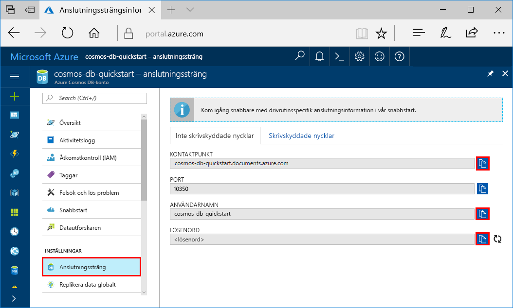
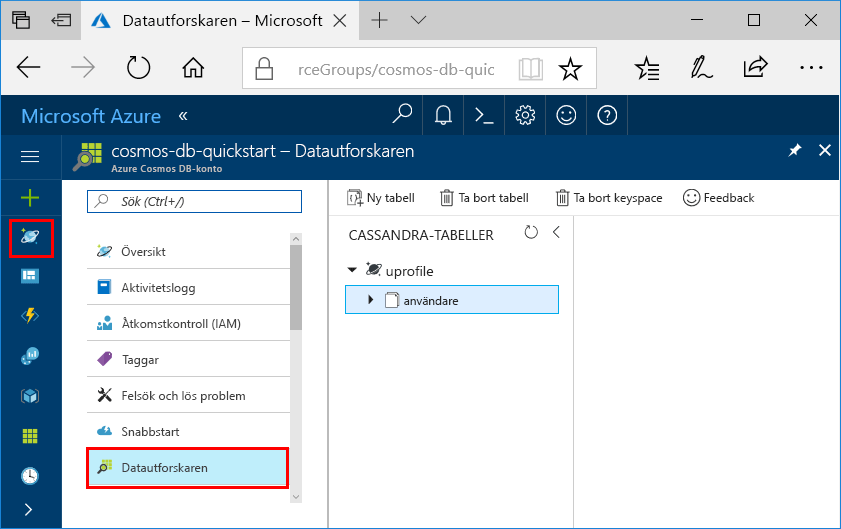

# <a name="quickstart-build-a-cassandra-app-with-java-and-azure-cosmos-db"></a>Snabbstart: Skapa en Cassandra-app med Java och Azure Cosmos DB

> [!div class="op_single_selector"]
> * [NET](create-cassandra-dotnet.md)
> * [Java](create-cassandra-java.md)
> * [Node.js](create-cassandra-nodejs.md)
> * [Python](create-cassandra-python.md)
>  

Den här snabbstarten visar hur du använder Java och [Cassandra API](cassandra-introduction.md) i Azure Cosmos DB för att skapa en profilapp genom att klona ett exempel från GitHub. Den här snabbstarten visar även hur du använder den webbaserade Azure-portalen för att skapa ett Azure Cosmos DB-konto.

Azure Cosmos DB är Microsofts globalt distribuerade databastjänst för flera datamodeller. Du kan snabbt skapa och ställa frågor mot databaser med dokument, tabeller, nyckel/värde-par och grafer. Du får fördelar av den globala distributionen och den horisontella skalningsförmågan som ligger i grunden hos Azure Cosmos DB. 

## <a name="prerequisites"></a>Nödvändiga komponenter

[!INCLUDE [quickstarts-free-trial-note](../../includes/quickstarts-free-trial-note.md)] Du kan även [Testa Azure Cosmos DB kostnadsfritt](https://azure.microsoft.com/try/cosmosdb/) utan en Azure-prenumeration, utan kostnad och åtaganden.

Dessutom behöver du:

* [Java Development Kit (JDK) 1.7+](https://aka.ms/azure-jdks)
    * I Ubuntu kör du `apt-get install default-jdk` för att installera JDK-paketet.
    * Tänk på att ställa in miljövariabeln JAVA_HOME så att den pekar på den mapp där JDK-paketet är installerat.
* [Ladda ned](https://maven.apache.org/download.cgi) och [installera](https://maven.apache.org/install.html) ett [Maven](https://maven.apache.org/)-binärarkiv
    * I Ubuntu kan du köra `apt-get install maven` för att installera Maven.
* [Git](https://www.git-scm.com/)
    * I Ubuntu kan du köra `sudo apt-get install git` för att installera Git.

## <a name="create-a-database-account"></a>Skapa ett databaskonto

Innan du kan börja skapa en dokumentdatabas måste du skapa ett Cassandra-konto med Azure Cosmos DB.

[!INCLUDE [cosmos-db-create-dbaccount-cassandra](../../includes/cosmos-db-create-dbaccount-cassandra.md)]

## <a name="clone-the-sample-application"></a>Klona exempelprogrammet

Nu ska vi övergå till att arbeta med kod. Vi ska klona en Cassandra API-app från GitHub, ange anslutningssträngen och köra appen. Du kommer att se hur lätt det är att arbeta med data programmässigt. 

1. Öppna en kommandotolk. Skapa en ny mapp med namnet `git-samples`. Stäng sedan kommandotolken.

    ```bash
    md "C:\git-samples"
    ```

2. Öppna ett git-terminalfönster, t.ex. git bash, och använd kommandot `cd` för att ändra till den nya mappen där du vill installera exempelappen.

    ```bash
    cd "C:\git-samples"
    ```

3. Klona exempellagringsplatsen med följande kommando. Detta kommando skapar en kopia av exempelappen på din dator.

    ```bash
    git clone https://github.com/Azure-Samples/azure-cosmos-db-cassandra-java-getting-started.git
    ```

## <a name="review-the-code"></a>Granska koden

Det här steget är valfritt. Om du vill lära dig hur databasresurserna skapas i koden kan du granska följande kodavsnitt. Annars kan du gå vidare till [Uppdatera din anslutningssträng](#update-your-connection-string). Alla kodavsnitt kommer från filen `src/main/java/com/azure/cosmosdb/cassandra/util/CassandraUtils.java`.  

* Värd, port, användarnamn, lösenord och SSL-alternativ är inställda för Cassandra. Information om anslutningssträngen kommer från sidan med anslutningssträngen i Azure-portalen.

   ```java
   cluster = Cluster.builder().addContactPoint(cassandraHost).withPort(cassandraPort).withCredentials(cassandraUsername, cassandraPassword).withSSL(sslOptions).build();
   ```

* `cluster` ansluter till Azure Cosmos DB Cassandra-API och kör en session för åtkomst.

    ```java
    return cluster.connect();
    ```

Följande kodavsnitt är från filen `src/main/java/com/azure/cosmosdb/cassandra/repository/UserRepository.java`.

* Skapa ett nytt keyspace.

    ```java
    public void createKeyspace() {
        final String query = "CREATE KEYSPACE IF NOT EXISTS uprofile WITH replication = {'class': 'SimpleStrategy', 'replication_factor': '3' } ";
        session.execute(query);
        LOGGER.info("Created keyspace 'uprofile'");
    }
    ```

* Skapa en ny tabell.

   ```java
   public void createTable() {
        final String query = "CREATE TABLE IF NOT EXISTS uprofile.user (user_id int PRIMARY KEY, user_name text, user_bcity text)";
        session.execute(query);
        LOGGER.info("Created table 'user'");
   }
   ```

* Infoga användarentiteter med ett förberett instruktionsobjekt.

    ```java
    public PreparedStatement prepareInsertStatement() {
        final String insertStatement = "INSERT INTO  uprofile.user (user_id, user_name , user_bcity) VALUES (?,?,?)";
        return session.prepare(insertStatement);
    }

    public void insertUser(PreparedStatement statement, int id, String name, String city) {
        BoundStatement boundStatement = new BoundStatement(statement);
        session.execute(boundStatement.bind(id, name, city));
    }
    ```

* Fråga för att hämta all användarinformation.

    ```java
   public void selectAllUsers() {
        final String query = "SELECT * FROM uprofile.user";
        List<Row> rows = session.execute(query).all();

        for (Row row : rows) {
            LOGGER.info("Obtained row: {} | {} | {} ", row.getInt("user_id"), row.getString("user_name"), row.getString("user_bcity"));
        }
    }
    ```

* Fråga för att hämta en användares information.

    ```java
    public void selectUser(int id) {
        final String query = "SELECT * FROM uprofile.user where user_id = 3";
        Row row = session.execute(query).one();

        LOGGER.info("Obtained row: {} | {} | {} ", row.getInt("user_id"), row.getString("user_name"), row.getString("user_bcity"));
    }
    ```

## <a name="update-your-connection-string"></a>Uppdatera din anslutningssträng

Gå nu tillbaka till Azure-portalen för att hämta information om din anslutningssträng och kopiera den till appen. Informationen i anslutningssträngen gör det möjligt för appen att kommunicera med den värdbaserade databasen.

1. På [Azure-portalen](https://portal.azure.com/) väljer du **Anslutningssträng**. 

    

2. Använd  knappen på höger sida av skärmen för att kopiera värdet KONTAKTPUNKT.

3. Öppna filen `config.properties` i mappen `C:\git-samples\azure-cosmosdb-cassandra-java-getting-started\java-examples\src\main\resources`. 

3. Klistra in KONTAKTPUNKT-värdet från portalen över `<Cassandra endpoint host>` på rad 2.

    Rad 2 i config.properties bör nu se ut ungefär så här 

    `cassandra_host=cosmos-db-quickstart.cassandra.cosmosdb.azure.com`

3. Gå tillbaka till portalen och kopiera värdet ANVÄNDARNAMN. Klistra in värdet för ANVÄNDARNAMN från portalen över `<cassandra endpoint username>` på rad 4.

    Rad 4 i config.properties bör nu se ut ungefär så här 

    `cassandra_username=cosmos-db-quickstart`

4. Gå tillbaka till portalen och kopiera värdet LÖSENORD. Klistra in värdet för LÖSENORD från portalen över `<cassandra endpoint password>` på rad 5.

    Rad 5 i config.properties bör nu se ut ungefär så här 

    `cassandra_password=2Ggkr662ifxz2Mg...==`

5. Om du vill använda ett visst SSL-certifikat ersätter du `<SSL key store file location>` på rad 6 med platsen för SSL-certifikatet. Om inget värde anges kommer JDK-certifikatet som är installerat på <JAVA_HOME>/jre/lib/security/cacerts att användas. 

6. Om du har ändrat rad 6 så att ett visst SSL-certifikat ska användas uppdaterar du rad 7 för att använda lösenordet för det certifikatet. 

7. Spara filen `config.properties`.

## <a name="run-the-java-app"></a>Kör Java-appen

1. I git-terminalfönstret `cd` till mappen `azure-cosmosdb-cassandra-java-getting-started\java-examples`.

    ```git
    cd "C:\git-samples\azure-cosmosdb-cassandra-java-getting-started\java-examples"
    ```

2. I git-terminalfönstret använder du följande kommando för att generera filen `cosmosdb-cassandra-examples.jar`.

    ```git
    mvn clean install
    ```

3. I git-terminalfönstret kör du följande kommando för att starta Java-programmet.

    ```git
    java -cp target/cosmosdb-cassandra-examples.jar com.azure.cosmosdb.cassandra.examples.UserProfile
    ```

    Terminalfönstret visar aviseringar om att keyspace och tabell har skapats. Det markerar och returnerar sedan alla användare i tabellen och visar utdata, och väljer sedan ett rad-ID och visar värdet.  

    Tryck på CTRL + C om du vill stoppa körning av programmet och stänga konsolfönstret.

4. I **Datautforskaren** på Azure-portalen kan du fråga, ändra och arbeta med dessa nya data. 

    

## <a name="review-slas-in-the-azure-portal"></a>Granska serviceavtal i Azure-portalen

[!INCLUDE [cosmosdb-tutorial-review-slas](../../includes/cosmos-db-tutorial-review-slas.md)]

## <a name="clean-up-resources"></a>Rensa resurser

[!INCLUDE [cosmosdb-delete-resource-group](../../includes/cosmos-db-delete-resource-group.md)]

## <a name="next-steps"></a>Nästa steg

I den här snabbstarten har du lärt dig att skapa ett Azure Cosmos DB-konto, en Cassandra-databas och en container med Datautforskaren och att köra en app för att göra samma sak programmässigt. Du kan nu importera ytterligare data till Azure Cosmos DB-containern. 

> [!div class="nextstepaction"]
> [Importera Cassandra-data till Azure Cosmos DB](cassandra-import-data.md)
