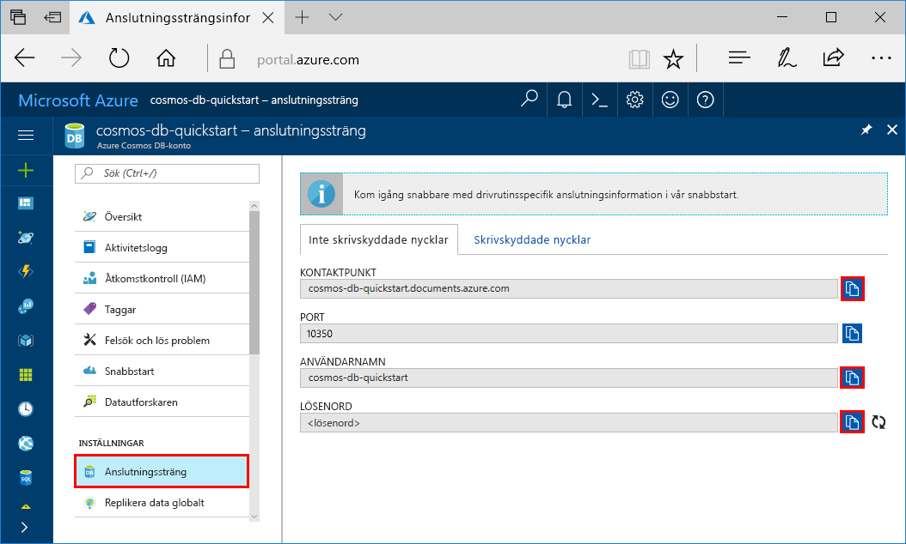
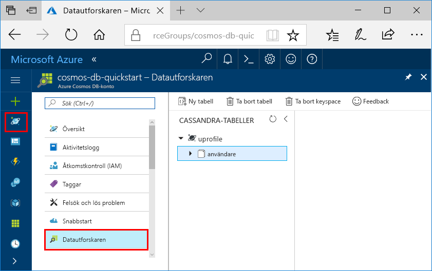

# <a name="quickstart-build-a-cassandra-app-with-nodejs-and-azure-cosmos-db"></a>Snabbstart: Skapa en Cassandra-app med Node.js och Azure Cosmos DB

Den här snabbstarten visar hur du använder [Cassandra-API](cassandra-introduction.md) i Node.js och Azure Cosmos DB för att skapa en profilapp genom att klona ett exempel från GitHub. Denna snabbstart visar dig också hur man skapar ett Azure Cosmos DB-konto med hjälp av den webbaserade Azure-portalen.

Azure Cosmos DB är Microsofts globalt distribuerade databastjänst för flera datamodeller. Du kan snabbt skapa och ställa frågor mot databaser med dokument, tabeller, nyckel/värde-par och grafer. Du får fördelar av den globala distributionen och den horisontella skalningsförmågan som ligger i grunden hos Azure Cosmos DB. 

## <a name="prerequisites"></a>Nödvändiga komponenter

[!INCLUDE [quickstarts-free-trial-note](../../includes/quickstarts-free-trial-note.md)] Du kan även [Testa Azure Cosmos DB kostnadsfritt](https://azure.microsoft.com/try/cosmosdb/) utan en Azure-prenumeration, utan kostnad och åtaganden.

Åtkomst till förhandsgranskningsprogrammet för Azure Cosmos DB Cassandra-API. Om du inte har ansökt om åtkomst än kan du [registrera dig nu](cassandra-introduction.md#sign-up-now).

Följande gäller också:
* [Node.js](https://nodejs.org/en/) version v0.10.29 eller senare
* [Git](http://git-scm.com/)

## <a name="create-a-database-account"></a>Skapa ett databaskonto

Innan du kan börja skapa en dokumentdatabas måste du skapa ett Cassandra-konto med Azure Cosmos DB.

[!INCLUDE [cosmos-db-create-dbaccount-cassandra](../../includes/cosmos-db-create-dbaccount-cassandra.md)]

## <a name="clone-the-sample-application"></a>Klona exempelprogrammet

Nu ska vi klona en Cassandra API-app från github, ange anslutningssträngen och köra appen. Du kommer att se hur lätt det är att arbeta med data programmässigt. 

1. Öppna en kommandotolk, skapa en ny mapp som heter git-samples och stäng sedan kommandotolken.

    ```bash
    md "C:\git-samples"
    ```

2. Öppna ett git-terminalfönster, t.ex. git bash, och använd kommandot `cd` för att ändra till den nya mappen där du vill installera exempelappen.

    ```bash
    cd "C:\git-samples"
    ```

3. Klona exempellagringsplatsen med följande kommando. Detta kommando skapar en kopia av exempelappen på din dator.

    ```bash
    git clone https://github.com/Azure-Samples/azure-cosmos-db-cassandra-nodejs-getting-started.git
    ```

## <a name="review-the-code"></a>Granska koden

Det här steget är valfritt. Om du vill lära dig hur databasresurserna skapas i koden kan du granska följande kodavsnitt. Kodavsnitten hämtas från filen uprofile.js i mappen C:\git-samples\azure-cosmos-db-cassandra-nodejs-getting-started. Annars kan du gå vidare till [Uppdatera din anslutningssträng](#update-your-connection-string). 

* Användarnamn och lösenord anges med hjälp av anslutningssträngsidan i Azure-portalen. ”path\to\cert” tillhandahåller en sökväg till X509-certifikatet. 

   ```nodejs
   var ssl_option = {
        cert : fs.readFileSync("path\to\cert"),
        rejectUnauthorized : true,
        secureProtocol: 'TLSv1_2_method'
        };
   const authProviderLocalCassandra = new cassandra.auth.PlainTextAuthProvider(config.username, config.password);
   ```

* `client` har initierats med contactPoint-information. contactPoint hämtas från Azure-portalen.

    ```nodejs
    const client = new cassandra.Client({contactPoints: [config.contactPoint], authProvider: authProviderLocalCassandra, sslOptions:ssl_option});
    ```

* `client` ansluter till Azure Cosmos DB Cassandra-API.

    ```nodejs
    client.connect(next);
    ```

* Ett nytt keyspace skapas.

    ```nodejs
    function createKeyspace(next) {
        var query = "CREATE KEYSPACE IF NOT EXISTS uprofile WITH replication = {\'class\': \'NetworkTopologyStrategy\', \'datacenter1\' : \'1\' }";
        client.execute(query, next);
        console.log("created keyspace");    
  }
    ```

* En ny tabell skapas.

   ```nodejs
   function createTable(next) {
    var query = "CREATE TABLE IF NOT EXISTS uprofile.user (user_id int PRIMARY KEY, user_name text, user_bcity text)";
        client.execute(query, next);
        console.log("created table");
   },
   ```

* Nyckel/värde-entiteter infogas.

    ```nodejs
    ...
       {
          query: 'INSERT INTO  uprofile.user  (user_id, user_name , user_bcity) VALUES (?,?,?)',
          params: [5, 'IvanaV', 'Belgaum', '2017-10-3136']
        }
    ];
    client.batch(queries, { prepare: true}, next);
    ```

* Fråga för att hämta alla nyckelvärden.

    ```nodejs
   var query = 'SELECT * FROM uprofile.user';
    client.execute(query, { prepare: true}, function (err, result) {
      if (err) return next(err);
      result.rows.forEach(function(row) {
        console.log('Obtained row: %d | %s | %s ',row.user_id, row.user_name, row.user_bcity);
      }, this);
      next();
    });
    ```  
    
* Fråga för att hämta ett nyckelvärde.

    ```nodejs
    function selectById(next) {
        console.log("\Getting by id");
        var query = 'SELECT * FROM uprofile.user where user_id=1';
        client.execute(query, { prepare: true}, function (err, result) {
        if (err) return next(err);
            result.rows.forEach(function(row) {
            console.log('Obtained row: %d | %s | %s ',row.user_id, row.user_name, row.user_bcity);
        }, this);
        next();
        });
    }
    ```  

## <a name="update-your-connection-string"></a>Uppdatera din anslutningssträng

Gå nu tillbaka till Azure Portal för att hämta information om din anslutningssträng och kopiera den till appen. På så vis kan appen kommunicera med den värdbaserade databasen.

1. I [Azure-portalen](http://portal.azure.com/) klickar du på **Anslutningssträng**. 

    Använd  knappen på höger sida av skärmen för att kopiera det övre värdet, KONTAKTPUNKT.

    

2. Öppna filen `config.js`. 

3. Klistra in KONTAKTPUNKT-värdet från portalen ovanpå `<FillMEIN>` på rad 4.

    Rad 4 bör nu se ut ungefär så här 

    `config.contactPoint = "cosmos-db-quickstarts.documents.azure.com:10350"`

4. Kopiera ANVÄNDARNAMN-värdet från portalen och klistra in det ovanpå `<FillMEIN>` på rad 2.

    Rad 2 bör nu se ut ungefär så här 

    `config.username = 'cosmos-db-quickstart';`
    
5. Kopiera LÖSENORD-värdet från portalen och klistra in det ovanpå `<FillMEIN>` på rad 3.

    Rad 3 bör nu se ut ungefär så här

    `config.password = '2Ggkr662ifxz2Mg==';`

6. Spara filen config.js.
    
## <a name="use-the-x509-certificate"></a>Använda X509-certifikatet 

1. Om du behöver lägga till Baltimore CyberTrust Root har den serienummer 02:00:00:b9 och SHA1-fingeravtrycket d4🇩🇪20:d0:5e:66:fc:53:fe:1a:50:88:2c:78:db:28:52:ca:e4:74. Den kan laddas ner från https://cacert.omniroot.com/bc2025.crt och sparas som en lokal fil med filnamnstillägget .cer. 

2. Öppna uprofile.js och ändra ”path\to\cert” så att det leder till det nya certifikatet. 

3. Spara uprofile.js. 

## <a name="run-the-app"></a>Kör appen

1. I git-terminalfönstret kör du `npm install` för att installera de npm-moduler som krävs.

2. Kör `node uprofile.js` för att starta nodprogrammet.

3. Kontrollera att resultatet blir det man kan förvänta sig från kommandoraden.

    

    Tryck på CTRL + C om du vill stoppa körning av programmet och stänga konsolfönstret. 

    Du kan nu öppna Datautforskaren i Azure-portalen och se frågan, ändra och arbeta med dessa nya data. 

     

## <a name="review-slas-in-the-azure-portal"></a>Granska serviceavtal i Azure Portal

[!INCLUDE [cosmosdb-tutorial-review-slas](../../includes/cosmos-db-tutorial-review-slas.md)]

## <a name="clean-up-resources"></a>Rensa resurser

[!INCLUDE [cosmosdb-delete-resource-group](../../includes/cosmos-db-delete-resource-group.md)]

## <a name="next-steps"></a>Nästa steg

I den här snabbstarten har du lärt dig hur man skapar ett Azure Cosmos DB-konto, skapar en samling med datautforskaren och kör en app. Du kan nu importera ytterligare data till ditt Cosmos DB-konto. 

> [!div class="nextstepaction"]
> [Importera Cassandra-data till Azure Cosmos DB](cassandra-import-data.md)


