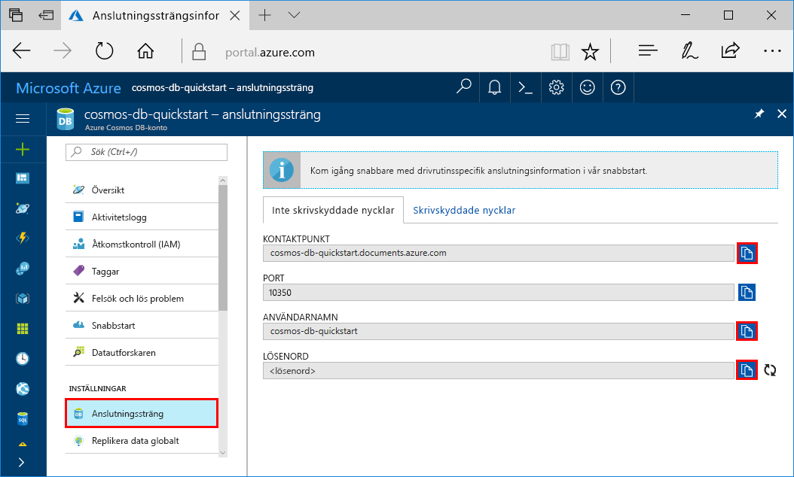
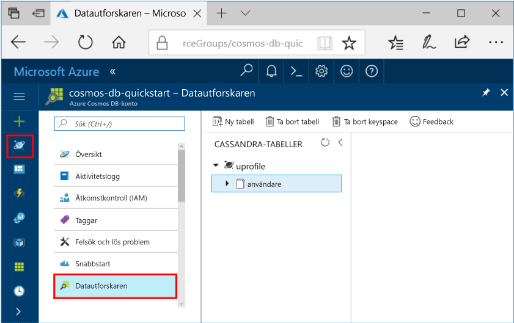

# <a name="quickstart-build-a-cassandra-app-with-python-and-azure-cosmos-db"></a>Snabbstart: Skapa en Cassandra-app med Python och Azure Cosmos DB

> [!div class="op_single_selector"]
> * [NET](create-cassandra-dotnet.md)
> * [Java](create-cassandra-java.md)
> * [Node.js](create-cassandra-nodejs.md)
> * [Python](create-cassandra-python.md)
>  

Den här snabbstarten visar hur du använder [Cassandra API](cassandra-introduction.md) i Python och Azure Cosmos DB för att skapa en profilapp genom att klona ett exempel från GitHub. Den här snabbstarten visar även hur du använder den webbaserade Azure-portalen för att skapa ett Azure Cosmos DB-konto.

Azure Cosmos DB är Microsofts globalt distribuerade databastjänst för flera datamodeller. Du kan snabbt skapa och ställa frågor mot databaser med dokument, tabeller, nyckel/värde-par och grafer. Du får fördelar av den globala distributionen och den horisontella skalningsförmågan som ligger i grunden hos Azure Cosmos DB.

## <a name="prerequisites"></a>Nödvändiga komponenter

[!INCLUDE [quickstarts-free-trial-note](../../includes/quickstarts-free-trial-note.md)] Du kan även [Testa Azure Cosmos DB kostnadsfritt](https://azure.microsoft.com/try/cosmosdb/) utan en Azure-prenumeration, utan kostnad och åtaganden.

Dessutom behöver du:
* [Python](https://www.python.org/downloads/) version v2.7.14
* [Git](https://git-scm.com/)
* [Python-drivrutin för Apache Cassandra](https://github.com/datastax/python-driver)

## <a name="create-a-database-account"></a>Skapa ett databaskonto

Innan du kan börja skapa en dokumentdatabas måste du skapa ett Cassandra-konto med Azure Cosmos DB.

[!INCLUDE [cosmos-db-create-dbaccount-cassandra](../../includes/cosmos-db-create-dbaccount-cassandra.md)]

## <a name="clone-the-sample-application"></a>Klona exempelprogrammet

Nu ska vi klona en Cassandra API-app från GitHub, ange anslutningssträngen och köra appen. Du kommer att se hur lätt det är att arbeta med data programmässigt. 

1. Öppna en kommandotolk. Skapa en ny mapp med namnet `git-samples`. Stäng sedan kommandotolken.

    ```bash
    md "C:\git-samples"
    ```

2. Öppna ett git-terminalfönster, t.ex. git bash, och använd kommandot `cd` för att ändra till den nya mappen där du vill installera exempelappen.

    ```bash
    cd "C:\git-samples"
    ```

3. Klona exempellagringsplatsen med följande kommando. Detta kommando skapar en kopia av exempelappen på din dator.

    ```bash
    git clone https://github.com/Azure-Samples/azure-cosmos-db-cassandra-python-getting-started.git
    ```

## <a name="review-the-code"></a>Granska koden

Det här steget är valfritt. Om du vill lära dig hur databasresurserna skapas i koden kan du granska följande kodavsnitt. Alla kodavsnitten kommer från filen pyquickstart.py. Annars kan du gå vidare till [Uppdatera din anslutningssträng](#update-your-connection-string). 

* Användarnamnet och lösenordet angavs med hjälp av anslutningssträngsidan i Azure-portalen. `path\to\cert` tillhandahåller en sökväg till X509-certifikatet. 

   ```python
    ssl_opts = {
            'ca_certs': 'path\to\cert',
            'ssl_version': ssl.PROTOCOL_TLSv1_2
            }
    auth_provider = PlainTextAuthProvider( username=cfg.config['username'], password=cfg.config['password'])
    cluster = Cluster([cfg.config['contactPoint']], port = cfg.config['port'], auth_provider=auth_provider, ssl_options=ssl_opts)
    session = cluster.connect()
   
   ```

* `cluster` har initierats med contactPoint-information. contactPoint hämtas från Azure-portalen.

    ```python
   cluster = Cluster([cfg.config['contactPoint']], port = cfg.config['port'], auth_provider=auth_provider)
    ```

* `cluster` ansluter till Azure Cosmos DB Cassandra-API.

    ```python
    session = cluster.connect()
    ```

* Ett nytt keyspace skapas.

    ```python
   session.execute('CREATE KEYSPACE IF NOT EXISTS uprofile WITH replication = {\'class\': \'NetworkTopologyStrategy\', \'datacenter1\' : \'1\' }')
    ```

* En ny tabell skapas.

   ```
   session.execute('CREATE TABLE IF NOT EXISTS uprofile.user (user_id int PRIMARY KEY, user_name text, user_bcity text)');
   ```

* Nyckel/värde-entiteter infogas.

    ```Python
    insert_data = session.prepare("INSERT INTO  uprofile.user  (user_id, user_name , user_bcity) VALUES (?,?,?)")
    session.execute(insert_data, [1,'Lybkov','Seattle'])
    session.execute(insert_data, [2,'Doniv','Dubai'])
    session.execute(insert_data, [3,'Keviv','Chennai'])
    session.execute(insert_data, [4,'Ehtevs','Pune'])
    session.execute(insert_data, [5,'Dnivog','Belgaum'])
    ....
    
    ```

* Fråga för att hämta alla nyckelvärden.

    ```Python
    rows = session.execute('SELECT * FROM uprofile.user')
    ```  
    
* Fråga för att hämta ett nyckelvärde.

    ```Python
    
    rows = session.execute('SELECT * FROM uprofile.user where user_id=1')
    ```  

## <a name="update-your-connection-string"></a>Uppdatera din anslutningssträng

Gå nu tillbaka till Azure-portalen för att hämta information om din anslutningssträng och kopiera den till appen. Anslutningssträngen gör det möjligt för appen att kommunicera med den värdbaserade databasen.

1. På [Azure-portalen](https://portal.azure.com/) väljer du **Anslutningssträng**. 

    Använd  knappen på höger sida av skärmen för att kopiera det övre värdet, KONTAKTPUNKT.

    

2. Öppna filen `config.py`. 

3. Klistra in KONTAKTPUNKT-värdet från portalen över `<FILLME>` på rad 10.

    Rad 10 bör nu se ut ungefär som 

    `'contactPoint': 'cosmos-db-quickstarts.cassandra.cosmosdb.azure.com:10350'`

4. Kopiera ANVÄNDARNAMN från portalen och klistra in det över `<FILLME>` på rad 6.

    Rad 6 bör nu se ut ungefär som 

    `'username': 'cosmos-db-quickstart',`
    
5. Kopiera LÖSENORD från portalen och klistra in det över `<FILLME>` på rad 8.

    Rad 8 bör nu se ut ungefär som

    `'password' = '2Ggkr662ifxz2Mg==`';`

6. Spara filen config.py.
    
## <a name="use-the-x509-certificate"></a>Använda X509-certifikatet

1. Ladda ned Baltimore CyberTrust-rotcertifikatet lokalt från [https://cacert.omniroot.com/bc2025.crt](https://cacert.omniroot.com/bc2025.crt). Byt namn på filen med filnamnstillägget `.cer`.

   Certifikatet har serienummer `02:00:00:b9` och SHA1-fingeravtryck `d4🇩🇪20:d0:5e:66:fc:53:fe:1a:50:88:2c:78:db:28:52:ca:e4:74`.

2. Öppna `pyquickstart.py` och ändra `path\to\cert` så att den pekar på det nya certifikatet.

3. Spara `pyquickstart.py`.

## <a name="run-the-python-app"></a>Köra Python-appen

1. Använd cd-kommandot i git-terminalen för att ändra till den `azure-cosmos-db-cassandra-python-getting-started`-mappen. 

2. Installera modulerna som krävs med hjälp av följande kommandon:

    ```python
    python -m pip install cassandra-driver
    python -m pip install prettytable
    python -m pip install requests
    python -m pip install pyopenssl
    ```

2. Kör följande kommando för att starta nodprogrammet:

    ```
    python pyquickstart.py
    ```

3. Kontrollera att resultatet blir det man kan förvänta sig från kommandoraden.

    Tryck på CTRL + C om du vill stoppa körningen av programmet och stänga konsolfönstret. 

    
    
4. I **Datautforskaren** på Azure-portalen kan du fråga, ändra och arbeta med dessa nya data. 

    

## <a name="review-slas-in-the-azure-portal"></a>Granska serviceavtal i Azure-portalen

[!INCLUDE [cosmosdb-tutorial-review-slas](../../includes/cosmos-db-tutorial-review-slas.md)]

## <a name="clean-up-resources"></a>Rensa resurser

[!INCLUDE [cosmosdb-delete-resource-group](../../includes/cosmos-db-delete-resource-group.md)]

## <a name="next-steps"></a>Nästa steg

I den här snabbstarten har du lärt dig hur du skapar ett Azure Cosmos DB-konto, hur du skapar en container med hjälp av Datautforskaren och hur du kör en app. Du kan nu importera ytterligare data till ditt Cosmos DB-konto. 

> [!div class="nextstepaction"]
> [Importera Cassandra-data till Azure Cosmos DB](cassandra-import-data.md)

