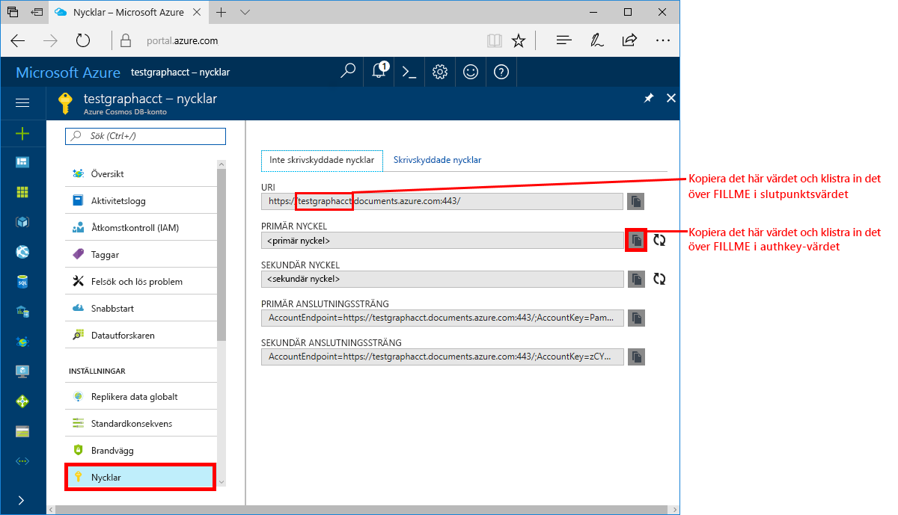
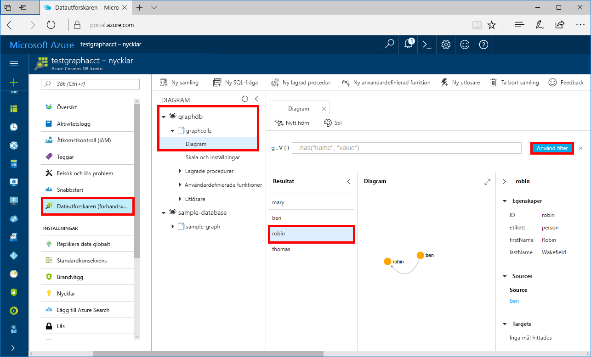

# <a name="azure-cosmos-db-build-a-net-framework-or-core-application-using-the-graph-api"></a>Azure Cosmos DB: Skapa ett .NET Framwork- eller Core-program med Graph API

Azure Cosmos DB är Microsofts globalt distribuerade databastjänst för flera datamodeller. Du kan snabbt skapa och ställa frågor mot databaser med dokument, nyckel/värde-par och grafer. Du får fördelar av den globala distributionen och den horisontella skalningsförmågan som ligger i grunden hos Azure Cosmos DB. 

Den här snabbstarten demonstrerar hur du skapar ett Azure Cosmos DB-konto, en databas och en graf (behållare) med hjälp av Azure Portal. Sedan skapar och kör du en konsolapp som är byggd med [Graph API](graph-sdk-dotnet.md).  

## <a name="prerequisites"></a>Nödvändiga komponenter

Om du inte har Visual Studio 2017 installerad kan du ladda ned och använda [Visual Studio 2017 Community Edition](https://www.visualstudio.com/downloads/) **utan kostnad**. Se till att du aktiverar **Azure-utveckling** under installationen av Visual Studio.

Om du redan har Visual Studio 2017 installerat ser du till att det är installerat upp till [Visual Studio 2017 Update 3](https://www.visualstudio.com/en-us/news/releasenotes/vs2017-relnotes).

[!INCLUDE [quickstarts-free-trial-note](../../includes/quickstarts-free-trial-note.md)]

## <a name="create-a-database-account"></a>Skapa ett databaskonto

[!INCLUDE [cosmos-db-create-dbaccount-graph](../../includes/cosmos-db-create-dbaccount-graph.md)]

## <a name="add-a-graph"></a>Lägga till en graf

[!INCLUDE [cosmos-db-create-graph](../../includes/cosmos-db-create-graph.md)]

## <a name="clone-the-sample-application"></a>Klona exempelprogrammet

Nu ska vi klona en Graph API-app från github, ange anslutningssträngen och köra appen. Du kommer att se hur lätt det är att arbeta med data programmässigt. 

Det här exempelprojektet använder projektformatet .NET Core och har konfigurerats för att rikta in sig på följande ramverk:
 - netcoreapp2.0
 - net461

1. Öppna ett git-terminalfönster, till exempel git bash, och `cd` till en arbetskatalog.  

2. Klona exempellagringsplatsen med följande kommando. 

    ```bash
    git clone https://github.com/Azure-Samples/azure-cosmos-db-graph-dotnet-getting-started.git
    ```

3. Öppna sedan Visual Studio och öppna lösningsfilen. 

## <a name="review-the-code"></a>Granska koden

Vi gör en snabb genomgång av vad som händer i appen. Öppna filen Program.cs så ser du att de här kodraderna skapar Azure Cosmos DB-resurserna. 

* DocumentClient initieras. I förhandsversionen har vi lagt till en graftillägg-API på Azure Cosmos DB-klienten. Vi arbetar på en fristående grafklient som är frikopplad från Azure Cosmos DB-klienten och resurserna.

    ```csharp
    using (DocumentClient client = new DocumentClient(
        new Uri(endpoint),
        authKey,
        new ConnectionPolicy { ConnectionMode = ConnectionMode.Direct, ConnectionProtocol = Protocol.Tcp }))
    ```

* En ny databas skapas.

    ```csharp
    Database database = await client.CreateDatabaseIfNotExistsAsync(new Database { Id = "graphdb" });
    ```

* En ny graf skapas.

    ```csharp
    DocumentCollection graph = await client.CreateDocumentCollectionIfNotExistsAsync(
        UriFactory.CreateDatabaseUri("graphdb"),
        new DocumentCollection { Id = "graph" },
        new RequestOptions { OfferThroughput = 1000 });
    ```
* En mängd Gremlin-steg utförs med metoden `CreateGremlinQuery`.

    ```csharp
    // The CreateGremlinQuery method extensions allow you to execute Gremlin queries and iterate
    // results asychronously
    IDocumentQuery<dynamic> query = client.CreateGremlinQuery<dynamic>(graph, "g.V().count()");
    while (query.HasMoreResults)
    {
        foreach (dynamic result in await query.ExecuteNextAsync())
        {
            Console.WriteLine($"\t {JsonConvert.SerializeObject(result)}");
        }
    }

    ```

## <a name="update-your-connection-string"></a>Uppdatera din anslutningssträng

Gå nu tillbaka till Azure Portal för att hämta information om din anslutningssträng och kopiera den till appen.

1. I [Azure Portal](http://portal.azure.com/) klickar du på **Nycklar**. 

    Kopiera den första delen av URI-värdet.

    

2. Öppna filen appsettings.json i Visual Studio 2017 och klistra in värdet över `FILLME` i `endpoint`. 

    `"endpoint": "https://FILLME.documents.azure.com:443/",`

    Slutpunktsvärdet bör nu se ut så här:

    `"endpoint": "https://testgraphacct.documents.azure.com:443/",`

3. Om du skapade ditt grafdatabaskonto innan 27 November 2017 ändrar du `documents` till `graphs` i värdet `endpoint`. Om du skapade ditt grafdatabaskonto på eller efter 27 November 2017 ändrar du `documents` till `gremlin.cosmosdb` i värdet `endpoint`.

    Slutpunktsvärdet bör nu se ut så här:

    `"endpoint": "https://testgraphacct.graphs.azure.com:443/",` eller `"endpoint": "https://testgraphacct.gremlin.cosmosdb.azure.com:443/",`

4. Kopiera värdet för din **PRIMÄRNYCKEL** från portalen och använd det som värdet för AuthKey-nyckeln i App.config. Avsluta med att spara dina ändringar. 

    `"authkey": "FILLME"`

5. Spara filen appsettings.json. 

Du har nu uppdaterat din app med all information den behöver för att kommunicera med Azure Cosmos DB. 

## <a name="run-the-console-app"></a>Kör konsolappen

Innan du kör programmet rekommenderar vi att du uppdaterar paketet *Microsoft.Azure.Graphs* till den senaste versionen.

1. I Visual Studio högerklickar du på projektet **GraphGetStarted** i **Solution Explorer** och sedan på **Hantera NuGet-paket**. 

2. På fliken **Bläddra** i NuGet-pakethanteraren skriver du *Microsoft.Azure.Graphs* och markerar kryssrutan **Include prerelease** (Ta med förhandsversioner). 

3. I resultaten uppdaterar du biblioteket **Microsoft.Azure.Graphs** till den senaste versionen av paketet. Detta installerar bibliotekspaketet för Azure Cosmos DB-graftillägget och alla beroenden.

    Om du får ett meddelande om att granska ändringar i lösningen klickar du på **OK**. Om du får ett meddelande om godkännande av licens klickar du på **Jag godkänner**.

4. Tryck på Ctrl + F5 för att köra programmet.

   Hörn och gränser som läggs till i tabellen visas i konsolfönstret. Stäng konsolfönstret genom att trycka två gånger på RETUR när skriptet har körts.

## <a name="browse-using-the-data-explorer"></a>Bläddra med datautforskaren

Nu kan du gå tillbaka till datautforskaren i Azure Portal och bläddra bland och ställa frågor mot dina nya grafdata.

1. Den nya databasen visas i fönstret Graphs (Diagram) i Datautforskaren. Expandera **graphdb**, **graphcollz** och klicka på **Diagram**.

2. Klicka på knappen **Använd filter** för att använda standardfrågan och visa alla hörn i diagrammet. Data som genereras av den här exempelappen visas i fönstret Graphs (Grafer).

    Du kan zooma in och ut i diagrammet, du kan expandera diagrammets skärmutrymme, lägga till ytterligare hörn och flytta hörn på skärmytan.

    

## <a name="review-slas-in-the-azure-portal"></a>Granska serviceavtal i Azure Portal

[!INCLUDE [cosmosdb-tutorial-review-slas](../../includes/cosmos-db-tutorial-review-slas.md)]

## <a name="clean-up-resources"></a>Rensa resurser

Om du inte planerar att fortsätta använda den här appen tar du bort alla resurser som skapades i snabbstarten i Azure Portal med följande steg: 

1. Klicka på **Resursgrupper** på den vänstra menyn i Azure Portal och sedan på namnet på den resurs du skapade. 
2. På sidan med resursgrupper klickar du på **Ta bort**, skriver in namnet på resursen att ta bort i textrutan och klickar sedan på **Ta bort**.

## <a name="next-steps"></a>Nästa steg

I den här snabbstarten har du fått lära dig att skapa ett Azure Cosmos DB-konto, skapa en graf med datautforskaren och att köra en app. Nu kan du skapa mer komplexa frågor och implementera kraftfull logik för grafbläddring med Gremlin. 

> [!div class="nextstepaction"]
> [Fråga med hjälp av Gremlin](tutorial-query-graph.md)

