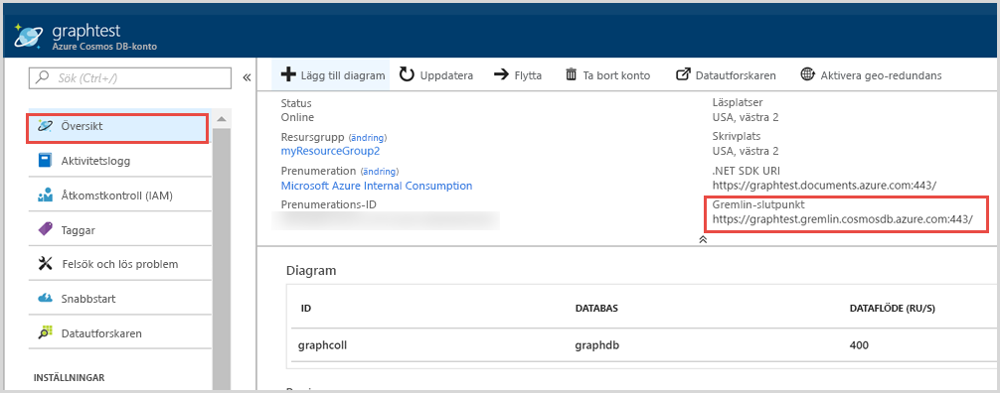

# <a name="azure-cosmos-db-build-a-net-framework-or-core-application-using-the-gremlin-api"></a>Azure Cosmos DB: Skapa ett .NET Framwork- eller Core-program med Gremlin-API:et

> [!div class="op_single_selector"]
> * [Gremlin-konsol](create-graph-gremlin-console.md)
> * [NET](create-graph-dotnet.md)
> * [Java](create-graph-java.md)
> * [Node.js](create-graph-nodejs.md)
> * [Python](create-graph-python.md)
> * [PHP](create-graph-php.md)
>  

Azure Cosmos DB är Microsofts globalt distribuerade databastjänst för flera datamodeller. Du kan snabbt skapa och ställa frågor mot databaser med dokument, nyckel/värde-par och grafer. Du får fördelar av den globala distributionen och den horisontella skalningsförmågan som ligger i grunden hos Azure Cosmos DB. 

Den här snabbstarten demonstrerar hur du skapar ett Microsoft Azure Cosmos DB [Gremlin-API](graph-introduction.md)-konto, en databas och en graf (container) med hjälp av Azure Portal. Sedan skapar och kör du en konsolapp med drivrutinen [Gremlin.Net](https://tinkerpop.apache.org/docs/3.2.7/reference/#gremlin-DotNet) (öppen källkod).  

## <a name="prerequisites"></a>Nödvändiga komponenter

Om du inte har Visual Studio 2017 installerat kan du ladda ned och använda [Visual Studio 2017 Community Edition](https://www.visualstudio.com/downloads/) **utan kostnad**. Se till att du aktiverar **Azure-utveckling** under installationen av Visual Studio.

Om du redan har Visual Studio 2017 installerat ser du till att det är installerat upp till [Visual Studio 2017 Update 3](https://www.visualstudio.com/en-us/news/releasenotes/vs2017-relnotes).

[!INCLUDE [quickstarts-free-trial-note](../../includes/quickstarts-free-trial-note.md)]

## <a name="create-a-database-account"></a>Skapa ett databaskonto

[!INCLUDE [cosmos-db-create-dbaccount-graph](../../includes/cosmos-db-create-dbaccount-graph.md)]

## <a name="add-a-graph"></a>Lägga till en graf

[!INCLUDE [cosmos-db-create-graph](../../includes/cosmos-db-create-graph.md)]

## <a name="clone-the-sample-application"></a>Klona exempelprogrammet

Nu ska vi klona en Gremlin-API-app från GitHub, ange anslutningssträngen och köra appen. Du kommer att se hur lätt det är att arbeta med data programmässigt. 

1. Öppna en kommandotolk, skapa en ny mapp som heter git-samples och stäng sedan kommandotolken.

    ```bash
    md "C:\git-samples"
    ```

2. Öppna ett git-terminalfönster, t.ex. git bash, och använd kommandot `cd` för att ändra till den nya mappen där du vill installera exempelappen.

    ```bash
    cd "C:\git-samples"
    ```

3. Klona exempellagringsplatsen med följande kommando. Detta kommando skapar en kopia av exempelappen på din dator.

    ```bash
    git clone https://github.com/Azure-Samples/azure-cosmos-db-graph-gremlindotnet-getting-started.git
    ```

4. Öppna sedan Visual Studio och öppna lösningsfilen.

5. Återställ NuGet-paketen i projektet. Det bör inkludera Gremlin.Net-drivrutinen och Newtonsoft.Json-paketet.


6. Du kan också installera Gremlin.Net-drivrutinen manuellt med Nuget-pakethanteraren eller [nuget-kommandoradsverktyget](https://docs.microsoft.com/nuget/install-nuget-client-tools): 

    ```bash
    nuget install Gremlin.Net
    ```

## <a name="review-the-code"></a>Granska koden

Det här steget är valfritt. Om du vill lära dig hur databasresurserna skapas i koden kan du granska följande kodavsnitt. Annars kan du gå vidare till [Uppdatera din anslutningssträng](#update-your-connection-string). 

Följande kodfragment är alla hämtade från filen Program.cs.

* Ställ in dina anslutningsparametrar baserat på kontot som skapades ovan (rad 19): 

    ```csharp
    private static string hostname = "your-endpoint.gremlin.cosmosdb.azure.com";
    private static int port = 443;
    private static string authKey = "your-authentication-key";
    private static string database = "your-database";
    private static string collection = "your-graph-container";
    ```

* Gremlin-kommandona som ska köras finns i en ordlista (rad 26):

    ```csharp
    private static Dictionary<string, string> gremlinQueries = new Dictionary<string, string>
    {
        { "Cleanup",        "g.V().drop()" },
        { "AddVertex 1",    "g.addV('person').property('id', 'thomas').property('firstName', 'Thomas').property('age', 44)" },
        { "AddVertex 2",    "g.addV('person').property('id', 'mary').property('firstName', 'Mary').property('lastName', 'Andersen').property('age', 39)" },
        { "AddVertex 3",    "g.addV('person').property('id', 'ben').property('firstName', 'Ben').property('lastName', 'Miller')" },
        { "AddVertex 4",    "g.addV('person').property('id', 'robin').property('firstName', 'Robin').property('lastName', 'Wakefield')" },
        { "AddEdge 1",      "g.V('thomas').addE('knows').to(g.V('mary'))" },
        { "AddEdge 2",      "g.V('thomas').addE('knows').to(g.V('ben'))" },
        { "AddEdge 3",      "g.V('ben').addE('knows').to(g.V('robin'))" },
        { "UpdateVertex",   "g.V('thomas').property('age', 44)" },
        { "CountVertices",  "g.V().count()" },
        { "Filter Range",   "g.V().hasLabel('person').has('age', gt(40))" },
        { "Project",        "g.V().hasLabel('person').values('firstName')" },
        { "Sort",           "g.V().hasLabel('person').order().by('firstName', decr)" },
        { "Traverse",       "g.V('thomas').out('knows').hasLabel('person')" },
        { "Traverse 2x",    "g.V('thomas').out('knows').hasLabel('person').out('knows').hasLabel('person')" },
        { "Loop",           "g.V('thomas').repeat(out()).until(has('id', 'robin')).path()" },
        { "DropEdge",       "g.V('thomas').outE('knows').where(inV().has('id', 'mary')).drop()" },
        { "CountEdges",     "g.E().count()" },
        { "DropVertex",     "g.V('thomas').drop()" },
    };
    ```


* Skapa ett `GremlinServer`-anslutningsobjekt med parametrarna som anges ovan (rad 52):

    ```csharp
    var gremlinServer = new GremlinServer(hostname, port, enableSsl: true, 
                                                    username: "/dbs/" + database + "/colls/" + collection, 
                                                    password: authKey);
    ```

* Skapa ett nytt `GremlinClient`-objekt (rad 56):

    ```csharp
    var gremlinClient = new GremlinClient(gremlinServer);
    ```

* Kör varje Gremlin-fråga med objektet `GremlinClient` med en an Async Task (rad 63). Det gör att Gremlin-frågorna läses från ordlistan som definierades ovan (rad 26):

    ```csharp
    var results = await gremlinClient.SubmitAsync<dynamic>(query.Value);
    ```

* Hämta resultatet och läs värdena, som är formaterade som en ordlista, med `JsonSerializer`-klassen från Newtonsoft.Json:

    ```csharp
    foreach (var result in results)
    {
        // The vertex results are formed as dictionaries with a nested dictionary for their properties
        string output = JsonConvert.SerializeObject(result);
        Console.WriteLine(String.Format("\tResult:\n\t{0}", output));
    }
    ```

## <a name="update-your-connection-string"></a>Uppdatera din anslutningssträng

Gå nu tillbaka till Azure-portalen för att hämta information om din anslutningssträng och kopiera den till appen.

1. Öppna [Azure Portal](https://portal.azure.com/) och navigera till ditt Graph-databaskonto. På fliken **Översikt** ser du två slutpunkter: 
 
   **.NET SDK URI** – Det här värdet används när du ansluter till Graph-kontot via biblioteket Microsoft.Azure.Graphs. 

   **Gremlin-slutpunkt** – Det här värdet används när du ansluter till Graph-kontot via biblioteket Gremlin.Net.

    

   Om du vill köra det här exemplet kopierar du värdet för **Gremlin-slutpunkt** och tar bort portnumret i slutet, så att URI:n blir `https://<your cosmos db account name>.gremlin.cosmosdb.azure.com`

2. I Program.cs klistrar du värdet över `your-endpoint` i variabeln `hostname` på rad 19. 

    `"private static string hostname = "<your cosmos db account name>.gremlin.cosmosdb.azure.com";`

    Slutpunktsvärdet bör nu se ut så här:

    `"private static string hostname = "testgraphacct.gremlin.cosmosdb.azure.com";`

3. Navigera sedan till fliken **Nycklar** och kopiera värdet för **PRIMÄRNYCKEL** från portalen. Klistra in det för variabeln `authkey` så att du ersätter platshållaren `"your-authentication-key"` på rad 21. 

    `private static string authKey = "your-authentication-key";`

4. Med informationen i databasen som skapades ovan klistrar du in databasnamnet i variabeln `database` på rad 22. 

    `private static string database = "your-database";`

5. På samma sätt använder du informationen från den container som skapades ovan och klistrar in samlingen (som även är grafnamnet) i variabeln `collection` på rad 23. 

    `private static string collection = "your-collection-or-graph";`

6. Spara filen Program.cs. 

Du har nu uppdaterat din app med all information den behöver för att kommunicera med Azure Cosmos DB. 

## <a name="run-the-console-app"></a>Kör konsolappen

Tryck på Ctrl + F5 för att köra programmet. Programmet skriver ut både Gremlin-frågekommandona och resultatet i konsolen.

   Hörn och gränser som läggs till i tabellen visas i konsolfönstret. Stäng konsolfönstret genom att trycka på RETUR när skriptet har körts.

## <a name="browse-using-the-data-explorer"></a>Bläddra med datautforskaren

Nu kan du gå tillbaka till datautforskaren i Azure Portal och bläddra bland och ställa frågor mot dina nya grafdata.

1. Den nya databasen visas i fönstret Graphs (Diagram) i Datautforskaren. Expandera databasen och containernoderna och klicka sedan på **Diagram**.

2. Klicka på knappen **Använd filter** för att använda standardfrågan och visa alla hörn i diagrammet. Data som genereras av den här exempelappen visas i fönstret Graphs (Grafer).

    Du kan zooma in och ut i diagrammet, du kan expandera diagrammets skärmutrymme, lägga till ytterligare hörn och flytta hörn på skärmytan.

    

## <a name="review-slas-in-the-azure-portal"></a>Granska serviceavtal i Azure-portalen

[!INCLUDE [cosmosdb-tutorial-review-slas](../../includes/cosmos-db-tutorial-review-slas.md)]

## <a name="clean-up-resources"></a>Rensa resurser

[!INCLUDE [cosmosdb-delete-resource-group](../../includes/cosmos-db-delete-resource-group.md)]

## <a name="next-steps"></a>Nästa steg

I den här snabbstarten har du fått lära dig att skapa ett Azure Cosmos DB-konto, skapa en graf med datautforskaren och att köra en app. Nu kan du skapa mer komplexa frågor och implementera kraftfull logik för grafbläddring med Gremlin. 

> [!div class="nextstepaction"]
> [Fråga med hjälp av Gremlin](tutorial-query-graph.md)

