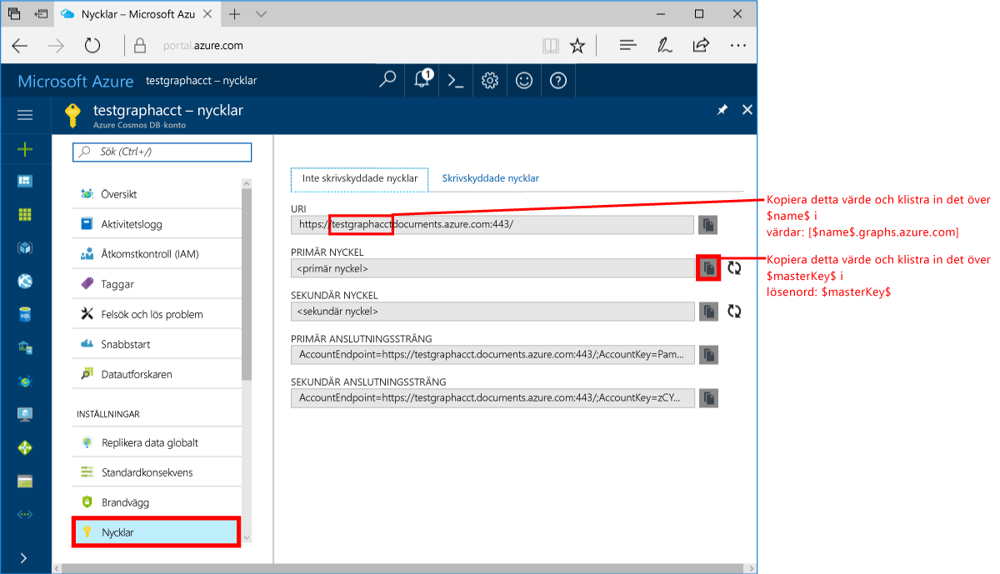
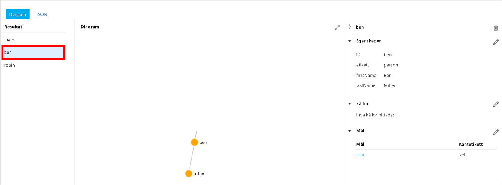
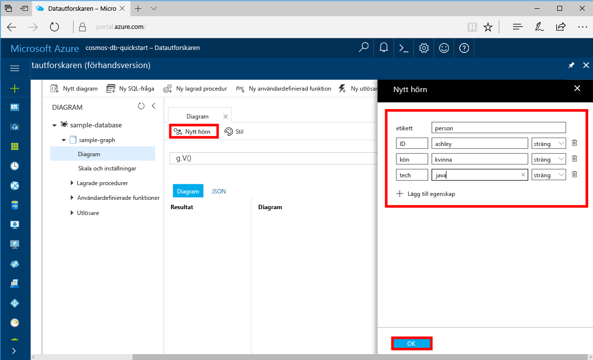

# <a name="azure-cosmos-db-create-a-graph-database-using-java-and-the-azure-portal"></a>Azure Cosmos DB: Skapa en grafdatabas med Java och Azure Portal

Azure Cosmos DB är Microsofts globalt distribuerade databastjänst för flera datamodeller. Du kan använda Azure Cosmos DB för att snabbt skapa och fråga hanterade dokument-, tabell- och grafdatabaser. 

I den här snabbstarten skapar vi en enkel grafdatabas med hjälp av Azure Portal-verktyg för Azure Cosmos DB. Här visas också hur du snabbt skapar en Java-konsolapp med hjälp av en [Graph API](graph-introduction.md)-databas som använder OSS-drivrutinen [Apache TinkerPop](http://tinkerpop.apache.org/). Anvisningarna i den här snabbstartsguiden gäller alla operativsystem som kan köra Java. Den här snabbstarten visar hur du skapar och ändrar grafer, antingen i användargränssnittet eller programmässigt, beroende på vad du föredrar. 

## <a name="prerequisites"></a>Nödvändiga komponenter
[!INCLUDE [quickstarts-free-trial-note](../../includes/quickstarts-free-trial-note.md)]

Följande gäller också:

* [Java Development Kit (JDK) 1.7+](http://www.oracle.com/technetwork/java/javase/downloads/jdk8-downloads-2133151.html)
    * I Ubuntu kör du `apt-get install default-jdk` för att installera JDK-paketet.
    * Tänk på att ställa in miljövariabeln JAVA_HOME så att den pekar på den mapp där JDK-paketet är installerat.
* [Ladda ned](http://maven.apache.org/download.cgi) och [installera](http://maven.apache.org/install.html) ett [Maven](http://maven.apache.org/)-binärarkiv
    * I Ubuntu kan du köra `apt-get install maven` för att installera Maven.
* [Git](https://www.git-scm.com/)
    * I Ubuntu kan du köra `sudo apt-get install git` för att installera Git.

## <a name="create-a-database-account"></a>Skapa ett databaskonto

Innan du kan börja skapa en grafdatabas måste du skapa ett Gremlin-databaskonto (Graph) med Azure Cosmos DB.

[!INCLUDE [cosmos-db-create-dbaccount-graph](../../includes/cosmos-db-create-dbaccount-graph.md)]

## <a name="add-a-graph"></a>Lägga till en graf

Nu kan du använda datautforskarverktyget i Azure Portal för att skapa en grafdatabas. 

1. Klicka på **Datautforskaren** > **Nytt diagram**.

    Området **Lägg till diagram** visas längst till höger, du kan behöva bläddra åt höger för att se det.

    

2. På sidan **Lägg till diagram** anger du inställningarna för den nya grafen.

    Inställning|Föreslaget värde|Beskrivning
    ---|---|---
    Databas-id|sample-database|Ange *sample-database* som namn på den nya databasen. Databasnamn måste innehålla mellan 1 och 255 tecken och får inte innehålla `/ \ # ?` eller avslutande blanksteg.
    Graf-id|sample-graph|Ange *sample-graph* som namnet på den nya samlingen. Samma teckenkrav gäller för grafnamn som databas-id.
    Lagringskapacitet|Fast (10 GB)|Låt standardvärdet **Fast (10 GB)** vara kvar. Det här värdet är databasens lagringskapacitet.
    Dataflöde|400 RU:er|Ändra genomflödet till 400 begäransenheter per sekund (RU/s). Du kan skala upp dataflödet senare om du vill minska svarstiden.

3. När formuläret är ifyllt klickar du på **OK**.

## <a name="clone-the-sample-application"></a>Klona exempelprogrammet

Nu ska vi övergå till att arbeta med kod. Nu ska vi klona en Graph API-app från GitHub, ange anslutningssträngen och köra appen. Du kommer att se hur lätt det är att arbeta med data programmässigt.  

1. Öppna en kommandotolk, skapa en ny mapp som heter git-samples och stäng sedan kommandotolken.

    ```bash
    md "C:\git-samples"
    ```

2. Öppna ett git-terminalfönster, t.ex. git bash, och använd kommandot `cd` för att ändra till en mapp där du vill installera exempelappen.  

    ```bash
    cd "C:\git-samples"
    ```

3. Klona exempellagringsplatsen med följande kommando. Detta kommando skapar en kopia av exempelappen på din dator. 

    ```bash
    git clone https://github.com/Azure-Samples/azure-cosmos-db-graph-java-getting-started.git
    ```

## <a name="review-the-code"></a>Granska koden

Det här steget är valfritt. Om du vill lära dig hur databasresurserna skapas i koden kan du granska följande kodavsnitt. Annars kan du gå vidare till [Uppdatera din anslutningssträng](#update-your-connection-information).

Följande kodfragment har hämtats från filen C:\git-samples\azure-cosmos-db-graph-java-getting-started\src\GetStarted\Program.java.

* Gremlin `Client` har initierats från konfigurationen i filen C:\git-samples\azure-cosmos-db-graph-java-getting-started\src\remote.yaml.

    ```java
    cluster = Cluster.build(new File("src/remote.yaml")).create();
    ...
    client = cluster.connect();
    ```

* En mängd Gremlin-steg utförs med metoden `client.submit`.

    ```java
    ResultSet results = client.submit(gremlin);

    CompletableFuture<List<Result>> completableFutureResults = results.all();
    List<Result> resultList = completableFutureResults.get();

    for (Result result : resultList) {
        System.out.println(result.toString());
    }
    ```

## <a name="update-your-connection-information"></a>Uppdatera din anslutningsinformation

Gå nu tillbaka till Azure Portal för att hämta anslutningsinformation och kopiera den till appen. De här inställningarna gör det möjligt för appen att kommunicera med den värdbaserade databasen.

1. I [Azure Portal](http://portal.azure.com/) klickar du på **Nycklar**. 

    Kopiera den första delen av URI-värdet.

    
2. Öppna filen src/remote.yaml och klistra in det unika ID-värdet över `$name$` i `hosts: [$name$.graphs.azure.com]`.

    Rad 1 i remote.yaml bör nu se ut ungefär så här 

    `hosts: [test-graph.graphs.azure.com]`

3. Ändra `graphs` till `gremlin.cosmosdb` i värdet `endpoint`. (Om du skapade grafdatabaskontot före den 20 december 2017 så gör du inga ändringar i slutpunktsvärdet och går vidare till nästa steg.)

    Slutpunktsvärdet bör nu se ut så här:

    `"endpoint": "https://testgraphacct.gremlin.cosmosdb.azure.com:443/"`

4. I Azure Portal använder du kopieringsknappen för att kopiera PRIMÄR NYCKEL och klistra in den över `$masterKey$` i `password: $masterKey$`.

    Rad 4 i remote.yaml bör nu se ut ungefär så här 

    `password: 2Ggkr662ifxz2Mg==`

5. Ändra rad 3 i remote.yaml från

    `username: /dbs/$database$/colls/$collection$`

    till 

    `username: /dbs/sample-database/colls/sample-graph`

    Om du använde ett unikt namn för din exempeldatabas eller exempeldiagram, så uppdatera värden efter behov.

6. Spara filen remote.yaml.

## <a name="run-the-console-app"></a>Kör konsolappen

1. I git-terminalfönstret `cd` till mappen azure-cosmos-db-graph-java-getting-started.

    ```git
    cd "C:\git-samples\azure-cosmos-db-graph-java-getting-started"
    ```

2. I git-terminalfönstret använder du följande kommando för att installera de Java-paket som krävs.

   ```
   mvn package
   ```

3. I git-terminalfönstret använder du följande kommando för att starta Java-programmet.
    
    ```
    mvn exec:java -D exec.mainClass=GetStarted.Program
    ```

    I terminalfönstret visas de hörn som läggs till i tabellen. 
    
    Om du får timeout-fel kontrollerar du att du har uppdaterat anslutningsinformationen på rätt sätt i [Uppdatera din anslutningsinformation](#update-your-connection-information). Prova även att köra det senaste kommandot igen. 
    
    När programmet har slutat arbeta trycker du på Retur och växlar sedan tillbaka till Azure Portal i webbläsaren. 

<a id="add-sample-data"></a>
## <a name="review-and-add-sample-data"></a>Granska och lägg till exempeldata

Nu kan du gå tillbaka till datautforskaren och se de hörn som lagts till i grafen, och lägga till ytterligare datapunkter.

1. Klicka på **Datautforskaren**, expandera **sample-graph**, klicka på **Diagram** och klicka sedan på **Tillämpa filter**. 

   

2. I listan **Resultat** kan du se nya användare som har lagts till i grafen. Välj **Ben** och lägg märke till att han är kopplad till Robin. Du kan flytta hörnen genom att dra och släppa, zooma in och ut genom att bläddra med mushjulet, och utöka diagrammets storlek med hjälp av dubbelpilen. 

   

3. Vi ska nu lägga till några nya användare. Klicka på **Nytt hörn** om du vill lägga till data i grafen.

   

4. Ange *person* i etikettrutan.

5. Klicka på **Lägg till egenskap** för att lägga till var och en av följande egenskaper. Tänk på att du kan skapa unika egenskaper för varje person i grafen. Endast id-nyckeln krävs.

    key|värde|Anteckningar
    ----|----|----
    id|ashley|Den unika identifieraren för hörnet. Om du inte anger något id skapas ett automatiskt.
    kön|kvinna| 
    teknik | Java | 

    > [!NOTE]
    > I den här snabbstartsguiden skapar vi en icke-partitionerad samling. Men om du skapar en partitionerad samling genom att ange en partitionsnyckel när samlingen skapas, måste du lägga till partitionsnyckeln som nyckel i varje nytt hörn. 

6. Klicka på **OK**. Du kan behöva expandera skärmen för att se **OK** längst ned på skärmen.

7. Klicka på **Nytt hörn** igen och lägg till ytterligare en ny användare. 

8. Ange en etikett för *person*.

9. Klicka på **Lägg till egenskap** för att lägga till var och en av följande egenskaper:

    key|värde|Anteckningar
    ----|----|----
    id|rakesh|Den unika identifieraren för hörnet. Om du inte anger något id skapas ett automatiskt.
    kön|man| 
    skola|MIT| 

10. Klicka på **OK**. 

11. Klicka på knappen **Tillämpa filter** med standardfiltret `g.V()` för att visa alla värden i diagrammet. Nu visas alla användare i listan **Resultat**. 

    Allteftersom du lägger till data kan du använda filter för att begränsa resultaten. Som standard använder Datautforskaren `g.V()` för att hämta alla hörnen i ett diagram. Du kan ändra till en annan [diagramfråga](tutorial-query-graph.md), t.ex. `g.V().count()`, för att returnera en uppräkning av alla hörn i diagrammet i JSON-format. Om du har ändrat filtret ändrar du tillbaka det till `g.V()` och klickar på **Tillämpa filter** om du vill visa alla resultaten igen.

12. Nu kan vi koppla ihop Rakesh och Ashley. Se till att **ashley** markeras i listan **Resultat** och klicka sedan på  bredvid **Mål** nere till höger. Du kan behöva bredda fönstret för att se knappen.

   

13. I rutan **Mål** skriver du *rakesh* och i rutan **Edge label**  (Kantetikett) skriver du *känner* och klickar sedan på kryssmarkeringen.

   

14. Markera nu **rakesh** i resultatlistan och se att Ashley och Rakesh är anslutna. 

   

   Då är delen om att skapa resurser slutförd i den här självstudien. Du kan fortsätta att lägga till hörn i diagrammet, ändra befintliga hörn eller ändra frågorna. Vi ska nu titta på de mått som Azure Cosmos DB tillhandahåller, och sedan ska vi rensa resurserna. 

## <a name="review-slas-in-the-azure-portal"></a>Granska serviceavtal i Azure Portal

[!INCLUDE [cosmosdb-tutorial-review-slas](../../includes/cosmos-db-tutorial-review-slas.md)]

## <a name="clean-up-resources"></a>Rensa resurser

[!INCLUDE [cosmosdb-delete-resource-group](../../includes/cosmos-db-delete-resource-group.md)]

## <a name="next-steps"></a>Nästa steg

I den här snabbstarten har du fått lära dig att skapa ett Azure Cosmos DB-konto, skapa en graf med datautforskaren och att köra en app. Nu kan du skapa mer komplexa frågor och implementera kraftfull logik för grafbläddring med Gremlin. 

> [!div class="nextstepaction"]
> [Fråga med hjälp av Gremlin](tutorial-query-graph.md)

