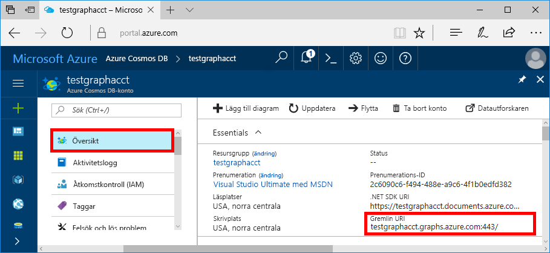
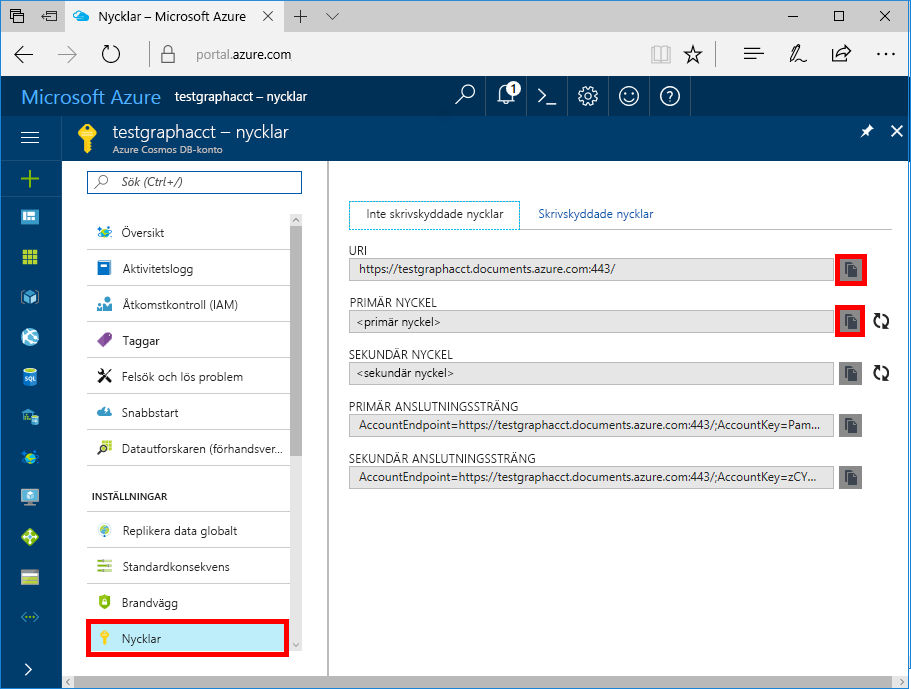

# <a name="azure-cosmos-db-build-a-nodejs-application-by-using-graph-api"></a>Azure Cosmos DB: Skapa en Node.js-app med Graph API

Azure Cosmos DB är Microsofts globalt distribuerade databas för flera modeller. Du kan snabbt skapa och ställa frågor mot databaser med dokument, nyckel/värde-par och grafer. Du får fördelar av den globala distributionen och den horisontella skalningsförmågan som ligger i grunden hos Azure Cosmos DB. 

Den här snabbstarten demonstrerar hur du skapar ett Azure Cosmos DB [Graph API](graph-introduction.md)-konto, en databas och en graf med hjälp av Azure Portal. Sedan skapar och kör du en konsolapp med drivrutinen [Gremlin Node.js](https://www.npmjs.com/package/gremlin) (öppen källkod).

## <a name="prerequisites"></a>Nödvändiga komponenter

Innan du kan köra det här exemplet måste du uppfylla följande krav:
* [Node.js](https://nodejs.org/en/)-version v0.10.29 eller senare
* [Git](http://git-scm.com/)

[!INCLUDE [quickstarts-free-trial-note](../../includes/quickstarts-free-trial-note.md)]

## <a name="create-a-database-account"></a>Skapa ett databaskonto

[!INCLUDE [cosmos-db-create-dbaccount-graph](../../includes/cosmos-db-create-dbaccount-graph.md)]

## <a name="add-a-graph"></a>Lägga till en graf

[!INCLUDE [cosmos-db-create-graph](../../includes/cosmos-db-create-graph.md)]

## <a name="clone-the-sample-application"></a>Klona exempelprogrammet

Nu ska vi klona en Graph API-app från github, ange anslutningssträngen och köra appen. Du kommer att se hur lätt det är att arbeta med data programmässigt. 

1. Öppna en kommandotolk, skapa en ny mapp som heter git-samples och stäng sedan kommandotolken.

    ```bash
    md "C:\git-samples"
    ```

2. Öppna ett git-terminalfönster, t.ex. git bash, och använd kommandot `cd` för att ändra till den nya mappen där du vill installera exempelappen.

    ```bash
    cd "C:\git-samples"
    ```

3. Klona exempellagringsplatsen med följande kommando. Detta kommando skapar en kopia av exempelappen på din dator.

    ```bash
    git clone https://github.com/Azure-Samples/azure-cosmos-db-graph-nodejs-getting-started.git
    ```

3. Öppna därefter lösningsfilen i Visual Studio. 

## <a name="review-the-code"></a>Granska koden

Det här steget är valfritt. Om du vill lära dig hur databasresurserna skapas i koden kan du granska följande kodavsnitt. Annars kan du gå vidare till [Uppdatera din anslutningssträng](#update-your-connection-string). 

Följande kodfragment är alla hämtade från filen app.js.

* Gremlin-klienten skapas.

    ```nodejs
    const client = Gremlin.createClient(
        443, 
        config.endpoint, 
        { 
            "session": false, 
            "ssl": true, 
            "user": `/dbs/${config.database}/colls/${config.collection}`,
            "password": config.primaryKey
        });
    ```

  Konfigurationerna finns i `config.js`, som vi redigerar i [följande avsnitt](#update-your-connection-string).

* En serie funktioner har definierats för att köra olika Gremlin-åtgärder. Detta är en av dem:

    ```nodejs
    function addVertex1(callback)
    {
        console.log('Running Add Vertex1'); 
        client.execute("g.addV('person').property('id', 'thomas').property('firstName', 'Thomas').property('age', 44).property('userid', 1)", { }, (err, results) => {
          if (err) callback(console.error(err));
          console.log("Result: %s\n", JSON.stringify(results));
          callback(null)
        });
    }
    ```

* Varje funktion kör en `client.execute`-metod med en frågesträngparameter för Gremlin. Följande är ett exempel på hur `g.V().count()` körs:

    ```nodejs
    console.log('Running Count'); 
    client.execute("g.V().count()", { }, (err, results) => {
        if (err) return console.error(err);
        console.log(JSON.stringify(results));
        console.log();
    });
    ```

* I slutet av filen anropas sedan alla metoder med hjälp av metoden `async.waterfall()`. På detta vis körs de efter varandra:

    ```nodejs
    try{
        async.waterfall([
            dropGraph,
            addVertex1,
            addVertex2,
            addEdge,
            countVertices
            ], finish);
    } catch(err) {
        console.log(err)
    }
    ```


## <a name="update-your-connection-string"></a>Uppdatera din anslutningssträng

1. Uppdatera filen config.js. 

2. I config.js fyller du i `config.endpoint`-nyckeln med **Gremlin URI**-värdet från sidan **Översikt** i Azure-portalen. 

    `config.endpoint = "GRAPHENDPOINT";`

    

   Om **Gremlin URI**-värdet är tomt kan du generera värdet från sidan **Nycklar** i portalen. Använd värdet **URI**, ta bort https:// och ändra documents till gremlin.cosmosdb. Om ditt grafkonto skapades före den 20 december 2017 så ändrar du documents till graphs. 

   Gremlin-slutpunkten måste vara värddatorns namn utan port och protocol-nummer, till exempel `mygraphdb.gremlin.cosmosdb.azure.com` (inte `https://mygraphdb.gremlin.cosmosdb.azure.com` eller `mygraphdb.gremlin.cosmosdb.azure.com:433`).

3. I config.js fyller du i värdet config.primaryKey med värdet **Primär nyckel** från sidan **Nycklar** i Azure-portalen. 

    `config.primaryKey = "PRIMARYKEY";`

   

4. Ange databasens namn och grafvärdet (behållaren) för config.database och config.collection. 

Här är ett exempel på hur din färdiga config.js-fil ska se ut:

```nodejs
var config = {}

// Note that this must not have HTTPS or the port number
config.endpoint = "testgraphacct.gremlin.cosmosdb.azure.com";
config.primaryKey = "Pams6e7LEUS7LJ2Qk0fjZf3eGo65JdMWHmyn65i52w8ozPX2oxY3iP0yu05t9v1WymAHNcMwPIqNAEv3XDFsEg==";
config.database = "graphdb"
config.collection = "Persons"

module.exports = config;
```

## <a name="run-the-console-app"></a>Kör konsolappen

1. Öppna ett terminalfönster och ändra (via kommandot `cd`) till installationskatalogen för package.json-fil som ingår i projektet.

2. Kör `npm install` att installera nödvändiga npm-moduler, inklusive `gremlin`.

3. Kör `node app.js` i en terminal för att starta nodprogrammet.

## <a name="browse-with-data-explorer"></a>Bläddra med datautforskaren

Nu kan du gå tillbaka till datautforskaren i Azure Portal och bläddra bland, ställa frågor mot och arbeta med dina nya grafdata.

Den nya databasen visas i fönstret **Graphs** (Diagram) i Datautforskaren. Expandera databasen, följt av containern, och välj sedan **Diagram**.

De data som genereras av exempelappen visas i nästa ruta på fliken **Diagram** när du klickar på **Tillämpa filter**.

Prova att slutföra `g.V()` med `.has('firstName', 'Thomas')` för att testa filtret. Observera att värdet är skiftlägeskänsligt.

## <a name="review-slas-in-the-azure-portal"></a>Granska serviceavtal i Azure Portal

[!INCLUDE [cosmosdb-tutorial-review-slas](../../includes/cosmos-db-tutorial-review-slas.md)]

## <a name="clean-up-your-resources"></a>Rensa dina resurser

[!INCLUDE [cosmosdb-delete-resource-group](../../includes/cosmos-db-delete-resource-group.md)]

## <a name="next-steps"></a>Nästa steg

I den här artikeln har du fått lära dig att skapa ett Azure Cosmos DB-konto, skapa en graf med Datautforskaren och köra en app. Nu kan du skapa mer komplexa frågor och implementera kraftfull logik för grafbläddring med Gremlin. 

> [!div class="nextstepaction"]
> [Fråga med hjälp av Gremlin](tutorial-query-graph.md)
