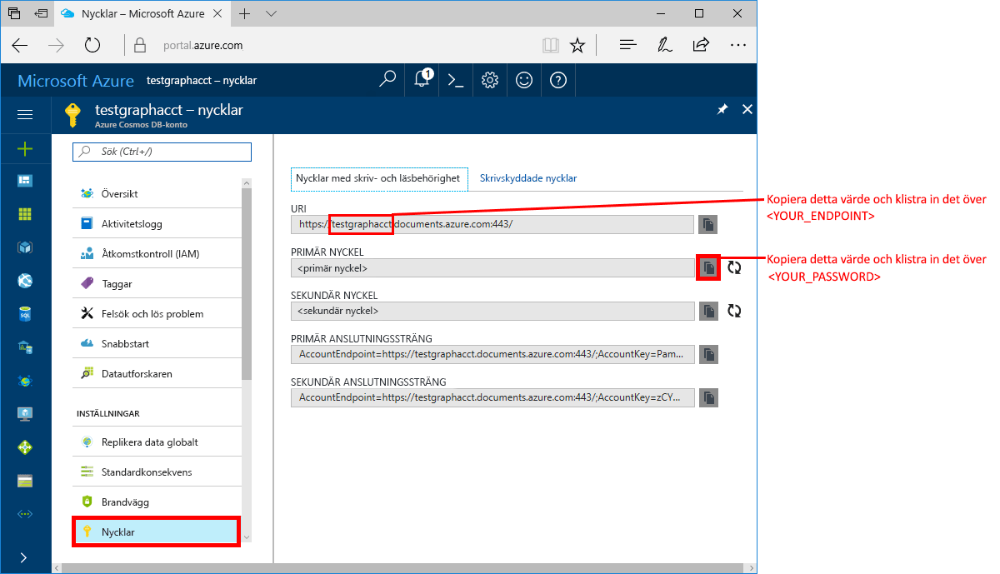
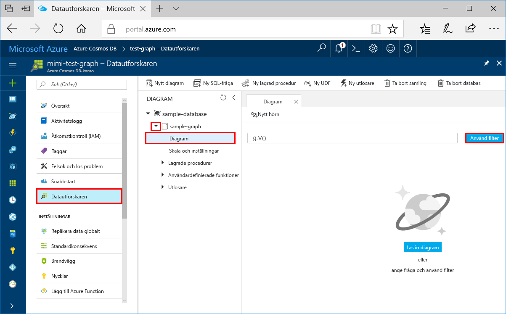
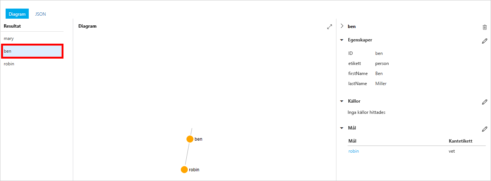
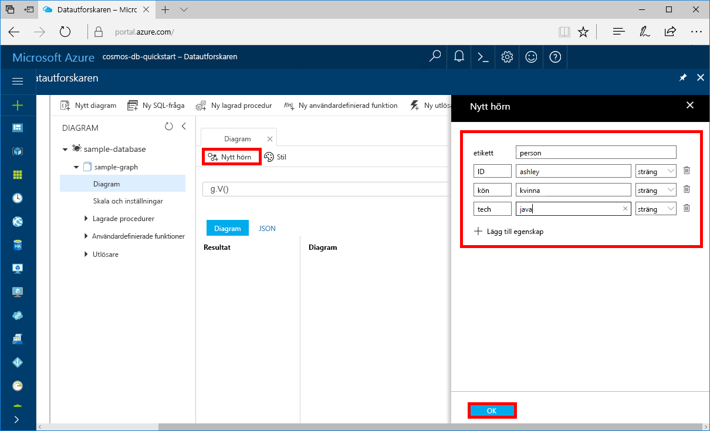
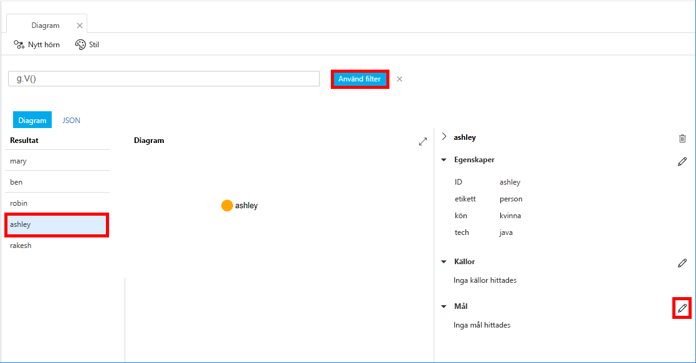
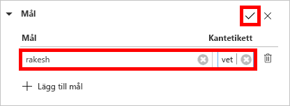
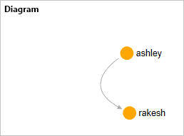

# <a name="azure-cosmos-db-create-a-graph-database-using-python-and-the-azure-portal"></a>Azure Cosmos DB: Skapa en grafdatabas med hjälp av Python och Azure Portal

> [!div class="op_single_selector"]
> * [Gremlin-konsol](create-graph-gremlin-console.md)
> * [NET](create-graph-dotnet.md)
> * [Java](create-graph-java.md)
> * [Node.js](create-graph-nodejs.md)
> * [Python](create-graph-python.md)
> * [PHP](create-graph-php.md)
>  

Den här snabbstarten visar hur du använder [Gremlin-API](graph-introduction.md) i Python och Azure Cosmos DB för att skapa en konsolapp genom att klona ett exempel från GitHub. Denna snabbstart visar dig också hur man skapar ett Azure Cosmos DB-konto med hjälp av den webbaserade Azure-portalen.   

Azure Cosmos DB är Microsofts globalt distribuerade databastjänst för flera datamodeller. Du kan snabbt skapa och ställa frågor mot databaser med dokument, tabeller, nyckel/värde-par och grafer. Du får fördelar av den globala distributionen och den horisontella skalningsförmågan som ligger i grunden hos Azure Cosmos DB.  

> [!NOTE]
> Den här snabbstarten kräver ett databaskonto för diagram som skapats efter den 20 december 2017. Befintliga konton stöder Python när de är migrerade till allmän tillgänglighet.

## <a name="prerequisites"></a>Nödvändiga komponenter

[!INCLUDE [quickstarts-free-trial-note](../../includes/quickstarts-free-trial-note.md)] Du kan även [Testa Azure Cosmos DB kostnadsfritt](https://azure.microsoft.com/try/cosmosdb/) utan en Azure-prenumeration, utan kostnad och åtaganden.

Följande gäller också:
* [Python](https://www.python.org/downloads/) version 3.5 eller senare
* [pip-pakethanterare](https://pip.pypa.io/en/stable/installing/)
* [Git](https://git-scm.com/)
* [Python-drivrutin för Gremlin](https://github.com/apache/tinkerpop/tree/master/gremlin-python)

## <a name="create-a-database-account"></a>Skapa ett databaskonto

Innan du kan börja skapa en grafdatabas måste du skapa ett Gremlin-databaskonto (Graph) med Azure Cosmos DB.

[!INCLUDE [cosmos-db-create-dbaccount-graph](../../includes/cosmos-db-create-dbaccount-graph.md)]

## <a name="add-a-graph"></a>Lägga till en graf

[!INCLUDE [cosmos-db-create-graph](../../includes/cosmos-db-create-graph.md)]

## <a name="clone-the-sample-application"></a>Klona exempelprogrammet

Nu ska vi övergå till att arbeta med kod. Nu ska vi klona en Gremlin API-app från GitHub, ange anslutningssträngen och köra appen. Du kommer att se hur lätt det är att arbeta med data programmässigt.  

1. Öppna en kommandotolk, skapa en ny mapp som heter git-samples och stäng sedan kommandotolken.

    ```bash
    md "C:\git-samples"
    ```

2. Öppna ett git-terminalfönster, t.ex. git bash, och använd kommandot `cd` för att ändra till en mapp där du vill installera exempelappen.  

    ```bash
    cd "C:\git-samples"
    ```

3. Klona exempellagringsplatsen med följande kommando. Detta kommando skapar en kopia av exempelappen på din dator. 

    ```bash
    git clone https://github.com/Azure-Samples/azure-cosmos-db-graph-python-getting-started.git
    ```

## <a name="review-the-code"></a>Granska koden

Det här steget är valfritt. Om du vill lära dig hur databasresurserna skapas i koden kan du granska följande kodavsnitt. Alla kodavsnitt hämtas från filen connect.py i mappen C:\git-samples\azure-cosmos-db-graph-python-getting-started\. Annars kan du gå vidare till [Uppdatera din anslutningssträng](#update-your-connection-information). 

* Gremlin `client` initieras i rad 104 i `connect.py`:

    ```python
    ...
    client = client.Client('wss://<YOUR_ENDPOINT>.gremlin.cosmosdb.azure.com:443/','g', 
        username="/dbs/<YOUR_DATABASE>/colls/<YOUR_COLLECTION_OR_GRAPH>", 
        password="<YOUR_PASSWORD>")
    ...
    ```

* En serie med Gremlin-steg deklareras i början av filen `connect.py`. De körs sedan med metoden `client.submitAsync()`:

    ```python
    client.submitAsync(_gremlin_cleanup_graph)
    ```

## <a name="update-your-connection-information"></a>Uppdatera din anslutningsinformation

Gå nu tillbaka till Azure Portal för att hämta anslutningsinformation och kopiera den till appen. De här inställningarna gör det möjligt för appen att kommunicera med den värdbaserade databasen.

1. I [Azure Portal](https://portal.azure.com/) klickar du på **Nycklar**. 

    Kopiera den första delen av URI-värdet.

    

2. Öppna filen connect.py och i rad 104 klistrar du in URI-värdet `<YOUR_ENDPOINT>` här:

    ```python
    client = client.Client('wss://<YOUR_ENDPOINT>.gremlin.cosmosdb.azure.com:443/','g', 
        username="/dbs/<YOUR_DATABASE>/colls/<YOUR_COLLECTION_OR_GRAPH>", 
        password="<YOUR_PASSWORD>")
    ```

    URI-delen av klientobjektet bör nu likna den här koden:

    ```python
    client = client.Client('wss://test.gremlin.cosmosdb.azure.com:443/','g', 
        username="/dbs/<YOUR_DATABASE>/colls/<YOUR_COLLECTION_OR_GRAPH>", 
        password="<YOUR_PASSWORD>")
    ```

3. Ändra den andra parametern för objektet `client` för att ersätta strängarna `<YOUR_DATABASE>` och `<YOUR_COLLECTION_OR_GRAPH>`. Om du använde de föreslagna värdena bör parametern se ut som den här koden:

    `username="/dbs/sample-database/colls/sample-graph"`

    Hela objektet `client` bör nu se ut som den här koden:

    ```python
    client = client.Client('wss://test.gremlin.cosmosdb.azure.com:443/','g', 
        username="/dbs/sample-database/colls/sample-graph", 
        password="<YOUR_PASSWORD>")
    ```

4. I Azure Portal använder du kopieringsknappen för att kopiera PRIMÄR NYCKEL och klistra in den över `<YOUR_PASSWORD>` i parametern `password=<YOUR_PASSWORD>`.

    Hela objektdefinitionen `client` bör nu se ut som den här koden:
    ```python
    client = client.Client('wss://test.gremlin.cosmosdb.azure.com:443/','g', 
        username="/dbs/sample-database/colls/sample-graph", 
        password="asdb13Fadsf14FASc22Ggkr662ifxz2Mg==")
    ```

6. Spara filen `connect.py`.

## <a name="run-the-console-app"></a>Kör konsolappen

1. I git-terminalfönstret `cd` till mappen azure-cosmos-db-graph-python-getting-started.

    ```git
    cd "C:\git-samples\azure-cosmos-db-graph-python-getting-started"
    ```

2. I git-terminalfönstret använder du följande kommando för att installera de Python-paket som krävs.

   ```
   pip install -r requirements.txt
   ```

3. I git-terminalfönstret använder du följande kommando för att starta Python-programmet.
    
    ```
    python connect.py
    ```

    I terminalfönstret visas de hörn och gränser som läggs till i tabellen. 
    
    Om du får timeout-fel kontrollerar du att du har uppdaterat anslutningsinformationen på rätt sätt i [Uppdatera din anslutningsinformation](#update-your-connection-information). Prova även att köra det senaste kommandot igen. 
    
    När programmet har slutat arbeta trycker du på Retur och växlar sedan tillbaka till Azure Portal i webbläsaren.

<a id="add-sample-data"></a>
## <a name="review-and-add-sample-data"></a>Granska och lägg till exempeldata

Nu kan du gå tillbaka till datautforskaren och se de hörn som lagts till i grafen, och lägga till ytterligare datapunkter.

1. Klicka på **Datautforskaren**, expandera **sample-graph**, klicka på **Diagram** och klicka sedan på **Tillämpa filter**. 

   

2. I listan **Resultat** kan du se nya användare som har lagts till i grafen. Välj **Ben** och lägg märke till att han är kopplad till Robin. Du kan flytta hörnen genom att dra och släppa, zooma in och ut genom att bläddra med mushjulet, och utöka diagrammets storlek med hjälp av dubbelpilen. 

   

3. Vi ska nu lägga till några nya användare. Klicka på **Nytt hörn** om du vill lägga till data i grafen.

   

4. Ange en etikett för *person*.

5. Klicka på **Lägg till egenskap** för att lägga till var och en av följande egenskaper. Tänk på att du kan skapa unika egenskaper för varje person i grafen. Endast id-nyckeln krävs.

    key|värde|Anteckningar
    ----|----|----
    id|ashley|Den unika identifieraren för hörnet. Om du inte anger något id skapas ett automatiskt.
    kön|kvinna| 
    teknik | Java | 

    > [!NOTE]
    > I den här snabbstartsguiden skapar vi en icke-partitionerad samling. Men om du skapar en partitionerad samling genom att ange en partitionsnyckel när samlingen skapas, måste du lägga till partitionsnyckeln som nyckel i varje nytt hörn. 

6. Klicka på **OK**. Du kan behöva expandera skärmen för att se **OK** längst ned på skärmen.

7. Klicka på **Nytt hörn** igen och lägg till ytterligare en ny användare. 

8. Ange en etikett för *person*.

9. Klicka på **Lägg till egenskap** för att lägga till var och en av följande egenskaper:

    key|värde|Anteckningar
    ----|----|----
    id|rakesh|Den unika identifieraren för hörnet. Om du inte anger något id skapas ett automatiskt.
    kön|man| 
    skola|MIT| 

10. Klicka på **OK**. 

11. Klicka på knappen **Tillämpa filter** med standardfiltret `g.V()` för att visa alla värden i diagrammet. Nu visas alla användare i listan **Resultat**. 

    Allteftersom du lägger till data kan du använda filter för att begränsa resultaten. Som standard använder Datautforskaren `g.V()` för att hämta alla hörnen i ett diagram. Du kan ändra till en annan [diagramfråga](tutorial-query-graph.md), t.ex. `g.V().count()`, för att returnera en uppräkning av alla hörn i diagrammet i JSON-format. Om du har ändrat filtret ändrar du tillbaka det till `g.V()` och klickar på **Tillämpa filter** om du vill visa alla resultaten igen.

12. Nu kan vi koppla ihop Rakesh och Ashley. Se till att **ashley** är markerat i listan **Resultat** och klicka sedan på redigeringsknappen bredvid **Mål** nere till höger. Du kan behöva bredda fönstret för att se området **Egenskaper**.

   

13. I rutan **Mål** skriver du *rakesh* och i rutan **Edge label**  (Kantetikett) skriver du *känner* och klickar sedan på kryssmarkeringen.

   

14. Markera nu **rakesh** i resultatlistan och se att Ashley och Rakesh är anslutna. 

   

   Då är delen om att skapa resurser slutförd i den här självstudien. Du kan fortsätta att lägga till hörn i diagrammet, ändra befintliga hörn eller ändra frågorna. Vi ska nu titta på de mått som Azure Cosmos DB tillhandahåller, och sedan ska vi rensa resurserna. 

## <a name="review-slas-in-the-azure-portal"></a>Granska serviceavtal i Azure-portalen

[!INCLUDE [cosmosdb-tutorial-review-slas](../../includes/cosmos-db-tutorial-review-slas.md)]

## <a name="clean-up-resources"></a>Rensa resurser

[!INCLUDE [cosmosdb-delete-resource-group](../../includes/cosmos-db-delete-resource-group.md)]

## <a name="next-steps"></a>Nästa steg

I den här snabbstarten har du fått lära dig att skapa ett Azure Cosmos DB-konto, skapa en graf med datautforskaren och att köra en app. Nu kan du skapa mer komplexa frågor och implementera kraftfull logik för grafbläddring med Gremlin. 

> [!div class="nextstepaction"]
> [Fråga med hjälp av Gremlin](tutorial-query-graph.md)

