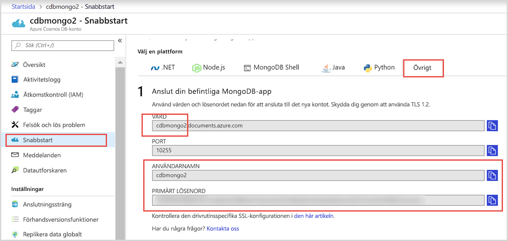
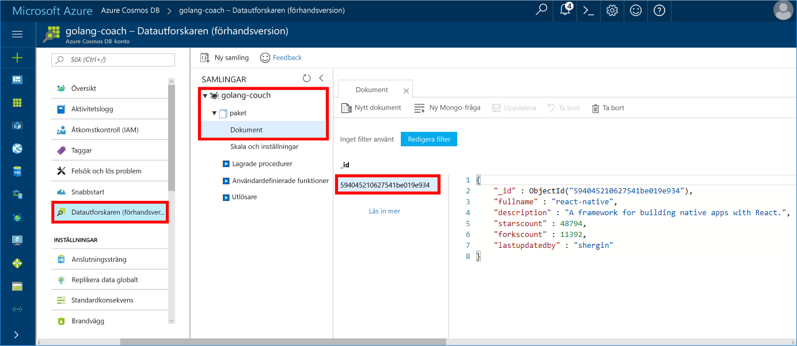

# <a name="quickstart-build-a-console-app-using-azure-cosmos-dbs-api-for-mongodb-and-golang-sdk"></a>Snabbstart: Skapa en konsolapp med Azure Cosmos DB:s API för MongoDB och Golang SDK

> [!div class="op_single_selector"]
> * [NET](create-mongodb-dotnet.md)
> * [Java](create-mongodb-java.md)
> * [Node.js](create-mongodb-nodejs.md)
> * [Python](create-mongodb-flask.md)
> * [Xamarin](create-mongodb-xamarin.md)
> * [Golang](create-mongodb-golang.md)
>  

Azure Cosmos DB är Microsofts globalt distribuerade databastjänst för flera datamodeller. Du kan snabbt skapa och ställa frågor mot databaser med dokument, nyckel/värde-par och grafer. Du får fördelar av den globala distributionen och den horisontella skalningsförmågan som ligger i grunden hos Cosmos DB.

Den här snabbstarten visar hur du använder en befintlig MongoDB-app som skrivits i [Golang](https://golang.org/) och ansluter den till din Cosmos-databas med hjälp av Azure Cosmos DB:s API för MongoDB.

Med andra ord vet ditt Golang-program bara att det ansluter med hjälp av en MongoDB-klient. Det är tydligt för programmet att data lagras i en Cosmos-databas.

## <a name="prerequisites"></a>Nödvändiga komponenter

- En Azure-prenumeration. Om du inte har en Azure-prenumeration kan du skapa ett [kostnadsfritt konto](https://azure.microsoft.com/free) innan du börjar. 

  [!INCLUDE [cosmos-db-emulator-mongodb](../../includes/cosmos-db-emulator-mongodb.md)]

- [Go](https://golang.org/dl/) och grundläggande kunskaper i språket [Go](https://golang.org/).
- En IDE – [GoLand](https://www.jetbrains.com/go/) från Jetbrains, [Visual Studio Code](https://code.visualstudio.com/) från Microsoft eller [Atom](https://atom.io/). Jag använder GoLand i den här självstudiekursen.

<a id="create-account"></a>
## <a name="create-a-database-account"></a>Skapa ett databaskonto

[!INCLUDE [cosmos-db-create-dbaccount](../../includes/cosmos-db-create-dbaccount-mongodb.md)]

## <a name="clone-the-sample-application"></a>Klona exempelprogrammet

Klona exempelprogrammet och installera de nödvändiga paketen.

1. Skapa en mapp med namnet CosmosDBSample i mappen GOROOT\src. Mappen finns i C:\Go\ som standard.
2. Kör följande kommando i ett git-terminalfönster, till exempel git bash, för att klona exempelkatalogen till mappen CosmosDBSample. 

    ```bash
    git clone https://github.com/Azure-Samples/azure-cosmos-db-mongodb-golang-getting-started.git
    ```
3.  Kör följande kommando för att hämta mgo-paketet. 

    ```
    go get gopkg.in/mgo.v2
    ```

Drivrutinen [mgo](https://labix.org/mgo) är en [MongoDB](https://www.mongodb.com/)-drivrutin för [språket Go](https://golang.org/) som implementerar ett omfattande och noggrant testat urval funktioner i ett mycket enkelt API som följer Go-standard.

<a id="connection-string"></a>

## <a name="update-your-connection-string"></a>Uppdatera din anslutningssträng

Gå nu tillbaka till Azure-portalen för att hämta information om din anslutningssträng och kopiera den till appen.

1. Klicka på **Snabbstart** på den vänstra navigeringsmenyn och klicka sedan på **Other** (Övriga) för att visa den information för anslutningssträngen som behövs för Go-programmet.

2. I Goglang öppnar du filen main.go i katalogen GOROOT\CosmosDBSample och uppdaterar följande kodrad med information för anslutningssträngen från Azure Portal enligt följande skärmbild. 

    Databasnamnet är prefixet för värdet **Host** (Värd) i rutan med anslutningssträngen i Azure Portal. Databasnamnet för kontot som visas på bilden nedan är golang-coach.

    ```go
    Database: "The prefix of the Host value in the Azure portal",
    Username: "The Username in the Azure portal",
    Password: "The Password in the Azure portal",
    ```

    

3. Spara filen main.go.

## <a name="review-the-code"></a>Granska koden

Det här steget är valfritt. Om du vill lära dig hur databasresurserna skapas i koden kan du granska följande kodavsnitt. Annars kan du gå vidare till [Kör appen](#run-the-app). 

Följande kodfragment är alla hämtade från filen main.go.

### <a name="connecting-the-go-app-to-cosmos-db"></a>Ansluta Go-appen till Cosmos DB

Azure Cosmos DB:s API för MongoDB stöder den SSL-aktiverade inloggningen. Om du vill ansluta måste du definiera funktionen **DialServer** i [mgo.DialInfo](https://godoc.org/gopkg.in/mgo.v2#DialInfo) och utföra anslutningen med funktionen [tls.*Dial*](https://golang.org/pkg/crypto/tls#Dial).

Följande Golang-kodfragment ansluter Go-appen till Azure Cosmos DB:s API för MongoDB. Klassen *DialInfo* innehåller alternativ för att upprätta en session.

```go
// DialInfo holds options for establishing a session.
dialInfo := &mgo.DialInfo{
    Addrs:    []string{"golang-couch.documents.azure.com:10255"}, // Get HOST + PORT
    Timeout:  60 * time.Second,
    Database: "database", // It can be anything
    Username: "username", // Username
    Password: "Azure database connect password from Azure Portal", // PASSWORD
    DialServer: func(addr *mgo.ServerAddr) (net.Conn, error) {
        return tls.Dial("tcp", addr.String(), &tls.Config{})
    },
}

// Create a session which maintains a pool of socket connections
// to Cosmos database (using Azure Cosmos DB's API for MongoDB).
session, err := mgo.DialWithInfo(dialInfo)

if err != nil {
    fmt.Printf("Can't connect, go error %v\n", err)
    os.Exit(1)
}

defer session.Close()

// SetSafe changes the session safety mode.
// If the safe parameter is nil, the session is put in unsafe mode, 
// and writes become fire-and-forget,
// without error checking. The unsafe mode is faster since operations won't hold on waiting for a confirmation.
// 
session.SetSafe(&mgo.Safe{})
```

Metoden **mgo. Dial()** används när det inte finns någon SSL-anslutning. För en SSL-anslutning krävs metoden **mgo.DialWithInfo()**.

En instans av objektet **DialWIthInfo{}** används för att skapa sessionsobjektet. När sessionen har upprättats kan du få åtkomst till samlingen med hjälp av följande kodfragment:

```go
collection := session.DB("database").C("package")
```

<a id="create-document"></a>

### <a name="create-a-document"></a>Skapa ett dokument

```go
// Model
type Package struct {
    Id bson.ObjectId  `bson:"_id,omitempty"`
    FullName      string
    Description   string
    StarsCount    int
    ForksCount    int
    LastUpdatedBy string
}

// insert Document in collection
err = collection.Insert(&Package{
    FullName:"react",
    Description:"A framework for building native apps with React.",
    ForksCount: 11392,
    StarsCount:48794,
    LastUpdatedBy:"shergin",

})

if err != nil {
    log.Fatal("Problem inserting data: ", err)
    return
}
```

### <a name="query-or-read-a-document"></a>Fråga eller läsa ett dokument

Cosmos DB stöder komplexa frågor mot data som lagras i varje samling. Följande exempelkod visar en fråga som du kan köra mot dokumenten i samlingen.

```go
// Get a Document from the collection
result := Package{}
err = collection.Find(bson.M{"fullname": "react"}).One(&result)
if err != nil {
    log.Fatal("Error finding record: ", err)
    return
}

fmt.Println("Description:", result.Description)
```


### <a name="update-a-document"></a>Uppdatera ett dokument

```go
// Update a document
updateQuery := bson.M{"_id": result.Id}
change := bson.M{"$set": bson.M{"fullname": "react-native"}}
err = collection.Update(updateQuery, change)
if err != nil {
    log.Fatal("Error updating record: ", err)
    return
}
```

### <a name="delete-a-document"></a>Ta bort ett dokument

Cosmos DB stöder borttagning av dokument.

```go
// Delete a document
query := bson.M{"_id": result.Id}
err = collection.Remove(query)
if err != nil {
   log.Fatal("Error deleting record: ", err)
   return
}
```
    
## <a name="run-the-app"></a>Kör appen

1. I Golang ser du till att din GOPATH (finns under **File** (Arkiv), **Settings** (Inställningar), **Go**, **GOPATH**) innehåller den plats där gopkg har installerats. Platsen är USERPROFILE\go som standard. 
2. Kommentera ut de rader som tar bort dokumentet (rad 103-107), så att du kan se dokumentet när appen har körts.
3. Klicka på **Run** (Kör) i Golang och sedan på **Run 'Build main.go and run'** (Bygg och kör main.go).

    Appen avslutas och en beskrivning av dokumentet som skapats i [Skapa ett dokument](#create-document) visas.
    
    ```
    Description: A framework for building native apps with React.
    
    Process finished with exit code 0
    ```

    
    
## <a name="review-your-document-in-data-explorer"></a>Granska dokumentet i Datautforskaren

Gå tillbaka till Azure Portal för att visa dokumentet i Datautforskaren.

1. Klicka på **Data Explorer (förhandsgranskning)** på den vänstra navigeringsmenyn, expandera **golang-coach** och **paketet** och klicka sedan på **Dokument**. Klicka på \_-ID:t på fliken **Dokument** för att visa dokumentet i den högra rutan. 

    
    
2. Du kan sedan arbeta med dokumentet och spara det genom att klicka på **Uppdatera**. Du kan också ta bort dokumentet eller skapa nya dokument eller frågor.

## <a name="review-slas-in-the-azure-portal"></a>Granska serviceavtal i Azure-portalen

[!INCLUDE [cosmosdb-tutorial-review-slas](../../includes/cosmos-db-tutorial-review-slas.md)]

## <a name="clean-up-resources"></a>Rensa resurser

[!INCLUDE [cosmosdb-delete-resource-group](../../includes/cosmos-db-delete-resource-group.md)]

## <a name="next-steps"></a>Nästa steg

I den här snabbstarten har du lärt dig hur du skapar ett Cosmos-konto och kör en Golang-app. Du kan nu importera ytterligare data till din Cosmos-databas. 

> [!div class="nextstepaction"]
> [Importera MongoDB-data till Azure Cosmos DB](mongodb-migrate.md)
