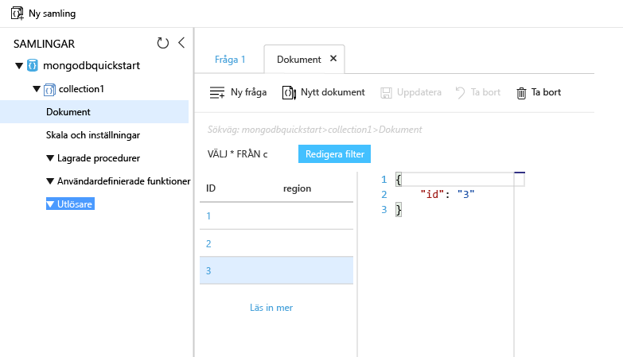

# <a name="azure-cosmos-db-migrate-an-existing-nodejs-mongodb-web-app"></a>Azure Cosmos DB: Migrera en befintlig Node.js MongoDB-webbapp 

> [!div class="op_single_selector"]
> * [.NET](create-mongodb-dotnet.md)
> * [Java](create-mongodb-java.md)
> * [Node.js](create-mongodb-nodejs.md)
> * [Python](create-mongodb-flask.md)
> * [Xamarin](create-mongodb-xamarin.md)
> * [Golang](create-mongodb-golang.md)
>  

Azure Cosmos DB är Microsofts globalt distribuerade databastjänst för flera datamodeller. Du kan snabbt skapa och ställa frågor mot databaser med dokument, nyckel/värde-par och grafer. Du får fördelar av den globala distributionen och den horisontella skalningsförmågan som ligger i grunden hos Azure Cosmos DB. 

Den här snabbstarten visar hur du använder en befintlig MongoDB-app som skrivits i Node.js och ansluter den till din Microsoft Azure Cosmos DB-databas, som stöder MongoDB-klientanslutningar genom att använda [MongoDB API](mongodb-introduction.md). Med andra ord vet ditt Node.js program bara att det ansluter till en databas som använder MongoDB-API:er. Det är transparent för programmet att data lagras i Azure Cosmos DB.

När du är klar har du ett MEAN-program (MongoDB, Express, Angular och Node.js) som körs på [Azure Cosmos DB](https://azure.microsoft.com/services/cosmos-db/). 


[!INCLUDE [cloud-shell-try-it](../../includes/cloud-shell-try-it.md)]

Om du väljer att installera och använda CLI lokalt måste du köra Azure CLI version 2.0 eller senare. Kör `az --version` för att hitta versionen. Om du behöver installera eller uppgradera kan du läsa [Installera Azure CLI]( /cli/azure/install-azure-cli). 

## <a name="prerequisites"></a>Nödvändiga komponenter 
Om du inte har en Azure-prenumeration kan du skapa ett [kostnadsfritt konto](https://azure.microsoft.com/free/?WT.mc_id=A261C142F) innan du börjar. 
[!INCLUDE [cosmos-db-emulator-mongodb](../../includes/cosmos-db-emulator-mongodb.md)]

Utöver Azure CLI, behöver du [Node.js](https://nodejs.org/) och [Git](http://www.git-scm.com/downloads) installerat lokalt om du vill köra `npm` och `git` kommandon.

Du bör ha kunskaper inom Node.js. Den här snabbstarten är inte avsedd att hjälpa dig med att utveckla Node.js-program i allmänhet.

## <a name="clone-the-sample-application"></a>Klona exempelprogrammet

Kör följande kommandon för att klona exempellagringsplatsen. Den här exempellagringsplatsen innehåller standard-[MEAN.js](http://meanjs.org/)-programmet.

1. Öppna en kommandotolk, skapa en ny mapp som heter git-samples och stäng sedan kommandotolken.

    ```bash
    md "C:\git-samples"
    ```

2. Öppna ett git-terminalfönster, t.ex. git bash, och använd kommandot `cd` för att ändra till den nya mappen där du vill installera exempelappen.

    ```bash
    cd "C:\git-samples"
    ```

3. Klona exempellagringsplatsen med följande kommando. Detta kommando skapar en kopia av exempelappen på din dator. 

    ```bash
    git clone https://github.com/prashanthmadi/mean
    ```

## <a name="run-the-application"></a>Köra programmet

Installera de nödvändiga paketen och starta programmet.

```bash
cd mean
npm install
npm start
```
Programmet försöker att ansluta till en MongoDB-källa, vilket misslyckas. Gå vidare och avsluta programmet när utdata returnerar ”[MongoError: connect ECONNREFUSED 127.0.0.1:27017]”.

## <a name="log-in-to-azure"></a>Logga in på Azure

Om du använder en installerad Azure CLI loggar du in på Azure-prenumerationen med kommandot [az login](/cli/azure/reference-index#az-login) och följer anvisningarna på skärmen. Du kan hoppa över det här steget om du använder Azure Cloud-gränssnittet.

```azurecli
az login 
``` 
   
## <a name="add-the-azure-cosmos-db-module"></a>Lägg till Azure Cosmos DB-modulen

Om du använder en installerad Azure CLI, kontrollera om `cosmosdb`-komponenten har installerats genom att köra kommandot `az`. Om `cosmosdb` är i listan över grundläggande kommandon, fortsätter du med nästa kommando. Du kan hoppa över det här steget om du använder Azure Cloud-gränssnittet.

Om `cosmosdb` inte är i listan över grundläggande kommandon, installerar du om [Azure CLI]( /cli/azure/install-azure-cli).

## <a name="create-a-resource-group"></a>Skapa en resursgrupp

Skapa en [resursgrupp](../azure-resource-manager/resource-group-overview.md) med [az group create](/cli/azure/group#az-group-create). En Azure-resursgrupp är en logisk container som Azure-resurser (t.ex. webbappar, databaser och lagringskonton) distribueras och hanteras i. 

Följande exempel skapar en resursgrupp i regionen västeuropa. Välj ett unikt namn för resursgruppen.

Om du använder Azure Cloud Shell, klickar du på **Prova**, följer anvisningarna på skärmen för att logga in och kopierar sedan kommandot i Kommandotolken.

```azurecli-interactive
az group create --name myResourceGroup --location "West Europe"
```

## <a name="create-an-azure-cosmos-db-account"></a>Skapa ett Azure Cosmos DB-konto

Skapa ett Azure Cosmos DB-konto med kommandot [az cosmosdb create](/cli/azure/cosmosdb#az-cosmosdb-create).

I följande kommando, ersätter du ditt eget unika Azure Cosmos DB-kontonamn där du ser platshållaren `<cosmosdb-name>`. Den här unika namnet kommer att användas som en del av din Azure Cosmos DB-slutpunkt (`https://<cosmosdb-name>.documents.azure.com/`) så namnet måste vara unikt för alla Azure Cosmos DB-konton i Azure. 

```azurecli-interactive
az cosmosdb create --name <cosmosdb-name> --resource-group myResourceGroup --kind MongoDB
```

Parametern `--kind MongoDB` aktiverar MongoDB-klientanslutningar.

När Azure Cosmos DB-kontot har skapats, visar Azure CLI information liknande följande exempel. 

> [!NOTE]
> I det här exemplet används JSON som standardalternativ för Azure CLI-utdataformat. Om du vill använda andra format läser du [Utdataformat för Azure CLI-kommandon](https://docs.microsoft.com/cli/azure/format-output-azure-cli).

```json
{
  "databaseAccountOfferType": "Standard",
  "documentEndpoint": "https://<cosmosdb-name>.documents.azure.com:443/",
  "id": "/subscriptions/00000000-0000-0000-0000-000000000000/resourceGroups/myResourceGroup/providers/Microsoft.Document
DB/databaseAccounts/<cosmosdb-name>",
  "kind": "MongoDB",
  "location": "West Europe",
  "name": "<cosmosdb-name>",
  "readLocations": [
    {
      "documentEndpoint": "https://<cosmosdb-name>-westeurope.documents.azure.com:443/",
      "failoverPriority": 0,
      "id": "<cosmosdb-name>-westeurope",
      "locationName": "West Europe",
      "provisioningState": "Succeeded"
    }
  ],
  "resourceGroup": "myResourceGroup",
  "type": "Microsoft.DocumentDB/databaseAccounts",
  "writeLocations": [
    {
      "documentEndpoint": "https://<cosmosdb-name>-westeurope.documents.azure.com:443/",
      "failoverPriority": 0,
      "id": "<cosmosdb-name>-westeurope",
      "locationName": "West Europe",
      "provisioningState": "Succeeded"
    }
  ]
} 
```

## <a name="connect-your-nodejs-application-to-the-database"></a>Anslut ditt Node.js-program till databasen

I det här steget, ansluter du ditt MEAN.js-exempelprogram till en Azure Cosmos DB-databas som du just skapade med en MongoDB-anslutningssträng. 

<a name="devconfig"></a>
## <a name="configure-the-connection-string-in-your-nodejs-application"></a>Konfigurera anslutningssträngen i ditt Node.js-program

I din MEAN.js-lagringsplats, öppnar du `config/env/local-development.js`.

Ersätt innehållet i filen med följande kod. Se till att även ersätta två `<cosmosdb-name>` platshållare med namnet på ditt Azure Cosmos DB.

```javascript
'use strict';

module.exports = {
  db: {
    uri: 'mongodb://<cosmosdb-name>:<primary_master_key>@<cosmosdb-name>.documents.azure.com:10255/mean-dev?ssl=true&sslverifycertificate=false'
  }
};
```

## <a name="retrieve-the-key"></a>Hämta nyckeln

För att kunna ansluta till en Azure Cosmos DB-databas, behöver du databasnyckeln. Använd kommandot [az documentdb list-keys](/cli/azure/cosmosdb#list-keys) för att hämta den primära nyckeln.

```azurecli-interactive
az cosmosdb list-keys --name <cosmosdb-name> --resource-group myResourceGroup --query "primaryMasterKey"
```

Azure CLI matar ut information som liknar följande exempel. 

```json
"RUayjYjixJDWG5xTqIiXjC..."
```

Kopiera värdet för `primaryMasterKey`. Klistra in det över `<primary_master_key>` i `local-development.js`.

Spara ändringarna.

### <a name="run-the-application-again"></a>Kör programmet igen.

Kör `npm start` igen. 

```bash
npm start
```

Ett konsolmeddelande borde nu komma upp som säger att utvecklingsmiljön är klar och igång. 

Gå till `http://localhost:3000` i en webbläsare. Klicka på **registrera dig** i huvudmenyn och försök skapa två låtsasanvändare. 

MEAN.js-exempelprogrammet lagrar användardata i databasen. Om du har lyckats och MEAN.js automatiskt loggar in på den skapade användaren så fungerar din Azure Cosmos DB-anslutning. 


## <a name="view-data-in-data-explorer"></a>Visa data i datautforskaren

Data som lagras av en Azure Cosmos DB finns tillgänglig för att se, fråga och köra affärslogik på i Azure-portalen.

Om du vill visa, fråga och arbeta med användardata som skapats i föregående steg, loggar du in på [Azure-portalen](https://portal.azure.com) i din webbläsare.

I den övre sökrutan skriver du in Azure Cosmos DB. När ditt Cosmos DB-kontoblad öppnas, väljer du ditt Cosmos DB-konto. I det vänstra navigeringsfönstret, klickar du på datautforskaren. Utöka din samling i samlings-fönstret så kan du visa dokumenten i samlingen, fråga data och skapa och köra lagrade procedurer, utlösare och UDF:er. 




## <a name="deploy-the-nodejs-application-to-azure"></a>Distribuera Node.js-programmet till Azure

I det här steget, distribuerar du ditt MongoDB-anslutna Node.js-program till Azure Cosmos DB.

Du kanske har märkt att konfigurationsfilen du ändrade tidigare är för utvecklingsmiljön (`/config/env/local-development.js`). När du distribuerar ditt program till App Service, körs det i produktionsmiljön som standard. Nu behöver du göra samma ändring till respektive konfigurationsfil.

I din MEAN.js-lagringsplats, öppnar du `config/env/production.js`.

I objektet `db`, ersätter du värdet `uri` som det visas i följande exempel. Se till att ersätta platshållarna som innan.

```javascript
'mongodb://<cosmosdb-name>:<primary_master_key>@<cosmosdb-name>.documents.azure.com:10255/mean?ssl=true&sslverifycertificate=false',
```

> [!NOTE] 
> Alternativet `ssl=true` är viktigt eftersom [Azure Cosmos DB kräver SSL](connect-mongodb-account.md#connection-string-requirements). 
>
>

Spara dina ändringar till Git i terminalen. Du kan kopiera bägge kommandona för att köra dem tillsammans.

```bash
git add .
git commit -m "configured MongoDB connection string"
```
## <a name="clean-up-resources"></a>Rensa resurser

[!INCLUDE [cosmosdb-delete-resource-group](../../includes/cosmos-db-delete-resource-group.md)]

## <a name="next-steps"></a>Nästa steg

I den här snabbstarten har du lärt dig hur man skapar ett Azure Cosmos DB-konto och skapar en MongoDB-samling med datautforskaren. Nu kan du migrera dina MongoDB-data till Azure Cosmos DB.  

> [!div class="nextstepaction"]
> [Importera MongoDB-data till Azure Cosmos DB](mongodb-migrate.md)
