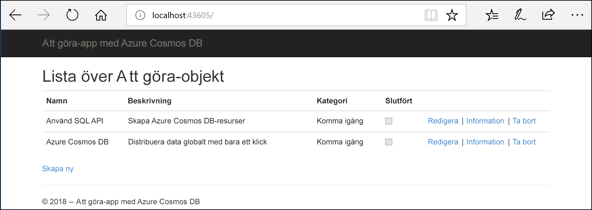
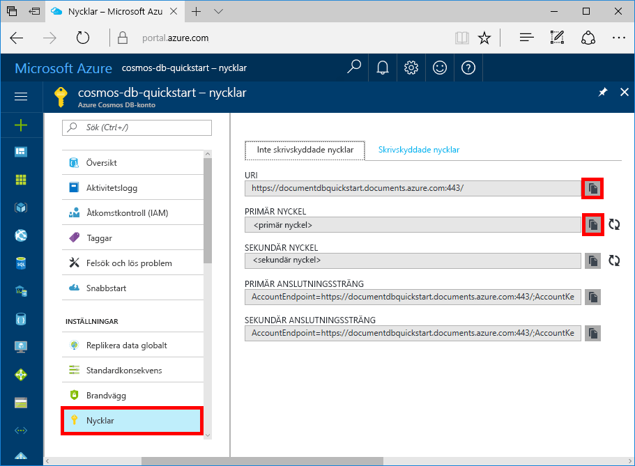
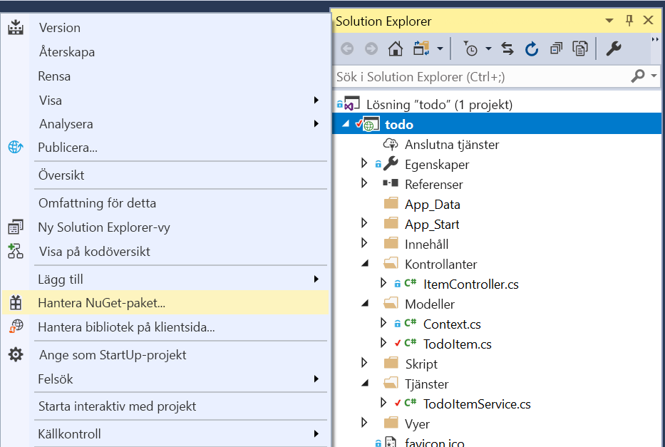
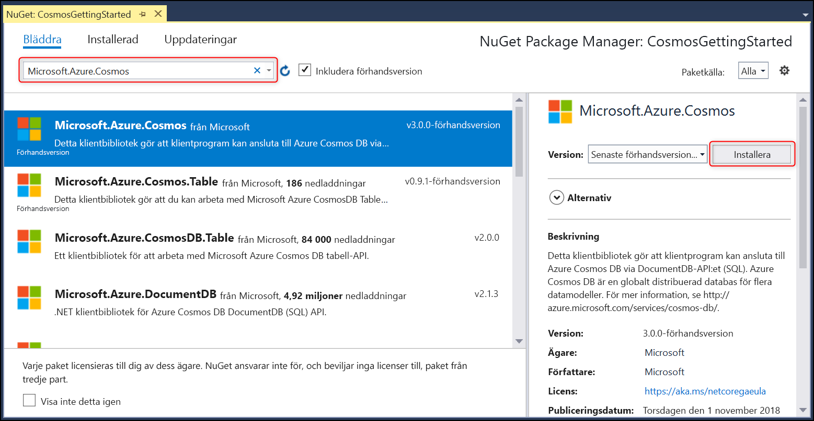

# <a name="quickstart-build-an-aspnet-web-app-with-azure-cosmos-db-using-the-sql-api-and-the-azure-portal"></a>Snabbstart: Skapa en ASP.NET-webbapp med Azure Cosmos DB med hjälp av SQL API och Azure Portal

> [!div class="op_single_selector"]
> * [.NET (förhandsversion)](create-sql-api-dotnet-preview.md)
> * [NET](create-sql-api-dotnet.md)
> * [Java](create-sql-api-java.md)
> * [Node.js](create-sql-api-nodejs.md)
> * [Python](create-sql-api-python.md)
> * [Xamarin](create-sql-api-xamarin-dotnet.md)
>  
> 

Azure Cosmos DB är Microsofts globalt distribuerade databastjänst med hög tillgänglighet för flera datamodeller. Du kan snabbt skapa och ställa frågor mot databaser med dokument, nyckel/värde-par och grafer. Du får fördelar av den globala distributionen och den horisontella skalningsförmågan som ligger i grunden hos Azure Cosmos DB. 

Den här snabbstarten visar hur du skapar ett Azure Cosmos DB [SQL API](sql-api-introduction.md)-konto, en databas och en container med hjälp av Azure-portalen. Därefter skapar och distribuerar du en ASP.NET-webbapp med en att göra-lista som bygger på [SQL .NET API](sql-api-sdk-dotnet.md), som visas i följande skärmbild. 

I den här snabbstarten används version 3.0+ av the Azure Cosmos DB .NET SDK. 



## <a name="prerequisites"></a>Nödvändiga komponenter

Om du inte har Visual Studio 2017 installerad kan du ladda ned och använda [Visual Studio 2017 Community Edition](https://www.visualstudio.com/downloads/) **utan kostnad**. Se till att du aktiverar arbetsbelastningen **Azure-utveckling** under installationen av Visual Studio.

[!INCLUDE [quickstarts-free-trial-note](../../includes/quickstarts-free-trial-note.md)] 
[!INCLUDE [cosmos-db-emulator-docdb-api](../../includes/cosmos-db-emulator-docdb-api.md)]  

<a id="create-account"></a>
## <a name="create-a-database-account"></a>Skapa ett databaskonto

[!INCLUDE [cosmos-db-create-dbaccount-preview](../../includes/cosmos-db-create-dbaccount-preview.md)]

<a id="create-collection"></a>
## <a name="add-a-collection"></a>Lägga till en samling

[!INCLUDE [cosmos-db-create-collection-preview](../../includes/cosmos-db-create-collection-preview.md)]

<a id="add-sample-data"></a>
## <a name="add-sample-data"></a>Lägg till exempeldata

[!INCLUDE [cosmos-db-create-sql-api-add-sample-data](../../includes/cosmos-db-create-sql-api-add-sample-data.md)]

## <a name="query-your-data"></a>Fråga dina data

[!INCLUDE [cosmos-db-create-sql-api-query-data](../../includes/cosmos-db-create-sql-api-query-data.md)]

## <a name="clone-the-sample-application"></a>Klona exempelprogrammet

Nu ska vi övergå till att arbeta med kod. Vi ska klona en [SQL API-app från GitHub](https://github.com/Azure-Samples/cosmos-dotnet-todo-app), ställa in anslutningssträngen och köra appen. 

1. Öppna en kommandotolk, skapa en ny mapp som heter git-samples och stäng sedan kommandotolken.

    ```bash
    md "C:\git-samples"
    ```

2. Öppna ett git-terminalfönster, t.ex. git bash, och använd kommandot `cd` för att ändra till den nya mappen där du vill installera exempelappen.

    ```bash
    cd "C:\git-samples"
    ```

3. Klona exempellagringsplatsen med följande kommando. Detta kommando skapar en kopia av exempelappen på din dator.

    ```bash
    git clone https://github.com/Azure-Samples/cosmos-dotnet-todo-app.git
    ```

4. Öppna lösningsfilen **todo.sln** i Visual Studio. 

## <a name="review-the-code"></a>Granska koden

Det här steget är valfritt. Om du vill lära dig hur databasresurserna skapas i koden kan du granska följande kodavsnitt. Annars kan du gå vidare till [Uppdatera din anslutningssträng](#update-your-connection-string). 

Observera att om du är bekant med den tidigare versionen av .NET SDK så är du kanske van vid att se termerna ”samling” och ”dokument”. Eftersom Azure Cosmos DB stöder flera API-modeller använder version 3.0+ av .NET SDK de allmänna termerna ”container” och ”objekt”. En container kan vara en samling, ett diagram eller en tabell. Ett objekt kan vara ett dokument, en kant/ett hörn eller en rad, och är innehållet i en container. [Läs mer om databaser, containrar och objekt.](databases-containers-items.md)

Följande kodavsnitt är alla hämtade från filen ToDoItemService.cs.

* CosmosClient initieras på raderna 68–69.

    ```csharp
    CosmosConfiguration config = new CosmosConfiguration(Endpoint, PrimaryKey);
    client = new CosmosClient(config);
    ```

* En ny databas skapas på rad 71.

    ```csharp
    CosmosDatabase database = await client.Databases.CreateDatabaseIfNotExistsAsync(DatabaseId);
    ```

* En ny container skapas på rad 72 med partitionsnyckeln ”/category”.

    ```csharp
    CosmosContainer container = await database.Containers.CreateContainerIfNotExistsAsync(ContainerId, "/category");
    ```

## <a name="update-your-connection-string"></a>Uppdatera din anslutningssträng

Gå nu tillbaka till Azure-portalen för att hämta information om din anslutningssträng och kopiera den till appen.

1. I [Azure-portalen](https://portal.azure.com/) går du till ditt Azure Cosmos DB-konto. Välj **Nycklar** i det vänstra navigeringsfönstret och sedan **läs- och skrivnycklar**. Du använder kopiera-knapparna till höger på skärmen för att kopiera URI:n och primärnyckeln i web.config-filen i nästa steg.

    

2. I Visual Studio 2017 öppnar du filen **web.config**. 

3. Kopiera ditt URI-värde från portalen (med kopieringsknappen) och gör det till värdet för ``endpoint``-nyckeln i web.config. 

    `<add key="endpoint" value="FILLME" />`

4. Kopiera sedan värdet för PRIMÄRNYCKEL från portalen och gör det till värdet för ``primarykey`` i web.config. 

    `<add key="primaryKey" value="FILLME" />`
    
5. Uppdatera sedan databas- och containervärdet för att matcha namnet på den databas och den container som du skapade tidigare. Du har nu uppdaterat din app med all information den behöver för att kommunicera med Azure Cosmos DB. 

    `<add key="database" value="Tasks" />`

    `<add key="container" value="Items" />`
    
## <a name="run-the-web-app"></a>Kör webbappen

1. I **Solution Explorer** högerklickar du på det nya konsolprogramprojektet, som finns under din Visual Studio-lösning, och klickar sedan på **Hantera NuGet-paket...**
    
    
1. På fliken **NuGet** klickar du på **Bläddra** och skriver **Microsoft.Azure.Cosmos** i sökrutan.
1. Leta upp **Microsoft.Azure.Cosmos** i resultatet och klicka på **Installera**.
   Paket-ID:t för Azure Cosmos DB-klientbiblioteket är [Microsoft Azure Cosmos DB Client Library](https://www.nuget.org/packages/Microsoft.Azure.Cosmos/).

   

    Om du får ett meddelande om att granska ändringar i lösningen klickar du på **OK**. Om du får ett meddelande om godkännande av licens klickar du på **Jag godkänner**.

1. Tryck på Ctrl + F5 för att köra programmet. Appen visas i din webbläsare. 

1. Välj **Skapa nytt** i webbläsaren och skapa några nya uppgifter i din att göra-app. Du bör även se de uppgifter som du skapade i [Lägg till exempeldata](#add-sample-data)

   

Du kan nu gå tillbaka till datautforskaren och se frågan, ändra och arbeta med dessa nya data. 

## <a name="review-slas-in-the-azure-portal"></a>Granska serviceavtal i Azure-portalen

[!INCLUDE [cosmosdb-tutorial-review-slas](../../includes/cosmos-db-tutorial-review-slas.md)]

## <a name="clean-up-resources"></a>Rensa resurser

[!INCLUDE [cosmosdb-delete-resource-group](../../includes/cosmos-db-delete-resource-group.md)]

## <a name="next-steps"></a>Nästa steg

I den här snabbstarten har du lärt dig hur du skapar ett Azure Cosmos DB-konto, hur du skapar en container och lägger till objekt i den med hjälp av Datautforskaren samt hur du kör en webbapp. Du kan nu importera ytterligare data till ditt Cosmos DB-konto. 

> [!div class="nextstepaction"]
> [Importera data till Azure Cosmos DB](import-data.md)


