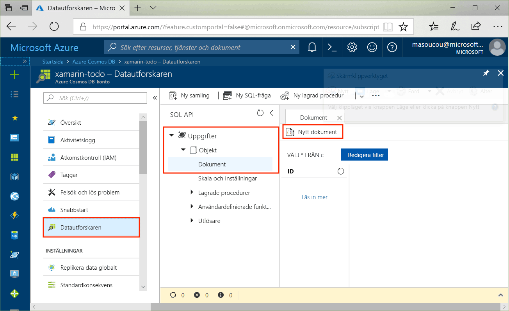
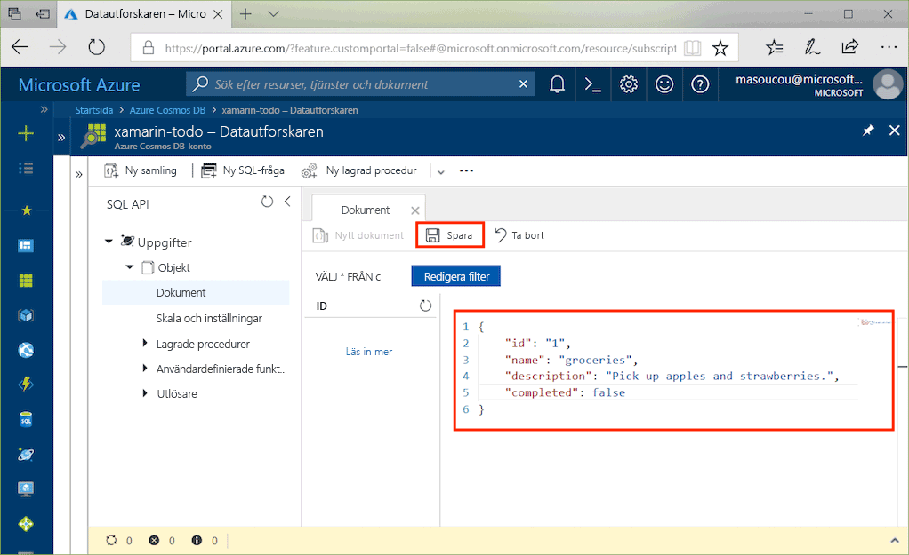
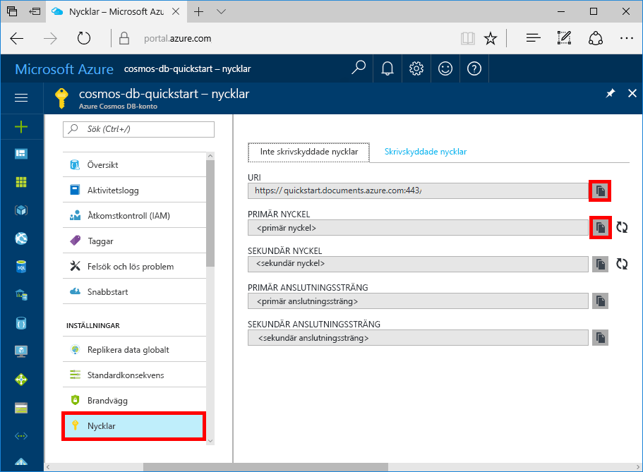

# <a name="azure-cosmos-db-build-a-todo-app-with-xamarin"></a>Azure Cosmos DB: Skapa en att göra-app med Xamarin

Azure Cosmos DB är Microsofts globalt distribuerade databastjänst för flera datamodeller. Du kan snabbt skapa och ställa frågor mot databaser med dokument, nyckel/värde-par och grafer. Du får fördelar av den globala distributionen och den horisontella skalningsförmågan som ligger i grunden hos Azure Cosmos DB.

> [!NOTE]
> Exempelkod för ett helt kanonisk Xamarin-exempelapp som visar flera Azure-erbjudanden, däribland CosmosDB, finns på GitHub [här](https://github.com/xamarinhq/app-geocontacts). Den här appen demonstrerar visning av geografiskt spridda kontakter, och gör att dessa kontakter kan uppdatera sin plats.

Den här snabbstarten visar hur du skapar ett SQL API-konto i Azure Cosmos DB, en dokumentdatabas och en samling med Azure Portal. Du kan sedan skapa och distribuera en att göra-lista i webbappen som bygger på [SQL .NET API](sql-api-sdk-dotnet.md) och [Xamarin](https://docs.microsoft.com/xamarin/#pivot=platforms&panel=Cross-Platform) med hjälp av [Xamarin.Forms](https://docs.microsoft.com/xamarin/#pivot=platforms&panel=XamarinForms) och [MVVM-arkitekturmönster](https://docs.microsoft.com/xamarin/xamarin-forms/xaml/xaml-basics/data-bindings-to-mvvm).


## <a name="prerequisites"></a>Nödvändiga komponenter

Om du utvecklar i Windows och inte har Visual Studio 2017 installerat, kan du ladda ned och använda [Visual Studio 2017 Community Edition](https://www.visualstudio.com/downloads/) **utan kostnad**. Se till att du aktiverar arbetsbelastningarna **Azure-utveckling** och **Mobil utveckling med .NET** under installationen av Visual Studio.

Om du använder en Mac kan du ladda ner den [Visual Studio för Mac](https://www.visualstudio.com/vs/mac/) **utan kostnad**.

[!INCLUDE [quickstarts-free-trial-note](../../includes/quickstarts-free-trial-note.md)]
[!INCLUDE [cosmos-db-emulator-docdb-api](../../includes/cosmos-db-emulator-docdb-api.md)]

## <a name="create-a-database-account"></a>Skapa ett databaskonto

[!INCLUDE [cosmos-db-create-dbaccount](../../includes/cosmos-db-create-dbaccount.md)]

## <a name="add-a-collection"></a>Lägga till en samling

[!INCLUDE [cosmos-db-create-collection](../../includes/cosmos-db-create-collection.md)]

## <a name="add-sample-data"></a>Lägg till exempeldata

Du kan nu lägga till data till din nya samling med datautforskaren.

1. Gå till Datautforskaren > expandera databasen **Aktiviteter**, expandera samlingen **Objekt**, klicka på **Dokument** och klicka sedan på **Nya dokument**.

   

2. Lägg nu till ett dokument i samlingen med följande struktur.

     ```json
     {
         "id": "1",
         "name": "groceries",
         "description": "Pick up apples and strawberries.",
         "completed": false
     }
     ```

3. När du har lagt till json på fliken **Dokument** klickar du på **Spara**.

    

4. Skapa och spara ännu ett dokument där du lägger till ett unikt värde för egenskapen `id` och ändrar de andra egenskaperna som passar. Dina nya dokument kan ha vilken struktur du vill eftersom Azure Cosmos DB inte kräver något schema för dina data.

     Du kan nu använda frågor i datautforskaren för att hämta dina data. Som standard används `SELECT * FROM c` i datautforskaren för att hämta alla dokument i samlingen, men du kan ändra det till en annan [SQL-fråga](sql-api-sql-query.md), till exempel `SELECT * FROM c ORDER BY c._ts DESC`, för att returnera alla dokument i fallande tidsstämpelordning.

     Du kan även använda datautforskaren för att skapa lagrade procedurer, UDF:er och utlösare för att utföra affärslogik på serversidan såväl som att skala genomflödet. Datautforskaren visar all den inbyggda programmässiga dataåtkomsten som finns tillgänglig i API:erna, men ger enkel åtkomst till dina data i Azure-portalen.

## <a name="clone-the-sample-application"></a>Klona exempelprogrammet

Nu ska vi klona SQL API-appen i Xamarin från GitHub, granska koden, hämta API-nycklar och köra den. Du kommer att se hur lätt det är att arbeta med data programmässigt.

1. Öppna ett git-terminalfönster, till exempel git bash, och `cd` till en arbetskatalog.

2. Klona exempellagringsplatsen med följande kommando.

    ```bash
    git clone https://github.com/Azure/azure-documentdb-dotnet.git
    ```

3. Öppna sedan filen ToDoItems.sln från mappen samples/xamarin/ToDoItems i Visual Studio.

## <a name="obtain-your-api-keys"></a>Hämta dina API-nycklar

Gå tillbaka till Azure Portal för att hämta API-nyckelinformationen och kopiera den till appen.

1. I [Azure Portal](http://portal.azure.com/) går du till ditt SQL API-konto i Azure Cosmos DB. Klicka på **Nycklar** i den vänstra navigeringen och sedan på **Läs- och skrivnycklar**. Använd kopieringsknapparna till höger på skärmen till att kopiera URI:n och primärnyckeln till filen APIKeys.cs i nästa steg.

    

2. Öppna filen APIKeys.cs i mappen azure-documentdb-dotnet/samples/xamarin/ToDoItems/ToDoItems.Core/Helpers i antingen Visual Studio 2017 eller Visual Studio för Mac.

3. Kopiera ditt URI-värde från portalen (med kopieringsknappen) och ange det som värde för variabeln `CosmosEndpointUrl` i APIKeys.cs.

    `public static readonly string CosmosEndpointUrl = "{Azure Cosmos DB account URL}";`

4. Kopiera sedan värdet för PRIMÄRNYCKEL från portalen och gör det till värdet för `Cosmos Auth Key` i APIKeys.cs.

    `public static readonly string CosmosAuthKey = "{Azure Cosmos DB secret}";`

## <a name="review-the-code"></a>Granska koden

Den här lösningen visar hur du skapar en att göra-app med SQL API i Azure Cosmos DB och Xamarin.Forms. Appen har två flikar, den första fliken innehåller en listvy med att göra-objekt som inte har slutförts än. Den andra fliken visar att göra-objekt som har slutförts. Förutom att visa att göra-objekt som inte slutförts i den första fliken, kan du också lägga till nya att göra-objekt, redigera befintliga och markera objekt som slutförda.


Koden i ToDoItems-lösningen innehåller:

* ToDoItems.Core: Detta är ett standardprojekt i .NET med ett Xamarin.Forms-projekt och delad programlogikkod som hanterar att göra-objekt i Azure Cosmos DB.
* ToDoItems.Android: Projektet innehåller Android-appen.
* ToDoItems.iOS: Projektet innehåller iOS-appen.

Nu ska vi ta en snabb titt på hur appen kommunicerar med Azure Cosmos DB.

* NuGet-paketet [Microsoft.Azure.DocumentDb.Core](https://www.nuget.org/packages/Microsoft.Azure.DocumentDB.Core/) måste läggas till i alla projekt.
* `ToDoItem`-klassen i mappen azure-documentdb-dotnet/samples/xamarin/ToDoItems/ToDoItems.Core/Models utformar dokumenten i samlingen **Objekt** som vi skapade ovan. Observera att egenskapsnamnet är skiftlägeskänsligt.
* `CosmosDBService`-klassen i mappen azure-documentdb-dotnet/samples/xamarin/ToDoItems/ToDoItems.Core/Services kapslar in kommunikationen till Azure Cosmos DB.
* I `CosmosDBService`-klassen finns det en variabel av typen `DocumentClient`. `DocumentClient` används för att konfigurera och köra begäranden mot Azure Cosmos DB-kontot och instantieras på rad 31:

    ```csharp
    docClient = new DocumentClient(new Uri(APIKeys.CosmosEndpointUrl), APIKeys.CosmosAuthKey);
    ```

* När du frågar efter en samling med dokument används metoden `DocumentClient.CreateDocumentQuery<T>`, som visas här i `CosmosDBService.GetToDoItems`-funktionen:

    ```csharp
    public async static Task<List<ToDoItem>> GetToDoItems()
    {
        var todos = new List<ToDoItem>();

        var todoQuery = docClient.CreateDocumentQuery<ToDoItem>(
                                UriFactory.CreateDocumentCollectionUri(databaseName, collectionName),
                                .Where(todo => todo.Completed == false)
                                .AsDocumentQuery();

        while (todoQuery.HasMoreResults)
        {
            var queryResults = await todoQuery.ExecuteNextAsync<ToDoItem>();

            todos.AddRange(queryResults);
        }

        return todos;
    }
    ```

    `CreateDocumentQuery<T>` tar en URI som pekar på den samling som skapades i föregående avsnitt. Du kan också ange specifika LINQ-operatorer. som t.ex. en `Where`-sats. I detta fall returneras endast att göra-objekt som inte är slutförda.

    Funktionen `CreateDocumentQuery<T>` körs synkront och returnerar en `IQueryable<T>`. Men `AsDocumentQuery`-metoden konverterar `IQueryable<T>` till ett `IDocumentQuery<T>`-objekt som kan köras asynkront. Därför blockeras inte UI-tråden för mobila program.

    Funktionen `IDocumentQuery<T>.ExecuteNextAsync<T>` hämtar resultatsidan från Azure Cosmos DB, där `HasMoreResults` kontrollerar om ytterligare resultat ska returneras.

> [!TIP]
> Flera funktioner som används i Azure Cosmos DB-samlingar och dokument har en URI som parameter för att ange adressen till samlingen eller dokumentet. URI:n skapas med hjälp av `URIFactory`-klassen. Alla URI:er för databaser, samlingar och dokument kan skapas med den här klassen.

* Funktionen `ComsmosDBService.InsertToDoItem` på rad 107 visar hur du infogar ett nytt dokument:

    ```csharp
    public async static Task InsertToDoItem(ToDoItem item)
    {
        ...
        await docClient.CreateDocumentAsync(UriFactory.CreateDocumentCollectionUri(databaseName, collectionName), item);
        ...
    }
    ```

    Både dokumentsamlingens URI och det objekt som ska infogas har angetts.

* Funktionen `CosmosDBService.UpdateToDoItem` på rad 124 visar hur du ersätter ett befintligt dokument med ett nytt:

    ```csharp
    public async static Task UpdateToDoItem(ToDoItem item)
    {
        ...
        var docUri = UriFactory.CreateDocumentUri(databaseName, collectionName, item.Id);

        await docClient.ReplaceDocumentAsync(docUri, item);
    }
    ```

    Här krävs en ny URI för att göra en unik identifiering av det dokument som ska ersättas och hämtas med hjälp av `UriFactory.CreateDocumentUri`, och sedan skickas till databasen, samlingsnamnen och ID:t för dokumentet.

    `DocumentClient.ReplaceDocumentAsync` ersätter dokumentet som identifieras av URI:n med det som anges som parameter.

* Att ta bort ett objekt illustreras med funktionen `CosmosDBService.DeleteToDoItem` på rad 115:

    ```csharp
    public async static Task DeleteToDoItem(ToDoItem item)
    {
        ...
        var docUri = UriFactory.CreateDocumentUri(databaseName, collectionName, item.Id);

        await docClient.DeleteDocumentAsync(docUri);
    }
    ```

    Observera återigen det unika dokument-URI som skapas och skickas till funktionen `DocumentClient.DeleteDocumentAsync`.

## <a name="run-the-app"></a>Kör appen

Du har nu uppdaterat din app med all information den behöver för att kommunicera med Azure Cosmos DB.

Följande steg visar hur du kör appen med felsökningsprogrammet i Visual Studio för Mac.

> [!NOTE]
> Att använda Android-appen går till på samma sätt, eventuella skillnader beskrivs i stegen nedan. Om du vill felsöka med Visual Studio i Windows finns dokumentation för [iOS här](https://docs.microsoft.com/xamarin/ios/deploy-test/debugging-in-xamarin-ios?tabs=vswin) och [Android här](https://docs.microsoft.com/xamarin/android/deploy-test/debugging/).

1. Först väljer du plattform genom att klicka på den markerade listrutan och välja antingen ToDoItems.iOS för iOS eller ToDoItems.Android för Android.

    

2. Tryck på cmd+Retur eller klicka på uppspelningsknappen för att starta felsökningen av appen.

    

3. När iOS-simulatorn eller Android-emulatorn har startats visar appen två flikar längst ned på skärmen för iOS och högst upp på skärmen för Android. Först visas de att göra-objekt som inte är slutförda, därefter visas att göra-objekten som har slutförts.

    

4. Om du vill slutföra ett att göra-objekt i iOS drar du det till vänster > och trycker på knappen **Slutför**. Om du vill slutföra ett att göra-objekt i Android trycker du länge på objektet > tryck sedan på knappen Slutför.

    

5. Om du vill redigera ett att göra-objekt > trycker du på objektet > en ny skärm visas där du kan ange nya värden. Tryck på Spara-knappen för att behålla ändringarna i Azure Cosmos DB.

    

6. Om du vill lägga till ett att göra-objekt > trycker du på knappen **Lägg till** längst upp till höger på startsidan > en ny tom redigeringssida visas.

    

## <a name="review-slas-in-the-azure-portal"></a>Granska serviceavtal i Azure Portal

[!INCLUDE [cosmosdb-tutorial-review-slas](../../includes/cosmos-db-tutorial-review-slas.md)]

## <a name="clean-up-resources"></a>Rensa resurser

Om du inte planerar att fortsätta använda den här appen tar du bort alla resurser som skapades i snabbstarten i Azure Portal med följande steg:

1. Klicka på **Resursgrupper** på den vänstra menyn i Azure Portal och sedan på namnet på den resurs du skapade.
2. På sidan med resursgrupper klickar du på **Ta bort**, skriver in namnet på resursen att ta bort i textrutan och klickar sedan på **Ta bort**.

## <a name="next-steps"></a>Nästa steg

I den här snabbstarten har du lärt dig hur man skapar ett Azure Cosmos DB-konto, skapar en samling med datautforskaren och skapar och distribuerar en Xamarin-app. Du kan nu importera ytterligare data till ditt Azure Cosmos DB-konto.

> [!div class="nextstepaction"]
> [Importera data till Azure Cosmos DB](import-data.md)
