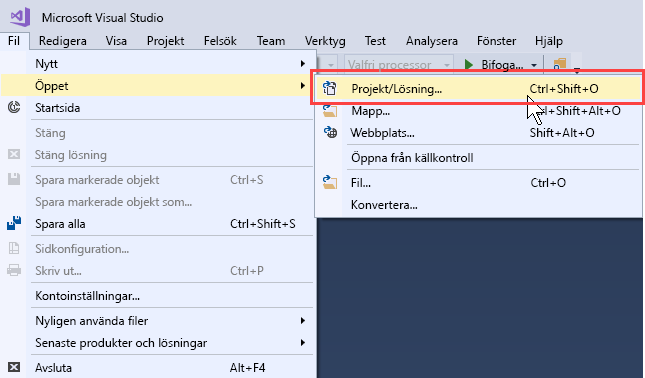
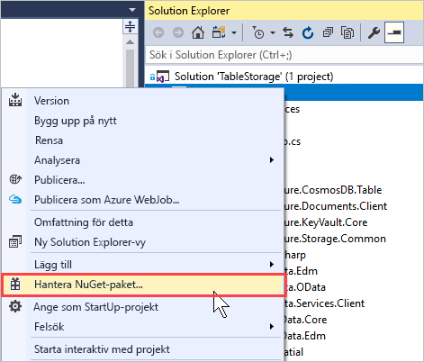
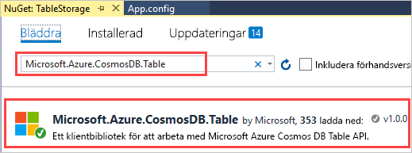
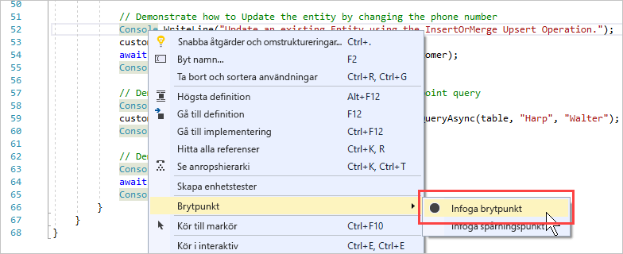
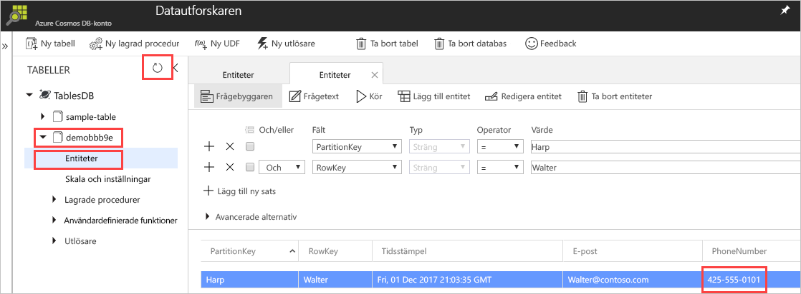

# <a name="quickstart-build-a-table-api-app-with-net-sdk-and-azure-cosmos-db"></a>Snabbstart: Skapa en tabell-API-app med .NET SDK och Azure Cosmos DB 

> [!div class="op_single_selector"]
> * [NET](create-table-dotnet.md)
> * [Java](create-table-java.md)
> * [Node.js](create-table-nodejs.md)
> * [Python](create-table-python.md)
>  

Den här snabbstarten visar hur du använder [tabell-API](table-introduction.md) i .NET och Azure Cosmos DB för att skapa en app genom att klona ett exempel från GitHub. Den här snabbstarten visar även hur du skapar ett Azure Cosmos DB-konto och hur du använder Datautforskaren för att skapa tabeller och entiteter i den webbaserade Azure-portalen.

## <a name="prerequisites"></a>Förutsättningar

Om du inte har Visual Studio 2017 installerad kan du ladda ned och använda [Visual Studio 2017 Community Edition](https://www.visualstudio.com/downloads/) **utan kostnad**. Se till att du aktiverar **Azure-utveckling** under installationen av Visual Studio.

[!INCLUDE [quickstarts-free-trial-note](../../includes/quickstarts-free-trial-note.md)]

## <a name="create-a-database-account"></a>Skapa ett databaskonto

[!INCLUDE [cosmos-db-create-dbaccount-table](../../includes/cosmos-db-create-dbaccount-table.md)]

## <a name="add-a-table"></a>Lägg till en tabell

[!INCLUDE [cosmos-db-create-table](../../includes/cosmos-db-create-table.md)]

## <a name="add-sample-data"></a>Lägg till exempeldata

[!INCLUDE [cosmos-db-create-table-add-sample-data](../../includes/cosmos-db-create-table-add-sample-data.md)]

## <a name="clone-the-sample-application"></a>Klona exempelprogrammet

Nu ska vi klona en Table-app från GitHub, ange anslutningssträngen och köra appen. Du kommer att se hur lätt det är att arbeta med data programmässigt. 

1. Öppna en kommandotolk, skapa en ny mapp som heter git-samples och stäng sedan kommandotolken.

   ```bash
   md "C:\git-samples"
   ```

2. Öppna ett git-terminalfönster, t.ex. git bash, och använd kommandot `cd` för att ändra till den nya mappen där du vill installera exempelappen.

   ```bash
   cd "C:\git-samples"
   ```

3. Klona exempellagringsplatsen med följande kommando. Detta kommando skapar en kopia av exempelappen på din dator.

   ```bash
   git clone https://github.com/Azure-Samples/azure-cosmos-table-dotnet-core-getting-started.git
   ```
   > [!NOTE]
   > .NET standard exemplet som beskrivs i det här dokumentet fungerar med både Azure Cosmos DB Table API och Azure Table Storage. Om du vill köra exemplet som fungerar med .NET Framework 4.5, finns i den [storage-table-dotnet-getting-started](https://github.com/Azure-Samples/storage-table-dotnet-getting-started) exemplet. 


## <a name="open-the-sample-application-in-visual-studio"></a>Öppna exempelappen i Visual Studio

1. I Visual Studio: Välj **Öppna** på **Arkiv**-menyn och välj sedan **Projekt/lösning**. 

    

2. Navigera till mappen där du klonade exempelappen och öppna filen tablestorage.SLN.

## <a name="update-your-connection-string"></a>Uppdatera din anslutningssträng

Gå nu tillbaka till Azure-portalen för att hämta information om din anslutningssträng och kopiera den till appen. På så vis kan appen kommunicera med den värdbaserade databasen. 

1. I [Azure-portalen](https://portal.azure.com/) klickar du på **Anslutningssträng**. Använd knapparna på höger sida av fönstret för att kopiera **PRIMÄR ANSLUTNINGSSTRÄNG**.

   

2. Visual Studio, öppna den **Settings.json** fil. 

3. Klistra in den **primär ANSLUTNINGSSTRÄNG** från portalen i värdet StorageConnectionString. Klistra in strängen innanför citattecknen.

   ```csharp
   {
      "StorageConnectionString": "<Primary connection string from Azure portal>"
   }
   ```
   Om du använder den [.NET Framework](https://github.com/Azure-Samples/storage-table-dotnet-getting-started) exemplet bör du uppdatera den anslutningssträng som finns i den **App.config** fil.

4. Tryck på CTRL + S för att spara den **Settings.json** fil.

Du har nu uppdaterat din app med all information den behöver för att kommunicera med Azure Cosmos DB. 

## <a name="build-and-deploy-the-app"></a>Skapa och distribuera appen

1. I Visual Studio högerklickar du på den **CosmosTableSamples** projekt i **Solution Explorer** och klicka sedan på **hantera NuGet-paket**. 

   

2. I NuGet **Bläddra** skriver Microsoft.Azure.Cosmos.Table. Därmed hittas klientbiblioteket Cosmos DB Table API. Observera att det här biblioteket är för närvarande tillgängligt för .NET Framework och .NET Standard. 

   > [!NOTE]
   > Om du använder de exempel som använder .NET Framework kan du installera den *Microsoft.Azure.CosmosDB.Table*, NuGet-paketet. Om du använder .NET Framework-exempel med Azure Table Storage, förutom Cosmos DB specifika NuGet-paketet du även kräva den *Microsoft.Azure.Storage.Common* NuGet-paketet. 
   
   

3. Klicka på **installera** att installera den **Microsoft.Azure.Cosmos.Table** biblioteket. Därmed installeras Azure Cosmos DB Table API-paketet och alla beroenden.

4. När du kör hela appen, exempeldata infogas i tabellentiteten och tas bort i slutet så att du inte ser några data infogas om du kör hela exemplet. Men du kan infoga vissa brytpunkter för att visa data. Öppna BasicSamples.cs-filen och högerklicka på rad 52, Välj **brytpunkt**och välj sedan **Infoga brytpunkt**. Infoga en annan brytpunkt på rad 55.

    

5. Tryck på F5 för att köra appen. Konsolfönstret visar namnet på den nya Tabelldatabasen (i det här fallet demoa13b1) i Azure Cosmos DB. 
    
   

   När du kommer till den första brytpunkten går du tillbaka till Datautforskaren i Azure Portal. Klicka på **Uppdatera**, expandera demotabellen* och klicka på **Entiteter**. Fliken **Entiteter** till höger visar den nya entiteten som har lagts till för Walter Harp. Lägg märke till att telefonnumret för den nya entiteten är 425-555-0101.

   
    
   Om du får ett meddelande om att det inte går att hitta filen Settings.json när du kör projektet, kan du lösa det genom att lägga till följande XML-post för projektet. Högerklicka på CosmosTableSamples, Välj Redigera CosmosTableSamples.csproj och Lägg till följande itemGroup: 

   ```csharp
     <ItemGroup>
       <None Update="Settings.json">
         <CopyToOutputDirectory>PreserveNewest</CopyToOutputDirectory>
       </None>
     </ItemGroup>
   ```

6. Stäng fliken **Entiteter** i Datautforskaren.
    
7. Tryck på F5 för att köra appen till nästa brytpunkt. 

    När du kommer till brytpunkten växlar du tillbaka till Azure Portal och klickar på **Entiteter** igen för att öppna fliken **Entiteter**. Du kan nu se att telefonnumret har uppdaterats till 425-555-0105.

8. Tryck på F5 för att köra appen. 
 
   Appen lägger till entiteter som kan användas i en avancerad exempelapp som tabell-API:t inte stöder för närvarande. Appen tar sedan bort tabellen som skapats av exempelappen.

9. I konsolfönstret trycker du på Retur för att avsluta körningen av appen. 
  

## <a name="review-slas-in-the-azure-portal"></a>Granska serviceavtal i Azure-portalen

[!INCLUDE [cosmosdb-tutorial-review-slas](../../includes/cosmos-db-tutorial-review-slas.md)]

## <a name="clean-up-resources"></a>Rensa resurser

[!INCLUDE [cosmosdb-delete-resource-group](../../includes/cosmos-db-delete-resource-group.md)]

## <a name="next-steps"></a>Nästa steg

I den här snabbstarten har du fått lära dig att skapa ett Azure Cosmos DB-konto, skapa en tabell med datautforskaren och att köra en app.  Du kan nu ställa frågor mot dina data med tabell-API:t.  

> [!div class="nextstepaction"]
> [Importera tabelldata till tabell-API](table-import.md)

