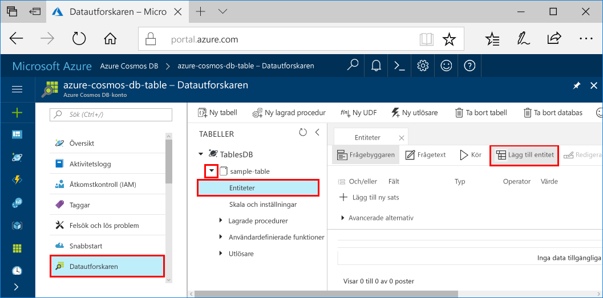
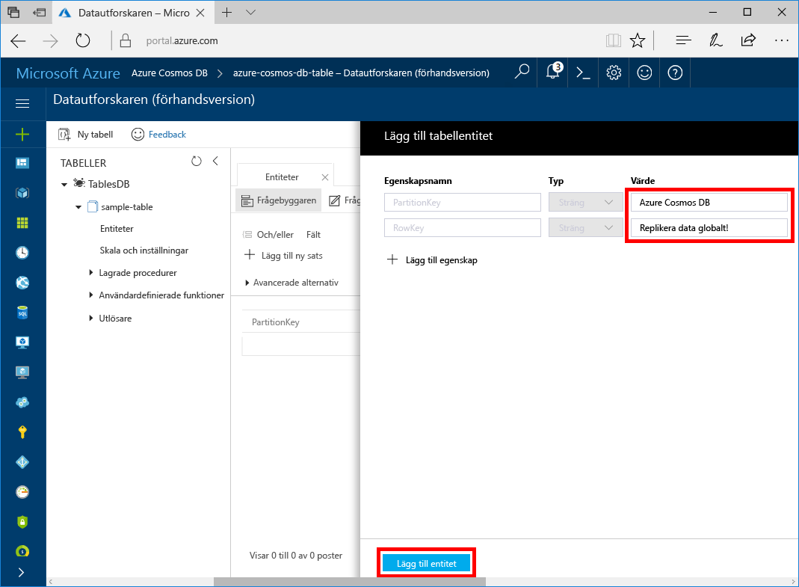

# <a name="quickstart-build-a-table-api-app-with-java-and-azure-cosmos-db"></a>Snabbstart: Skapa en tabell-API-app med Java och Azure Cosmos DB

Den här snabbstarten visar hur du använder [tabell-API](table-introduction.md) i Java och Azure Cosmos DB för att skapa en app genom att klona ett exempel från GitHub. Den här snabbstarten visar även hur du skapar ett Azure Cosmos DB-konto och hur du använder Datautforskaren för att skapa tabeller och entiteter i den webbaserade Azure-portalen.

Azure Cosmos DB är Microsofts globalt distribuerade databastjänst för flera datamodeller. Du kan snabbt skapa och ställa frågor mot databaser med dokument, nyckel/värde-par och grafer. Du får fördelar av den globala distributionen och den horisontella skalningsförmågan som ligger i grunden hos Azure Cosmos DB. 

## <a name="prerequisites"></a>Krav

[!INCLUDE [quickstarts-free-trial-note](../../includes/quickstarts-free-trial-note.md)]
[!INCLUDE [cosmos-db-emulator-docdb-api](../../includes/cosmos-db-emulator-docdb-api.md)]

Följande gäller också: 

* [Java Development Kit (JDK) 1.7+](http://www.oracle.com/technetwork/java/javase/downloads/jdk8-downloads-2133151.html)
    * I Ubuntu kör du `apt-get install default-jdk` för att installera JDK-paketet.
    * Tänk på att ställa in miljövariabeln JAVA_HOME så att den pekar på den mapp där JDK-paketet är installerat.
* [Ladda ned](http://maven.apache.org/download.cgi) och [installera](http://maven.apache.org/install.html) ett [Maven](http://maven.apache.org/)-binärarkiv
    * I Ubuntu kan du köra `apt-get install maven` för att installera Maven.
* [Git](https://www.git-scm.com/)
    * I Ubuntu kan du köra `sudo apt-get install git` för att installera Git.

## <a name="create-a-database-account"></a>Skapa ett databaskonto

> [!IMPORTANT] 
> Du måste skapa ett nytt tabell-API-konto för att arbeta med de allmänt tillgängliga tabell-API SDK:erna. Tabell-API-konton som skapas i förhandsversionen stöds inte av de allmänt tillgängliga SDK:erna.
>

[!INCLUDE [cosmos-db-create-dbaccount-table](../../includes/cosmos-db-create-dbaccount-table.md)]

## <a name="add-a-table"></a>Lägg till en tabell

[!INCLUDE [cosmos-db-create-table](../../includes/cosmos-db-create-table.md)]

## <a name="add-sample-data"></a>Lägg till exempeldata

Du kan nu lägga till data till den nya tabellen med datautforskaren.

1. Öppna Datautforskaren, expandera **sample-table**, klicka på **Entiteter** och klicka sedan på **Lägg till entitet**.

   
2. Lägg till data i värderutorna för egenskaperna PartitionKey (Partitionsnyckel) och RowKey (Radnyckel) och klicka på **Lägg till entitet**.

   
  
    Du kan nu lägga till fler entiteter i din tabell, redigera entiteter eller ställa frågor mot data i Datautforskaren. I Datautforskaren kan du även skala ditt dataflöde och lägga till lagrade procedurer, användardefinierade funktioner och utlösare i tabellen.

## <a name="clone-the-sample-application"></a>Klona exempelprogrammet

Nu ska vi klona en Table-app från github, ange anslutningssträngen och köra appen. Du kommer att se hur lätt det är att arbeta med data programmässigt. 

1. Öppna ett git-terminalfönster, t.ex. git bash, och använd kommandot `cd` för att ändra till en mapp där du vill installera exempelappen. 

    ```bash
    cd "C:\git-samples"
    ```

2. Klona exempellagringsplatsen med följande kommando. Detta kommando skapar en kopia av exempelappen på din dator. 

    ```bash
    git clone https://github.com/Azure-Samples/storage-table-java-getting-started.git 
    ```

## <a name="update-your-connection-string"></a>Uppdatera din anslutningssträng

Gå nu tillbaka till Azure Portal för att hämta information om din anslutningssträng och kopiera den till appen. På så vis kan appen kommunicera med den värdbaserade databasen. 

1. I [Azure-portalen](http://portal.azure.com/) klickar du på **Anslutningssträng**. 

   

2. Kopiera PRIMÄR ANSLUTNINGSSTRÄNG med hjälp av kopieringsknappen till höger.

3. Öppna config.properties i mappen C:\git-samples\storage-table-java-getting-started\src\main\resources. 

5. Kommentera ut rad ett och avkommentera rad två. De två första raderna bör nu se ut så här.

    ```
    #StorageConnectionString = UseDevelopmentStorage=true
    StorageConnectionString = DefaultEndpointsProtocol=https;AccountName=[ACCOUNTNAME];AccountKey=[ACCOUNTKEY]
    ```

6. Klistra in PRIMÄR ANSLUTNINGSSTRÄNG från portalen i värdet StorageConnectionString på rad 2. 

    > [!IMPORTANT]
    > Om slutpunkten använder documents.azure.com innebär det att du har ett förhandsversionskonto, och du måste skapa ett [nytt tabell-API-konto](#create-a-database-account) för att kunna arbeta med den allmänt tillgängliga SDK:n för tabell-API.
    >

7. Spara filen config.properties.

Du har nu uppdaterat appen med all information som behövs för kommunikation med Azure Cosmos DB. 

## <a name="run-the-app"></a>Kör appen

1. I git-terminalfönstret lägger du till `cd` framför mappen storage-table-java-getting-started.

    ```git
    cd "C:\git-samples\storage-table-java-getting-started"
    ```

2. I git-terminalfönstret kör du följande kommandon för att starta Java-programmet.

    ```git
    mvn compile exec:java 
    ```

    Konsolfönstret visar de data som läggs till i den nya tabelldatabasen i Azure Cosmos DB.

    Du kan nu gå tillbaka till datautforskaren och se frågan, ändra och arbeta med dessa nya data. 

## <a name="review-slas-in-the-azure-portal"></a>Granska serviceavtal i Azure Portal

[!INCLUDE [cosmosdb-tutorial-review-slas](../../includes/cosmos-db-tutorial-review-slas.md)]

## <a name="clean-up-resources"></a>Rensa resurser

[!INCLUDE [cosmosdb-delete-resource-group](../../includes/cosmos-db-delete-resource-group.md)]

## <a name="next-steps"></a>Nästa steg

I den här snabbstarten har du fått lära dig att skapa ett Azure Cosmos DB-konto, skapa en tabell med datautforskaren och att köra en app.  Du kan nu ställa frågor mot dina data med tabell-API:t.  

> [!div class="nextstepaction"]
> [Importera tabelldata till tabell-API](table-import.md)
