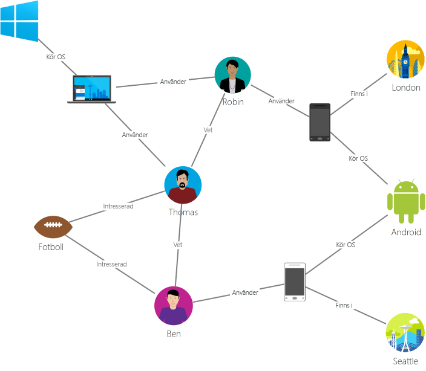
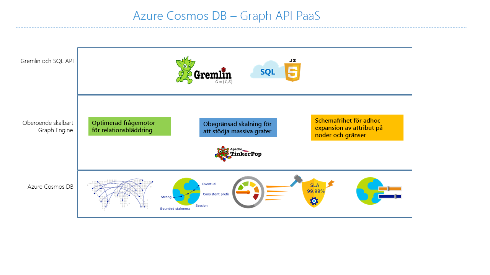

# Introduktion till Azure Cosmos DB: Graph API

[Azure Cosmos-DB](introduction.md) är globalt distribuerade, multimodel databastjänsten från Microsoft för verksamhetskritiska program. Azure Cosmos-DB tillhandahåller följande funktioner, som alla backas upp av [branschledande serviceavtal](https://azure.microsoft.com/support/legal/sla/cosmos-db/):

* [Nyckelfärdig global distribution](distribute-data-globally.md)
* [Elastisk skalbarhet av dataflöden och lagringsutrymmen](partition-data.md) över hela världen
* En siffra millisekunders latens vid 99th percentilen
* [Fem väldefinierade konsekvensnivåer](consistency-levels.md)
* Garanterat hög tillgänglighet 

Azure Cosmos DB [indexerar alla data automatiskt](http://www.vldb.org/pvldb/vol8/p1668-shukla.pdf) utan att du behöver bry dig om schema- eller indexhantering. Det är multimodel och har stöd för dokument, nyckelvärde, diagram och kolumner datamodeller.

Vi rekommenderar att du titta på nedanstående video, där Kirill Gavrylyuk förklarar hur du kommer igång med diagram på Azure Cosmos DB:

> [!VIDEO https://channel9.msdn.com/Shows/Azure-Friday/Graphs-with-Azure-Cosmos-DB-Gremlin-API/player]
> 
> 

Azure Cosmos DB Graph API innehåller:

- Diagram över modellering.
- Traversal API: er.
- Nyckelfärdig global distributionsplatsen.
- Elastisk skalbarhet av lagring och dataflöde med mindre än 10 ms läsa svarstiderna och mindre än 15 ms vid 99th percentilen.
- Automatisk indexering med snabbmeddelanden frågan tillgänglighet.
- Justerbara konsekvensnivåer.
- Omfattande SLA: er, inklusive 99,99% tillgänglighet.

Om du vill fråga Azure Cosmos DB, du kan använda den [Apache TinkerPop](http://tinkerpop.apache.org) kurva traversal språk [Gremlin](http://tinkerpop.apache.org/docs/current/reference/#graph-traversal-steps), eller andra TinkerPop-kompatibel graph-system som [Apache Spark GraphX](spark-connector-graph.md).

Den här artikeln innehåller en översikt över Azure Cosmos DB Graph API och förklarar hur du kan använda den för att lagra massiv diagram med miljarder hörn och kanter. Du kan fråga diagram med millisekunds fördröjning och enkelt utvecklas diagrammet struktur och schema.

## Diagram-databas
Data är som det visas i verkligheten naturligt kopplade. Traditionella modellering fokuserar på enheter. För många program krävs också en modell eller modell både enheter och relationer naturligt.

En [diagram](http://mathworld.wolfram.com/Graph.html) är en struktur som består av [formhörnen](http://mathworld.wolfram.com/GraphVertex.html) och [kanter](http://mathworld.wolfram.com/GraphEdge.html). Både formhörnen och kanter kan ha ett godtyckligt antal egenskaper. Formhörnen betecknar diskreta objekt, till exempel en person, en plats eller en händelse. Kanter anger relationer mellan formhörnen. Till exempel kan en person känna av en annan person, vara inblandad i en händelse och nyligen använts på en plats. Egenskaper för snabba och information om formhörnen och kanter. Exempel egenskaper innehåller en nod som har ett namn, ålder och kant som har en tidsstämpel och/eller en vikt. Mer formellt den här modellen kallas en [egenskapen diagram](http://tinkerpop.apache.org/docs/current/reference/#intro). Azure Cosmos-DB stöder egenskapen graph-modell.

Till exempel visar följande exempel diagram relationerna mellan personer, mobila enheter, intressen och operativsystem:

Diagram är användbar för att förstå en mängd olika datauppsättningar i vetenskap, teknik och företag. Diagrammet databaser kan du modellera och lagra diagram naturligt och effektivt, vilket gör dem användbart i många fall. Diagrammet databaser är vanligtvis NoSQL-databaser, eftersom dessa används ofta också fall måste schemaflexibilitet och snabb iteration.

Diagram erbjuder en bok och kraftfull datamodeller tekniken. Men detta ensamt är inte en tillräcklig anledning till att använda en databas i diagrammet. För många användningsområden och mönster som omfattar diagram traversals överträffar diagram traditionella SQL och NoSQL-databaser genom att i storlek. Denna skillnad i prestanda är ytterligare förökas när det rör sig över mer än en relation som friend i en vän.

Du kan kombinera snabb traversals med diagrammet databaser med graph-algoritmer som djup första sökning, breda första Sök och Dijkstras algoritmen att lösa problem i olika domäner som sociala nätverk, innehållshantering, geospatiala, och rekommendationer.

## Planeten skala diagram med Azure Cosmos DB
Azure Cosmos-DB är en helt hanterad graph-databas som erbjuder global distributionsplatsen, elastisk skalbarhet av lagring och dataflöde, automatisk indexering och fråga, justerbara konsekvensnivåer och stöd för TinkerPop standard.

Azure Cosmos-DB erbjuder följande differentierade funktioner jämfört med andra diagram databaser på marknaden:

* Elastiska och skalbara dataflöden och lagring

 Diagram i verkligheten behöver bortom kapaciteten för en enskild server. Med Azure Cosmos DB kan du skala ditt diagram sömlöst över flera servrar. Du kan även skala genomflödet av diagrammet oberoende baserat på ditt åtkomstmönster. Azure Cosmos-DB stöder graph-databaser som kan skalas till praktiskt taget obegränsade lagringsstorlekar och etablerat dataflöde.

* Flera regioner replikering

 Azure Cosmos-DB replikerar transparent graph-data till alla områden som du har kopplat till ditt konto. Replikering kan du utveckla program som kräver global åtkomst till data. Det finns kompromisser i områden som konsekvens, tillgänglighet, prestanda och att motsvarande garantier. Azure Cosmos-DB tillhandahåller transparent regional växling vid fel med flera API: er. Du kan skala dataflöden och lagringsutrymmen Elastiskt världen.

* Snabb frågor och traversals med välbekanta Gremlin syntax

 Lagra heterogena hörn och kanter och fråga dokumenten via en bekant Gremlin syntax. Azure Cosmos-DB använder en samtidig frigöra lås, loggstrukturerad indexeringsteknik för att automatiskt indexerar allt innehåll. Den här funktionen möjliggör omfattande förfrågningar i realtid och traversals utan att behöva ange schematips, sekundärindex eller vyer. Läs mer i [fråga diagram med hjälp av Gremlin](gremlin-support.md).

* Helt förvaltad

 Azure Cosmos-DB eliminerar behovet av att hantera databasen och datorresurser. Som en helt hanterad Microsoft Azure-tjänst inte behöver hantera virtuella datorer, distribuera och konfigurera programvara, hantera skalning eller hantera komplexa datanivå uppgraderingar. Varje diagram säkerhetskopieras och skyddas mot regionala fel automatiskt. Du kan enkelt lägga till ett Azure DB som Cosmos-konto och etablera kapacitet när du behöver den så att du kan fokusera på ditt program i stället för att använda och hantera din databas.

* Automatisk indexering

 Standard Azure Cosmos DB automatiskt indexerar alla egenskaper i noder och kanter i diagrammet och inte förväntar sig eller kräver något schema eller att sekundärindex.

* Kompatibilitet med Apache TinkerPop

 Azure Cosmos-DB inbyggt stöd för öppen källkod Apache TinkerPop-standarden och kan integreras med andra diagram TinkerPop-aktiverade system. Du kan därför enkelt migrera från en annan graph-databas, exempel Titan eller Neo4j, eller använda Azure Cosmos DB med diagrammet analytics ramverk som [Apache Spark GraphX](spark-connector-graph.md).

* Justerbara konsekvensnivåer

 Välj fem väldefinierade konsekvensnivåer för optimala förhållandet mellan konsekvens och prestanda. Azure Cosmos DB erbjuder fem olika konsekvensnivåer för frågor och läsåtgärder: stark, bunden utgång, session, enhetligt prefix och slutlig. Dessa detaljerade, väldefinierade konsekvensnivåerna kan du ljud kompromissa mellan konsekvens, tillgänglighet och svarstid. Läs mer om hur du [maximerar tillgänglighet och prestanda i DocumentDB med hjälp av konsekvensnivåer](consistency-levels.md).

Azure Cosmos-DB kan också använda flera modeller som dokument och diagram i samma behållare/databaser. Du kan använda en dokumentsamling för att lagra diagramdata bredvid dokument. Du kan använda både SQL-frågor via JSON och Gremlin frågor för att fråga efter samma data som ett diagram.

## Kom igång
Du kan använda Azure-kommandoradsgränssnittet (CLI), Azure PowerShell eller Azure-portalen med stöd för graph API för att skapa Azure DB som Cosmos-konton. När du har skapat konton Azure-portalen innehåller en tjänstslutpunkt som `https://<youraccount>.graphs.azure.com`, som ger en WebSocket-klientdel för Gremlin. Du kan konfigurera din TinkerPop-kompatibla verktyg som den [Gremlin konsolen](http://tinkerpop.apache.org/docs/current/reference/#gremlin-console), för att ansluta till den här slutpunkten och skapa program i Java, Node.js och eventuella Gremlin klientdrivrutinen.

I följande tabell visas populära Gremlin drivrutiner som du kan använda mot Azure Cosmos DB:

| Ladda ned | Dokumentation |
| --- | --- |
| [Java](https://mvnrepository.com/artifact/com.tinkerpop.gremlin/gremlin-java) |[Gremlin JavaDoc](http://tinkerpop.apache.org/javadocs/current/full/) |
| [Node.js](https://www.npmjs.com/package/gremlin) |[Gremlin JavaScript på Github](https://github.com/jbmusso/gremlin-javascript) |
| [Gremlin konsolen](https://tinkerpop.apache.org/downloads.html) |[TinkerPop dokument](http://tinkerpop.apache.org/docs/current/reference/#gremlin-console) |

Azure Cosmos-DB tillhandahåller också ett .NET-bibliotek som har Gremlin tilläggsmetoder ovanpå det [Azure Cosmos DB SDK](documentdb-sdk-dotnet.md) via NuGet. Det här biblioteket innehåller en Gremlin ”pågående”-server som du kan använda för att ansluta direkt till DocumentDB datapartitioner.

| Ladda ned | Dokumentation |
| --- | --- |
| [.NET](https://www.nuget.org/packages/Microsoft.Azure.Graphs/) |[Microsoft.Azure.Graphs](https://msdn.microsoft.com/library/azure/dn948556.aspx) |

Med hjälp av den [Azure Cosmos DB emulatorn](local-emulator.md), du kan använda .NET Graph API ovan för att utveckla och testa lokalt utan att skapa en Azure-prenumeration eller kostnader. När du är nöjd med hur programmet fungerar i emulatorn kan växla du till med ett Azure DB som Cosmos-konto i molnet.

> [!NOTE]
> Stöd för att validera Gremlin frågor mot [Azure Cosmos DB emulatorn](local-emulator.md) är bara tillgängliga via .NET Graph API.

## Scenarier för diagram stöd för Azure Cosmos DB
Här följer några scenarier där diagrammet stöd för Azure Cosmos DB kan användas:

* Sociala nätverk

 Genom att kombinera data om dina kunder och deras interaktioner med andra personer kan du utveckla anpassade upplevelser, förutsäga kunden beteende eller ansluter personer med andra med liknande intressen. Azure Cosmos-DB kan användas för att hantera sociala nätverk och spåra kundinställningar och data.

* Rekommendation motorer

 Det här scenariot används ofta i detaljhandel. Du kan skapa anpassade rekommendationer genom att kombinera information om produkter, användare och användarinteraktioner som köp, bläddra eller klassificeringen av ett objekt. Låg latens, elastisk skalbarhet och intern diagrammet stöd för Azure Cosmos DB är idealisk för modellering dessa interaktioner.

* Geospatial

 Många program i telekommunikation logistik och planera din resa måste du hitta en plats av intresse inom ett område eller hitta den kortaste/optimala vägen mellan två platser. Azure Cosmos-DB är en fysisk anpassning för dessa problem.

* Internet of Things

 Du kan skapa en bättre förståelse av status för enheterna och tillgångar med nätverks- och anslutningar mellan IoT-enheter som modellerats som ett diagram. Du kan också veta hur ändringar i en del av nätverket kan potentiellt påverkar en annan del.

## Nästa steg
Mer information om graph-stöd i Azure Cosmos DB finns:

* Kom igång med den [Azure Cosmos DB diagrammet kursen](create-graph-dotnet.md).
* Lär dig mer om hur du [fråga diagram i Azure Cosmos-databasen med hjälp av Gremlin](gremlin-support.md).
