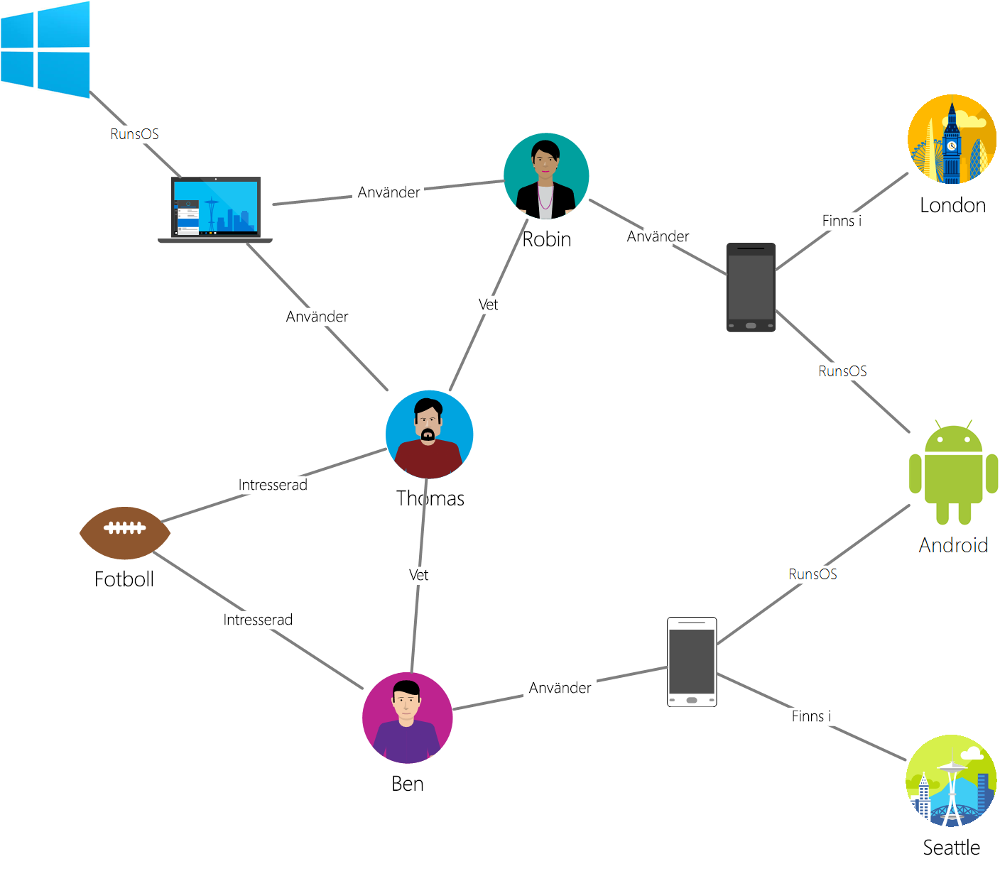

# <a name="azure-cosmos-db-gremlin-graph-support"></a>Stöd för Azure Cosmos DB Gremlin diagram
Har stöd för Azure Cosmos-DB [Apache Tinkerpop](http://tinkerpop.apache.org) kurva traversal språk [Gremlin](http://tinkerpop.apache.org/docs/current/reference/#graph-traversal-steps), vilket är en Graph API för att skapa diagram entiteter och utför åtgärder i diagrammet frågan. Du kan använda Gremlin språk för att skapa diagram entiteter (formhörnen och kanter), ändra egenskaper i dessa enheter, utföra frågor och traversals och ta bort enheter. 

Azure Cosmos-DB ger funktioner för enterprise-redo för graph-databaser. Detta inkluderar global distributionsplatsen, oberoende skalning av lagring och dataflöde, förutsägbar en siffra millisekunders latens automatisk indexering servicenivåavtal, läsa tillgänglighet för databasen konton utsträckning två eller flera Azure-regioner. Eftersom Azure Cosmos DB stöder TinkerPop/Gremlin kan migrera du enkelt program som skrivits med en annan graph-databas utan att behöva göra kodändringar. Dessutom tack vare stöd för Gremlin Azure Cosmos DB smidigt kan integreras med TinkerPop-aktiverade analytics ramverk som [Apache Spark GraphX](http://spark.apache.org/graphx/). 

Vi ger en snabb genomgång av Gremlin i den här artikeln och räkna upp Gremlin funktioner och åtgärder som stöds i förhandsversionen av Graph API-stöd.

## <a name="gremlin-by-example"></a>Gremlin efter exempel
Nu ska vi använda ett diagram som exempel för att förstå hur frågor kan uttryckas i Gremlin. Följande bild visar ett affärsprogram som hanterar data om användare, enheter i form av ett diagram.  

 

Det här diagrammet innehåller följande vertex (kallas ”etikett” i Gremlin):

- Personer: diagrammet har tre personer Robin, Thomas och Ben
- Intressen: deras intressen, i det här exemplet Football spel
- : De enheter som de flesta använder
- Operativsystem: de operativsystem som enheterna som körs på

Vi representerar relationerna mellan dessa enheter via följande edge typer/etiketter:

- Vet: till exempel ”Thomas vet Robin”
- Berörda: Representerar intresse för personerna i vår diagram, till exempel ”Ben är intresserad av Football”
- RunsOS: Bärbara datorer kör Windows-Operativsystemet
- Användning: Representerar vilken enhet som en person som använder. Robin använder exempelvis en Motorola telefon med serienummer 77

Kör vi några åtgärder mot det här diagrammet med den [Gremlin konsolen](http://tinkerpop.apache.org/docs/current/reference/#gremlin-console). Du kan också utföra dessa åtgärder med hjälp av Gremlin drivrutiner i plattformen önskat (Java, Node.js, Python eller .NET).  Innan vi tittar på det här stöds i Azure Cosmos DB ska vi titta på några exempel för att bekanta dig med syntax.

Först ska vi titta på CRUD. Följande instruktion Gremlin infogar ”Thomas” vertex i diagrammet:

```
:> g.addV('person').property('id', 'thomas.1').property('firstName', 'Thomas').property('lastName', 'Andersen').property('age', 44)
```

Därefter infogar följande Gremlin instruktionen en ”vet” kant mellan Thomas och Robin.

```
:> g.V('thomas.1').addE('knows').to(g.V('robin.1'))
```

Följande fråga returnerar ”person” formhörnen i fallande ordning med deras förnamn:
```
:> g.V().hasLabel('person').order().by('firstName', decr)
```

Om diagram skiner är när du behöver för att besvara som frågor ”vilka operativsystem vänners Thomas använder”?. Du kan köra den här enkla Gremlin traversal för att hämta informationen från diagrammet:

```
:> g.V('thomas.1').out('knows').out('uses').out('runsos').group().by('name').by(count())
```
Nu ska vi titta på Azure Cosmos DB tillhandahåller för Gremlin utvecklare.

## <a name="gremlin-features"></a>Gremlin funktioner
TinkerPop är en standard som omfattar en mängd olika tekniker för diagrammet. Därför har standard terminologi som beskriver vilka funktioner som tillhandahålls av en provider i diagrammet. Azure Cosmos-DB tillhandahåller en beständig, hög samtidighet, skrivbara graph-databas som kan vara partitionerad över flera servrar eller kluster. 

I följande tabell visas funktionerna TinkerPop som implementeras av Azure Cosmos DB: 

| Kategori | Azure DB Cosmos-implementering |  Anteckningar | 
| --- | --- | --- |
| Diagram-funktioner | Ger beständighet och ConcurrentAccess i förhandsgranskningen. Stöder transaktioner | Datorn metoder kan implementeras via Spark-koppling. |
| Variabeln funktioner | Stöder boolesk, heltal, Byte, Double, Float, Integer, Long, sträng | Har stöd för primitiva typer, är kompatibel med komplexa typer via datamodellen |
| Vertex funktioner | Stöder RemoveVertices, MetaProperties, AddVertices, MultiProperties, StringIds, UserSuppliedIds, AddProperty, RemoveProperty  | Har stöd för att skapa, ändra och ta bort formhörnen |
| Vertex egenskapen funktioner | StringIds, UserSuppliedIds, AddProperty, RemoveProperty, BooleanValues, ByteValues, DoubleValues, FloatValues, IntegerValues, LongValues, StringValues | Har stöd för att skapa, ändra och ta bort vertex egenskaper |
| Edge-funktioner | AddEges, RemoveEdges, StringIds, UserSuppliedIds, AddProperty, RemoveProperty | Har stöd för att skapa, ändra och ta bort kanter |
| Edge-egenskapen funktioner | Egenskaper för BooleanValues, ByteValues, DoubleValues, FloatValues, IntegerValues, LongValues, StringValues | Har stöd för att skapa, ändra och ta bort gräns egenskaper |

## <a name="gremlin-wire-format-graphson"></a>Gremlin kabelformat: GraphSON

Använder Azure Cosmos-DB i [GraphSON format](https://github.com/thinkaurelius/faunus/wiki/GraphSON-Format) när du returnerar resultat från Gremlin åtgärder. GraphSON är Gremlin standardformat för att representera formhörnen och kanter (egenskaper enkla och flera värden) med JSON. 

Följande utdrag visar exempelvis en GraphSON representation av en brytpunkt *returneras till klienten* från Azure Cosmos-databasen. 

```json
  {
    "id": "a7111ba7-0ea1-43c9-b6b2-efc5e3aea4c0",
    "label": "person",
    "type": "vertex",
    "outE": {
      "knows": [
        {
          "id": "3ee53a60-c561-4c5e-9a9f-9c7924bc9aef",
          "inV": "04779300-1c8e-489d-9493-50fd1325a658"
        },
        {
          "id": "21984248-ee9e-43a8-a7f6-30642bc14609",
          "inV": "a8e3e741-2ef7-4c01-b7c8-199f8e43e3bc"
        }
      ]
    },
    "properties": {
      "firstName": [
        {
          "value": "Thomas"
        }
      ],
      "lastName": [
        {
          "value": "Andersen"
        }
      ],
      "age": [
        {
          "value": 45
        }
      ]
    }
  }
```

De egenskaper som används av GraphSON för formhörnen är följande:

| Egenskap | Beskrivning |
| --- | --- |
| id | ID för vertex. Måste vara unika (i kombination med värdet av _partition om tillämpligt) |
| Etikett | Etiketten för vertex. Detta är valfria och används för att beskriva entitetstypen. |
| typ | För att särskilja formhörnen från icke-diagram-dokument |
| properties | Egenskapsuppsättning med associerade vertex användardefinierade egenskaper. Varje egenskap kan ha flera värden. |
| _partition (konfigureras) | Partitionsnyckeln för vertex. Kan användas för att skala ut diagram till flera servrar |
| outE | Innehåller en lista över ut kanter från en nod. Lagra angränsande information med vertex möjliggör snabb körning av traversals. Kanter är grupperade baserat på deras etiketter. |

Och kanten innehåller följande information för att underlätta navigeringen till andra delar av diagrammet.

| Egenskap | Beskrivning |
| --- | --- |
| id | ID för kant. Måste vara unika (i kombination med värdet av _partition om tillämpligt) |
| Etikett | Etiketten för kant. Den här egenskapen är valfria och används för att beskriva relationstypen. |
| inV | Innehåller en lista över på formhörnen för en kant. Lagra informationen angränsande med kanten möjliggör snabb körning av traversals. Formhörnen är grupperade baserat på deras etiketter. |
| properties | Egenskapsuppsättning för användardefinierade egenskaper som är associerade med gränsen. Varje egenskap kan ha flera värden. |

Varje egenskap kan lagra flera värden i en matris. 

| Egenskap | Beskrivning |
| --- | --- |
| värde | Värdet på egenskapen

## <a name="gremlin-partitioning"></a>Gremlin partitionering

I Azure Cosmos DB diagram lagras i behållare som kan skalas oberoende vad gäller lagring och genomströmning (uttryckt i normaliserade begäranden per sekund). Varje behållare måste definiera en valfri men rekommenderad partition nyckelegenskapen som anger en logisk partition gräns för relaterade data. Varje vertex/kanten måste ha en `id` egenskap som är unik för entiteter i partitionen nyckelvärdet. Vad som beskrivs i [partitionering i Azure Cosmos DB](partition-data.md).

Gremlin åtgärderna fungerar sömlöst över diagramdata som sträcker sig över flera partitioner i Azure Cosmos-databasen. Det rekommenderas dock att välja en partitionsnyckel för ditt diagram som ofta används som filter i frågor har flera separata värden och liknande frekvensen för åtkomst till dessa värden. 

## <a name="gremlin-steps"></a>Gremlin steg
Nu ska vi titta på Gremlin stegen som stöds av Azure Cosmos DB. En fullständig referens om Gremlin finns [TinkerPop referens](http://tinkerpop.apache.org/docs/current/reference).

| Steg | Beskrivning | TinkerPop 3.2-dokumentation | Anteckningar |
| --- | --- | --- | --- |
| `addE` | Lägger till en kant mellan två formhörnen | [addE steg](http://tinkerpop.apache.org/docs/current/reference/#addedge-step) | |
| `addV` | Lägger till en nod i diagrammet | [addV steg](http://tinkerpop.apache.org/docs/current/reference/#addvertex-step) | |
| `and` | Garanterar att alla traversals returnera ett värde | [och steg](http://tinkerpop.apache.org/docs/current/reference/#and-step) | |
| `as` | Ett steg modulator att tilldela en variabel till utdata från ett steg | [steg](http://tinkerpop.apache.org/docs/current/reference/#as-step) | |
| `by` | Ett steg modulator som används med `group` och`order` | [för steg](http://tinkerpop.apache.org/docs/current/reference/#by-step) | |
| `coalesce` | Returnerar den första traversal som returnerar ett resultat | [sammanslagning av steg](http://tinkerpop.apache.org/docs/current/reference/#coalesce-step) | |
| `constant` | Returnerar ett konstant värde. Används med`coalesce`| [konstant steg](http://tinkerpop.apache.org/docs/current/reference/#constant-step) | |
| `count` | Returnerar antalet från övergången | [antal steg](http://tinkerpop.apache.org/docs/current/reference/#count-step) | |
| `dedup` | Returnerar värden med borttagna dubbletter | [dedupliceringen steg](http://tinkerpop.apache.org/docs/current/reference/#dedup-step) | |
| `drop` | Släpper värden (vertex/kant) | [ta bort steg](http://tinkerpop.apache.org/docs/current/reference/#drop-step) | |
| `fold` | Fungerar som en barriären som beräknar aggregering av resultat| [vikning steg](http://tinkerpop.apache.org/docs/current/reference/#fold-step) | |
| `group` | Grupper värden baserat på etiketter för angivna| [grupp steg](http://tinkerpop.apache.org/docs/current/reference/#group-step) | |
| `has` | Används för att filtrera egenskaper, formhörnen och kanter. Stöder `hasLabel`, `hasId`, `hasNot`, och `has` varianter. | [har steg](http://tinkerpop.apache.org/docs/current/reference/#has-step) | |
| `inject` | Mata in värden i en dataström| [mata in steg](http://tinkerpop.apache.org/docs/current/reference/#inject-step) | |
| `is` | Används för att utföra ett filter som använder ett booleskt uttryck | [är steg](http://tinkerpop.apache.org/docs/current/reference/#is-step) | |
| `limit` | Används för att begränsa antalet objekt i övergången| [gränsen steg](http://tinkerpop.apache.org/docs/current/reference/#limit-step) | |
| `local` | Lokal packar en del av en överträdelse liknar en underfråga | [lokala steg](http://tinkerpop.apache.org/docs/current/reference/#local-step) | |
| `not` | Används för att producera negationer av ett filter | [inte steg](http://tinkerpop.apache.org/docs/current/reference/#not-step) | |
| `optional` | Returnerar resultatet av den angivna traversal om den ger ett resultat annars returnerar den anropande elementet | [valfritt steg](http://tinkerpop.apache.org/docs/current/reference/#optional-step) | |
| `or` | Garanterar att minst en av traversals returnerar ett värde | [eller -steg](http://tinkerpop.apache.org/docs/current/reference/#or-step) | |
| `order` | Returnerar resultat i den angivna sorteringsordningen | [ordning steg](http://tinkerpop.apache.org/docs/current/reference/#order-step) | |
| `path` | Returnerar den fullständiga sökvägen till övergången | [sökvägen steg](http://tinkerpop.apache.org/docs/current/reference/#path-step) | |
| `project` | Projekt egenskaper som en karta | [projektet steg](http://tinkerpop.apache.org/docs/current/reference/#project-step) | |
| `properties` | Returnerar egenskaperna för de angivna etiketterna | [Egenskaper för-steg](http://tinkerpop.apache.org/docs/current/reference/#properties-step) | |
| `range` | Filter för att det angivna intervallet för värden| [intervallet steg](http://tinkerpop.apache.org/docs/current/reference/#range-step) | |
| `repeat` | Upprepar steget för det angivna antalet gånger. Används för upprepning | [Upprepa steg](http://tinkerpop.apache.org/docs/current/reference/#repeat-step) | |
| `sample` | För exempel på resultat från övergången | [exempel steg](http://tinkerpop.apache.org/docs/current/reference/#sample-step) | |
| `select` | Används för att projektresultat från övergången |  [Välj steg](http://tinkerpop.apache.org/docs/current/reference/#select-step) | |
| `store` | Används för icke-blockerande mängder från övergången | [lagra steg](http://tinkerpop.apache.org/docs/current/reference/#store-step) | |
| `tree` | Sammanställd sökvägar från en nod i ett träd | [trädet steg](http://tinkerpop.apache.org/docs/current/reference/#tree-step) | |
| `unfold` | Unroll en iterator som ett steg| [vika steg](http://tinkerpop.apache.org/docs/current/reference/#unfold-step) | |
| `union` | Sammanfoga resultat från flera traversals| [Union steg](http://tinkerpop.apache.org/docs/current/reference/#union-step) | |
| `V` | Innehåller steg som krävs för traversals mellan hörn och kanter `V`, `E`, `out`, `in`, `both`, `outE`, `inE`, `bothE`, `outV`, `inV`, `bothV`, och `otherV` för | [Vertex steg](http://tinkerpop.apache.org/docs/current/reference/#vertex-steps) | |
| `where` | Används för att filtrera resultat från övergången. Stöder `eq`, `neq`, `lt`, `lte`, `gt`, `gte`, och `between` operatörer  | [steg där](http://tinkerpop.apache.org/docs/current/reference/#where-step) | |

Azure Cosmos-write-optimerad databasmotor har stöd för automatisk indexering av alla egenskaper i formhörnen och kanter som standard. Därför frågor med filter kan variera frågor, sortering eller mängder om en egenskap bearbetas från indexet och hanteras effektivt. Mer information om hur indexering fungerar i Azure Cosmos-databasen finns på vår [schema-oberoende indexering](http://www.vldb.org/pvldb/vol8/p1668-shukla.pdf).

## <a name="next-steps"></a>Nästa steg
* Komma igång med att skapa ett program i diagrammet [med hjälp av vår SDK](create-graph-dotnet.md) 
* Lär dig mer om [Azure Cosmos DB graph-support](graph-introduction.md)
