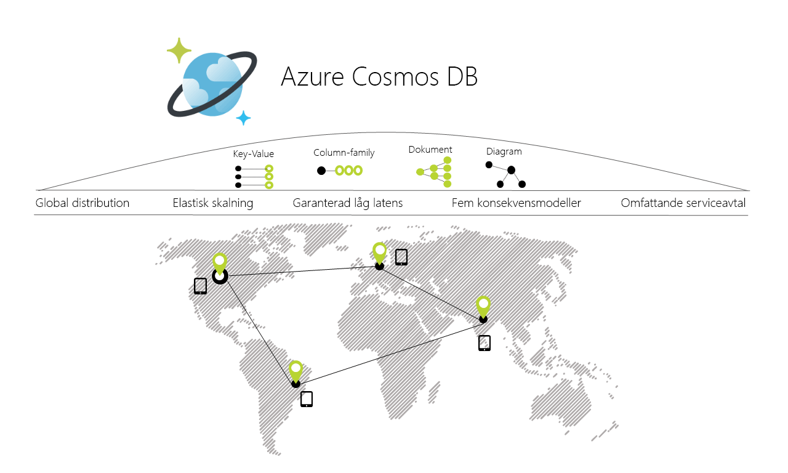

# Välkommen till Azure Cosmos DB

Azure Cosmos DB är Microsofts globalt distribuerade databas för flera datamodeller. Med ett knappklick, låter Azure DB Cosmos dig att elastiskt och oberoende skala dataflöde och lagring över valfritt antal av Azures geografiska regioner. Det erbjuder garantier när det gäller dataflöde, svarstider, tillgänglighet och konsekvens med omfattande [serviceavtal](https://aka.ms/acdbsla) (SLA:er) något som ingen annan databastjänst kan erbjuda. Du kan [Testa Azure Cosmos DB kostnadsfritt](https://azure.microsoft.com/try/cosmosdb/) utan en Azure-prenumeration, utan kostnad och åtaganden.

> [!div class="nextstepaction"]
> [Testa Azure Cosmos DB kostnadsfritt](https://azure.microsoft.com/try/cosmosdb/)

## De viktigaste funktionerna
Som en globalt distribuerad databastjänst med fler modeller gör Azure Cosmos DB det enkelt att bygga skalbara och högdynamiska program på global skala:

* **Nyckelfärdig global distribution**
    * Du kan [distribuera dina data](distribute-data-globally.md) till valfritt antal [Azure-regioner](https://azure.microsoft.com/regions/) genom att [klicka på en knapp](tutorial-global-distribution-sql-api.md). På så sätt kan du placera dina data där dina användare finns, och säkerställa minsta möjliga tidsfördröjning till dina kunder. 
    * Med hjälp av Azure Cosmos DB som har flera API:er registrerar appen alltid var den närmaste regionen finns och skickar begäranden till närmaste datacenter. Allt detta är möjligt utan konfigurationsändringar. Du ställer in skrivregion och så många skrivskyddade regioner som du vill och resten hanteras åt dig.
    * När du lägger till och tar bort regioner i Azure Cosmos DB-databasen behöver programmet inte distribueras om utan fortsätter att ha hög tillgänglighet tack vare API-funktionen med flera värdar.

* **Flera datamodeller och populära API:er för att komma åt och fråga efter data**
    * En atom-postsekvensbaserad (ARS) datamodell som Azure Cosmos DB bygger på internt stöd för flera datamodeller, inklusive men inte begränsat till dokument, diagram, nyckelvärde, tabeller och datamodeller för kolumnfamiljer.
    * API:er för följande datamodeller stöds med SDK:er som är tillgängliga på flera språk:
        * [SQL API](sql-api-introduction.md): En JSON-databasmotor utan schema med omfattande SQL-frågemöjligheter.
        * [MongoDB API](mongodb-introduction.md): En mycket skalbar *MongoDB som en tjänst* som drivs på Azure Cosmos DB-plattformen. Kompatibel med befintliga bibliotek, drivrutiner, verktyg och program för MongoDB.
        * [Cassandra API](cassandra-introduction.md): En globalt distribuerad Cassandra som en tjänst som drivs på Azure Cosmos DB-plattformen. Kompatibel med befintliga bibliotek, drivrutiner, verktyg och program för [Apache Cassandra](https://cassandra.apache.org/).
        * [Gremlin API](graph-introduction.md): En fullständigt hanterad, vågrätt skalbar grafdatabastjänst som gör det enkelt att skapa och köra program som fungerar med mycket anslutna datauppsättningar med stöd för Open Graph-API:er (baserade på [Apache TinkerPop-specifikationen](http://tinkerpop.apache.org/), Apache Gremlin).
        * [Tabell-API](table-introduction.md): En nyckel/värde-databastjänst som skapats för att tillhandahålla premium-funktioner (till exempel automatisk indexering, garanteras snabb svarstid, global distribution) till befintliga Azure Table Storage-program utan att göra några ändringar i appen.
        * Ytterligare datamodeller och API:er kommer snart!

* **Skala dataflöde och lagring elastiskt och oberoende på begäran över hela världen**
    * Skala enkelt databasflödet med [sekundprecision](request-units.md) och ändra inställningarna när som helst. 
    * Skala lagringsutrymmet [transparent och automatiskt](partition-data.md) för att hantera utrymmesbehoven nu och för all framtid.

* **Bygg högdynamiska och verksamhetskritiska program**
    * Azure Cosmos DB garanterar sina kunder svarstider från slutpunkt till slutpunkt som ligger inom den 99:e percentilen. 
    * För ett typiskt 1 kB-objekt garanterar Cosmos DB en svarstid på läsningar från slutpunkt till slutpunkt på under 10 ms och indexerade skrivningar under 15 ms i den 99:e percentilen, inom samma Azure-region. Median-svarstiderna är betydligt lägre (under 5 ms).

* **Se till att tillgängligheten alltid är så hög som möjligt**
    * Serviceavtal med 99,99 % tillgänglighet för alla databaskonton i en region och 99,999 % läsningstillgänglighet för alla databaskonton med tillgång till flera regioner.
    * Distribuera till valfritt antal [Azure-regioner](https://azure.microsoft.com/regions) för högre tillgänglighet och bättre prestanda.
    * Ange prioriteter dynamiskt till regioner och [simulera ett fel](regional-failover.md) i en eller flera regioner helt utan dataförlust för att testa tillgängligheten slutpunkt till slutpunkt för hela appen (inte endast databasen). 

* **Skriv globalt distribuerade program, på rätt sätt**
    * Fem väldefinierade, praktiska och intuitiva [konsekvensmodeller](consistency-levels.md) ger ett spektrum av stark SQL-liknande konsekvens hela vägen till en avslappnad NoSQL-liknande eventuell konsekvens och allt däremellan. 
  
* **Pengarna tillbaka-garanti**
    * Branschledande och omfattande [serviceavtal](https://aka.ms/acdbsla) (SLA) med ekonomisk garanti för tillgänglighet, svarstid, dataflöde och konsekvens för dina verksamhetskritiska data. 

* **Ingen hantering av databasscheman/-index**
    * Iterera snabbt schemat för ditt program utan att behöva oroa dig om hantering av databasschema och/eller index.
    * Azure Cosmos DB:s databasmotor är fullständigt schemaoberoende. Den indexerar automatiskt alla data den tar in utan att kräva något schema eller index och hanterar frågor blixtsnabbt. 

* **Låg totalkostnad**
    * Fem till tio gånger [mer kostnadseffektivt](https://aka.ms/cosmos-db-tco-paper) än en icke-hanterad lösning eller en lokal NoSQL-lösning.
    * Tre gånger billigare än AWS DynamoDB eller Google Spanner.

## Jämförelse av funktioner

Azure Cosmos DB erbjuder de bästa funktionerna för traditionella relations- och icke-relationsdatabaser.

| Funktioner | Relationsdatabaser   | Icke-relationella databaser (NoSQL) |    Azure Cosmos DB |
| --- | --- | --- | --- |
| Global distribution | Nej | Nej | Ja, nyckelfärdig distribution i fler än 30 områden, med flera API: er|
| Horisontell skalning | Nej | Ja | Ja, oberoende skalning av lagring och dataflöde är möjligt | 
| Svarstidsgarantier | Nej | Ja | Ja, 99 % läsningar på < 10 ms och skrivningar på < 15 ms | 
| Hög tillgänglighet | Nej | Ja | Ja, Azure Cosmos DB är alltid aktiverat, har väldefinierade PACELC-kompromisser och erbjuder alternativ för automatisk och manuell redundans vid fel|
| Datamodell + API | Relations + SQL | Multi-modell + OSS API | Multi-modell + SQL + OSS API (mer kommer snart) |
| Serviceavtal | Ja | Nej | Ja, omfattande serviceavtal för svarstider, dataflöde, konsekvens och tillgänglighet |

## Lösningar som har nytta av Azure Cosmos DB

Alla [webb-, mobil-, spel- och IoT-program](use-cases.md) som behöver hantera stora mängder data-, läs- och skrivoperationer i [global](distribute-data-globally.md) skala med svarstider i nära realtid för en mängd olika data drar nytta av Azure Cosmos DB:s [garanterade](https://azure.microsoft.com/support/legal/sla/cosmos-db/) höga tillgänglighet, snabba dataflöde, korta svarstider och justerbara konsekvenskontroll. Lär dig mer om hur Azure Cosmos DB kan användas på [IoT och telematik](use-cases.md#iot-and-telematics), [Handel och marknadsföring](use-cases.md#retail-and-marketing), [Spel](use-cases.md#gaming) och [Webb- och mobilprogram](use-cases.md#web-and-mobile-applications).

## Nästa steg
Kom igång med Azure Cosmos DB med någon av våra snabbstarter:

* [Komma igång med SQL-API för Azure Cosmos DB](create-sql-api-dotnet.md)
* [Kom igång med MongoDB-API för Azure Cosmos DB](create-mongodb-nodejs.md)
* [Kom igång med Cassandra-API för Azure Cosmos DB](create-cassandra-dotnet.md)
* [Komma igång med Gremlin API för Azure Cosmos DB](create-graph-dotnet.md)
* [Komma igång med Tabell-API för Azure Cosmos DB](create-table-dotnet.md)

> [!div class="nextstepaction"]
> [Testa Azure Cosmos DB kostnadsfritt](https://azure.microsoft.com/try/cosmosdb/)
