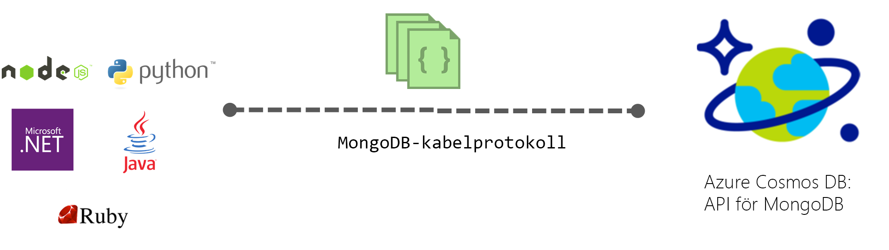

# Introduktion till Azure Cosmos DB: MongoDB API

[Azure Cosmos DB](../cosmos-db/introduction.md) är Microsofts globalt distribuerade databastjänst för flera datamodeller för verksamhetskritiska program. Azure Cosmos-DB tillhandahåller [nyckelfärdig global distributionsplatsen](distribute-data-globally.md), [elastisk skalbarhet av dataflöden och lagringsutrymmen](partition-data.md) över hela världen, en siffra millisekunders latens i 99th percentil och garanterad hög tillgänglighet, alla säkerhetskopieras av [branschledande serviceavtal](https://azure.microsoft.com/support/legal/sla/cosmos-db/). Azure Cosmos DB [indexerar alla data automatiskt](http://www.vldb.org/pvldb/vol8/p1668-shukla.pdf) utan att du behöver bry dig om schema- eller indexhantering. Det stöder flera modeller och dokument, nyckelvärde graf och kolumndatamodeller. 

 

Azure DB Cosmos-databaser kan användas som datalager för appar som skrivits för [MongoDB](https://docs.mongodb.com/manual/introduction/). Den här funktionen innebär att med hjälp av befintliga [drivrutiner](https://docs.mongodb.org/ecosystem/drivers/), ditt program som skrivits för MongoDB nu kan kommunicera med Azure Cosmos DB och använda Azure Cosmos DB databaser i stället för MongoDB-databaser. I många fall kan du växla från att använda MongoDB till Azure Cosmos DB genom att ändra en anslutningssträng. Med den här funktionen kan du enkelt skapa och köra MongoDB globalt distribuerad databasprogram i Azure-moln med Azure Cosmos DB och dess [omfattande branschledande serviceavtal](https://azure.microsoft.com/support/legal/sla/cosmos-db), medan du använder bekant kunskaper och verktyg för MongoDB.

**MongoDB kompatibilitet**: du kan använda din befintliga MongoDB kunskaper programkod och verktygsuppsättning som Azure Cosmos DB implementerar protokollet MongoDB 3.4 (version 5) under överföring och stöder de [MongoDB aggregering pipeline](mongodb-feature-support.md#aggregation-pipeline). Du kan utveckla program som använder MongoDB och distribuera dem till produktionsmiljön med helt hanterad och globalt distribuerade Azure DB som Cosmos-tjänsten.

## Vad är fördelen med att använda Azure Cosmos DB för MongoDB program?

**Elastiska och skalbara dataflöden och lagring:** uppfyller dina program behöver genom att enkelt skala uppåt eller nedåt MongoDB-databas. Dina data lagras på SSD-diskar (Solid State Disk) för korta och förutsägbara svarstider. Azure Cosmos-DB stöder MongoDB samlingar som kan skalas till praktiskt taget obegränsade lagringsstorlekar och etablerat dataflöde. Du kan skala Azure Cosmos DB elastiskt och smidigt med förutsägbara prestanda allteftersom programmet växer. 

**Flera regioner replikering:** Azure Cosmos DB transparent replikerar data till alla områden som du har kopplat till ditt konto för MongoDB, så att du kan utveckla program som kräver global åtkomst till data samtidigt som man kompromisser mellan konsekvens, tillgänglighet och prestanda, alla med motsvarande garantier. Azure Cosmos DB tillhandahåller transparent regional redundans med flera API:er, och möjligheten att elastiskt skala dataflöde och lagring i hela världen. Läs mer i [distribuera data globalt](distribute-data-globally.md).

**Inga serverhantering**: du behöver hantera och skala MongoDB-databaser. Azure Cosmos-DB är en helt hanterad tjänst, vilket innebär att du inte behöver hantera någon infrastruktur och de virtuella datorerna själv. Azure Cosmos-DB är tillgänglig i 30 + [Azure-regioner](https://azure.microsoft.com/regions/services/).

**Justerbara konsekvensnivåer:** Azure Cosmos DB implementerar MongoDB version 3.4, som har två konsekvenskontroll inställningar, starkt och eventuell för närvarande. Eftersom Azure Cosmos DB multi-api, konsekvens inställningarna tillämpas på kontonivå och verkställandet av konsekvenskontrollen styrs av varje API. Tills MongoDB 3,6 har inga begreppet sessionskonsekvens, så om du anger ett MongoDB API-konto för att använda sessionskonsekvens konsekvenskontrollen nedgraderas till klientdatorn när du använder MongoDB APIs. Om du behöver din-äger-skrivskyddad säkerhet för MongoDB-API-kontot ska vara inställd på strong konsekvenskontroll standardnivå för kontot eller avgränsas föråldrad. Läs mer om hur du [maximerar tillgänglighet och prestanda med hjälp av konsekvensnivåer](consistency-levels.md).

| Azure Cosmos DB standardnivå för konsekvenskontroll |   Mongo-API (3.4) |
|---|---|
|Eventuell| Eventuell |
|Konsekvent prefix| Eventuell konsekvent ordning |
|Session| Eventuell konsekvent ordning |
|Begränsad föråldring| Stark |
| Stark | Stark |

**Automatisk indexering**: som standard, Azure Cosmos DB indexerar automatiskt alla egenskaper i dokument i din MongoDB-databas och inte förväntar sig eller kräver något schema eller att sekundärindex. Kapacitet för unikt index möjliggör dessutom en unikhetsbegränsningen på dokumentfält som redan är auto-indexerat i Azure Cosmos-databasen.

**Enterprise-klass**: Azure Cosmos DB stöder flera lokala repliker för att leverera 99,99% tillgänglighet och dataskydd i händelse av lokala och regionala fel. Azure Cosmos-DB har enterprise-klass [kompatibilitet certifieringar](https://www.microsoft.com/trustcenter) och säkerhetsfunktioner. 

Läs mer i den här videon med Azure Cosmos DB programchef, Aleksey Savateyev.

> [!VIDEO https://channel9.msdn.com/Events/Connect/2017/T136/player]
> 

## Så här kommer du igång

Följ MongoDB-Snabbstart för att skapa ett Azure DB som Cosmos-konto och migrera dina befintliga MongoDB-programmet att använda Azure Cosmos DB eller skapa en ny:

* [Migrera en befintlig MongoDB för Node.js-webbapp](create-mongodb-nodejs.md).
* [Skapa en MongoDB API webbprogram med .NET och Azure portal](create-mongodb-dotnet.md)
* [Skapa en MongoDB-API-konsolapp med Java och Azure portal](create-mongodb-java.md)

## Nästa steg

Information om Azure Cosmos DB MongoDB API är integrerat i den övergripande dokumentationen för Azure Cosmos DB, men här följer några tips för att komma igång:

* Följ den [Anslut till ett konto med MongoDB](connect-mongodb-account.md) kursen för att lära dig hur du hämtar information om anslutningssträngar ditt konto.
* Följ den [Använd Studio 3T (MongoChef) med Azure Cosmos DB](mongodb-mongochef.md) kursen lär dig hur du skapar en anslutning mellan Azure Cosmos-DB-databas och MongoDB-app i Studio 3 T.
* Följ den [migrera data till Azure Cosmos DB med protokollet stöd för MongoDB](mongodb-migrate.md) självstudiekursen för att importera data till en API för MongoDB-databas.
* Ansluta till en API för MongoDB kontot med [Robomongo](mongodb-robomongo.md).
* Lär dig hur många RUs åtgärderna använder med den [GetLastRequestStatistics kommando och Azure portal mått](request-units.md#GetLastRequestStatistics).
* Lär dig hur du [konfigurera Läs inställningar för globalt distribuerade appar](../cosmos-db/tutorial-global-distribution-mongodb.md).
