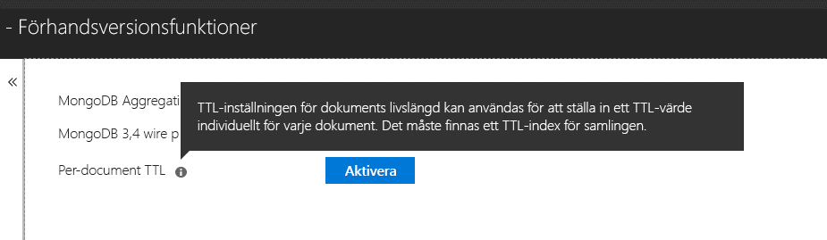

# <a name="expire-data-in-azure-cosmos-db-mongodb-api"></a>Låt data utgå i MongoDB-API:t för Azure Cosmos DB

Med time to live (TTL)-funktionen kan databasen automatiskt låta data gå ut. MongoDB API använder Azure Cosmos DB:s TTL-funktioner. Två lägen stöds: ange ett TTL-värde på hela samlingen och ange enskilda TTL-värden för varje dokument. Logik för TTL-index och TTL-värden per dokument i MongoDB API är [samma som i Azure Cosmos DB](../cosmos-db/mongodb-indexing.md).

## <a name="ttl-indexes"></a>TTL-index
Om du vill aktivera förfallodatum för dokumenten i en viss samling måste du skapa ett [TTL-index (Time to Live)](../cosmos-db/mongodb-indexing.md). Ett TTL-index är ett index för fältet _ts med värdet ”expireAfterSeconds”.

Exempel:
```JavaScript
globaldb:PRIMARY> db.coll.createIndex({"_ts":1}, {expireAfterSeconds: 10})
{
        "_t" : "CreateIndexesResponse",
        "ok" : 1,
        "createdCollectionAutomatically" : true,
        "numIndexesBefore" : 1,
        "numIndexesAfter" : 4
}
```

Kommandot i exemplet ovan skapar ett index med TTL-funktioner. När indexet har skapats kommer databasen automatiskt att ta bort alla dokument i samlingen som inte har ändrats de senaste 10 sekunderna. 

> [!NOTE]
> **_ts** är ett fält som är unikt för Cosmos DB och det går inte att använda med MongoDB-klienter. Det är en reserverad (system)egenskap som innehåller tidsstämpeln för senaste ändringen av dokumentet.
>
    
Dessutom, ett C#-exempel: 

```csharp
var options = new CreateIndexOptions {ExpireAfter = TimeSpan.FromSeconds(10)}; 
var field = new StringFieldDefinition<BsonDocument>("_ts"); 
var indexDefinition = new IndexKeysDefinitionBuilder<BsonDocument>().Ascending(field); 
await collection.Indexes.CreateOneAsync(indexDefinition, options); 
``` 

## <a name="set-time-to-live-value-for-a-document"></a>Ange TTL-värde för ett dokument 
TTL-värden per dokument stöds också. Dokumenten måste innehålla en rotnivåegenskap ”ttl” (gemener) och ett TTL-index enligt beskrivningen ovan måste ha skapats för samlingen. TTL-värden som anges i ett dokument åsidosätter samlingens TTL-värde.

TTL-värdet måste vara ett int32. Du kan också använda ett int64 som passar i int32 eller dubbelt med någon decimaldel som passar i int32. Värdena för TTL-egenskapen som inte överensstämmer med dessa specifikationer tillåts men behandlas inte som ett beskrivande dokument-TTL-värde.

TTL-värdet för dokumentet är valfritt. Dokument utan ett TTL-värde kan infogas i samlingen.  I det här fallet respekteras samlingens TTL-värde. 

Följande dokument har giltiga TTL-värden. När dokumenten är infogat används dokumentets TTL-värden istället för samlingens TTL-värden. Därför tas dokumenten bort efter 20 sekunder.  

```JavaScript 
globaldb:PRIMARY> db.coll.insert({id:1, location: "Paris", ttl: 20.0}) 
globaldb:PRIMARY> db.coll.insert({id:1, location: "Paris", ttl: NumberInt(20)}) 
globaldb:PRIMARY> db.coll.insert({id:1, location: "Paris", ttl: NumberLong(20)}) 
```

Följande dokument har ogiltiga TTL-värden. Dokumenten kommer att infogas men dokument-TTL-värdet kommer inte att gälla. Därför tas dokumenten bort efter 10 sekunder på grund av samlingens TTL-värde. 

```JavaScript 
globaldb:PRIMARY> db.coll.insert({id:1, location: "Paris", ttl: 20.5}) //TTL value contains non-zero decimal part. 
globaldb:PRIMARY> db.coll.insert({id:1, location: "Paris", ttl: NumberLong(2147483649)}) //TTL value is greater than Int32.MaxValue (2,147,483,648). 
``` 

## <a name="how-to-activate-the-per-document-ttl-feature"></a>Så här aktiverar du TTL-funktionen per dokument
FunktionenTTL-värde per dokument kan aktiveras via API MongoDB-kontots ”förhandsgranskningsfunktioner” i Azure-portalen.

 

## <a name="next-steps"></a>Nästa steg
* [Ta bort data från Azure Cosmos DB-samlingarna automatiskt med hjälp av förfallodatum](../cosmos-db/time-to-live.md)
* [Indexering i MongoDB-API:t för Azure Cosmos DB](../cosmos-db/mongodb-indexing.md)
