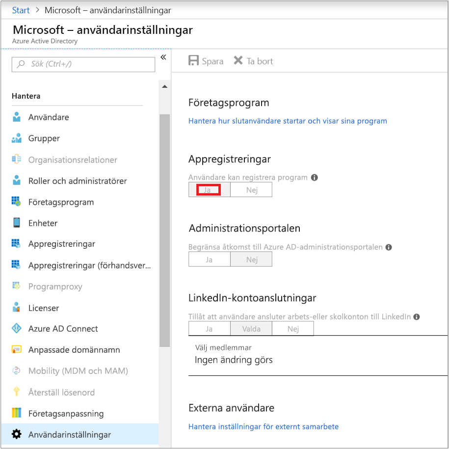
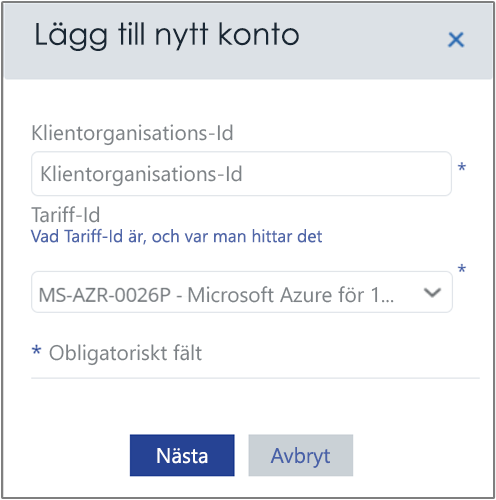
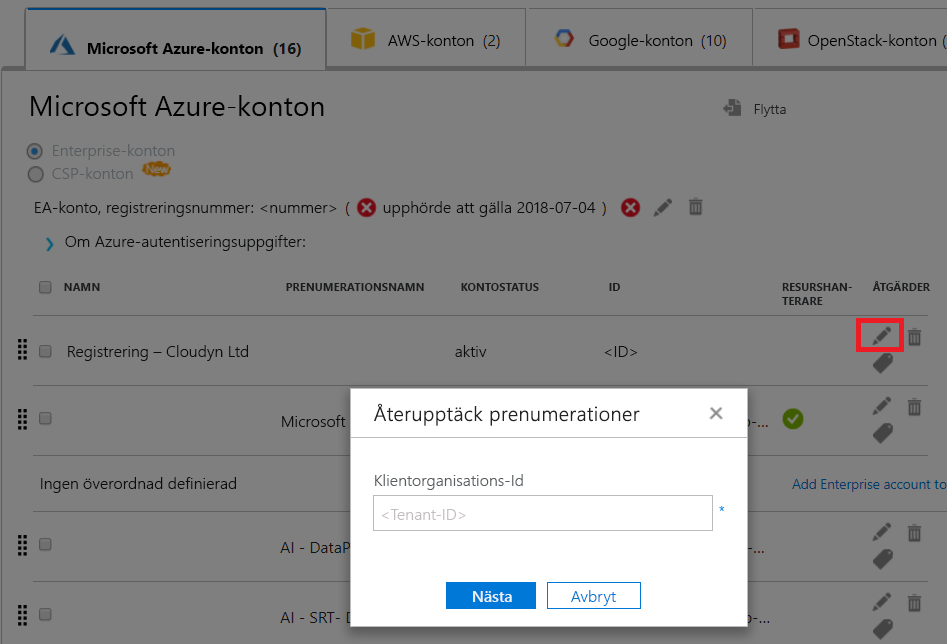

# Aktivera Azure-prenumerationer och konton med Azure kostnaden Management

Lägger till eller uppdaterar Azure Resource Manager-autentiseringsuppgifter tillåts Azure kostnaden för identifiering av konton och prenumerationer i Azure-klient. Om du har även Azure Diagnostics tillägget aktiverat på virtuella datorer, samla Azure kostnaden Management utökad mått som processor och minne. Den här artikeln beskriver hur du aktiverar åtkomst med hjälp av Azure Resource Manager API: erna för nya och befintliga konton. Det beskriver också hur du löser vanliga problem med kontot.

Hantering av Azure kostnaden kan inte komma åt de flesta av dina Azure-prenumerationsdata när prenumerationen är _inaktiverade_. Du måste redigera _inaktiverade_ så att Azure kostnaden Management kan komma åt dem-konton.

## Behörigheter som krävs för Azure

Specifika behörigheter som krävs för att slutföra procedurerna i den här artikeln. Du eller din Innehavaradministratör måste ha båda av följande behörigheter:

- Behörighet att registrera CloudynCollector program med Azure AD-klienten.
- Möjligheten att tilldela program till en roll i Azure-prenumerationer.

I din Azure-prenumerationer, dina konton måste ha `Microsoft.Authorization/*/Write` åtkomst till tilldela CloudynCollector program. Den här åtgärden beviljas genom den [ägare](../active-directory/role-based-access-built-in-roles.md#owner) roll eller [administratör för användaråtkomst](../active-directory/role-based-access-built-in-roles.md#user-access-administrator) roll.

Om ditt konto har tilldelats den **deltagare** roll, du har inte tillräcklig behörighet för att tilldela programmet. Du får ett fel vid försök att tilldela CloudynCollector program till din Azure-prenumeration.

### Kontrollera behörigheter för Azure Active Directory

1. Logga in på den [Azure-portalen](https://portal.azure.com).
2. Välj i Azure-portalen **Azure Active Directory**.
3. Välj i Azure Active Directory, **användarinställningar**.
4. Kontrollera den **App registreringar** alternativet.
    - Om den är inställd på **Ja**, och andra användare kan registrera AD-appar. Den här inställningen innebär att alla användare i Azure AD-klient kan registrera en app. Du kan fortsätta att behörigheter som krävs för Azure-prenumeration.  
    
    - Om den **App registreringar** alternativet är inställt på **nr**, och sedan endast klient administrativa användare kan registrera Azure Active Directory-appar. Klient-administratören måste registrera CloudynCollector program.

## Lägg till ett konto eller uppdatera en prenumeration

När du lägger till en uppdatering av en prenumeration kan bevilja du Azure kostnaden Management åtkomst till dina Azure data.

### Lägg till ett nytt konto (prenumeration)

1. Klicka på symbolen växel i övre högra i hanteringsportalen för Azure kostnad och välj **moln konton**.
2. Klicka på **Lägg till nytt konto** och **Lägg till nytt konto** visas. Ange informationen som krävs.  
    

### Uppdatera en prenumeration

1. Om du vill uppdatera en _inaktiverade_ prenumeration som redan finns i Azure kostnaden Management i hantering av konton, klicka på Redigera penna symbolen till höger om den _klient GUID_.
    
2. Ange om det behövs, klient-ID. Om du inte vet klient-ID, använder du följande steg för att hitta den:
    1. Logga in på den [Azure-portalen](https://portal.azure.com).
    2. Välj i Azure-portalen **Azure Active Directory**.
    3. Om du vill hämta klient-ID, Välj **egenskaper** för din Azure AD-klient.
    4. Kopiera katalog-ID-GUID. Det här värdet är klient-ID.
    Mer information finns i [hämta klient-ID](../azure-resource-manager/resource-group-create-service-principal-portal.md#get-tenant-id).
3. Om det behövs Välj hastighet-ID. Om du inte vet hastighet-ID, använder du följande steg för att hitta den.
    1. I det övre högra på Azure-portalen klickar du på din användarinformation och klicka sedan på **Visa min faktura**.
    2. Under **faktureringskonto**, klickar du på **prenumerationer**.
    3. Under **Mina prenumerationer**, Välj prenumerationen.
    4. Vilken takt dina ID visas under **erbjuder ID**. Kopiera erbjuder-ID för prenumerationen.
4. Lägg till nytt konto (eller redigera prenumeration) klickar du på **spara** (eller **nästa**). Du ska omdirigeras till Azure-portalen.
5. Logga in på portalen. Klicka på **acceptera** Azure kostnaden Management insamlaren för att auktorisera åtkomst till ditt Azure-konto.

    Du ska omdirigeras till sidan för hantering av Hanteringskonton kostnaden för Azure och din prenumeration uppdateras med **active** kontostatus. Den ska visa en grön bock symbol under kolumnen Resource Manager.

    Om du inte ser en grön bockmarkering symbol för en eller flera av prenumerationerna, innebär det att du inte har behörighet att skapa reader-appen (CloudynCollector) för prenumerationen. En användare med högre behörighet för prenumerationen måste upprepa den här processen.

Titta på den [ansluter till Azure Resource Manager med Azure kostnaden Management med Cloudyn](https://youtu.be/oCIwvfBB6kk) video som går igenom processen.

>[!VIDEO https://www.youtube.com/embed/oCIwvfBB6kk?ecver=1]

## Lösa vanliga problem med installation indirekt enterprise

När du börjar använda hanteringsportalen för Azure kostnad, kan du se följande meddelanden om du använder en Enterprise-avtal eller Cloud Solution Providers (CSP):

- *Den angivna API-nyckeln är inte en nyckel för övre nivå registrering* visas i den **ställa in Azure kostnaden Management** guiden.
- *Direktregistrering – inte* visas i portalen Enterprise-avtal.
- *Inga användningsdata hittades för de senaste 30 dagarna. Kontakta din återförsäljare att försäkra markup har aktiverats för ditt Azure-konto* visas i hanteringsportalen för Azure kostnaden.

Föregående meddelanden tyda på att du har köpt en Azure-Företagsavtal genom en återförsäljare eller CSP. Återförsäljaren eller CSP måste aktivera _markup_ för din Azure-konto så att du kan visa dina data i Azure kostnaden Management.

Här är hur du löser problem:

1. Din återförsäljare måste aktivera _markup_ för ditt konto. Mer information finns i [indirekt Customer Onboarding Guide](https://ea.azure.com/api/v3Help/v2IndirectCustomerOnboardingGuide).
2. Du genererar nyckeln Azure Enterprise-avtal för användning med Azure kostnaden Management. Instruktioner finns i [registrera en Azure Enterprise-avtal och visa data](https://docs.microsoft.com/en-us/azure/cost-management/quick-register-ea).

Endast en Azure-tjänst-administratör kan aktivera hantering av kostnaden. Behörigheter som medadministratör är otillräcklig.

Innan du kan generera Azure Enterprise-avtal API-nyckeln som ställa in hantering av Azure kostnad, måste du aktivera Azure Billing API genom att följa anvisningarna på:

- [Översikt över Reporting API: er för Enterprise-kunder](../billing/billing-enterprise-api.md)
- [Microsoft Azure enterprise portal Reporting API](https://ea.azure.com/helpdocs/reportingAPI) under **aktivera dataåtkomst till API: et**

Kan du behöva ge avdelning administratörer, kontot ägare och enterprise administratörer behörighet till _visa debiteringar_ med fakturerings-API.

## Nästa steg

- Om du inte har redan slutförts första självstudierna för hantering av kostnader, läsa den på [granska användning och kostnader](tutorial-review-usage.md).
