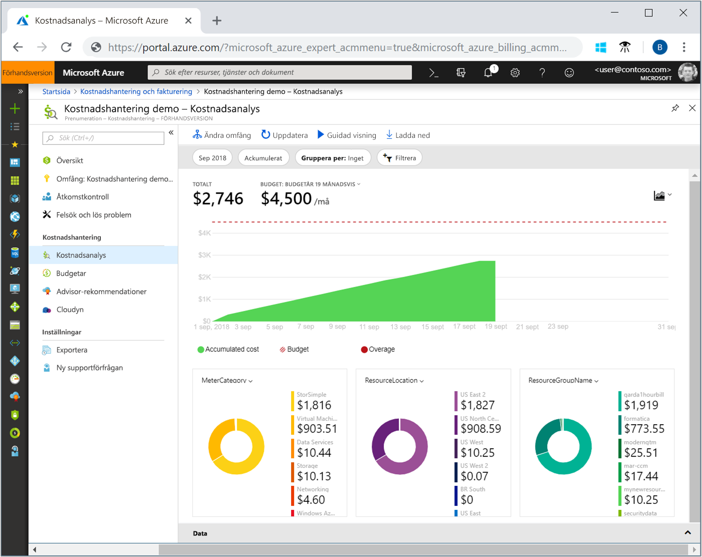
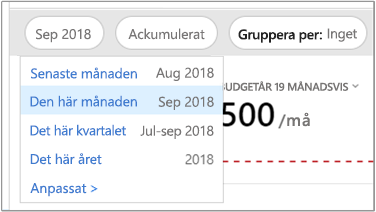
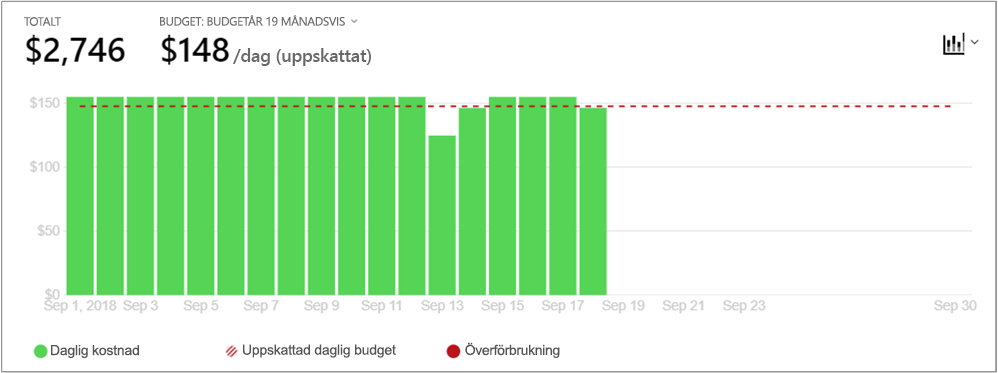
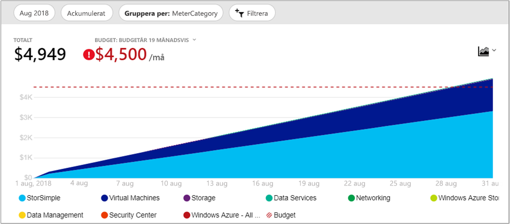

# Snabbstart: Utforska och analysera kostnader med kostnadsanalys

För att kunna kontrollera och optimera dina Azure-kostnader på rätt sätt behöver du förstå var kostnaderna har sitt ursprung i organisationen. Det är även bra att veta hur mycket pengar dina tjänster kostar och vilka miljöer och system de stödjer. Insyn i hela spektrumet av kostnader är mycket viktigt för kunna förstå organisationens utgiftsmönster. Utgiftsmönster kan användas för att tillämpa kostnadskontrollmekanismer, till exempel budgetar.

I den här snabbstarten använder du kostnadsanalys för att utforska och analysera dina organisationskostnader. Du kan visa aggregerade kostnader efter organisation för att se var kostnader sker över tid och för att identifiera utgiftstrender. Du kan se ackumulerade kostnader över tid för att beräkna månatliga, kvartalsvisa eller årliga kostnadstrender mot en budget. En budget gör det lättare att hålla sig till ekonomiska begränsningar. En budget används även till att visa dagliga och månatliga kostnader för att isolera oregelbundenheter vad gäller utgifter. Dessutom kan du ladda ned den aktuella rapportens data för ytterligare analys eller för användning i ett externt system.

I den här snabbstarten lär du dig att:

- Granska kostnader i kostnadsanalys
- Anpassa kostnadsvyer
- Ladda ned kostnadsanalysdata

## Nödvändiga komponenter

Kostnadsanalys är tillgängligt för alla [Enterprise-avtalskunder (EA)](https://azure.microsoft.com/pricing/enterprise-agreement/). Du måste minst ha skrivskyddad åtkomst till ett eller flera av följande omfång för att visa kostnadsdata. Mer information om hur du får åtkomst till Cost Management finns i [Tilldela åtkomst till data](assign-access-acm-data.md).

- Faktureringskonto
- Avdelning
- Registreringskonto
- Hanteringsgrupp
- Prenumeration
- Resursgrupp

## Logga in på Azure

- Logga in på Azure Portal på https://portal.azure.com.

## Granska kostnader i kostnadsanalys

Om du vill granska dina kostnader med kostnadsanalys går du i Azure-portalen till **Kostnadshantering + fakturering** &gt; **Kostnadshantering** &gt; **Ändra omfång**, väljer ett omfång och klickar sedan på **Välj**.

Det omfång som du väljer används i hela Cost Management för att ge datakonsolidering och styra åtkomsten till kostnadsinformation. När du använder omfång så använder du inte flerval för dem. I stället väljer du ett större omfång som andra ackumuleras till, och sedan filtrerar du ned till det du vill. Detta är viktigt att förstå eftersom vissa användare inte ska ha åtkomst till ett överordnat omfång som underordnade omfång ackumuleras till.

Klicka på **Öppna kostnadsanalys**.

Den initiala kostnadsanalysvyn innehåller följande områden:

**Total** (Totalt) – visar den totala kostnaden för aktuell månad.

**Budget** – visar den planerade utgiftsgränsen för det valda omfånget, om en sådan är tillgänglig.

**Accumulated cost** (Ackumulerad kostnad) – visar de totala ackumulerade dagliga utgifterna med start i början av månaden. När du har [skapat en budget](tutorial-acm-create-budgets.md) för ditt faktureringskonto eller din prenumeration kan du snabbt se din utgiftstrend jämfört med budgeten. Hovra över ett datum om du vill visa den ackumulerade kostnaden för den dagen.

**Pivotdiagram (ringdiagram)** – visar dynamiska pivoter som delar upp den totala kostnaden enligt en gemensam uppsättning standardegenskaper. De visar den högsta till minsta kostnaden som ackumulerats för den aktuella månaden. Du kan ändra pivotdiagram när som helst genom att välja en annan pivot. Kostnaderna kategoriseras efter: tjänst (mätarkategori), plats (region) och underordnat omfång som standard. Exempel: registreringskonton under faktureringskonton, resursgrupper under prenumerationer och resurser under resursgrupper.

## Anpassa kostnadsvyer

Standardvyn ger snabba svar på vanliga frågor som:

- Hur mycket spenderade jag?
- Följer jag budgeten?

Det finns dock många fall där du behöver djupare analys. Anpassning startar överst på sidan med valet av datum.

Kostnadsanalys visar data för den aktuella månaden som standard. Använd datumväljaren för att snabbt växla till: föregående månad, denna månad, detta kalenderkvartal, detta kalenderår eller ett eget datumintervall som du väljer. Att välja föregående månaden är det snabbaste sättet att analysera din senaste Azure-faktura och enkelt stämma av avgifter. Alternativen för aktuellt kvartal och år är till hjälp för att spåra kostnader mot mer långsiktiga budgetar. Du kan även välja ett annat datumintervall. Till exempel kan du välja en enstaka dag, de senaste sju dagarna eller något annat så långt tillbaka som ett år före den aktuella månaden.

Kostnadsanalysen visar **ackumulerade** kostnader som standard. Ackumulerade kostnader omfattar alla kostnader för varje dag plus föregående dagar, för en ständigt växande vy över dina dagliga ackumulerade kostnader. Den här vyn är optimerad för att visa hur du trendar mot en budget för det valda tidsintervallet.

Det finns även den **dagsvyn**, som visar kostnaderna för varje dag. Dagsvyn visar inte någon tillväxttrend. Vyn har utformats för att visa oregelbundenheter såsom toppar eller dalar i utgifter från dag till dag. Om du har valt en budget visar dagsvyn även en uppskattning av hur din dagliga budget kan se ut. När dina dagliga kostnader konsekvent är över den beräknade dagliga budgeten kan du förvänta dig att du överskrider din månatliga budget. Den beräknade dagliga budgeten är bara ett sätt att visualisera din budget på en lägre nivå. När det förekommer variationer i de dagliga kostnaderna är jämförelsen mellan den uppskattade dagliga budgeten och den månatliga budgeten mindre exakt.

Normalt kan du förvänta dig att se data eller meddelanden för förbrukade resurser inom åtta timmar.

Du kan **gruppera efter** för att välja en gruppkategori och ändra data som visas i diagrammet med total area längst upp. Med gruppering kan du snabbt se hur dina utgifter kategoriseras efter gemensamma resurs- och användningsegenskaper såsom resursgrupp eller resurstaggar. Du grupperar efter taggar genom att välja den taggnyckel som du vill gruppera efter. Kostnaderna visas uppdelade efter varje värde för den taggen, med ett extra segment för resurser som inte har den taggen tillämpad.

De flesta [Azure-resurser stöder taggning](../azure-resource-manager/tag-support.md), men vissa taggar är inte tillgängliga inom Cost Management (kostnadshantering) och fakturering. Dessutom stöds inte resursgrupptaggar. Cost Management stöder endast resurstaggar från det datum då taggarna tillämpas direkt på resursen.

Här är en vy över Azure-tjänstkostnaderna för en vy över föregående månad.

Pivotdiagram under huvuddiagram visar olika grupperingar för att ge dig en bredare bild av de totala kostnaderna för den valda tidsperioden och filtren. Välj en egenskap eller en tagg för att visa samlade kostnader efter valfri dimension. Du kan visa en fullständig uppsättning data för totalvyn finns längst ned på skärmen genom att expandera rutan **Data** eller välja **Exportera > Ladda ned CSV** längst upp på skärmen. Här är ett exempel på datarutan för resursgrupper.

I föregående bild visas resursgruppnamn. Du kan gruppera efter tagg för att visa totala kostnader per tagg, men det finns inte stöd för att visa alla taggar per resurs eller resursgrupp i någon av vyerna för kostnadsanalys.

När du grupperar kostnader efter ett specifikt attribut visas de tio viktigaste kostnadsfaktorerna från högsta till lägsta. Om det finns fler än tio grupper visas de nio viktigaste kostnadsfaktorerna. Det visas även en grupp som heter **Andra**, som omfattar alla de återstående grupperna tillsammans. När du grupperar efter taggar kan det även hända att du ser en **Otaggad** grupp för kostnader som inte har taggnyckeln tillämpad. **Otaggad** är alltid är sist även om det finns fler otaggade kostnader än taggade kostnader. Om det finns minst tio taggvärden ingår otaggade kostnader i **Andra**.

*Klassiska* virtuella datorer (Azure Service Management eller ASM), nätverk och lagringsresurser delar inte detaljerad faktureringsinformation. De slås samman som **klassiska tjänster** när kostnader grupperas.

## Ladda ned kostnadsanalysdata

Du kan **ladda ned** information från kostnadsanalys att generera en CSV-fil för alla data som för närvarande visas i Azure-portalen. Alla filter eller grupper som du tillämpar ingår i filen. Underliggande data för totaldiagrammet längst upp som inte visas aktivt ingår i CSV-filen.

## Nästa steg

Gå vidare till den första självstudien om du vill lära dig att skapa och hantera budgetar.

> [!div class="nextstepaction"]
> [Skapa och hantera budgetar](tutorial-acm-create-budgets.md)
