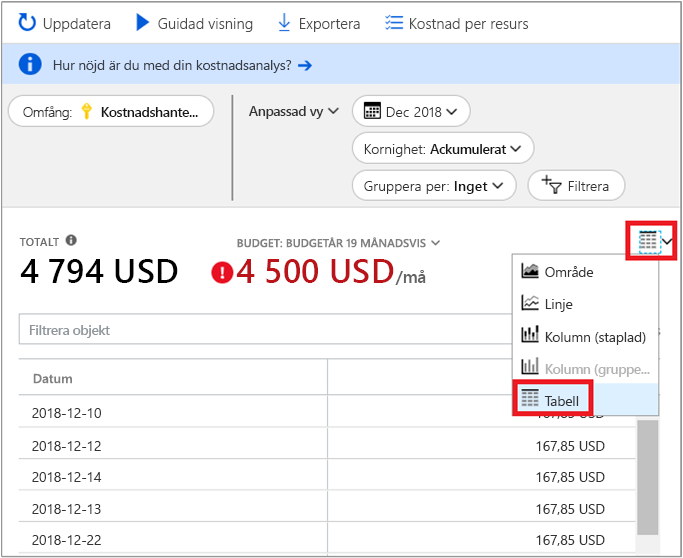

# Snabbstart: Utforska och analysera kostnader med kostnadsanalys

För att kunna kontrollera och optimera dina Azure-kostnader på rätt sätt behöver du förstå var kostnaderna har sitt ursprung i organisationen. Det är även bra att veta hur mycket pengar dina tjänster kostar och vilka miljöer och system de stödjer. Insyn i hela spektrumet av kostnader är mycket viktigt för kunna förstå organisationens utgiftsmönster. Utgiftsmönster kan användas för att tillämpa kostnadskontrollmekanismer, till exempel budgetar.

I den här snabbstarten använder du kostnadsanalys för att utforska och analysera dina organisationskostnader. Du kan visa aggregerade kostnader efter organisation för att se var kostnader sker över tid och för att identifiera utgiftstrender. Du kan se ackumulerade kostnader över tid för att beräkna månatliga, kvartalsvisa eller årliga kostnadstrender mot en budget. En budget gör det lättare att hålla sig till ekonomiska begränsningar. En budget används även till att visa dagliga och månatliga kostnader för att isolera oregelbundenheter vad gäller utgifter. Dessutom kan du ladda ned den aktuella rapportens data för ytterligare analys eller för användning i ett externt system.

I den här snabbstarten lär du dig att:

- Granska kostnader i kostnadsanalys
- Anpassa kostnadsvyer
- Ladda ned kostnadsanalysdata

## Nödvändiga komponenter

Kostnadsanalys stöder olika typer av Azure kontotyper. Om du vill se hela listan med kontotyper som stöds kan du läsa [Förstå Cost Management-data](understand-cost-mgt-data.md). Om du vill visa kostnadsdata behöver du minst läsbehörighet för ditt Azure-konto.

För [EA-kunder (Enterprise Agreement)](https://azure.microsoft.com/pricing/enterprise-agreement/) måste du minst ha skrivskyddad åtkomst till ett eller flera av följande omfång för att visa kostnadsdata.

- Faktureringskonto
- Avdelning
- Registreringskonto
- Hanteringsgrupp
- Prenumeration
- Resursgrupp

Mer information om hur du får åtkomst till Cost Management finns i [Tilldela åtkomst till data](assign-access-acm-data.md).

## Logga in på Azure

- Logga in på Azure Portal på https://portal.azure.com.

## Granska kostnader i kostnadsanalys

Öppna området i Azure-portalen och välj om du vill granska dina kostnader i cost analysis **analys av kostnader** på menyn. Till exempel Gå till **prenumerationer**, Välj en prenumeration i listan och välj sedan **analys av kostnader** på menyn. Använd den **omfång** pill att växla till ett annat omfång i kostnadsanalys. Mer information om scope finns [förstå och arbeta med omfattningar](understand-work-scopes.md).

Omfång som du väljer används i hela kostnadshantering datakonsolidering och styra åtkomsten till kostnadsinformation. När du använder omfång så använder du inte flerval för dem. I stället kan du välja ett större område som andra kavla upp till och sedan filtrera ner till kapslade omfång som du behöver. Den här metoden är viktigt att förstå eftersom vissa personer inte kan ha åtkomst till en enda överordnad omfattning, som omfattar flera kapslade omfång.

Den initiala kostnadsanalysvyn innehåller följande områden:

**Total** (Totalt) – visar den totala kostnaden för aktuell månad.

**Budget** – visar den planerade utgiftsgränsen för det valda omfånget, om en sådan är tillgänglig.

**Ackumulerade kostnaden** – visar den totala mängden utgifter varje dag, med start i början av månaden. När du har [skapat en budget](tutorial-acm-create-budgets.md) för ditt faktureringskonto eller din prenumeration kan du snabbt se din utgiftstrend jämfört med budgeten. Hovra över ett datum om du vill visa den ackumulerade kostnaden för den dagen.

**Pivotdiagram (ringdiagram)** – visar dynamiska pivoter som delar upp den totala kostnaden enligt en gemensam uppsättning standardegenskaper. De visar de mest till minst kostsamma för den aktuella månaden. Du kan ändra pivotdiagram när som helst genom att välja en annan pivot. Kostnaderna kategoriseras efter: tjänst (mätarkategori), plats (region) och underordnat omfång som standard. Exempel: registreringskonton under faktureringskonton, resursgrupper under prenumerationer och resurser under resursgrupper.

## Anpassa kostnadsvyer

Kostnadsanalys har fyra inbyggda vyer, optimerat för de flesta vanliga mål: 

Visa | Svara på frågor som...
--- | ---
Ackumulerad kostnad | Hur mycket under har hittills den här månaden? Följer jag budgeten?
Daglig kostnad | Har det varit höjs kostnader per dag under de senaste 30 dagarna?
Kostnad efter tjänst | Hur har Mina månatlig användning som kan variera under senaste 3 fakturor?
Kostnad efter resurs | Vilka resurser kosta mest hittills den här månaden?

Det finns dock många fall där du behöver djupare analys. Anpassning startar överst på sidan med valet av datum.

Kostnadsanalys visar data för den aktuella månaden som standard. Använd Väljaren datum för att växla till vanliga datumintervall snabbt. Några exempel är de senaste sju dagarna, senaste månaden, aktuellt år eller ett eget datumintervall. Prenumerationer med användningsbaserad betalning även innehålla datumintervall baserat på din faktureringsperiod, som inte är bunden till kalendermånad, som den aktuella faktureringsperioden eller senaste fakturan. Använd den **< föregående** och **Nästa >** länkar överst i menyn för att hoppa till föregående eller nästa period, respektive. Till exempel **< föregående** växlar från de senaste sju dagarna till 8 – 14 dagar sedan och sedan till 15-21 dagar sedan.

Kostnadsanalysen visar **ackumulerade** kostnader som standard. Ackumulerade kostnaderna omfattar alla kostnader för varje dag plus de senaste dagarna, för en ständigt växande vy över dina dagliga sammanställd kostnader. Den här vyn är optimerad för att visa hur du trendar mot en budget för det valda tidsintervallet.

Det finns även den **dagsvyn**, som visar kostnaderna för varje dag. Dagsvyn visar inte någon tillväxttrend. Vyn har utformats för att visa oregelbundenheter såsom toppar eller dalar i utgifter från dag till dag. Om du har valt en budget visar dagsvyn även en uppskattning av hur din dagliga budget kan se ut. När dina dagliga kostnader konsekvent är över den beräknade dagliga budgeten kan du förvänta dig att du överskrider din månatliga budget. Den beräknade dagliga budgeten är bara ett sätt att visualisera din budget på en lägre nivå. När det förekommer variationer i de dagliga kostnaderna är jämförelsen mellan den uppskattade dagliga budgeten och den månatliga budgeten mindre exakt.

I allmänhet bör du kan förvänta dig att se data eller meddelanden för förbrukade resurser inom 8 – 12 timmar.

**Gruppera efter** gemensamma egenskaper att bryta ned kostnader och identifiera de främsta deltagare. Om du vill gruppera efter resurstaggar, Välj taggnyckeln som du vill gruppera efter. Kostnaderna är uppdelade efter varje tagg-värde med ett extra segment för resurser som inte har den tagg som tillämpas.

De flesta [Azure-resurser stöder taggning](../azure-resource-manager/tag-support.md), men vissa taggar är inte tillgängliga inom Cost Management (kostnadshantering) och fakturering. Dessutom stöds inte resursgrupptaggar. Cost Management stöder endast resurstaggar från det datum då taggarna tillämpas direkt på resursen.

Här är en vy över Azure-tjänstkostnaderna för en vy över föregående månad.

Pivotdiagram under huvuddiagram visar olika grupperingar för att ge dig en bredare bild av de totala kostnaderna för den valda tidsperioden och filtren. Välj en egenskap eller en tagg för att visa samlade kostnader efter valfri dimension.

I föregående bild visas resursgruppnamn. Du kan gruppera efter tagg för att visa totala kostnader per tagg, men det finns inte stöd för att visa alla taggar per resurs eller resursgrupp i någon av vyerna för kostnadsanalys.

När du grupperar kostnader efter ett specifikt attribut, visas de översta 10 kostnadsfaktorer från högsta till lägsta. Om fler än 10 översta nio kostnadsfaktorer visas med en **andra** grupp som omfattar alla återstående grupperna tillsammans. När du grupperar efter taggar kan det även hända att du ser en **Otaggad** grupp för kostnader som inte har taggnyckeln tillämpad. **Ej taggade** alltid är den sista även om otaggade kostnader är högre än taggade kostnaderna. Otaggade kostnader kommer att ingå i **andra**, om det finns minst 10 taggvärden.

*Klassiska* virtuella datorer, nätverk och lagringsresurser inte dela detaljerad faktureringsinformation. De slås samman som **klassiska tjänster** när kostnader grupperas.

Du kan visa den fullständiga datauppsättningen för alla vyer. Oavsett vilka val och filter som du använder påverkar de data som visas. Om du vill se en fullständig uppsättning data klickar du på listan **diagramtyp** och därefter på **tabellvyn**.

## Ladda ned kostnadsanalysdata

Du kan **ladda ned** information från kostnadsanalys att generera en CSV-fil för alla data som för närvarande visas i Azure-portalen. Alla filter eller grupper som du tillämpar ingår i filen. Underliggande data för totaldiagrammet längst upp som inte visas aktivt ingår i CSV-filen.

## Nästa steg

Gå vidare till den första självstudien om du vill lära dig att skapa och hantera budgetar.

> [!div class="nextstepaction"]
> [Skapa och hantera budgetar](tutorial-acm-create-budgets.md)
