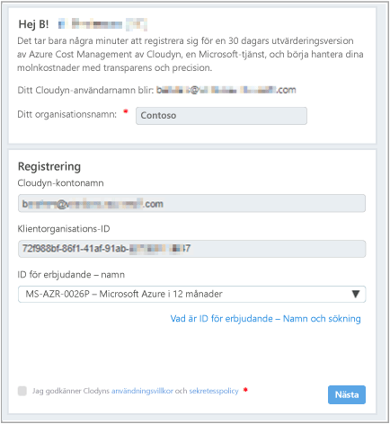
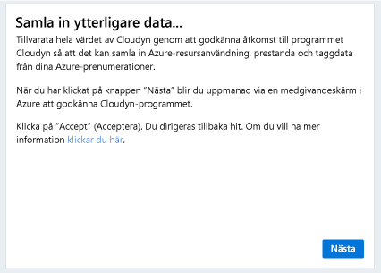
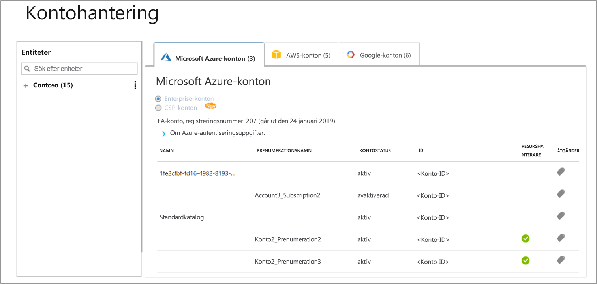

# Registrera en enskild Azure-prenumeration och visa kostnadsdata

Du registrerar dig för Azure Cost Management med hjälp av din Azure-prenumeration. Registreringen ger dig åtkomst till Cloudyn-portalen. Den här snabbstarten beskriver registreringsprocessen som krävs för att skapa en utvärderingsprenumeration på Cloudyn och logga in på Cloudyn-portalen. Den visar också hur du kan börja visa kostnadsdata direkt.

## Logga in på Azure

- Logga in på Azure Portal på http://portal.azure.com.

## Registrera dig för Azure Cost Management

1. Klicka på **Kostnadshantering + fakturering** i listan med tjänster i Azure Portal.
2. Klicka på **Kostnadshantering** under **Översikt**  
    
3. På sidan **Kostnadshantering** klickar du på **Gå till kostnadshantering** för att öppna Cloudyn-registreringssidan i ett nytt fönster.
4. På utvärderingsregistreringssidan på Cloudyn-portalen anger du namnet på ditt företag och väljer sedan **Azure Individual Subscription Owner** och klickar sedan på **Nästa**. Ditt kontonamn och klient-ID läggs automatiskt till i formuläret.  
    
5. Välj det **erbjudande-ID – namn** som är associerat med din prenumeration. Om du är osäker på vilket ID du har för din prenumeration kan du se **erbjudande-ID** på din Azure-faktura.
6. Godkänn användningsvillkoren och validera sedan dina uppgifter och klicka sedan på **Nästa**.
7. Klicka på **Nästa** på sidan **Gather additional data** (Samla in ytterligare data) för att tillåta att Cloudyn samlar in Azure-resursdata. Data som samlas in omfattar information om användning, prestanda, fakturering och taggar från dina prenumerationer.  
    
8. Din webbläsare tar dig till inloggningssidan för Cloudyn. Logga in med dina Azure-autentiseringsuppgifter.
9. Klicka på **Go to Cloudyn** (Gå till Cloudyn) för att öppna Cloudyn-portalen. Nu ska kontoinformationen för din Azure-prenumeration visas på sidan **Accounts Management** (Kontohantering).  
    

Vill du se en video om hur du registrerar din Azure-prenumeration kan du titta på [Finding your Directory GUID and Rate ID for use in Azure Cost Management](https://youtu.be/PaRjnyaNGMI) (Hitta ditt unika katalog-ID och tariff-ID för användning i Azure Cost Management).

[!INCLUDE [cost-management-create-account-view-data](../../includes/cost-management-create-account-view-data.md)]

## Nästa steg

I den här snabbstarten använde du din Azure-prenumerationsinformation för att göra en registrering med Cost Management. Du loggade också in på Cloudyn-portalen och började visa kostnadsdata. Om du vill veta mer om Azure Cost Management kan du fortsätta till självstudierna om Cost Management.

> [!div class="nextstepaction"]
> [Granska användning och kostnader](./tutorial-review-usage.md)
