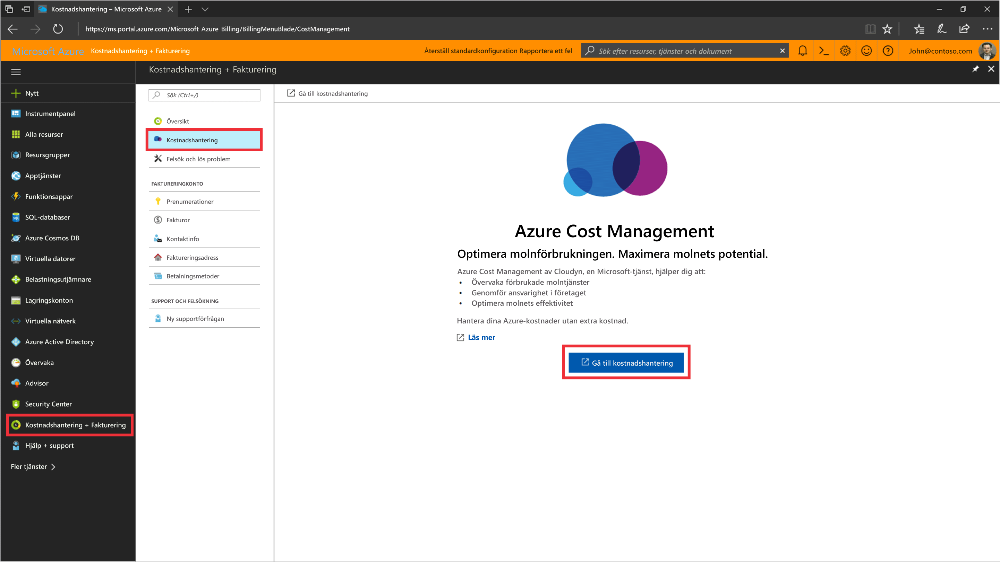
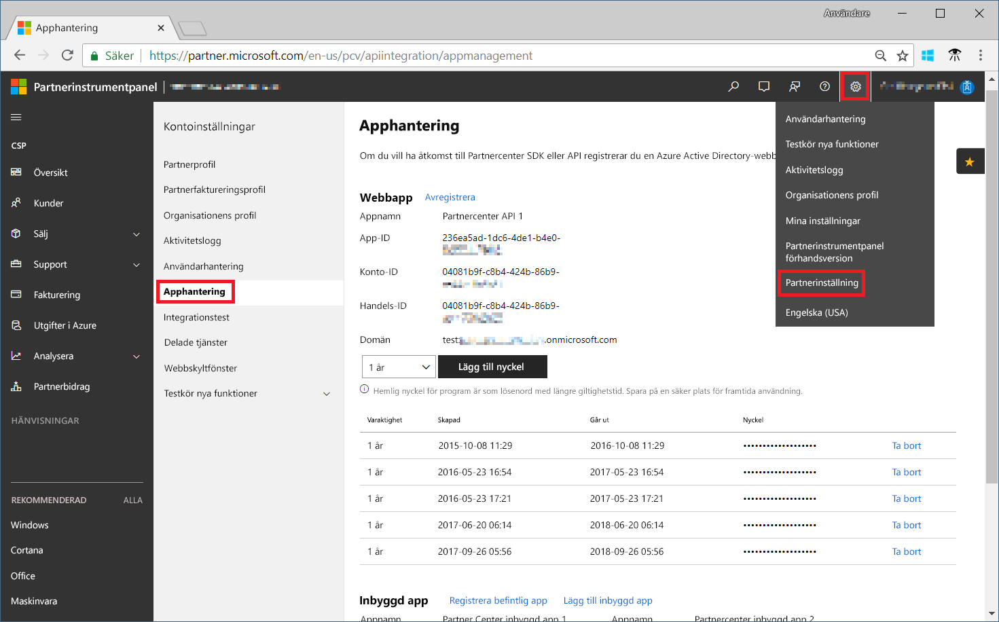
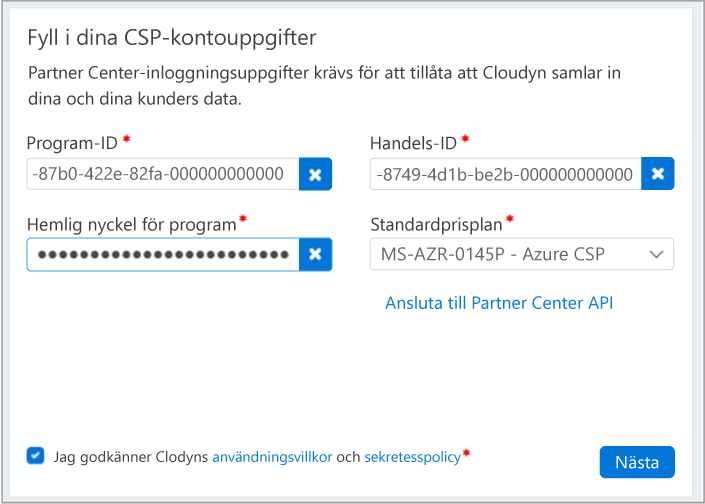

# Registrera dig för CSP-partnerprogrammet och visa kostnadsdata

Som CSP-partner kan du registrera dig för Cloudyn. Registreringen ger dig åtkomst till Cloudyn-portalen. Den här snabbstarten beskriver registreringsprocessen som krävs för att skapa en utvärderingsprenumeration på Cloudyn och logga in på Cloudyn-portalen. Den visar också hur du kan börja visa kostnadsdata direkt.

>[!NOTE]

>Endast CSP Direct-partner och CSP Indirect-partner kan slutföra Cloudyn-registreringen.
>
>Konfigurering av Partner Center API krävs för autentisering och åtkomst till data. Ett global administratör-konto för Partner Center krävs för att etablera API-åtkomst.
Mer information finns i [Ansluta till Partner Center API](https://msdn.microsoft.com/library/partnercenter/mt709136.aspx).
>
>Åtkomst till Cloudyn kan göras tillgänglig för CSP Indirect-återförsäljare när deras CSP Indirekt-leverantörer registreras i Cloudyn. Sedan kan CSP Indirect-återförsäljare ge Cloudyn-åtkomst till Azure-kunder och prenumerationer.

## Logga in på Azure

- Logga in på Azure Portal på http://portal.azure.com.

## Registrera dig för Cloudyn

1. Klicka på **Kostnadshantering + fakturering** i listan med tjänster i Azure Portal.
2. Klicka på **Cloudyn** under **Översikt**  
    
3. På sidan **Cloudyn** klickar du på **Go to Cloudyn** (Gå till Cloudyn) för att öppna Cloudyn-registreringssidan i ett nytt fönster.
4. På utvärderingsregistreringssidan på Cloudyn-portalen anger du namnet på ditt företag, väljer **Microsoft CSP Partner Program Administrator** och klickar sedan på **Nästa**.  
5. Ange **program-ID**, **handels-ID**, **hemlig nyckel för program** och välj **standardprisplanen**. Om du inte har informationen till hands loggar du in på Partner Center-portalen på  [https://partnercenter.microsoft.com](https://partnercenter.microsoft.com) med ditt primära administratörskonto och gör följande:
  1. Gå till **Instrumentpanelen** klicka på symbolen **Inställningar**, klicka på **Partner settings** (Partnerinställningar) och klicka sedan på **Apphantering**.
  2. Hoppa över det här steget om du har skapat en webbapp tidigare. Annars klickar du på **Lägg till ny webbapp** i avsnittet **Webbapp**.
  3. Kopiera den unika identifieraren **App-ID** från din webbapp.
  4. Kopiera den unika identifieraren **Handels-ID** från din webbapp.
  5. Välj ett eller två års giltighetstid för nyckeln, efter behov. Välj **Lägg till nyckel** och kopiera och spara sedan värdet för hemliga nyckeln.  
    
  6. Gå tillbaka till Cloudyn-registreringssidan och klistra in informationen.  
      
6. Godkänn användningsvillkoren och validera sedan dina uppgifter. Klicka på **Nästa** för att tillåta att Cloudyn samlar in Azure-resursdata. Data som samlas in innefattar information om användning, prestanda, fakturering och taggar från dina prenumerationer.  
7. Under **Invite other stakeholders** (Bjud in andra intressenter) kan du lägga till användare genom att ange deras e-postadresser. Klicka på **Nästa** när du är klar. Det tar ungefär två timmar att lägga till all din faktureringsinformation på Cloudyn.
8. Klicka på **Go to Cloudyn** (Gå till Cloudyn) för att öppna Cloudyn-portalen. Nu ska din registrerade CSP-kontoinformation visas på sidan **Cloud Accounts Management** (Hantering av molnkonton).

## Konfigurera indirekt CSP-åtkomst i Cloudyn

Som standard är Partner Center API endast tillgängligt för direkta CSP:er. En direkt CSP-provider kan dock konfigurera åtkomst för indirekta CSP-kunder eller partner med hjälp av entitetsgrupper i Cloudyn.

Om du vill aktivera åtkomst för indirekta CSP-kunder eller partner följer du stegen i [Skapa en utvärderingsregistrering](#create-a-trial-registration) för att skapa en utvärderingsregistrering. Sedan slutför du följande steg för att dela upp indirekta CSP-data med hjälp av entitetsgrupper i Cloudyn. Tilldela sedan lämpliga användarbehörigheter till entitetsgrupperna.

1. Skapa en entitetsgrupp med informationen i [Create entities](tutorial-user-access.md#create-and-manage-entities) (Skapa entiteter).
2. Följ stegen i [Tilldela prenumerationer till kostnadsentiteter](https://support.cloudyn.com/hc/articles/115005139425-Video-Assigning-subscriptions-to-Cost-Entities) (Tilldela prenumerationer till kostnadsentiteter). Associera den indirekta CSP-kundens konto och Azure-prenumerationer till den entitet som du skapade tidigare.
3. Följ stegen i [Create a user with admin access](tutorial-user-access.md#create-a-user-with-admin-access) (Skapa en användare med administratörsåtkomst) för att skapa ett användarkonto med administratörsåtkomst. Kontrollera sedan att användarkontot har administratörsåtkomst till de specifika entiteter som du skapade tidigare för det indirekta kontot.

Indirekta CSP-partner loggar in på Cloudyn-portalen med hjälp av de konton som du skapar åt dem.

[!INCLUDE [cost-management-create-account-view-data](../../includes/cost-management-create-account-view-data.md)]

## Nästa steg

I den här snabbstarten använde du din CSP-information för att göra en registrering med Cloudyn. Du loggade också in på Cloudyn-portalen och började visa kostnadsdata. Om du vill veta mer om Cloudyn kan du fortsätta till självstudien för Cloudyn.

> [!div class="nextstepaction"]
> [Granska användning och kostnader](./tutorial-review-usage.md)
