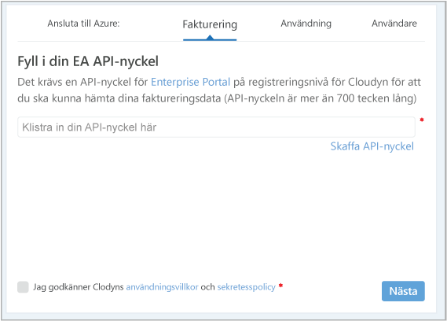
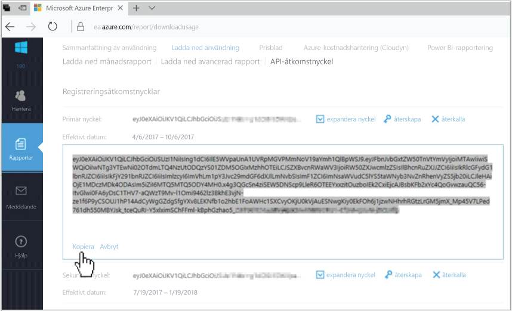
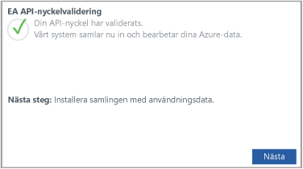

# Registrera ett Azure Enterprise-avtal och visa kostnadsdata

Du kan använda ditt Azure Enterprise-avtal för att registrera dig i Azure Cost Management från Cloudyn. Registreringen ger dig åtkomst till Cloudyn-portalen. Den här snabbstarten beskriver registreringsprocessen som krävs för att skapa en utvärderingsprenumeration på Cloudyn och logga in på Cloudyn-portalen. Den visar också hur du kan börja visa kostnadsdata direkt.

## Logga in på Azure

- Logga in på Azure Portal på http://portal.azure.com.

## Skapa en utvärderingsregistrering

1. Klicka på **Kostnadshantering + fakturering** i listan med tjänster i Azure Portal.
2. Klicka på **Kostnadshantering** under **Översikt**  
    
3. På sidan **Kostnadshantering** klickar du på **Gå till kostnadshantering** för att öppna Cloudyn-registreringssidan i ett nytt fönster.
4. På utvärderingsregistreringssidan på Cloudyn-portalen anger du namnet på ditt företag och väljer sedan **Azure Enterprise Enrollment Administrator**.  
    
5. Ange API-nyckeln för Enterprise Portal-registreringen. Om du inte har nyckeln tillgänglig kan du klicka på länken [Enterprise Portal](https://ea.azure.com) och göra så här:
  1. Logga in på webbplatsen för Azure Enterprise och klicka på **Rapporter**, klicka på **API-åtkomstnyckel** och kopiera sedan den primära nyckeln.  
    
  3. Gå tillbaka till registreringssidan och klistra in API-nyckeln.
6. Godkänn användningsvillkoren och validera sedan nyckeln. Klicka på **Nästa** för att tillåta att Cloudyn samlar in Azure-resursdata. Data som samlas in omfattar information om användning, prestanda, fakturering och taggar från dina prenumerationer.  
    
7. Under **Invite other stakeholders** (Bjud in andra intressenter) kan du lägga till användare genom att ange deras e-postadresser. Klicka på **Nästa** när du är klar. Det tar ungefär två timmar att lägga till all din faktureringsinformation på Cloudyn.
8. Klicka på **Go to Cloudyn** (Gå till Cloudyn) för att öppna Cloudyn-portalen. Nu ska din registrerade EA-kontoinformation visas på sidan **Cloud Accounts Management** (Hantering av molnkonton).

Om du vill se en självstudievideo om registrering av Enterprise-avtalet kan du se [How to Find Your EA Enrollment ID and API Key for use in Azure Cost Management by Cloudyn](https://youtu.be/u_phLs_udig) (Hitta ditt EA-registrerings-ID och din API-nyckel som används i Azure Cost Management med Cloudyn).

[!INCLUDE [cost-management-create-account-view-data](../../includes/cost-management-create-account-view-data.md)]

## Nästa steg

I den här snabbstarten använde du din Azure Enterprise-avtalsinformation för att göra en registrering med Cost Management. Du loggade också in på Cloudyn-portalen och började visa kostnadsdata. Om du vill veta mer om Azure Cost Management från Cloudyn kan du fortsätta till självstudierna om Cost Management.

> [!div class="nextstepaction"]
> [Granska användning och kostnader](./tutorial-review-usage.md)
