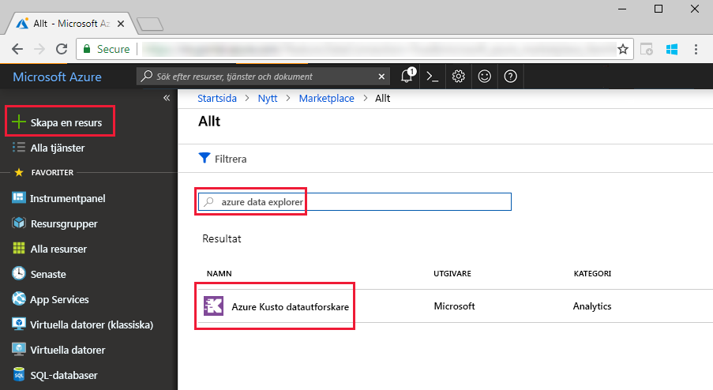
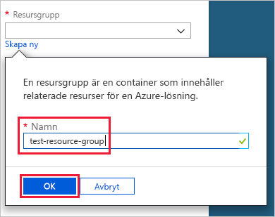
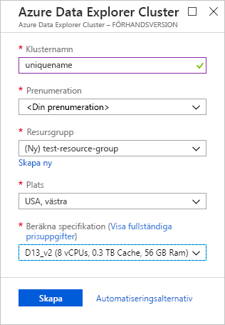
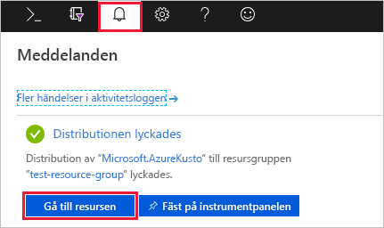
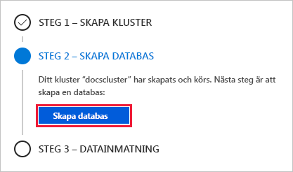
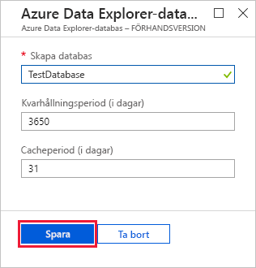
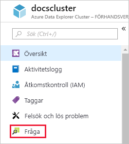
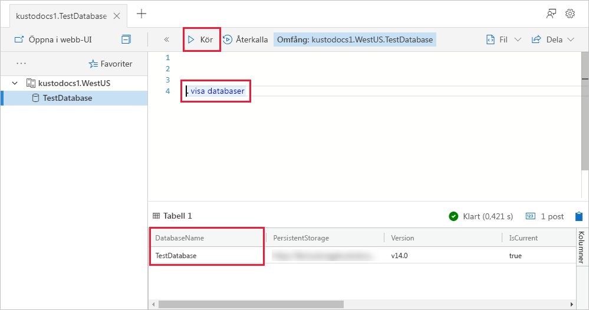
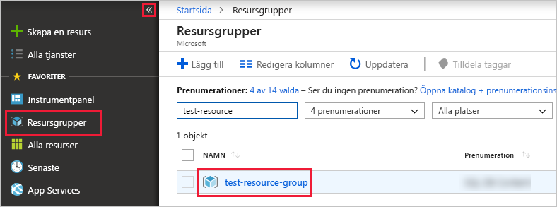

# Snabbstart: Skapa ett Azure Data Explorer-kluster och -databas

Azure Data Explorer är en snabb och mycket skalbar datautforskningstjänst för logg- och telemetridata. För att använda Azure Data Explorer måste du först skapa en *kluster*, och skapa en eller flera *databaser* i klustret. Sedan *matar du in* (läser in) data i databastabeller så att du kan köra frågor mot dem. I den här snabbstarten skapar du ett kluster och en databas. I efterföljande artiklar visar vi hur vi du kan mata in data.

Om du inte har en Azure-prenumeration kan du skapa ett [kostnadsfritt Azure-konto](https://azure.microsoft.com/free/) innan du börjar.

## Logga in på Azure Portal

Logga in på [Azure-portalen](https://portal.azure.com/).

## Skapa ett kluster

Du skapar ett Azure Data Explorer-kluster i en Azure-resursgrupp med en definierad uppsättning beräknings- och lagringsresurser.

1. Välj knappen **Skapa en resurs** (+) i det övre vänstra hörnet i portalen.

1. Sök efter *Azure Data Explorer*och välj sedan **Azure Data Explorer**.

   

1. I det övre vänstra hörnet väljer du **Skapa**.

1. Ange ett unikt namn för ditt kluster, välj din prenumeration och skapa en resursgrupp med namnet *test-resource-group*.

    

1. Fyll i formuläret med följande information.

   

    **Inställning** | **Föreslaget värde** | **Fältbeskrivning**
    |---|---|---|
    | Klusternamn | Ett unikt klusternamn | Välj ett unikt namn som identifierar klustret. Till exempel *mytestcluster*. Domännamnet *[region]. kusto.windows .net* läggs till i klusternamnet som du anger. Namnet får bara innehålla gemena bokstäver och siffror. Det måste innehålla mellan 3 och 22 tecken.
    | Prenumeration | Din prenumeration | Välj den Azure-prenumeration som ska användas för klustret.|
    | Resursgrupp | *test-resource-group* | Skapa en ny resursgrupp. |
    | Plats | *USA, västra* | Välj *USA, västra* för den här snabbstarten. Välj den region som bäst uppfyller dina behov för ett produktionssystem.
    | Compute-specifikation | *D13_v2* | Välj den lägsta prisspecifikationen för den här snabbstarten. För ett produktionssystem väljer du den specifikation som bäst uppfyller dina behov.
    | | |

1. Välj **Skapa** för att etablera klustret. Etableringen tar vanligtvis ungefär tio minuter. Välj **Aviseringar** (klockikonen) i verktygsfältet för att övervaka etableringsprocessen.

1. När processen är klar, väljer du **Meddelanden** och sedan **Gå till resurs**.

    

## Skapa en databas

Nu är du redo för det andra steget i processen: skapa databasen.

1. På fliken **Översikt** väljer du **Skapa databas**.

    

1. Fyll i formuläret med följande information.

    

    **Inställning** | **Föreslaget värde** | **Fältbeskrivning**
    |---|---|---|
    | Databasnamn | *TestDatabase* | Databasnamnet måste vara unikt inom klustret.
    | Kvarhållningsperiod | *3650* | Det tidsintervall under vilket det är garanterat att data förblir tillgängliga för frågor. Tidsintervallet mäts från det att data matas in.
    | Cacheperiod | *31* | Det tidsintervall i vilket du vill ha ofta efterfrågade data tillgängliga i SSD-lagring eller RAM-minne, i stället för i långsiktig lagring.
    | | | |

1. Välj **Spara** för att skapa databasen. Det brukar ta mindre än en minut att skapa en databas. När processen är klar kan du är tillbaka på klustrets **översiktsflik**.

## Köra grundläggande kommandon i databasen

Nu när du har ett kluster och en databas kan köra du frågor och kommandon. Du har inga data i databasen än, men du kan ändå se hur verktyg fungerar.

1. Under ditt kluster väljer du **Fråga**.

    

1. Klistra in följande kommando i frågefönstret: `.show databases` och välj sedan **Kör**.

    

    Resultatuppsättningen visar **TestDatabase**, den enda databasen i klustret.

1. Klistra in följande kommando i frågefönstret: `.show tables`, välj sedan kommandot i fönstret. Välj **Kör**.

    Det här kommandot returnerar en tom resultatuppsättning eftersom du inte har några tabeller än. Du kan lägga till en tabell i nästa artikel i den här serien.

## Stoppa och starta om klustret

Du kan stoppa och starta om ett kluster beroende på företagets behov.

1. Om du vill stoppa klustret väljer du **Stoppa** överst på fliken **Översikt**.

    När klustret har stoppats är data inte tillgängliga för frågor och du kan inte hämta nya data.

1. Om du vill starta om klustret väljer du **Starta** överst på fliken **Översikt**.

    När klustret har startats om tar det ungefär tio minuter för att det ska bli tillgängligt (som när den etablerades ursprungligen). Det tar extra tid för data att läsas in till den frekventa cachen.  

## Rensa resurser

Om du planerar att följa våra andra snabbstarter och självstudier kan du spara alla resurser som du skapade. Om inte rensar du **test-resource-group** för att undvika kostnader.

1. Välj **Resursgrupper** i Azure Portal längst till vänster och välj sedan den resursgrupp du skapat.  

    Om den vänstra menyn döljs väljer du  för att expandera den.

   

1. Under **test-resource-group** väljer du **Ta bort resursgrupp**.

1. I det nya fönstret skriver du namnet på resursgruppen som ska tas bort (*test-resource-group*) och väljer sedan **Ta bort**.

## Nästa steg

> [!div class="nextstepaction"]
> [Snabbstart: Mata in data från Event Hub i Azure Data Explorer](ingest-data-event-hub.md)

