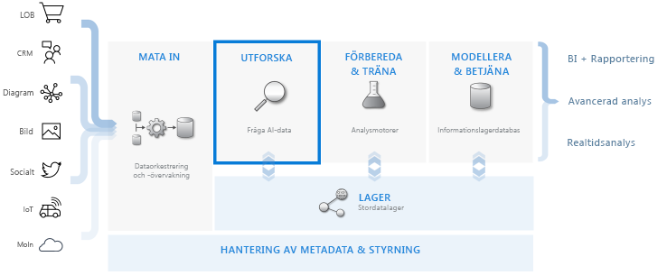
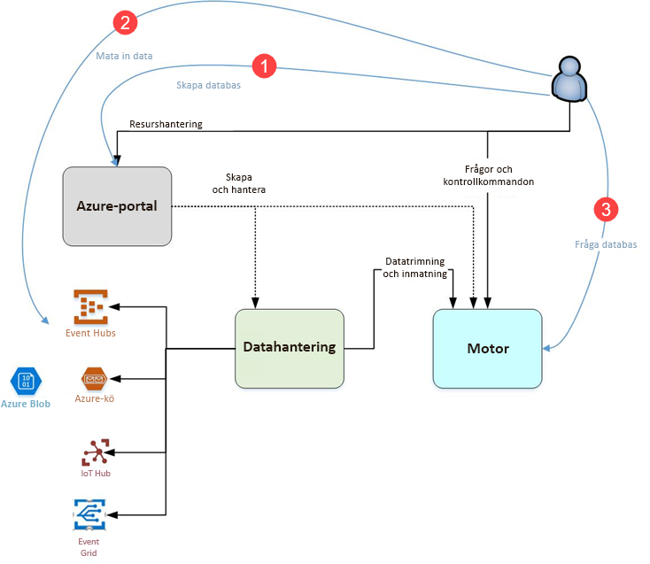

# Vad är Azure Data Explorer?

Azure Data Explorer är en snabb och mycket skalbar datautforskningstjänst för logg- och telemetridata. Den hjälper dig att hantera de många dataströmmar som modern programvara skapar, så att du kan samla in, lagra och analysera data. Azure Data Explorer är perfekt för att analysera stora volymer av olikartade data från olika datakällor, till exempel webbplatser, program, IoT-enheter med mera. Dessa data används för diagnostik, övervakning, rapportering, maskininlärning och ytterligare analysfunktioner. Azure Data Explorer gör det enkelt att mata in dessa data och låter dig utföra komplexa ad hoc-frågor på data i sekunder.

## Vad gör Azure Data Explorer unikt?

- Det går att skala snabbt till TB data på några minuter, vilket möjliggör snabba iterationer för utforskning av data för att identifiera relevant information.

- Du får ett innovativt frågespråk som optimerats för dataanalys med höga prestanda.

- Det finns stöd för analys av stora volymer av heterogena data (strukturerade och ostrukturerade).

- Du får möjlighet att bygga och distribuera exakt det du behöver eftersom du kan kombinera med andra tjänster och skapa en innesluten, kraftfull och interaktiv lösning för dataanalys.

## Arbetsflöde för datalagerhantering

Azure Data Explorer integreras med andra tjänster som är viktiga för att få en komplett lösning som innehåller insamling av data, datainmatning, lagring, indexering, frågekörning och visualisering. Data Explorer har en nyckelroll i flödet för datalagerhanteringen eftersom du kan köra steget **EXPLORE** i flödet på TB av olika rådata.

Azure Data Explorer stöder flera inmatningsmetoder, till exempel anslutningsappar till vanliga tjänster som Event Hub, programmatisk inmatning med SDK:er som .NET och Python samt direkt åtkomst till motorn för utforskningsändamål. Azure Data Explorer integreras med tjänster för analys och modellering för ytterligare analys och visualisering av data.

## Azure Data Explorer-flödet

I följande diagram visas de olika aspekterna av arbetet med Azure Data Explorer.

Arbetet i Azure Data Explorer följer vanligtvis det här mönstret:

1. **Skapa databas:** Skapa ett *kluster* och skapa sedan en eller flera *databaser* i klustret. [Snabbstart: Skapa ett Azure Data Explorer-kluster och en databas](create-cluster-database-portal.md)

1. **Mata in data:** Läs in data i databastabeller så att du kan köra frågor mot dem. [Snabbstart: Mata in data från Event Hub till Azure Data Explorer](ingest-data-event-hub.md)

1. **Köra frågor mot databas:** Använd vår webbapp för att köra, granska och dela frågor och resultat. Webbprogrammet är tillgängligt i Azure-portalen och som ett fristående program. Du kan också skicka frågor via programmering (med ett SDK) eller till en REST API-slutpunkt. [Snabbstart: Fråga efter data i Azure Data Explorer](web-query-data.md)

## Frågor

En fråga i Azure Data Explorer är en skrivskyddad begäran att bearbeta data och returnera resultatet av bearbetningen, utan att modifiera data eller metadata. Du fortsätter att finjustera dina frågor tills du är klar med din analys. Azure Data Explorer är den här processen enkel på grund av sin erfarenhet av mycket snabb ad hoc-frågor.

Azure Data Explorer kan hantera stora mängder strukturerade, halvstrukturerade, (JSON-liknande kapslade typer av data) och ostrukturerade data (fritext) lika bra. Det gör att du kan söka efter specifika sökord, leta efter specifika händelser och utföra måttberäkningar i strukturerade data. Azure Data Explorer överbryggar klyftorna mellan ostrukturerade textloggar och strukturerade tal och mått genom att extrahera värden vid körning från fält med fritext. Utforskning av data förenklas genom en kombination av snabb textindexering, kolumnarkiv och tidsserieåtgärder.

Azure Data Explorer-funktionerna utökas med andra tjänster som bygger på dess kraftfulla frågespråk, däribland [Azure Monitor-loggar](/azure/log-analytics/), [Application Insights](/azure/application-insights/), [Time Series Insights](/azure/time-series-insights/) och [Windows Defender Avancerat skydd](/windows/security/threat-protection/windows-defender-atp/windows-defender-advanced-threat-protection/).

## Feedback

Vi vill gärna ha dina synpunkter på Azure Data Explorer och dess frågespråk. Därför ser vi fram emot att du:

- Ställ frågor
  - [Stack Overflow](https://stackoverflow.com/questions/tagged/azure-data-explorer)
  - [Microsoft Tech Community](https://techcommunity.microsoft.com/t5/Azure-Data-Explorer/bd-p/Kusto)
  - [MSDN](https://social.msdn.microsoft.com/Forums/en-US/home?forum=AzureKusto)
- [Ger produktförslag i User Voice](https://aka.ms/AzureDataExplorer.UserVoice)

## Nästa steg

[Snabbstart: Skapa ett Azure Data Explorer-kluster och en databas](create-cluster-database-portal.md)

[Snabbstart: Mata in data från Event Hub till Azure Data Explorer](ingest-data-event-hub.md)

[Snabbstart: Fråga efter data i Azure Data Explorer](web-query-data.md)
