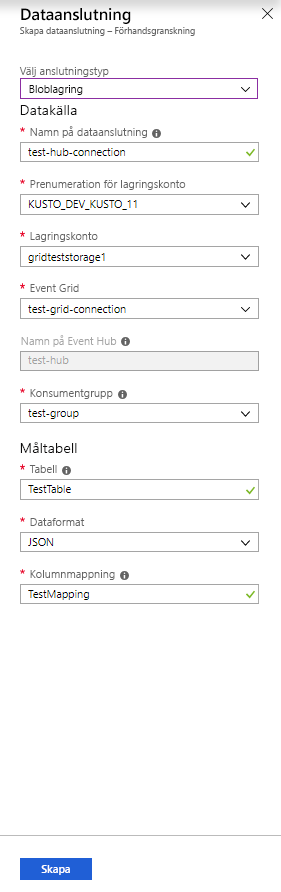
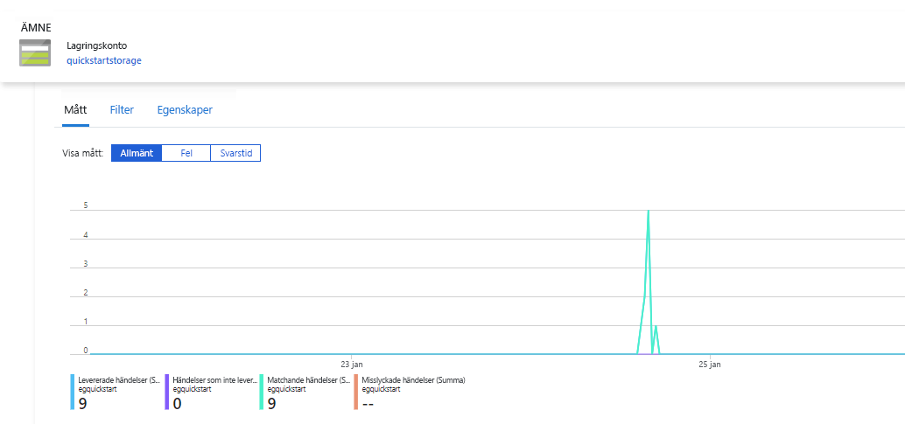
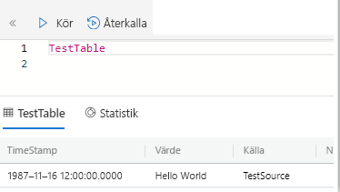

# <a name="quickstart-ingest-blobs-into-azure-data-explorer-by-subscribing-to-event-grid-notifications"></a>Snabbstart: Mata in blobar i Azure Data Explorer genom att prenumerera på meddelanden för Event Grid

Azure Data Explorer är en snabb och skalbar tjänst för Kunskapsutveckling för logg-och telemetri. Den erbjuder kontinuerlig inmatning (datainläsning) från blobbar som skrivs till blob-behållare. 

I den här snabbstarten får du lära dig hur du ställer in en [Azure Event Grid](/azure/event-grid/overview) prenumeration och dirigera händelser till Datautforskaren i Azure via en händelsehubb. Om du vill börja, bör du ha ett lagringskonto med en event grid-prenumeration som skickar meddelanden till Azure Event Hubs. Sedan skapar en Event Grid-dataanslutning och se data flödet i hela systemet.

## <a name="prerequisites"></a>Förutsättningar

* En Azure-prenumeration. Skapa en [kostnadsfritt Azure-konto](https://azure.microsoft.com/free/).
* [Ett kluster och databasen](create-cluster-database-portal.md).
* [Ett lagringskonto](https://docs.microsoft.com/azure/storage/common/storage-quickstart-create-account?tabs=azure-portal).
* [En händelsehubb](https://docs.microsoft.com/azure/event-hubs/event-hubs-create).

## <a name="create-an-event-grid-subscription-in-your-storage-account"></a>Skapa en Event Grid-prenumeration på ditt lagringskonto

1. Leta reda på lagringskontot i Azure-portalen.
1. Välj **händelser** > **händelseprenumeration**.

    

1. I fönstret **Skapa händelseprenumeration** på fliken **Grundläggande** anger du följande värden:

    **Inställning** | **Föreslaget värde** | **Fältbeskrivning**
    |---|---|---|
    | Namn | *test-grid-connection* | Namnet på event grid som du vill skapa.|
    | Händelseschema | *Event Grid-schema* | Schemat som ska användas för event grid. |
    | Typ av ämne | *Lagringskonto* | Typ av Event Grid-ämne. |
    | Ämnesresurs | *gridteststorage* | Namnet på ditt lagringskonto. |
    | Prenumerera på alla händelsetyper | *clear* | Få inte meddelanden vid alla händelser. |
    | Definierade händelsetyper | *BLOB skapas* | Vilka specifika händelser du ska meddelas om. |
    | Typ av slutpunkt | *Händelsehubbar* | Typ av slutpunkt som du skickar händelserna till. |
    | Slutpunkt | *test-hub* | Händelsehubben som du skapade. |
    | | |

1. Välj fliken **Ytterligare funktioner** om du vill spåra filer från en specifik container. Ange filter för meddelanden på följande sätt:
    * **Ämnet börjar med** fältet är den *literal* prefixet för blob-behållaren. Eftersom det mönster som används är *startswith*, den kan sträcka sig över flera behållare. Jokertecken får inte användas.
     Det *måste* anges enligt följande: *`/blobServices/default/containers/`*[containerprefix]
    * Fältet **Subject Ends With** (Ämnet slutar med) är det *literala* blobsuffixet. Jokertecken får inte användas.

## <a name="create-a-target-table-in-azure-data-explorer"></a>Skapa en måltabell i Azure Data Explorer

Skapa en tabell i Azure Data Explorer där Händelsehubbar ska skicka data. Skapa tabellen i klustret och databasen förberett i förutsättningarna.

1. Välj **Fråga** under klustret på Azure-portalen.

    

1. Kopiera följande kommando i fönstret och välj **kör** till att skapa tabellen (TestTable) som ska ta emot de insamlade data.

    ```Kusto
    .create table TestTable (TimeStamp: datetime, Value: string, Source:string)
    ```

    

1. Kopiera följande kommando till fönstret och välj **Kör** för att mappa inkommande JSON-data till kolumnnamnen och datatyperna i tabellen (TestTable).

    ```Kusto
    .create table TestTable ingestion json mapping 'TestMapping' '[{"column":"TimeStamp","path":"$.TimeStamp"},{"column":"Value","path":"$.Value"},{"column":"Source","path":"$.Source"}]'
    ```

## <a name="create-an-event-grid-data-connection-in-azure-data-explorer"></a>Skapa en Event Grid-dataanslutning i Azure Data Explorer

Nu ansluta till event grid från Azure Data Explorer så att data som flödar till blob-behållaren strömmas till test-tabellen.

1. Välj **Meddelanden** i verktygsfältet för att kontrollera att distributionen av händelsehubben lyckades.

1. Under det kluster som du har skapat, Välj **databaser** > **TestDatabase**.

    

1. Välj **datainmatning** > **Lägg till dataanslutning**.

    

1.  Välj anslutningstyp: **Blob Storage**.

1. Fyll i formuläret med följande information och välj **skapa**.

    

     Datakälla:

    **Inställning** | **Föreslaget värde** | **Fältbeskrivning**
    |---|---|---|
    | Namn på dataanslutning | *test-hub-connection* | Namnet på den anslutning som du vill skapa i Datautforskaren i Azure.|
    | Lagringskontoprenumeration | Ditt prenumerations-ID | Prenumerations-ID:t där lagringskontot finns.|
    | Lagringskonto | *gridteststorage* | Namnet på det lagringskonto som du skapade tidigare.|
    | Event Grid | *test-grid-connection* | Namnet på event grid som du skapade. |
    | Namn på händelsehubb | *test-hub* | Den händelsehubb som du skapade. Det här fältet fylls i automatiskt när du väljer en event grid. |
    | Konsumentgrupp | *test-group* | Konsumentgruppen definierats i hubben som du skapade. |
    | | |

    Måltabell:

     **Inställning** | **Föreslaget värde** | **Fältbeskrivning**
    |---|---|---|
    | Tabell | *TestTable* | Tabellen som du skapade i **TestDatabase**. |
    | Dataformat | *JSON* | Format som stöds är Avro, CSV, JSON, MULTILINE JSON, PSV, SOH, SCSV, TSV och TXT. |
    | Kolumnmappning | *TestMapping* | Den mappning som du skapade i **TestDatabase**, som mappar inkommande JSON-data till kolumnnamnen och datatyperna i **TestTable**.|
    | | |

## <a name="generate-sample-data"></a>Generera exempeldata

Nu när Azure Data Explorer och lagringskontot som är ansluten kan du skapa exempeldata och överföra den till blob-lagringen.

Vi kommer att arbeta med ett litet kommandoskript som utfärdar några grundläggande Azure CLI-kommandon för att interagera med Azure Storage-resurser. Det här skriptet skapar en ny behållare i ditt storage-konto, överför en befintlig fil (som en blob) till den behållaren och visar en lista över blobarna i behållaren. Du kan använda [Azure Cloud Shell](https://docs.microsoft.com/azure/cloud-shell/overview) att köra skriptet direkt i portalen.

Spara data i en fil och ladda upp den med det här skriptet:

```Json
{"TimeStamp": "1987-11-16 12:00","Value": "Hello World","Source": "TestSource"}
```

```bash
#!/bin/bash
### A simple Azure Storage example script

    export AZURE_STORAGE_ACCOUNT=<storage_account_name>
    export AZURE_STORAGE_KEY=<storage_account_key>

    export container_name=<container_name>
    export blob_name=<blob_name>
    export file_to_upload=<file_to_upload>
    export destination_file=<destination_file>

    echo "Creating the container..."
    az storage container create --name $container_name

    echo "Uploading the file..."
    az storage blob upload --container-name $container_name --file $file_to_upload --name $blob_name

    echo "Listing the blobs..."
    az storage blob list --container-name $container_name --output table

    echo "Done"
```

## <a name="review-the-data-flow"></a>Granska dataflödet

> [!NOTE]
> Azure Data Explorer har en aggregering (batchbearbetning)-princip för datainmatning som utformats för att optimera inmatning.
Som standard konfigureras principen till 5 minuter.
Du kommer att kunna ändra principen vid ett senare tillfälle om det behövs. I den här snabbstarten kan du förvänta dig en fördröjning på några minuter.

1. Under ditt händelserutnät på Azure-portalen ser du en aktivitetstopp när appen körs.

    

1. För att kontrollera hur många meddelanden som nått databasen hittills kör du följande fråga i testdatabasen.

    ```Kusto
    TestTable
    | count
    ```

1. Kör följande fråga i testdatabasen för att se innehållet i meddelandena.

    ```Kusto
    TestTable
    ```

    Resultatet bör se ut så här.

    

## <a name="clean-up-resources"></a>Rensa resurser

Om du inte planerar att använda händelserutnätet igen rensar du **test-hub-rg** för att undvika kostnader.

1. Välj **Resursgrupper** i Azure Portal längst till vänster och välj sedan den resursgrupp du skapat.  

    Om den vänstra menyn är dold väljer du  för att expandera den.

   

1. Under **test-resource-group** väljer du **Ta bort resursgrupp**.

1. I det nya fönstret, ange namnet på resursgruppen som ska ta bort (*test-hub-rg*), och välj sedan **ta bort**.

## <a name="next-steps"></a>Nästa steg

> [!div class="nextstepaction"]
> [Snabbstart: Fråga efter data i Azure Data Explorer](web-query-data.md)
