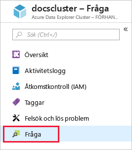
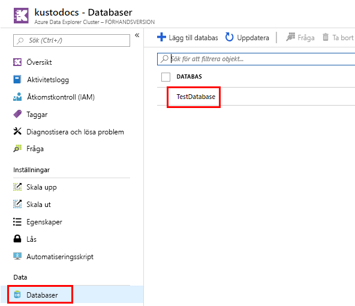
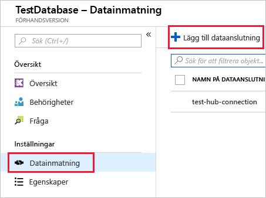
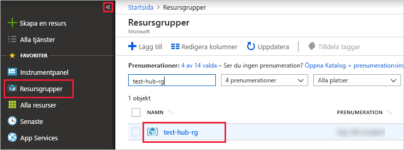

# <a name="quickstart-ingest-azure-blobs-into-azure-data-explorer-by-subscribing-to-event-grid-notifications"></a>Snabbstart: Mata in Azure-blobar i Azure Data Explorer genom att prenumerera på Event Grid-meddelanden

Azure Data Explorer är en snabb och mycket skalbar datautforskningstjänst för logg- och telemetridata. Azure Data Explorer erbjuder kontinuerlig inmatning (datainläsning) från blobar som skrivits till blobcontainrar. Du uppnår det genom att skapa en [Azure Event Grid](/azure/event-grid/overview)-prenumeration för blobskapande händelser och sedan cirkulera händelserna till Kusto via en händelsehubb. För den här snabbstarten bör du ha ett lagringskonto med en Event Grid-prenumeration som skickar meddelanden till Händelsehubb. Du kan sedan skapa en Event Grid-dataanslutning och visa dataflödet för hela systemet.

## <a name="prerequisites"></a>Nödvändiga komponenter

1. Om du inte har någon Azure-prenumeration kan du skapa ett [kostnadsfritt Azure-konto](https://azure.microsoft.com/free/)
1. [Ett kluster och en databas](create-cluster-database-portal.md)
1. [Ett lagringskonto](https://docs.microsoft.com/azure/storage/common/storage-quickstart-create-account?tabs=azure-portal)
1. [En händelsehubb](https://docs.microsoft.com/azure/event-hubs/event-hubs-create)

## <a name="create-an-event-grid-subscription-in-your-storage-account"></a>Skapa en Event Grid-prenumeration på ditt lagringskonto

1. Navigera till ditt lagringskonto på Azure-portalen
1. Klicka på fliken **Händelser** och sedan på **Händelseprenumeration**

    

1. I fönstret **Skapa händelseprenumeration** på fliken **Grundläggande** anger du följande värden:

    **Inställning** | **Föreslaget värde** | **Fältbeskrivning**
    |---|---|---|
    | Namn | *test-grid-connection* | Namnet på det händelserutnät som du vill skapa.|
    | Händelseschema | *Event Grid-schema* | Schemat som ska användas för händelserutnätet. |
    | Typ av ämne | *Lagringskonto* | Typ av Event Grid-ämne. |
    | Ämnesresurs | *gridteststorage* | Namnet på ditt lagringskonto. |
    | Prenumerera på alla händelsetyper | *Avmarkera* | Få inte meddelanden vid alla händelser. |
    | Definierade händelsetyper | *Blob skapades* | Vilka specifika händelser du ska meddelas om. |
    | Typ av slutpunkt | *Event Hubs* | Typ av slutpunkt som du skickar händelserna till. |
    | Slutpunkt | *test-hub* | Händelsehubben som du skapade. |
    | | |

1. Välj fliken **Ytterligare funktioner** om du vill spåra filer från en specifik container. Ange filter för meddelanden på följande sätt:
    * Fältet **Subject Begins With** (Ämnet börjar med) är det *literala* prefixet för blobcontainern (eftersom mönstret som används är *startswith* kan flera containrar omfattas). Jokertecken får inte användas.
     Det *måste* anges enligt följande: *`/blobServices/default/containers/`*[containerprefix]
    * Fältet **Subject Ends With** (Ämnet slutar med) är det *literala* blobsuffixet. Jokertecken får inte användas.

## <a name="create-a-target-table-in-azure-data-explorer"></a>Skapa en måltabell i Azure Data Explorer

Skapa en tabell i Azure Data Explorer som Event Hubs kan skicka data till. Du skapar tabellen i klustret och databasen som skapades i avsnittet **Förutsättningar**.

1. Välj **Fråga** under klustret på Azure-portalen.

    

1. Kopiera följande kommando till fönstret och välj **Kör** för att skapa den tabell (TestTable) som tar emot insamlade data.

    ```Kusto
    .create table TestTable (TimeStamp: datetime, Value: string, Source:string)
    ```

    

1. Kopiera följande kommando till fönstret och välj **Kör** för att mappa inkommande JSON-data till kolumnnamnen och datatyperna i tabellen (TestTable).

    ```Kusto
    .create table TestTable ingestion json mapping 'TestMapping' '[{"column":"TimeStamp","path":"$.TimeStamp"},{"column":"Value","path":"$.Value"},{"column":"Source","path":"$.Source"}]'
    ```

## <a name="create-an-event-grid-data-connection-in-azure-data-explorer"></a>Skapa en Event Grid-dataanslutning i Azure Data Explorer

Nu ska du ansluta till händelserutnätet från Azure Data Explorer så att data som flödar till blobcontainern strömmas till testtabellen.

1. Välj **Meddelanden** i verktygsfältet för att kontrollera att distributionen av händelsehubben lyckades.

1. Under klustret som du skapade väljer du **Databaser** och sedan **TestDatabase**.

    

1. Välj **Datainmatning** och sedan **Lägg till dataanslutning**.

    

1. Välj anslutningstyp: **Blob Storage**.

1. Fyll i formuläret med följande information och klicka sedan på **Skapa**.

    

     Datakälla:

    **Inställning** | **Föreslaget värde** | **Fältbeskrivning**
    |---|---|---|
    | Namn på dataanslutning | *test-hub-connection* | Namnet på anslutningen som du vill skapa i Azure Data Explorer.|
    | Lagringskontoprenumeration | Ditt prenumerations-ID | Prenumerations-ID:t där lagringskontot finns.|
    | Lagringskonto | *gridteststorage* | Namnet på det lagringskonto som du skapade tidigare.|
    | Event Grid | *test-grid-connection* | Namnet på det händelserutnät som du skapade. |
    | Namn på händelsehubb | *test-hub* | Händelsehubben som du skapade. Det här fylls automatiskt i när du väljer ett händelserutnät. |
    | Konsumentgrupp | *test-group* | Konsumentgruppen som definierades i hubben som du skapade. |
    | | |

    Måltabell:

     **Inställning** | **Föreslaget värde** | **Fältbeskrivning**
    |---|---|---|
    | Tabell | *TestTable* | Tabellen som du skapade i **TestDatabase**. |
    | Dataformat | *JSON* | Format som stöds är Avro, CSV, JSON, MULTILINE JSON, PSV, SOH, SCSV, TSV och TXT. |
    | Kolumnmappning | *TestMapping* | Den mappning som du skapade i **TestDatabase**, som mappar inkommande JSON-data till kolumnnamnen och datatyperna i **TestTable**.|
    | | |

## <a name="generate-sample-data"></a>Generera exempeldata

När nu Azure Data Explorer och lagringskontot har anslutits kan du skapa exempeldata och ladda upp dem till bloblagringen.

Vi kommer att arbeta med ett litet kommandoskript som utfärdar några grundläggande Azure CLI-kommandon för att interagera med Azure Storage-resurser. Skriptet skapar först en ny container på ditt lagringskonto och överför sedan en befintlig fil (som en blob) till containern. Sedan visar det en lista över alla blobar i containern. Du kan använda [Cloud Shell](https://docs.microsoft.com/azure/cloud-shell/overview) för att köra skriptet direkt på portalen.

Spara följande data i en fil och använd dem med skriptet nedan:

```Json
{"TimeStamp": "1987-11-16 12:00","Value": "Hello World","Source": "TestSource"}
```

```bash
#!/bin/bash
### A simple Azure Storage example script

    export AZURE_STORAGE_ACCOUNT=<storage_account_name>
    export AZURE_STORAGE_KEY=<storage_account_key>

    export container_name=<container_name>
    export blob_name=<blob_name>
    export file_to_upload=<file_to_upload>
    export destination_file=<destination_file>

    echo "Creating the container..."
    az storage container create --name $container_name

    echo "Uploading the file..."
    az storage blob upload --container-name $container_name --file $file_to_upload --name $blob_name

    echo "Listing the blobs..."
    az storage blob list --container-name $container_name --output table

    echo "Done"
```

## <a name="review-the-data-flow"></a>Granska dataflödet

> [!NOTE]
> ADX har en sammansättningsprincip (batchbearbetning) för datainmatning som är utformad för att optimera inmatningsprocessen.
Som standard konfigureras principen till 5 minuter.
Du kan ändra principen senare efter behov. I den här snabbstarten kan du förvänta dig en fördröjning på några minuter.

1. Under ditt händelserutnät på Azure-portalen ser du en aktivitetstopp när appen körs.

    

1. För att kontrollera hur många meddelanden som nått databasen hittills kör du följande fråga i testdatabasen.

    ```Kusto
    TestTable
    | count
    ```

1. Kör följande fråga i testdatabasen för att se innehållet i meddelandena.

    ```Kusto
    TestTable
    ```

    Resultatet bör se ut så här.

    

## <a name="clean-up-resources"></a>Rensa resurser

Om du inte planerar att använda händelserutnätet igen rensar du **test-hub-rg** för att undvika kostnader.

1. Välj **Resursgrupper** i Azure Portal längst till vänster och välj sedan den resursgrupp du skapat.  

    Om den vänstra menyn är dold väljer du  för att expandera den.

   

1. Under **test-resource-group** väljer du **Ta bort resursgrupp**.

1. I det nya fönstret skriver du namnet på resursgruppen som ska tas bort (*test-hub-rg*) och väljer sedan **Ta bort**.

## <a name="next-steps"></a>Nästa steg

> [!div class="nextstepaction"]
> [Snabbstart: Fråga efter data i Azure Data Explorer](web-query-data.md)
