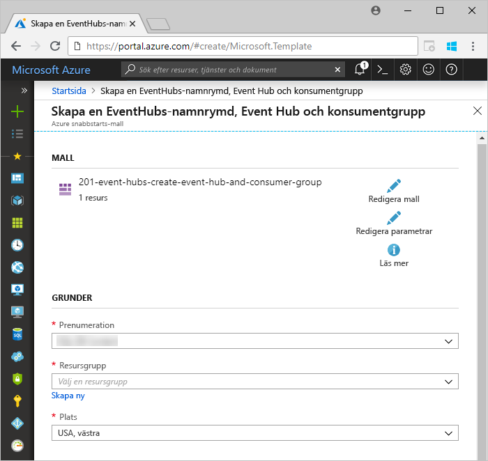
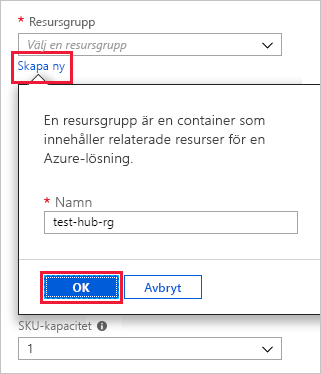
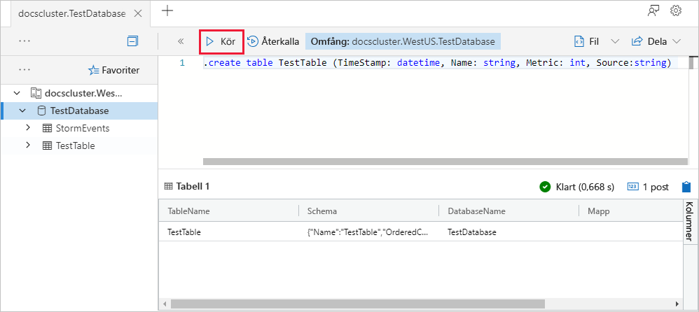
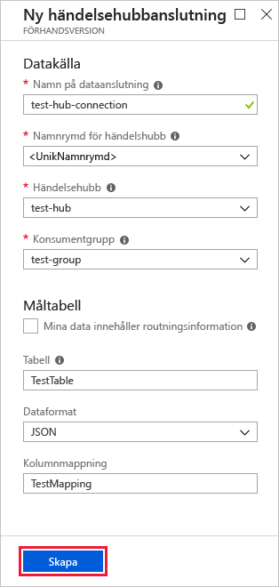
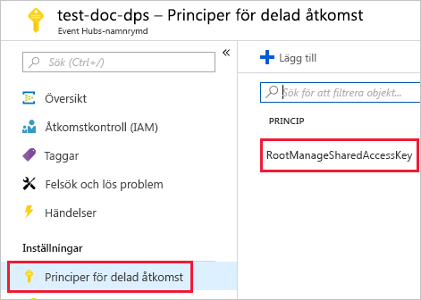
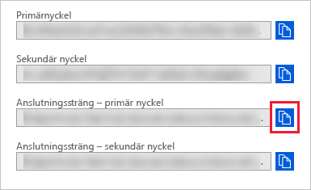
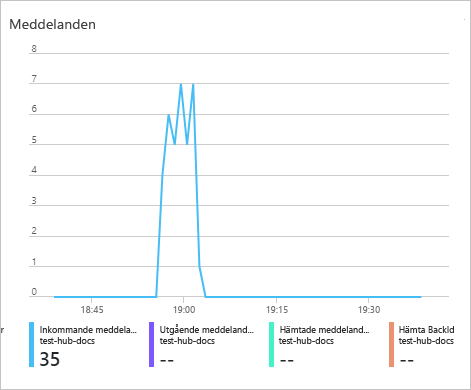
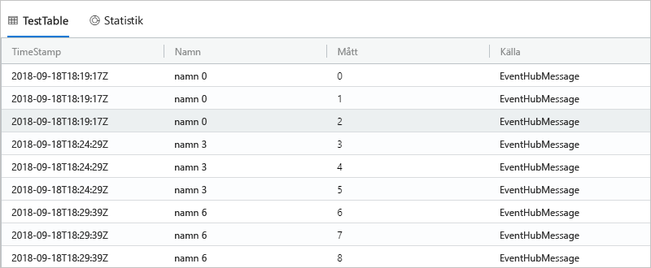

# <a name="quickstart-ingest-data-from-event-hub-into-azure-data-explorer"></a>Snabbstart: Mata in data från Event Hub i Azure Data Explorer

Azure Data Explorer är en snabb och mycket skalbar datautforskningstjänst för logg- och telemetridata. Azure Data Explorer erbjuder inmatning (datainläsning) från Event Hubs, en dataströmningsplattform och händelseinmatningstjänst för stordata. [Event Hubs](/azure/event-hubs/event-hubs-about) kan bearbeta flera miljoner händelser per sekund i nära realtid. I den här snabbstarten ska du skapa en händelsehubb, ansluta till den från Azure Data Explorer och se hur data flödar genom systemet.

## <a name="prerequisites"></a>Nödvändiga komponenter

* Om du inte har en Azure-prenumeration kan du skapa ett [kostnadsfritt Azure-konto](https://azure.microsoft.com/free/) innan du börjar.

* [Ett testkluster och en databas](create-cluster-database-portal.md)

* [En exempelapp](https://github.com/Azure-Samples/event-hubs-dotnet-ingest) som genererar data och skickar dem till en händelsehubb. Ladda ned exempelprogrammet till datorn.

* [Visual Studio 2017 version 15.3.2 eller senare](https://www.visualstudio.com/vs/) för att köra exempelappen

## <a name="sign-in-to-the-azure-portal"></a>Logga in på Azure-portalen

Logga in på [Azure-portalen](https://portal.azure.com/).

## <a name="create-an-event-hub"></a>Skapa en händelsehubb

I den här snabbstarten ska du skapa exempeldata och skicka dem till en händelsehubb. Det första steget är att skapa en händelsehubb. Du kan göra detta med hjälp av en Azure Resource Manager-mall på Azure-portalen.

1. Skapa en händelsehubb genom att använda följande knapp för att starta distributionen. Högerklicka och välj länken **Öppna i nytt fönster** i en annan flik eller ett annat fönster så att du kan följa resten av stegen i den här artikeln.

    [](https://portal.azure.com/#create/Microsoft.Template/uri/https%3A%2F%2Fraw.githubusercontent.com%2FAzure%2Fazure-quickstart-templates%2Fmaster%2F201-event-hubs-create-event-hub-and-consumer-group%2Fazuredeploy.json)

    Knappen **Distribuera till Azure** tar dig till Azure-portalen där du kan fylla i ett distributionsformulär.

    

1. Välj den prenumeration där du vill skapa händelsehubben och skapa en resursgrupp med namnet *test-hub-rg*.

    

1. Fyll i formuläret med följande information.

    

    Använd standardinställningarna för alla inställningar som inte visas i följande tabell.

    **Inställning** | **Föreslaget värde** | **Fältbeskrivning**
    |---|---|---|
    | Prenumeration | Din prenumeration | Välj den Azure-prenumeration som ska användas för händelsehubben.|
    | Resursgrupp | *test-hub-rg* | Skapa en ny resursgrupp. |
    | Plats | *USA, västra* | Välj *USA, västra* för den här snabbstarten. Välj den region som bäst uppfyller dina behov för ett produktionssystem. Skapa händelsehubbens namnområde på samma plats som klustret Kusto för bästa prestanda (viktigast för händelsehubbnamnområden med högt dataflöde).
    | Namn på namnområde | Ett unikt namnområdesnamn | Välj ett unikt namn som identifierar namnområdet. Till exempel *mytestnamespace*. Domännamnet *servicebus.windows.net* läggs till i namnet som du anger. Namnet får endast innehålla bokstäver, siffror och bindestreck. Namnet måste börja med en bokstav och sluta med en bokstav eller siffra. Värdet måste innehålla mellan 6 och 50 tecken.
    | Namn på händelsehubb | *test-hub* | Händelsehubben finns under namnområdet, som tillhandahåller en unik omfångscontainer. Namnet på händelsehubben måste vara unikt inom namnområdet. |
    | Konsumentgruppens namn | *test-group* | Konsumentgrupper gör att flera konsumerande program kan ha en separat vy över händelseströmmen. |
    | | |

1. Välj **Köp**, vilket bekräftar att du skapar resurser i din prenumeration.

1. Välj **Meddelanden** i verktygsfältet för att övervaka etableringsprocessen. Det kan ta flera minuter innan distributionen slutförs, men du kan gå vidare till nästa steg nu.

    

## <a name="create-a-target-table-in-azure-data-explorer"></a>Skapa en måltabell i Azure Data Explorer

Nu ska du skapa en tabell i Azure Data Explorer som Event Hubs skickar data till. Du skapar tabellen i klustret och databasen som etablerades i avsnittet **Förutsättningar**.

1. På Azure-portalen går du till ditt kluster och väljer sedan **Fråga**.

    

1. Kopiera följande kommando till fönstret och välj **Kör** för att skapa den tabell (TestTable) som tar emot insamlade data.

    ```Kusto
    .create table TestTable (TimeStamp: datetime, Name: string, Metric: int, Source:string)
    ```

    

1. Kopiera följande kommando till fönstret och välj **Kör** för att mappa inkommande JSON-data till kolumnnamnen och datatyperna i tabellen (TestTable).

    ```Kusto
    .create table TestTable ingestion json mapping 'TestMapping' '[{"column":"TimeStamp","path":"$.timeStamp","datatype":"datetime"},{"column":"Name","path":"$.name","datatype":"string"},{"column":"Metric","path":"$.metric","datatype":"int"},{"column":"Source","path":"$.source","datatype":"string"}]'
    ```

## <a name="connect-to-the-event-hub"></a>Ansluta till händelsehubben

Nu ansluter du till händelsehubben från Azure-datautforskaren. När den här anslutningen är på plats strömmas data som flödar till händelsehubben till den testtabell som du skapade tidigare i den här artikeln.

1. Välj **Meddelanden** i verktygsfältet för att kontrollera att distributionen av händelsehubben lyckades.

1. Under klustret som du skapade väljer du **Databaser** och sedan **TestDatabase**.

    

1. Välj **Datainmatning** och sedan **Lägg till dataanslutning**.

    

1. Fyll i formuläret med följande information och välj sedan **Skapa**.

    

    Datakälla:

    **Inställning** | **Föreslaget värde** | **Fältbeskrivning**
    |---|---|---|
    | Namn på dataanslutning | *test-hub-connection* | Namnet på anslutningen som du vill skapa i Azure Data Explorer.|
    | Namnområde för händelsehubb | Ett unikt namnområdesnamn | Namnet som du valde tidigare, som identifierar ditt namnområde. |
    | Händelsehubb | *test-hub* | Händelsehubben som du skapade. |
    | Konsumentgrupp | *test-group* | Konsumentgruppen som definierades i hubben som du skapade. |
    | | |

    Måltabell:

    Det finns två alternativ för routning: *statisk* och *dynamisk*. För den här snabbstartsguiden använder du statisk routning (standardinställning), där du anger tabellnamnet, filformatet och mappningen. Låt därför **My data includes routing info** (Mina data innehåller routningsinformation) vara avmarkerat.
    Du kan även använda dynamisk routning, där dina data innehåller den nödvändiga routningsinformationen.

     **Inställning** | **Föreslaget värde** | **Fältbeskrivning**
    |---|---|---|
    | Tabell | *TestTable* | Tabellen som du skapade i **TestDatabase**. |
    | Dataformat | *JSON* | JSON- och CSV-format stöds. |
    | Kolumnmappning | *TestMapping* | Den mappning som du skapade i **TestDatabase**, som mappar inkommande JSON-data till kolumnnamnen och datatyperna i **TestTable**.|
    | | |

## <a name="copy-the-connection-string"></a>Kopiera anslutningssträngen

När du kör den [exempelapp](https://github.com/Azure-Samples/event-hubs-dotnet-ingest) som anges i Nödvändiga komponenter behöver du anslutningssträngen för händelsehubbens namnrymd.

1. Under händelsehubbens namnområde som du skapade väljer du **Policyer för delad åtkomst** och sedan **RootManageSharedAccessKey**.

    

1. Kopiera **Anslutningssträng – primär nyckel**. Du klistrar in den i nästa avsnitt.

    

## <a name="generate-sample-data"></a>Generera exempeldata

Använd den [exempelapp](https://github.com/Azure-Samples/event-hubs-dotnet-ingest) som du laddade ned för att generera data.

1. Öppna exempelapplösningen i Visual Studio.

1. I filen *program.cs* uppdaterar du konstanten `connectionString` till anslutningssträngen som du kopierade från händelsehubbens namnområde.

    ```csharp
    const string eventHubName = "test-hub";
    // Copy the connection string ("Connection string-primary key") from your Event Hub namespace.
    const string connectionString = @"<YourConnectionString>";
    ```

1. Skapa och kör appen. Appen skickar meddelanden till händelsehubben, och den skriver ut status var tionde sekund.

1. När appen har skickat några meddelanden går du vidare till nästa steg där du ska granska dataflödet till händelsehubben och testtabellen.

## <a name="review-the-data-flow"></a>Granska dataflödet

Med appen som genererar data kan du nu se flödet av dessa data från händelsehubben till tabellen i ditt kluster.

1. Under händelsehubben på Azure-portalen ser du en aktivitetstopp när appen körs.

    

1. För att kontrollera hur många meddelanden som nått databasen hittills kör du följande fråga i testdatabasen.

    ```Kusto
    TestTable
    | count
    ```

1. Kör följande fråga för att se innehållet i meddelandena:

    ```Kusto
    TestTable
    ```

    Resultatuppsättningen bör se ut så här:

    

    > [!NOTE]
    > Azure Data Explorer har en sammansättningsprincip (batchbearbetning) för datainmatning som är utformad för att optimera inmatningsprocessen. Principen är konfigurerad till 5 minuter, så det kan förekomma en fördröjning.

## <a name="clean-up-resources"></a>Rensa resurser

Om du inte planerar att använda händelsehubben igen rensar du **test-hub-rg** för att undvika kostnader.

1. Välj **Resursgrupper** i Azure-portalen längst till vänster och välj sedan den resursgrupp du skapat.  

    Om den vänstra menyn är dold väljer du  för att expandera den.

   

1. Under **test-resource-group** väljer du **Ta bort resursgrupp**.

1. I det nya fönstret skriver du namnet på resursgruppen som ska tas bort (*test-hub-rg*) och väljer sedan **Ta bort**.

## <a name="next-steps"></a>Nästa steg

> [!div class="nextstepaction"]
> [Snabbstart: Fråga efter data i Azure Data Explorer](web-query-data.md)
