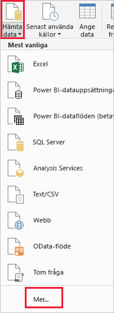
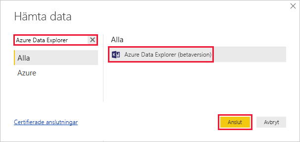
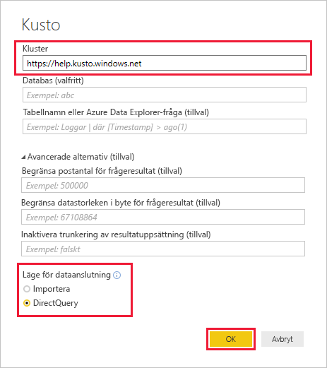
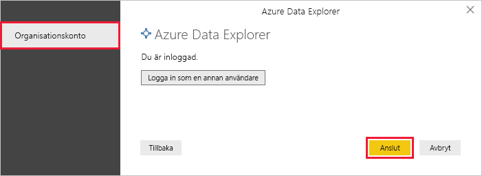
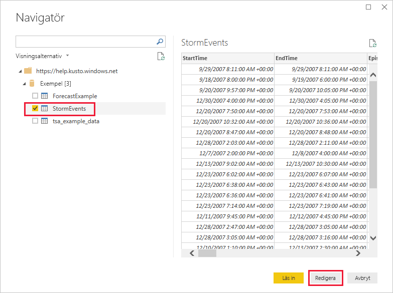
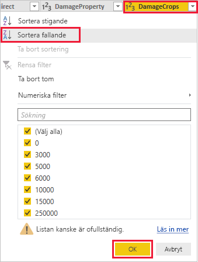
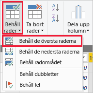
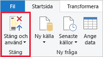

# Visualisera data med Azure Datautforskaren Connector för Power BI

Azure Data Explorer är en snabb och mycket skalbar datautforskningstjänst för logg- och telemetridata. Power BI är en lösning för företagsanalys där du kan visualisera dina data och dela resultaten i hela organisationen. Azure Data Explorer ger tre alternativ för att ansluta till data i Power BI: använda den inbyggda anslutningsappen, importera en fråga från Azure Data Explorer eller använda en SQL-fråga. Den här artikeln visar hur du använder den inbyggda anslutningen för att hämta data och visualisera dem i en Power BI rapport. Det är enkelt att använda Azure Datautforskaren Native Connector för att skapa Power BI-instrumentpaneler. Power BI-anslutningen har stöd för [import-och Direct-frågor för anslutnings läge](https://docs.microsoft.com/power-bi/desktop-directquery-about). Du kan bygga instrument paneler med **import** -eller **DirectQuery** -läge beroende på scenario-, skalnings-och prestanda krav. 

## Förutsättningar

Du behöver följande för att slutföra den här artikeln:

* Om du inte har en Azure-prenumeration kan du skapa ett [kostnadsfritt Azure-konto](https://azure.microsoft.com/free/) innan du börjar.
* En organisations e-postkonto som är medlem i Azure Active directory, så att du kan ansluta till [Azure Data Explorer-hjälpklustret](https://dataexplorer.azure.com/clusters/help/databases/samples).
* [Power BI Desktop](https://powerbi.microsoft.com/get-started/) (klicka på **DOWNLOAD FREE**) (LADDA NED KOSTNADSFRITT)

## Hämta data från Azure Data Explorer

Först ansluter du till Azure Data Explorer-hjälpklustret, och sedan hämtar du in en delmängd av data från tabellen *StormEvents*. [!INCLUDE [data-explorer-storm-events](../../includes/data-explorer-storm-events.md)]

1. I Power BI Desktop går du till fliken **Start**, väljer **Hämta data** och sedan **Mer**.

    

1. Sök efter *azure datautforskaren*, välj **Azure datautforskaren** sedan **Anslut**.

    

1. På sidan **Azure datautforskaren (Kusto)** fyller du i formuläret med följande information.

    

    **Inställning** | **Värde** | **Fältbeskrivning**
    |---|---|---|
    | Kluster | *https://help.kusto.windows.net* | URL för hjälpklustret. För andra kluster är URL:en i formatet *https://\<Klusternamn\>.\<Region\>.kusto.windows.net*. |
    | Databas | Lämna tomt | En databas som finns på det kluster som du ansluter till. Vi väljer detta i ett senare steg. |
    | Tabellnamn | Lämna tomt | En av tabellerna i databasen eller en fråga som <code>StormEvents \| take 1000</code>. Vi väljer detta i ett senare steg. |
    | Avancerade alternativ | Lämna tomt | Alternativ för dina frågor, till exempel storlek på resultatuppsättning. |
    | Dataanslutningsläge | *DirectQuery* | Anger huruvida Power BI importerar data eller ansluter direkt till datakällan. Du kan använda endera alternativ med den här anslutningsappen. |
    | | | |
    
    > [!NOTE]
    > I **import** läge flyttas data till Power BI. I **DirectQuery** -läge frågas data direkt från ditt Azure datautforskaren-kluster.
    >
    > Använd **import** läge när:
    > * Din data uppsättning är liten.
    > * Du behöver inte nästan real tids data. 
    > * Dina data är redan sammansatta eller du utför [agg regering i Kusto](/azure/kusto/query/summarizeoperator#list-of-aggregation-functions)    
    >
    > Använd **DirectQuery** -läge när:
    > * Din data uppsättning är mycket stor. 
    > * Du behöver nära real tids data.   

1. Om du inte redan har en anslutning till hjälpklustret loggar du in. Logga in med ett organisationskonto och välj sedan **Anslut**.

    

1. På skärmen **Navigatör** expanderar du databasen **Exempel**, väljer **StormEvents** och väljer sedan **Redigera**.

    

    Tabellen öppnas i Power Query Editor, där du kan redigera rader och kolumner innan du importerar data.

1. I Power Query Editor väljer du pilen intill kolumnen **DamageCrops** och sedan **Sortera fallande**.

    

1. På fliken **Start** väljer du **Behåll rader** och sedan **Behåll de översta raderna**. Ange värdet *1000* för att hämta de översta 1000 raderna i den sorterade tabellen.

    

1. På fliken **Start** väljer du **Stäng och tillämpa**.

    

## Visualisera data i en rapport

[!INCLUDE [data-explorer-power-bi-visualize-basic](../../includes/data-explorer-power-bi-visualize-basic.md)]

## Rensa resurser

Om du inte längre behöver rapporten som du skapade för den här artikeln tar du bort Power BI Desktop-filen (. pbix).

## Nästa steg

[Tips för att använda Azure Datautforskaren Connector för Power BI för att fråga efter data](power-bi-best-practices.md#tips-for-using-the-azure-data-explorer-connector-for-power-bi-to-query-data)
