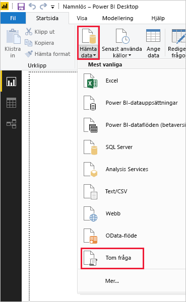
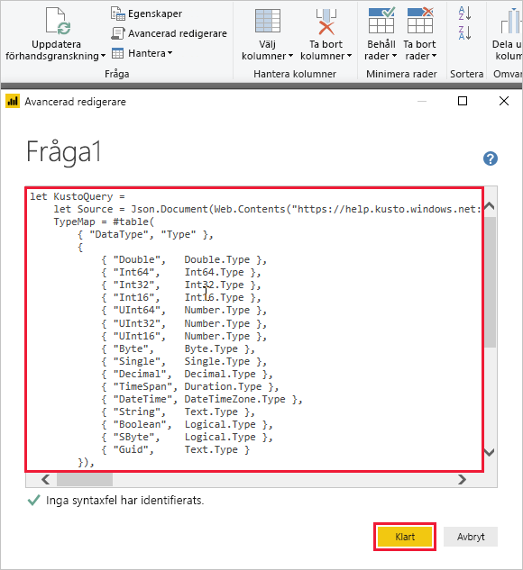
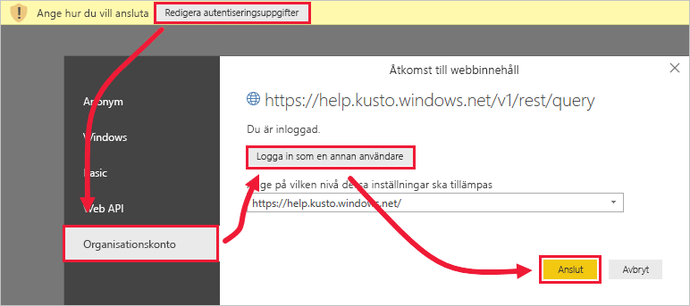
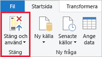

# <a name="quickstart-visualize-data-using-a-query-imported-into-power-bi"></a>Snabbstart: Visualisera data med hjälp av en fråga som importerats till Power BI

Azure Data Explorer är en snabb och mycket skalbar datautforskningstjänst för logg- och telemetridata. Power BI är en lösning för företagsanalys där du kan visualisera dina data och dela resultaten i hela organisationen.

Azure Data Explorer ger tre alternativ för att ansluta till data i Power BI: använda den inbyggda anslutningsappen, importera en fråga från Azure Data Explorer eller använda en SQL-fråga. Den här snabbstarten visar hur du importerar en fråga så att du kan hämta data och visualisera dem i en Power BI-rapport.

Om du inte har en Azure-prenumeration kan du skapa ett [kostnadsfritt Azure-konto](https://azure.microsoft.com/free/) innan du börjar.

## <a name="prerequisites"></a>Nödvändiga komponenter

Du behöver följande för att slutföra den här snabbstarten:

* En organisations e-postkonto som är medlem i Azure Active directory, så att du kan ansluta till [Azure Data Explorer-hjälpklustret](https://dataexplorer.azure.com/clusters/help/databases/samples).

* [Power BI Desktop](https://powerbi.microsoft.com/get-started/) (klicka på **DOWNLOAD FREE**) (LADDA NED KOSTNADSFRITT)

* [Azure Data Explorer-skrivbordsapp](/azure/kusto/tools/kusto-explorer)

## <a name="get-data-from-azure-data-explorer"></a>Hämta data från Azure Data Explorer

Först skapar du en fråga i Azure Data Explorer-skrivbordsappen och exporterar den för användning i Power BI. Sedan ansluter du till Azure Data Explorer-hjälpklustret, och hämtar du en delmängd av data från tabellen *StormEvents*. [!INCLUDE [data-explorer-storm-events](../../includes/data-explorer-storm-events.md)]

1. I en webbläsare går du till [https://help.kusto.windows.net/](https://help.kusto.windows.net/) för att starta Azure Data Explorer-skrivbordsappen.

1. I skrivbordsappen kopierar du följande fråga i det övre högra frågefönstret och kör den.

    ```Kusto
    StormEvents
    | sort by DamageCrops desc
    | take 1000
    ```

    De första raderna i resultatuppsättningen bör likna följande bild.

    

1. På fliken **Verktyg** väljer du **Query to Power BI** (Fråga till Power BI) och sedan **OK**.

    

1. I Power BI Desktop går du till fliken **Start**, väljer **Hämta data** och sedan **Tom fråga**.

    

1. På **startfliken** i Power Query Editor väljer du **Avancerad redigerare**.

1. I fönstret **Avancerad redigerare** klistrar du in frågan du exporterade och väljer **Klar**.

    

1. I Power Query Editor-fönstret väljer du **Redigera autentiseringsuppgifter**. Välj **Organisationskonto**, logga in och välj sedan **Anslut**.

    

1. På fliken **Start** väljer du **Stäng och tillämpa**.

    

## <a name="visualize-data-in-a-report"></a>Visualisera data i en rapport

[!INCLUDE [data-explorer-power-bi-visualize-basic](../../includes/data-explorer-power-bi-visualize-basic.md)]

## <a name="clean-up-resources"></a>Rensa resurser

Om du inte längre behöver den rapport som du skapade för den här snabbstarten kan du ta bort Power BI Desktop-filen (.pbix).

## <a name="next-steps"></a>Nästa steg

> [!div class="nextstepaction"]
> [Snabbstart: Visualisera data med hjälp av en importerad fråga i Power BI](power-bi-sql-query.md)