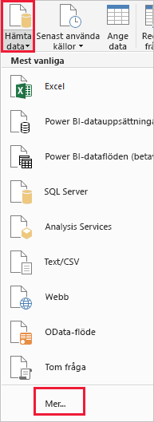
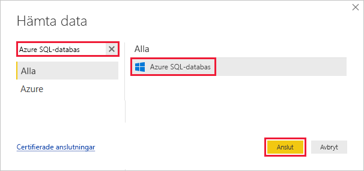
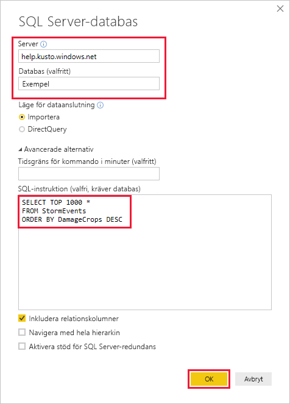
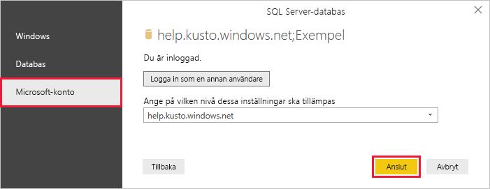
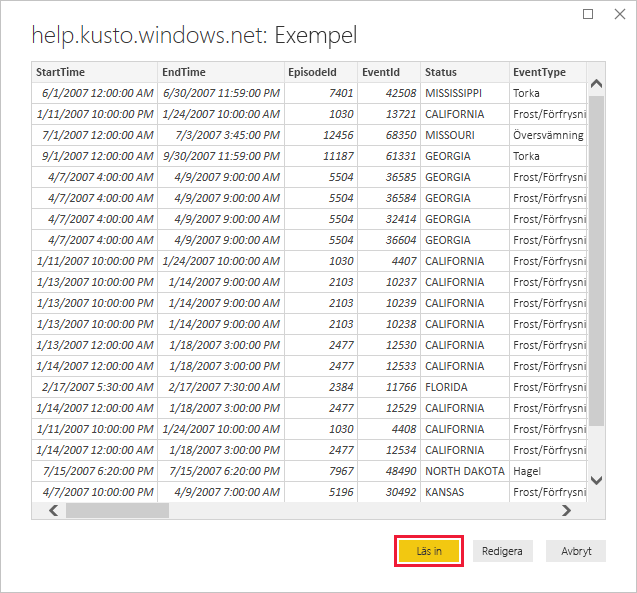

# <a name="quickstart-visualize-data-using-the-azure-data-explorer-connector-for-power-bi"></a>Snabbstart: Visualisera data med Azure Data Explorer-kopplingen för Power BI

Azure Data Explorer är en snabb och mycket skalbar datautforskningstjänst för logg- och telemetridata. Power BI är en lösning för företagsanalys där du kan visualisera dina data och dela resultaten i hela organisationen.

Azure Data Explorer ger tre alternativ för att ansluta till data i Power BI: använda den inbyggda anslutningsappen, importera en fråga från Azure Data Explorer eller använda en SQL-fråga. Den här snabbstarten visar hur du använder en SQL-fråga för att hämta data och visualisera dem i en Power BI-rapport.

Om du inte har en Azure-prenumeration kan du skapa ett [kostnadsfritt Azure-konto](https://azure.microsoft.com/free/) innan du börjar.

## <a name="prerequisites"></a>Förutsättningar

Du behöver följande för att slutföra den här snabbstarten:

* En organisations e-postkonto som är medlem i Azure Active directory, så att du kan ansluta till [Azure Data Explorer-hjälpklustret](https://dataexplorer.azure.com/clusters/help/databases/samples).

* [Power BI Desktop](https://powerbi.microsoft.com/get-started/) (välj **DOWNLOAD FREE**) (Ladda ned kostnadsfritt)

## <a name="get-data-from-azure-data-explorer"></a>Hämta data från Azure Data Explorer

Först ansluter du till Azure Data Explorer-hjälpklustret, och sedan hämtar du in en delmängd av data från tabellen *StormEvents*. [!INCLUDE [data-explorer-storm-events](../../includes/data-explorer-storm-events.md)]

Du använder vanligtvis det interna frågespråket med Azure Data Explorer, men det stöder även SQL-frågor, vilket du använder här. Azure Data Explorer översätter SQL-frågan till en intern fråga.

1. I Power BI Desktop går du till fliken **Start**, väljer **Hämta data** och sedan **Mer**.

    

1. Sök efter *Azure SQL Database*, välj **Azure SQL Database** och sedan **Anslut**.

    

1. På skärmen **SQL Server-databas** fyller du i formuläret med följande information.

    

    **Inställning** | **Värde** | **Fältbeskrivning**
    |---|---|---|
    | Server | *help.kusto.windows.net* | URL för hjälpklustret (utan *https://*). För andra kluster är URL:en i formatet *\<Klusternamn\>.\<Region\>.kusto.windows.net*. |
    | Databas | *Exempel* | Den exempeldatabas som finns på det kluster som du ansluter till. |
    | Dataanslutningsläge | *Importera* | Anger huruvida Power BI importerar data eller ansluter direkt till datakällan. Du kan använda endera alternativ med den här anslutningsappen. |
    | Tidsgräns för kommando | Lämna tomt | Hur länge frågan körs innan den genererar ett tidsgränsfel. |
    | SQL-instruktion | Kopiera frågan under den här tabellen | Den SQL-instruktion som Azure Data Explorer översätter till en intern fråga. |
    | Andra alternativ | Låt vara som standardvärden | Alternativ gäller inte för Azure Data Explorer-kluster. |
    | | | |

    ```SQL
    SELECT TOP 1000 *
    FROM StormEvents
    ORDER BY DamageCrops DESC
    ```

1. Om du inte redan har en anslutning till hjälpklustret loggar du in. Logga in med ett Microsoft-konto och välj sedan **Anslut**.

    

1. På den **help.kusto.windows.net: Exempel** väljer **belastningen**.

    

    Tabellen öppnas i rapportvyn i Power BI-huvudfönstret, där du kan skapa rapporter som baseras på exempeldata.

## <a name="visualize-data-in-a-report"></a>Visualisera data i en rapport

[!INCLUDE [data-explorer-power-bi-visualize-basic](../../includes/data-explorer-power-bi-visualize-basic.md)]

## <a name="clean-up-resources"></a>Rensa resurser

Om du inte längre behöver den rapport som du skapade för den här snabbstarten kan du ta bort Power BI Desktop-filen (.pbix).

## <a name="next-steps"></a>Nästa steg

> [!div class="nextstepaction"]
> [Snabbstart: Visualisera data med hjälp av en fråga för importerade i Power BI](power-bi-connector.md)