# <a name="quickstart-query-data-in-azure-data-explorer"></a>Snabbstart: Fråga efter data i Azure Data Explorer

Azure Data Explorer är en snabb och mycket skalbar datautforskningstjänst för logg- och telemetridata. Azure Data Explorer tillhandahåller en webbapp som gör att du kan köra och dela frågor. Programmet är tillgängligt i Azure-portalen och som en fristående webbapp. I den här artikeln får arbeta du i den fristående versionen, vilket gör det möjligt att ansluta till flera kluster och dela djuplänkar till dina frågor.

Om du inte har en Azure-prenumeration kan du skapa ett [kostnadsfritt Azure-konto](https://azure.microsoft.com/free/) innan du börjar.

## <a name="prerequisites"></a>Nödvändiga komponenter

Förutom en Azure-prenumeration behöver du ett [testkluster och en databas](create-cluster-database-portal.md) för att slutföra den här snabbstarten.

## <a name="sign-in-to-the-application"></a>Logga in på programmet

Logga in på [programmet](https://dataexplorer.azure.com/).

## <a name="add-clusters"></a>Lägga till kluster

Den första gången du öppnar programmet finns det inga anslutningar.


Du måste lägga till en anslutning till minst ett kluster innan du kan börja köra frågor. I det här avsnittet ska du lägga till anslutningar till *hjälpklustret* i Azure Data Explorer som vi har ställt in för att inlärningen, och till testklustret du skapade i en tidigare snabbstarten.

1. Överst till vänster i programmet väljer du **Lägg till kluster**.

1. I den **Lägg till klustret** dialogrutan Ange URI: N och välj sedan **Lägg till**.

   Du kan använda hjälpklustret URI, `https://help.kusto.windows.net`. Om du har ett eget kluster kan du ange URI för ditt kluster. Till exempel `https://mydataexplorercluster.westus.kusto.windows.net` som i följande bild:

    

1. I den vänstra rutan bör du nu se **hjälpklustret**. Expandera **exempeldatabasen** så att du kan se de exempeltabeller som du har åtkomst till.

    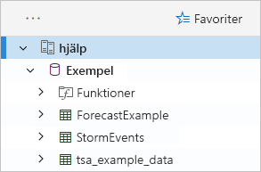

    Vi använder tabellen **StormEvents** senare i den här snabbstarten och i andra Azure Data Explorer-artiklar.

Lägg nu till testklustret som du skapade.

1. Välj **Lägg till kluster**.

1. I dialogrutan **Lägg till kluster** anger du webbadressen för textklustret i formatet `https://<ClusterName>.<Region>.kusto.windows.net/`och väljer sedan **Lägg till**.

    I exemplet nedan ser du **hjälpklustret** och ett nytt kluster, **docscluster.westus** (den fullständiga webbadressen är `https://docscluster.westus.kusto.windows.net/`).

    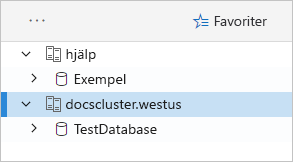

## <a name="run-queries"></a>Köra frågor

Du kan nu köra frågor mot ett kluster som du är ansluten till (förutsatt att du har data i ditt testkluster). Vi fokuserar på de **hjälpklustret**.

1. I det vänstra fönstret under **hjälpklustret** väljer du databasen **Exempel**.

1. Kopiera och klistra in följande fråga i frågefönstret. Välj **Kör** högst upp i fönstret.

    ```Kusto
    StormEvents
    | sort by StartTime desc
    | take 10
    ```
    Den här frågan returnerar de 10 senaste posterna i tabellen **StormEvents**. Den vänstra sidan av resultatet ska se ut som i följande tabell.

    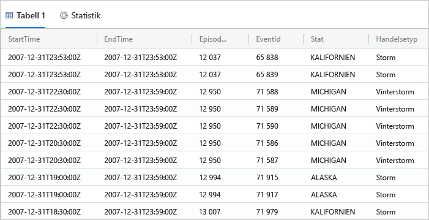

    Följande bild visar de tillstånd som programmet nu bör finnas på, med tillagda kluster till och en fråga med resultat.

    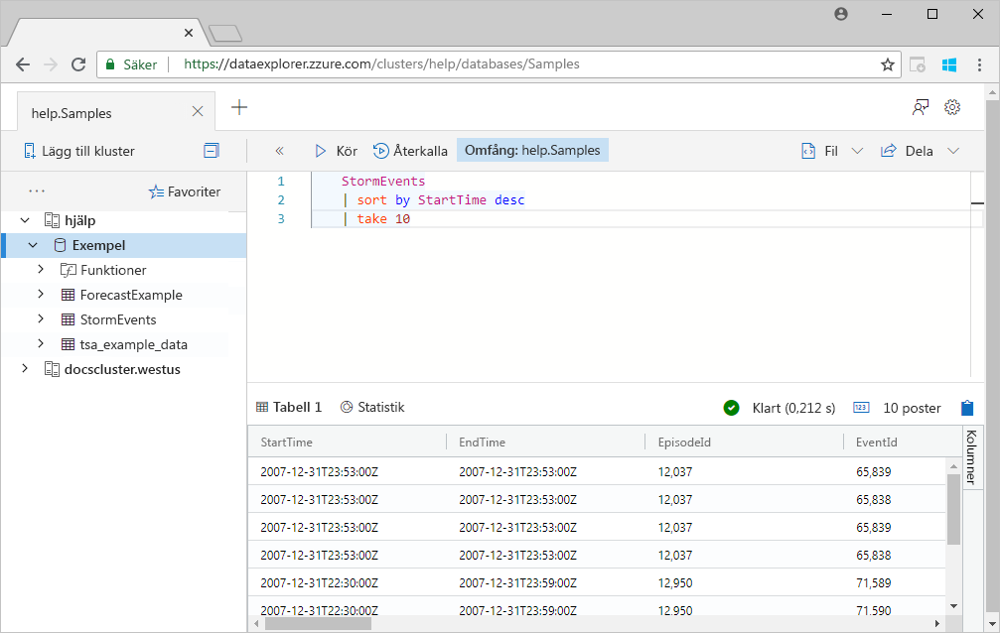

1. Kopiera och klistra in följande fråga i frågefönstret under den första frågan. Observera att den inte har formaterats på separata rader som den första frågan.

    ```Kusto
    StormEvents | sort by StartTime desc | project StartTime, EndTime, State, EventType, DamageProperty, EpisodeNarrative | take 10
    ```

1. Klicka på ny fråga i fönstret, vilket väljer fråga. Tryck på Skift + Alt + F för att formatera frågan, så att den ser ut som följande.

    

1. Tryck på SKIFT + RETUR, vilket är en genväg för att köra en fråga.

   Den här frågan returnerar samma poster som den första, men innehåller bara de kolumner som anges i instruktionen `project`. Resultatet ska se ut som i följande tabell.

    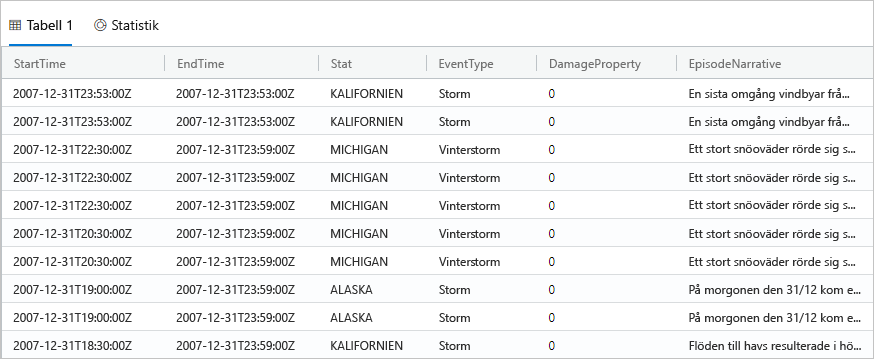

1. Välj **Återkalla** högst upp i frågefönstret.

    Frågefönstret visar nu resultatuppsättningen från den första frågan utan att du kör frågan på nytt. Ofta under analyser kör du flera frågor, och via **Återkalla** kan du gå tillbaka till resultatet för föregående frågor.

1. Nu ska vi köra en fråga till för att se en annan typ av utdata.

    ```Kusto
    StormEvents
    | summarize event_count=count(), mid = avg(BeginLat) by State
    | sort by mid
    | where event_count > 1800
    | project State, event_count
    | render columnchart
    ```
    Resultatet ska se ut som i följande diagram.

    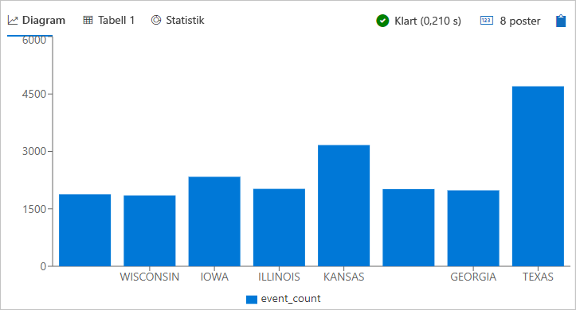

## <a name="work-with-the-table-grid"></a>Arbeta med tabellrutnätet

När du har sett hur grundläggande frågor fungerar ska vi titta på hur du kan använda tabellrutnätet för att anpassa resultat och göra ytterligare analyser.

1. Kör om den första frågan. Håll musen över kolumnen **Tillstånd**, markera menyn och välj **Gruppera efter tillstånd**.

    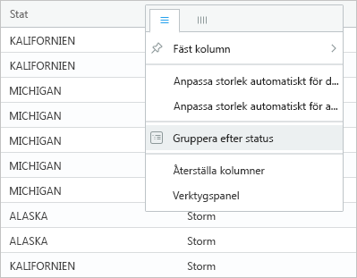

1. I rutnätet expanderar du **Kalifornien** att se poster för den delstaten.

    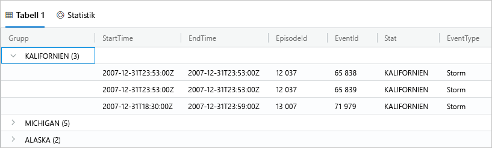

    Den här typen av gruppering kan vara användbar när du gör undersökande analys.

1. Håll musen över kolumnen **Grupp** och välj sedan **Återställ kolumner**.

    

    Det här returnerar rutnätet till det ursprungliga tillståndet.

1. Kör följande fråga.

    ```Kusto
    StormEvents
    | sort by StartTime desc
    | where DamageProperty > 5000
    | project StartTime, State, EventType, DamageProperty, Source
    | take 10
    ```

1. Till höger i rutnätet väljer **Kolumner** för att se verktygspanelen.

    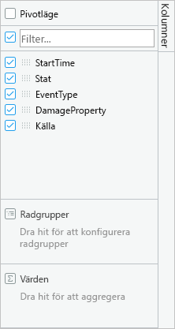

    Den här panelen fungerar på samma sätt som pivottabellens fältlista i Excel, så att du kan göra mer analyser i själva rutnätet.

1. Välj **Pivot-läge** och dra sedan kolumnerna så här: **State** (Tillstånd) till **Radgrupper**, **DamageProperty** (Egendomsskada) till **Värden** och **EventTyp** (Händelsetyp) till **Kolumnetiketter**.  

    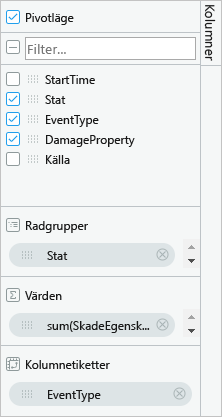

    Resultatet ska se ut som i följande pivottabell.

    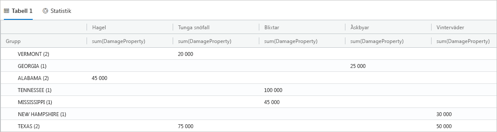

    Observera hur Vermont och Alabama ha två händelser vardera under samma kategori, medan Texas har två händelser i olika kategorier. Pivottabeller gör det möjligt att snabbt hitta sådana här saker, så de är ett bra verktyg för snabb analys.

## <a name="share-queries"></a>Dela frågor

Många gånger vill du dela frågor som du skapar. Du kan ange en djuplänk så att andra användare med åtkomst till klustret kan köra frågor.

1. Välj den första frågan som du kopierade i frågefönstret.

1. Välj **Dela** högst upp i frågefönstret.

1. Välj **Link, query to clipboard** (Länk, fråga till urklipp).

1. Kopiera länk och frågan till en textfil.

1. Klistra in länken i ett nytt webbläsarfönster. Resultatet ska se ut som nedan när frågan har körts.

    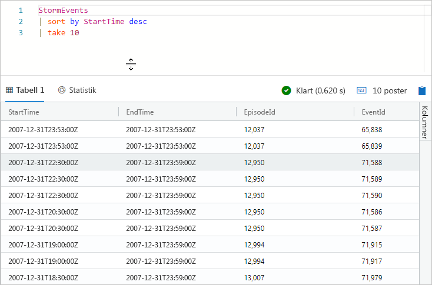

## <a name="provide-feedback"></a>Ge feedback

Datautforskaren är för närvarande preliminär och vi tar gärna emot feedback om din upplevelse. Du kan göra det nu eller vänta tills du har hållit på med den längre.

1. I det övre högra hörnet av programmet väljer du ikonen feedback: .

1. Ange din feedback och välj sedan **Skicka**.

## <a name="clean-up-resources"></a>Rensa resurser

Du inte har skapat några resurser i den här snabbstarten, men om du vill ta bort ett kluster eller båda två från programmet högerklickar du på klustret och väljer **Ta bort anslutning**.

## <a name="next-steps"></a>Nästa steg

> [!div class="nextstepaction"]
> [Skriva frågor för Azure Data Explorer](write-queries.md)
