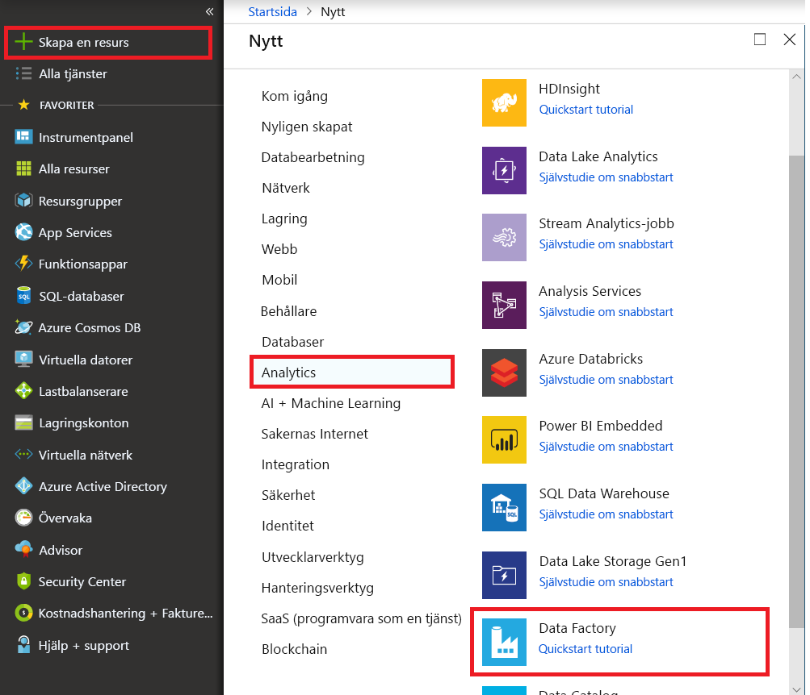

# Läs in data från Office 365 med hjälp av Azure Data Factory

[!INCLUDE[appliesto-adf-xxx-md](includes/appliesto-adf-xxx-md.md)]

Den här artikeln visar hur du använder Data Factory _läsa in data från Office 365 till Azure Blob Storage_. Du kan följa liknande steg för att kopiera data till Azure Data Lake gen1 eller Gen2. Se [artikeln om office 365-koppling](connector-office-365.md) om hur du kopierar data från Office 365 i allmänhet.

## Skapa en datafabrik

1. På den vänstra menyn väljer du **skapa en resurs**  >  **analys**  >  **Data Factory**: 
   
   

2. På sidan **ny data fabrik** anger du värden för de fält som visas i följande bild:
      
   
 
    * **Namn**: Ange ett globalt unikt namn för din Azure Data Factory. Om du får felet "Data Factory name *LoadFromOffice365Demo* är inte tillgängligt" anger du ett annat namn på data fabriken. Du kan till exempel använda namnet _**dittnamn**_**LoadFromOffice365Demo**. Försök att skapa data fabriken igen. Se artikeln [Data Factory – namnregler](naming-rules.md) för namnregler för Data Factory-artefakter.
    * **Prenumeration**: Välj din Azure-prenumeration där du vill skapa data fabriken. 
    * **Resurs grupp**: Välj en befintlig resurs grupp i list rutan eller Välj alternativet för att **Skapa nytt** och ange namnet på en resurs grupp. Mer information om resursgrupper finns i [Använda resursgrupper till att hantera Azure-resurser](../azure-resource-manager/management/overview.md).  
    * **Version**: Välj **V2**.
    * **Plats**: Välj plats för data fabriken. Endast platser som stöds visas i listrutan. De data lager som används av Data Factory kan finnas på andra platser och regioner. Dessa data lager omfattar Azure Data Lake Store, Azure Storage, Azure SQL Database och så vidare.

3. Välj **Skapa**.
4. När du har skapat filen går du till din data fabrik. Du ser **Data Factory** start sida så som visas i följande bild:
   
   

5. Välj panelen **Författare och övervakare** för att starta dataintegreringsprogrammet på en separat flik.

## Skapa en pipeline

1. På sidan "Låt oss komma igång" väljer du **skapa pipeline**.
 
    

2. På **fliken Allmänt** för pipelinen anger du "CopyPipeline" som **namn** på pipelinen.

3. I rutan aktiviteter > flytta & transformera kategori > drar och släpper du **kopierings aktiviteten** från verktygs rutan till pipelinens design yta. Ange "CopyFromOffice365ToBlob" som aktivitets namn.

### Konfigurera källan

1. Gå till fliken pipeline > **källa**, klicka på **+ ny** för att skapa en käll data uppsättning. 

2. I fönstret ny data uppsättning väljer du **Office 365** och väljer sedan **Fortsätt**.
 
3. Du är nu på fliken Kopiera aktivitets konfiguration. Klicka på knappen **redigera** bredvid Office 365-datauppsättningen för att fortsätta med data konfigurationen.

    
 
4. Du ser att en ny flik öppnas för Office 365-datauppsättning. På **fliken Allmänt** längst ned i fönstret Egenskaper anger du "SourceOffice365Dataset" som namn.
 
5. Gå till **fliken anslutning** i fönstret Egenskaper. Klicka på **+ ny** bredvid text rutan länkad tjänst.

6. I fönstret ny länkad tjänst anger du "Office365LinkedService" som namn, anger tjänstens huvud namns-ID och tjänstens huvud namns nyckel. testa sedan anslutning och välj **skapa** för att distribuera den länkade tjänsten.

    
 
7. När du har skapat den länkade tjänsten kommer du tillbaka till inställningarna för datauppsättningen. Välj nedpilen bredvid **tabell** för att expandera listan över tillgängliga Office 365-datauppsättningar och välj BasicDataSet_v0. Message_v0 "i list rutan:

    

8. Gå nu tillbaka till fliken **pipeline**-  >  **källa** om du vill fortsätta konfigurera ytterligare egenskaper för data extrahering i Office 365.  Filter för användar omfång och användar omfång är valfria predikat som du kan definiera för att begränsa de data som du vill extrahera från Office 365. Se avsnittet [Egenskaper för Office 365-datauppsättning](./connector-office-365.md#dataset-properties) för hur du konfigurerar de här inställningarna.

9. Du måste välja ett av datum filtren och ange start tid och slut tid.

10. Klicka på fliken **Importera schema** för att importera schemat för meddelande data uppsättning.

    

### Konfigurera kanalmottagare

1. Gå till fliken pipeline > **mottagare** och välj **+ ny** för att skapa en data uppsättning för mottagare.
 
2. I fönstret ny data uppsättning ser du att endast de destinationer som stöds är markerade när du kopierar från Office 365. Välj **Azure Blob Storage**, Välj binärt format och välj sedan **Fortsätt**.  I den här självstudien kopierar du Office 365-data till ett Azure-Blob Storage.

3. Klicka på knappen **redigera** bredvid Azure Blob Storage data uppsättningen för att fortsätta med data konfigurationen.

4. På **fliken Allmänt** i fönstret Egenskaper anger du "OutputBlobDataset" i namn.

5. Gå till **fliken anslutning** i fönstret Egenskaper. Vid textrutan Länkad tjänst väljer du **+ Nytt**.

6. I fönstret ny länkad tjänst anger du "AzureStorageLinkedService" som namn, väljer "tjänstens huvud namn" i list rutan över autentiseringsmetoder, fyller i tjänstens slut punkt, klient organisation, tjänstens huvud namns-ID och tjänstens huvud namns nyckel och väljer sedan Spara för att distribuera den länkade tjänsten.  [Här](connector-azure-blob-storage.md#service-principal-authentication) kan du läsa om hur du ställer in autentisering av tjänstens huvud namn för Azure Blob Storage.

    

## Verifiera pipeline

Verifiera pipelinen genom att välja **Verifiera** i verktygsfältet.

Du kan också se den JSON-kod som är kopplad till pipelinen genom att klicka på kod längst upp till höger.

## Publicera pipelinen

I det översta verktygsfältet väljer du **publicera alla**. Med den här åtgärden publicerar du enheter (datauppsättningar och pipelines) som du skapat i datafabriken.

 

## Utlös pipelinen manuellt

Välj **Lägg till utlösare** i verktygsfältet och välj sedan **Utlös nu**. På sidan Pipeline Run (Pipelinekörning) väljer du **Slutför**. 

## Övervaka pipeline

Gå till fliken **Övervaka** till vänster. Du ser en pipelinekörning som är utlöst av en manuell utlösare. Du kan använda länkar i kolumnen **åtgärder** för att Visa aktivitets information och köra pipelinen igen.

 

Om du vill se aktivitetskörningar som är associerade med pipelinekörningen, väljer du länken **View Activity Runs** (Visa aktivitetskörningar) i kolumnen Actions (Åtgärder). Det finns bara en aktivitet i det här exemplet. Därför visas bara en post i listan. Om du vill se mer information om kopieringsåtgärden väljer du länken för **detaljer** (glasögonikonen) i kolumnen Actions (Åtgärder).

 

Om det här är första gången du begär data för den här kontexten (en kombination av vilken data tabell som ska nås, vilket mål konto som läses in i och vilken användar identitet som gör data åtkomst förfrågan) visas status för kopierings aktiviteten som **pågående** och endast när du klickar på länken "information" under åtgärder visas statusen som **RequesetingConsent**.  En medlem i gruppen för godkännande av data åtkomst måste godkänna begäran i Privileged Access Management innan data extraheringen kan fortsätta.

_Status som begärt godkännande:_ 
  

_Status som extraherar data:_

 

När godkännandet har tillhandahållits kommer data extraheringen att fortsätta och efter en stund visas pipeline-körningen som slutförd.

 

Gå nu till Azures Azure-Blob Storage och kontrol lera att Office 365-data har extraherats i binärt format.

## Nästa steg

Gå vidare till följande artikel om du vill lära dig mer om Azure Synapse Analytics-support: 

> [!div class="nextstepaction"]
>[Office 365-anslutningsapp](connector-office-365.md)