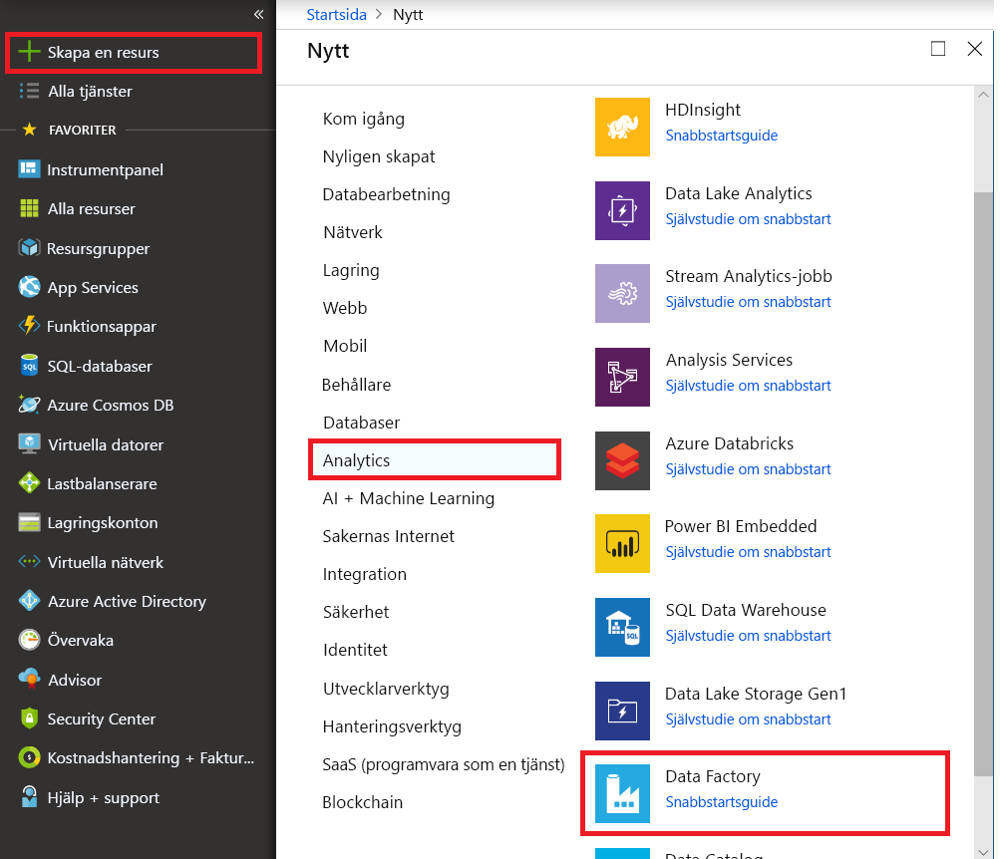
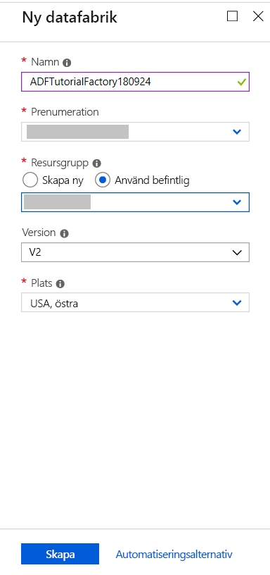
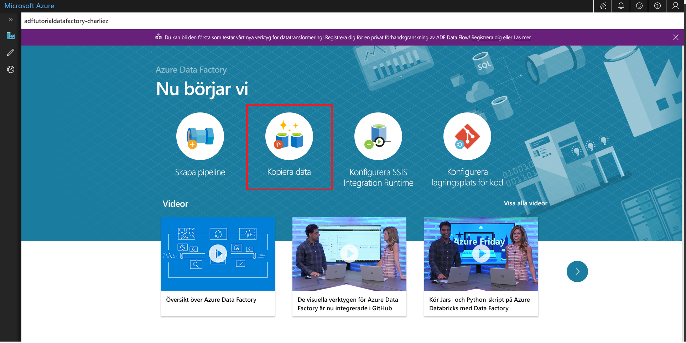

# Kopiera data med verktyget Kopiera data 
> [!div class="op_single_selector" title1="Select the version of Data Factory service that you are using:"]
> * [Version 1 – allmänt tillgänglig](v1/data-factory-copy-data-from-azure-blob-storage-to-sql-database.md)
> * [Version 2 – förhandsversion](quickstart-create-data-factory-copy-data-tool.md)

I den här snabbstarten använder du Azure-portalen för att skapa en datafabrik. Sedan använder du verktyget Kopiera data för att skapa en pipeline som kopierar data från en mapp i en Azure Blob Storage till en annan mapp. 

> [!NOTE]
> Om du inte har använt Azure Data Factory tidigare kan du läsa [Introduktion till Azure Data Factory](data-factory-introduction.md). 
>
> Den här artikeln gäller för version 2 av Data Factory, som för närvarande är en förhandsversion. Om du använder version 1 av tjänsten som är allmänt tillgänglig ska du läsa [Kom igång med Data Factory version 1](v1/data-factory-copy-data-from-azure-blob-storage-to-sql-database.md).

[!INCLUDE [data-factory-quickstart-prerequisites](../../includes/data-factory-quickstart-prerequisites.md)] 

## Skapa en datafabrik

1. Välj **Nytt** på den vänstra menyn, välj **Data och analys** och välj sedan **Data Factory**. 
   
   
2. På sidan **Ny datafabrik** anger du **ADFTutorialDataFactory** som **Namn**. 
      
   
 
   Namnet på Azure Data Factory måste vara *globalt unikt*. Om du ser följande fel ändrar du namnet på datafabriken (till exempel **&lt;dittnamn&gt;ADFTutorialDataFactory**) och provar att skapa fabriken igen. Namngivningsregler för Data Factory-artefakter finns i artikeln [Data Factory – namnregler](naming-rules.md).
  
   
3. Välj den Azure-prenumeration där du vill skapa den nya datafabriken för **Prenumeration**. 
4. För **Resursgrupp** utför du något av följande steg:
     
   - Välj **Använd befintlig** och välj en befintlig resursgrupp från listan. 
   - Välj **Skapa ny** och ange namnet på en resursgrupp.   
         
   Mer information om resursgrupper finns i [Använda resursgrupper till att hantera Azure-resurser](../azure-resource-manager/resource-group-overview.md).  
4. För **Version** väljer du **V2 (förhandsversion)**.
5. För **Plats** väljer du en plats för datafabriken. 

   Endast platser som stöds visas på listan. Datalager (som Azure Storage och Azure SQL Database) och beräkningar (som HDInsight) som används i Data Factory kan finnas på andra platser/regioner.

6. Välj **fäst till instrumentpanelen**.     
7. Välj **Skapa**.
8. Du ser följande panel på instrumentpanelen med statusen **Distribuerar datafabrik**: 

    
9. När datafabriken har skapats visas sidan **Datafabrik**. Välj panelen **Författare och övervakare** för att starta användargränssnittet för Azure Data Factory på en separat flik.
   
   

## Starta verktyget Kopiera data

1. Sidan **Nu sätter vi igång** visas. Välj panelen **Kopiera data** för att starta verktyget kopieringsdata. 

   
2. Välj **Nästa** på sidan **Egenskaper** för verktyget Kopiera data. Du kan ange ett namn och en beskrivning för pipelinen på den här sidan. 

   
3. Välj **Azure Blob Storage** på sidan om **källdatalager** och klicka på **Nästa**.

   
4. Sidan för att **ange Azure Blob Storage-konto** visas. Välj ditt lagringskonto i listan med **lagringskontonamn** och välj sedan **Nästa**. 

   
5. Gör följande på sidan för att **välja indatafil eller -mapp**:

   a. Bläddra till mappen **adftutorial/input**.

   b. Välj filen **emp.txt**.

   c. Klicka på **Välj**. Du kan hoppa över det här steget genom att dubbelklicka på **emp.txt**.

   d. Välj **Nästa**. 

   
6. Sidan med **filformatsinställningar** visas. Observera att verktyget automatiskt identifierar kolumn- och radavgränsare och klicka på **Nästa**. Du kan också förhandsgranska data och visa scheman för indata på den här sidan. 

   
7. Sidan **Destination data store** (Måldatalager) visas. Välj **Azure Blob Storage** och sedan **Nästa**. 

       
8. Sidan för att **ange Azure Blob Storage-konto** visas. Välj ditt Azure Blob Storage-konto och sedan **Nästa**. 

   
9. Gör följande på sidan **Choose the output file or folder** (Välj utdatafil eller -mapp): 

   a. Ange **adftutorial/output** som mappsökväg.

   b. Ange **emp.txt** som filnamn.

   c. Välj **Nästa**. 

    
10. Sidan med **filformatsinställningar** visas. Välj **Nästa**. 

    
11. Sidan **Settings** (Inställningar) visas. Välj **Nästa**. 

    
12. Granska alla inställningar på sidan **Summary** (Sammanfattning) och klicka på **Nästa**. 

    
13. Sidan om att **distributionen har slutförts** visas. Välj **Övervaka** om du vill övervaka den pipeline du har skapat. 

    
14. Programmet växlar till fliken **Övervaka**. På den här fliken visas status för pipelinen. Om du vill uppdatera listan väljer du **Refresh** (Uppdatera). 
    
    
15. Välj länken **View Activity Runs** (Visa aktivitetskörningar) i kolumnen **Actions** (Åtgärder). Pipelinen har endast en aktivitet av typen **Kopiera**. 

    
16. Om du vill se mer information om kopieringsåtgärden väljer du länken **Detaljer** (glasögonbilden) i kolumnen **Actions** (Åtgärder). Mer information om egenskaperna finns i [Copy Activity overview](copy-activity-overview.md) (Översikt över kopieringsaktivitet). 

    
17. Verifiera att filen **emp.txt** har skapats i mappen **output** för behållaren **adftutorial**. Om utdatamappen inte finns skapas den automatiskt av Data Factory-tjänsten. 
18. Välj fliken **Edit** (Redigera) så kan du redigera länkade tjänster, datauppsättningar och pipeliner. Mer information om hur du redigerar dessa i användargränssnittet för Data Factory finns i [Skapa en datafabrik med hjälp av Azure-portalen](quickstart-create-data-factory-portal.md).

    

## Nästa steg
Pipelinen i det här exemplet kopierar data från en plats till en annan i Azure Blob Storage. Gå igenom [självstudiekurserna](tutorial-copy-data-portal.md) om du vill lära dig hur du använder Data Factory i fler scenarier. 