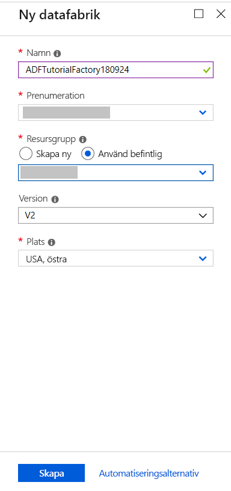
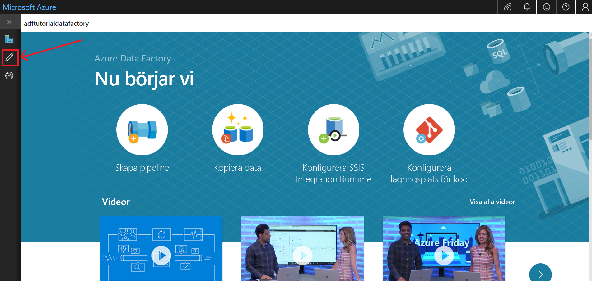
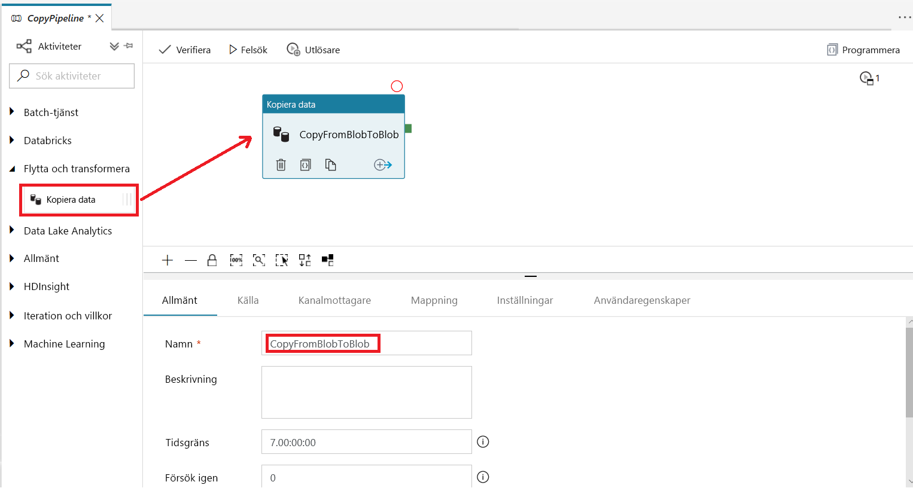
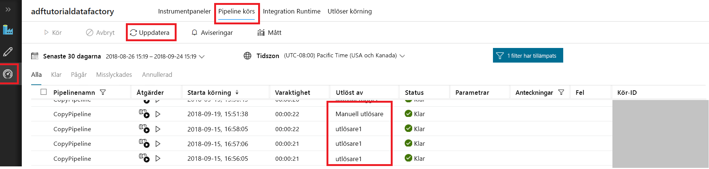
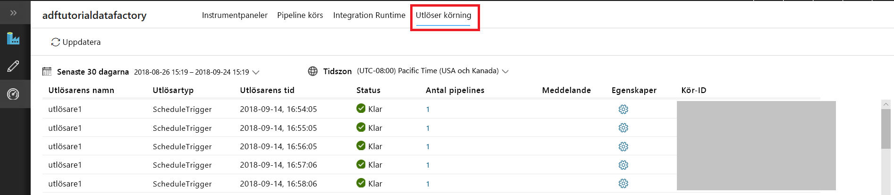

# Skapa en datafabrik med hjälp av gränssnittet i Azure Data Factory
> [!div class="op_single_selector" title1="Select the version of Data Factory service that you are using:"]
> * [Version 1 – allmänt tillgänglig](v1/data-factory-copy-data-from-azure-blob-storage-to-sql-database.md)
> * [Version 2 – förhandsversion](quickstart-create-data-factory-portal.md)

Den här snabbstarten beskriver hur du använder Azure Data Factory-användargränssnittet till att skapa och övervaka en datafabrik. Den pipeline du skapar i den här datafabriken *kopierar* data från en mapp till en annan mapp i Azure Blob Storage. Om du vill se en självstudie som visar hur du *omvandlar* data med Azure Data Factory går du till [Tutorial: Transform data using Spark](tutorial-transform-data-spark-portal.md) (Självstudie: Omvandla data med Spark). 

> [!NOTE]
> Om du inte har använt Azure Data Factory tidigare kan du läsa [Introduktion till Azure Data Factory](data-factory-introduction.md). 
>
> Den här artikeln gäller för version 2 av Data Factory, som för närvarande är en förhandsversion. Om du använder version 1 av tjänsten som är allmänt tillgänglig ska du läsa [Introduktion till Data Factory version 1](v1/data-factory-copy-data-from-azure-blob-storage-to-sql-database.md).

[!INCLUDE [data-factory-quickstart-prerequisites](../../includes/data-factory-quickstart-prerequisites.md)] 

### Video 
Om du tittar på den här videon får du hjälp med att förstå Data Factory-användargränssnittet: 
>[!VIDEO https://channel9.msdn.com/Shows/Azure-Friday/Visually-build-pipelines-for-Azure-Data-Factory-v2/Player]

## Skapa en datafabrik

1. Gå till [Azure-portalen](https://portal.azure.com). 
2. Välj **Nytt** på den vänstra menyn, välj **Data och analys** och välj sedan **Data Factory**. 
   
   
2. På sidan **Ny datafabrik** anger du **ADFTutorialDataFactory** som **Namn**. 
      
   
 
   Namnet på Azure-datafabriken måste vara *globalt unikt*. Om du ser följande fel ändrar du namnet på datafabriken (till exempel **&lt;dittnamn&gt;ADFTutorialDataFactory**) och provar att skapa fabriken igen. Namngivningsregler för Data Factory-artefakter finns i artikeln [Data Factory – namnregler](naming-rules.md).
  
   
3. Välj den Azure-prenumeration där du vill skapa den nya datafabriken för **Prenumeration**. 
4. För **Resursgrupp** utför du något av följande steg:
     
   - Välj **Använd befintlig** och välj en befintlig resursgrupp från listan. 
   - Välj **Skapa ny** och ange namnet på en resursgrupp.   
         
   Mer information om resursgrupper finns i [Använda resursgrupper till att hantera Azure-resurser](../azure-resource-manager/resource-group-overview.md).  
4. För **Version** väljer du **V2 (förhandsgranskning)**.
5. För **Plats** väljer du en plats för datafabriken.

   I listan visas endast platser som kan användas i Data Factory. Datalager (som Azure Storage och Azure SQL Database) och beräkningar (som HDInsight) som används i Data Factory kan finnas på andra platser.
6. Välj **Fäst på instrumentpanelen**.     
7. Välj **Skapa**.
8. Du ser följande panel på instrumentpanelen med statusen **Distribuerar datafabrik**: 

   
9. När datafabriken har skapats visas sidan **Datafabrik**. Välj panelen **Författare och övervakare** för att starta användargränssnittet för Azure Data Factory på en separat flik.
   
   
10. På sidan **Nu sätter vi igång** växlar du till fliken **Redigera** i den vänstra panelen. 

    

## Skapa en länkad tjänst
I den här proceduren skapar du en länkad tjänst för att länka ditt Azure Storage-konto till datafabriken. Den länkade tjänsten har anslutningsinformationen som Data Factory-tjänsten använder vid körning för att ansluta till den.

1. Klicka på **Anslutningar** och sedan på knappen **Nytt** i verktygsfältet. 

       
2. På sidan **New Linked Service** (Ny länkad tjänst) väljer du **Azure Blob Storage** och klickar på **Fortsätt**. 

   
3. Utför följande steg: 

   a. Som **Namn** anger du **AzureStorageLinkedService**.

   b. Som **Lagringskontonamn** väljer du namnet på ditt Azure Storage-konto.

   c. Välj **Testanslutning** och bekräfta att Data Factory-tjänsten kan ansluta till lagringskontot. 

   d. Välj **Spara** för att spara den länkade tjänsten. 

    
4. Bekräfta att du kan se **AzureStorageLinkedService** i listan över länkade tjänster. 

   

## Skapa datauppsättningar
I den här proceduren skapar du två datauppsättningar: **InputDataset** och **OutputDataset**. Dessa datauppsättningar är av typen **AzureBlob**. De refererar till den länkade Azure Storage-tjänst du skapade i föregående avsnitt. 

Datauppsättningen för indata representerar källdata i indatamappen. I definitionen av datauppsättningen för indata anger du blobbehållaren (**adftutorial**), mappen (**input**) och filen (**emp.txt**) som innehåller källdata. 

Datauppsättningen för utdata representerar de data som kopieras till målet. I definitionen av datauppsättningen för utdata anger du blobbehållaren (**adftutorial**), mappen (**output**) och filen som data ska kopieras till. Varje pipelinekörning har ett unikt ID tilldelat. Du kan komma åt detta ID via systemvariabeln **RunId**. Namnet på utdatafilen utvärderas dynamiskt baserat på pipelinens körnings-ID.   

I den länkade tjänstinställningen angav du Azure-lagringskontot som innehåller källdata. I inställningarna för källdatauppsättningen anger du exakt var källdata finns (blobbehållare, mapp och fil). I inställningarna för mottagaruppsättningen anger du var du vill kopiera data (blobbehållare, mapp och fil). 
 
1. Klicka på knappen **+** (plus) och välj **Datauppsättning**.

   
2. I fönstret **Ny datauppsättning** väljer du **Azure Blob Storage** och klickar på **Slutför**. 

   
3. I datauppsättningens **egenskapsfönster** anger du **InputDataset** som **namn**. 

   
4. Växla till fliken **Anslutning** och utför följande steg: 

   a. För **Länkad tjänst** väljer du **AzureStorageLinkedService**.

   b. För **Filsökväg** väljer du knappen **Bläddra**.

       c. I fönstret för att **välja en fil eller mapp** navigerar du till mappen **input** i behållaren **adftutorial**, väljer filen **emp.txt** och väljer sedan **Slutför**.

      
    
   d. (valfritt) Välj **Förhandsgranska data** om du vill förhandsgranska data i filen emp.txt.     
5. Upprepa stegen för att skapa datauppsättningen för utdata:  

   a. Klicka på knappen **+** (plus) och välj **Datauppsättning**.

   b. I fönstret **Ny datauppsättning** väljer du **Azure Blob Storage** och klickar på **Slutför**.

   c. Ange**OutputDataset** som namn.

   d. Ange **adftutorial/output** för mappen. Kopieringsaktiviteten skapar utdatamappen om den inte finns.

   e. Ange `@CONCAT(pipeline().RunId, '.txt')` för filnamnet. 
   
      Varje gång du kör en pipeline har pipelinekörningen ett unikt ID kopplat till sig. Uttrycket sammanfogar körnings-ID:t för pipelinen med **.txt** för att utvärdera utdatafilnamnet. En lista över systemvariabler och uttryck som stöds finns i [Systemvariabler](control-flow-system-variables.md) och [Uttrycksspråk](control-flow-expression-language-functions.md).

   

## Skapa en pipeline 
I den här proceduren skapar och verifierar du en pipeline med en kopieringsaktivitet som använder uppsättningar för indata och utdata. Kopieringsaktiviteten kopierar data från filen som anges i inställningarna för datauppsättningen för indata till filen som anges i inställningarna för datauppsättningen för utdata. Om datauppsättningen för indata endast anger en mapp (inte filnamnet) kopierar kopieringsaktiviteten alla filer i källmappen till målet. 

1. Välj knappen **+** (plus) och välj sedan **Pipeline**. 

   
2. I fönstret **Egenskaper** anger du **CopyPipeline** som **Namn**. 

   
3. Gå till verktygsfältet **Aktiviteter** och expandera **Dataflöde**. Dra aktiviteten **Kopiera** från verktygslådan **Aktiviteter** till pipelinedesignytan. Du kan också söka efter aktiviteter i verktygslådan **Aktiviteter**. Ange **CopyFromBlobToBlob** som **Namn**.

   
4. Växla till fliken **Källa** i inställningarna för kopieringsaktiviteten och välj **InputDataset** som **Källdatauppsättning**.

       
5. Växla till fliken **Mottagare** i inställningarna för kopieringsaktiviteten och välj **OutputDataset** som **Datauppsättning för mottagare**.

       
7. Verifiera pipelineinställningarna genom att välja **Verifiera**. Bekräfta att pipelinen har verifierats. Du stänger utdata från verifieringen genom att välja **>>** (högerpil). 

   

## Testkör pipelinen
I det här steget testkör du pipelinen innan du distribuerar den till Data Factory. 

1. Välj **Testkörning** i pipelinens verktygsfält. 
    
   
2. Bekräfta att du ser status för pipelinekörningen på fliken **Utdata** i pipelineinställningarna. 

       
3. Bekräfta att du ser en utdatafil i **outputfolder** för behållaren **adftutorial**. Om utdatamappen inte finns skapar Data Factory-tjänsten den automatiskt. 
    
   

## Utlös pipelinen manuellt
I den här proceduren distribuerar du entiteter (länkade tjänster, datauppsättningar, pipeliner) till Azure Data Factory. Sedan utlöser du en pipelinekörning manuellt. Du kan också publicera entiteter i din egen Git-lagringsplats för Visual Studio Team Services. Det förklaras i [en annan självstudie](tutorial-copy-data-portal.md?#configure-code-repository).

1. Innan du utlöser en pipeline måste du publicera entiteter i Data Factory. Välj **Publicera** i rutan till vänster för att publicera. 

   
2. Om du vill utlösa pipelinen manuellt väljer du **Utlösa** i verktygsfältet och sedan **Trigger Now** (Utlös nu). 
    
   

## Övervaka pipeline

1. Växla till fliken **Övervaka** till vänster. Du kan uppdatera listan med knappen **Uppdatera**.

   
2. Välj länken **View Activity Runs** (Visa aktivitetskörningar) under **Åtgärder**. Du kan se status för kopieringsaktiviteten på den här sidan. 

   
3. Om du vill se mer information om kopieringsåtgärden väljer du länken **Detaljer** (glasögonbilden) i kolumnen **Åtgärder**. Mer information om egenskaperna finns i [Copy Activity overview](copy-activity-overview.md) (Översikt över kopieringsaktivitet). 

   
4. Bekräfta att du ser en ny fil i **utdatamappen**. 
5. Du kan gå tillbaka till vyn med **pipelinekörningar** från vyn med **aktivitetskörningar** genom att välja länken **Pipeliner**. 

## Utlös pipelinen enligt ett schema
Den här proceduren är valfri i den här självstudien. Du kan skapa en *schemautlösare* för att schemalägga pipelinen så att den körs regelbundet (varje timme, varje dag och så vidare). I den här proceduren skapar du en utlösare som ska köras varje minut tills det slutdatum och den sluttid du anger. 

1. Växla till fliken **Redigera**. 

   
1. Välj **Utlösare** på menyn och välj sedan **Ny/redigera**. 

   
2. På sidan **Add Triggers** (Lägg till utlösare) väljer du **Choose trigger** (Välj utlösare) och sedan **Ny**. 

   
3. På sidan **Ny utlösare** går du till fältet **Slut**, väljer **På datumet**, anger en sluttid några minuter senare och väljer sedan **Använd**. 

   Den tillkommer en kostnad för varje pipelinekörning, så ange sluttiden bara några minuter efter starttiden. Kontrollera att det är samma dag. Men se till att det finns tillräckligt med tid att köra pipelinen mellan publiceringstiden och sluttiden. Utlösaren träder endast i kraft när du har publicerat lösningen till Data Factory, och inte när du sparar utlösaren i användargränssnittet. 

   
4. På den **Ny utlösare** markerar du kryssrutan **Aktiverad** och väljer sedan **Nästa**. 

   
5. Läs varningsmeddelandet och välj **Slutför**.

   
6. Välj **Publicera** för att publicera ändringarna till Data Factory. 

   
8. Växla till fliken **Övervaka** till vänster. Om du vill uppdatera listan väljer du **Uppdatera**. Du ser att pipelinen körs varje minut från publiceringstiden till sluttiden. 

   Observera värdena i kolumnen **Aktiverad av**. Den manuella körningen av utlösaren var från steget (**Trigger Now**) (Utlös nu) du gjorde tidigare. 

   
9. Välj nedåtpilen bredvid **Pipelinekörningar** för att växla till vyn **Trigger Runs** (Utlösarkörningar). 

       
10. Bekräfta att en utdatafil har skapats för varje pipelinekörning fram till det angivet slutdatum och angiven sluttid i **utdatamappen**. 

## Nästa steg
Pipelinen i det här exemplet kopierar data från en plats till en annan i Azure Blob Storage. Gå igenom [självstudiekurserna](tutorial-copy-data-portal.md) om du vill lära dig hur du använder Data Factory i fler scenarier. 