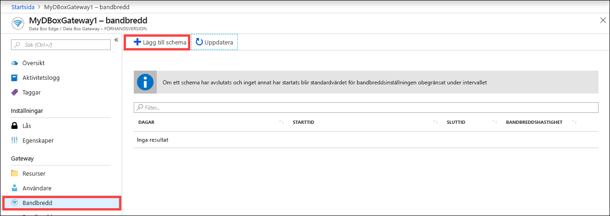
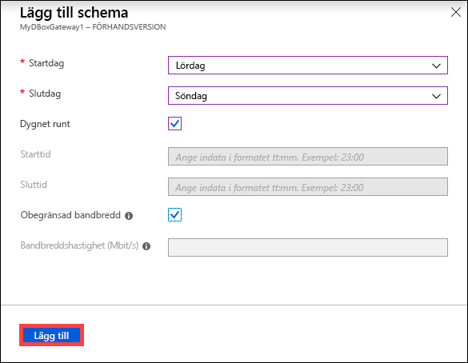
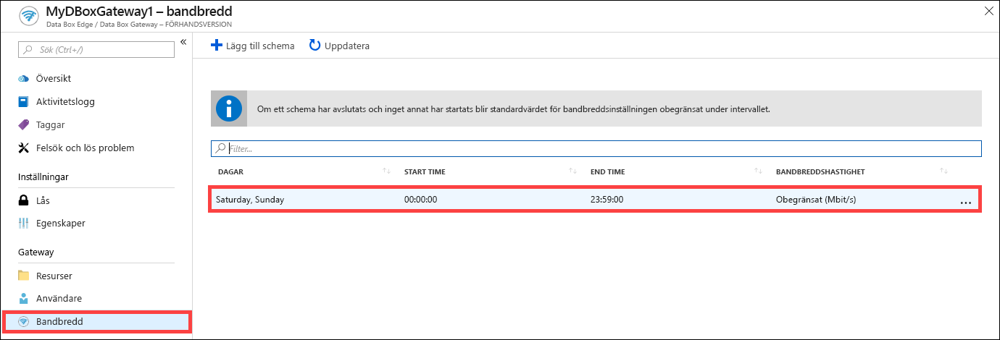
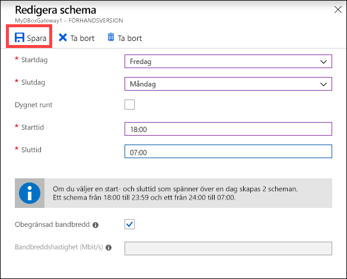
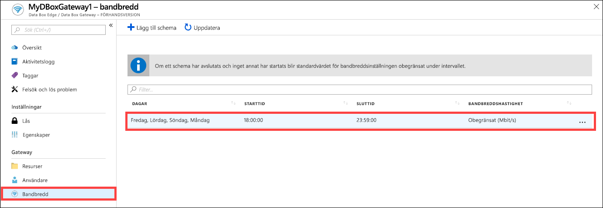
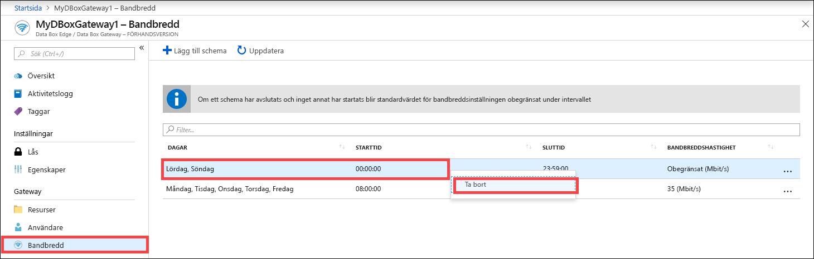

# Använda Azure-portalen för att hantera bandbreddsscheman på din Azure Data Box Gateway  

Den här artikeln beskriver hur du hanterar användare i din Azure Data Box Gateway. Med bandbreddsscheman kan du konfigurera användningen av nätverksbandbredd mellan scheman under olika tider på dagen. Schemana kan användas för upp- och nedladdningar mellan din enhet och molnet. 

Du kan lägga till, ändra och ta bort bandbreddsscheman för din Data Box Gateway via Azure-portalen.

I den här artikeln kan du se hur du:

> [!div class="checklist"]
> * Lägga till ett schema
> * Ändra schema
> * Ta bort ett schema 

## Lägga till ett schema

Lägg till en användare genom att följa de här instruktionerna på Azure-portalen.

1. I Azure-portalen för din Data Box Gateway går du till **Bandbredd**.
2. Klicka på **+ Lägg till schema** i den högra rutan.

    

3. I **Lägg till schema**: 

   1. Ange **Startdag**, **Slutdag**, **Starttid** och **Sluttid** för schemat. 
   2. Om schemat körs dygnet runt kan du markera alternativet **Dygnet runt**. 
   3. **Bandbreddshastighet** är den bandbredd i megabit per sekund (Mbit/s) som används av din enhet i åtgärder som rör molnet (upp- och nedladdning). Ange ett tal mellan 1 och 1 000 för det här fältet. 
   4. Markera **Obegränsad** bandbredd om du inte vill begränsa upp- och nedladdningen. 
   5. Klicka på **Lägg till**.

      

3. Ett schema skapas med de angivna parametrarna. Schemat visas sedan i listan över bandbreddsscheman i portalen.

## Redigera schema

Gör följande om du vill redigera ett bandbreddsschema. 

1. I Azure-portalen går du till din Data Box Gateway-resurs och går sedan till Bandbredd. 
2. I listan över bandbreddsscheman väljer du och klickar på det schema du vill ändra.
    

3. Gör önskade ändringar och spara ändringarna.

    

4. När schemat har ändrats uppdateras listan över scheman så att den återspeglar det ändrade schemat.

    

## Ta bort ett schema

Utför följande steg för att ta bort ett bandbreddsschema som är kopplat till din Data Box-Gateway-enhet.

1. I Azure Portal går du till din Data Box Gateway-resurs och går sedan till **Bandbredd**.  

2. I listan över bandbreddsscheman väljer du det schema som du vill ta bort. Högerklicka så att snabbmenyn visas, och klicka på **Ta bort**. 

   

3.  När schemat har tagits bort uppdateras listan över scheman.

## Nästa steg

- Lär dig hur du [hanterar bandbredd](data-box-gateway-manage-bandwidth-schedules.md).
